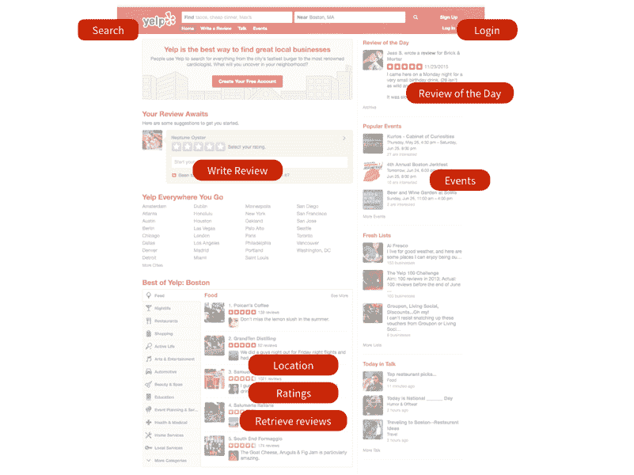
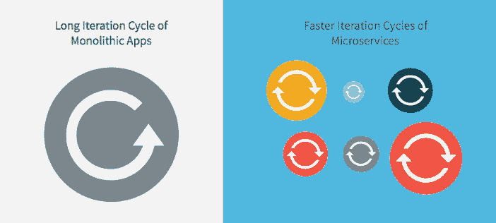

# 高管微服务精要:高速软件开发的关键-企业家

> 原文：<http://www.forentrepreneurs.com/microservices/?utm_source=wanqu.co&utm_campaign=Wanqu+Daily&utm_medium=website>

*“软件正在吞噬世界”——马克·安德森*

在新的世界秩序中蓬勃发展的公司将技术作为核心竞争力。他们构建复杂的云应用。他们不断为市场带来新的功能和特性。尽管他们的云应用程序不断迭代和更新，但他们的软件非常可靠。他们是如何实现这种敏捷性*和*可靠性的？

在过去几年中，亚马逊、优步、Airbnb、网飞、Yelp 和许多其他行业颠覆者采用了一种新的模式来开发云应用程序——微服务。微服务给这些颠覆者带来的速度甚至将软件架构提到了议事日程。

无论微服务这个术语是模糊熟悉的还是你还没有遇到过的，这篇文章将涵盖它是什么，它为什么重要，以及当你采用它时，你的公司将会发生什么变化。

### 什么是微服务？

传统上，云应用程序是作为单个大型应用程序构建的(通常称为 monolith)。有人将微服务描述为将整体软件应用程序分割成更小的部分。这是一个真实但不完整的解释，它忽略了微服务的本质优势——你的每个开发团队都可以在一个*可独立发布的*代码单元上工作，称为微服务。最好将微服务描述为“云应用程序的分布式开发的*架构”*

例如，最初的 Amazon.com 是一个单片应用程序，由数百万行 C++组成。随着时间的推移，Amazon 已经将单个应用程序的功能拆分为更小的服务，因此有一个单独的推荐、支付、搜索等服务。反过来，这些独立的服务中的每一个都可能由几十个更小的微服务组成。

在最初的 Amazon 架构中，对推荐服务的错误修复需要更改单片应用程序中的一些 C++，等待其他组完成他们各自对单片应用程序的更改，并测试整个应用程序以进行发布。在微服务架构中，建议开发团队可以对他们的微服务进行更改，并发布它，而无需等待与其他功能团队协调。

Yelp 也采用了微服务架构，由数百个服务组成。仅仅加载 Yelp 主页就调用了几十个微服务，如下例所示。

### 为什么选择微服务？

微服务有六个主要优势:

1.  **敏捷度提高。**微服务使开发组织能够更快地响应市场和客户反馈。无论它是一个改变游戏规则的功能，还是一个使现有功能更加可用的调整，它的发布将不再被单一发布系列的时间表所推迟。而是每个微服务都可以独立发布。
2.  **组织规模。有了 monolith，每多一个开发者，破解彼此代码的风险就会急剧上升。这降低了开发速度，因为需要额外的测试、调试和集成来防止意外错误。在微服务架构中，每个团队都在一个独立的代码库上工作，因此 bug 被隔离到单个微服务中。**
3.  **开发效率。** Monolith 开发团队受限于通用的技术堆栈和流程。微服务架构使独立团队能够为给定的服务选择正确的流程和技术。例如，PCI 标准要求任何处理信用卡数据的代码库都要接受合规性审计。通过由单个或一组微服务处理支付处理，范围内的代码量大大减少。或者推荐引擎可能是用 Python 写的，以使用 TensorFlow 机器学习库，而其他服务是用 Java 写的。
4.  **经济高效的扩展。**在传统的整体架构中，当整个应用达到极限时，必须进行扩展。例如，如果应用程序无法运行，则必须添加能够运行额外的整体实例的新服务器。在微服务架构中，每个微服务都可以单独扩展。因此，新服务器仅针对成为瓶颈的给定微服务进行添加。这种更精细的扩展方法支持更具成本效益的计算模式。
5.  **更快的入职。**有了微服务，新工程师可以放心地在一个小的微服务上开始编码。工程师没有必要仅仅为了修复一个 bug 而学习一个完整的代码库。
6.  吸引更多有才华的工程师。微服务使您能够逐步采用和测试新技术，优秀的工程师希望使用最新的技术。

### 微服务并不适合所有人

虽然微服务有很多好处，但微服务并不适合所有人。特别是，拥有小型工程团队的组织应该考虑整体优先的方法。在这些组织中，开发团队没有能力同时独立迭代多个特性。首先采用一个整体，然后随着团队的成长添加微服务，这通常是一个更好的策略。

### 采用微服务架构的影响

采用微服务架构会带来显著的好处，但也会带来巨大的变化。有三种类型的变化可以预期:文化、部署基础设施和开发人员基础设施。

**团队获得更大的自主权**

也许采用微服务最大的变化是文化。为了提高灵活性和效率，微服务开发团队做出了以前他们无法控制的决策，比如发货日期。许多组织还授权团队定制他们的 QA 策略或技术栈。

这种决策权的重新分配需要人员和教育的改变。将发货日期决策以及技术和流程选择的更多责任移交给团队，需要至少一名团队成员能够做出这些决策，或者在培训和指导方面进行一些前期投资，以发展这些技能。

这并不是说技术栈标准或架构审查委员会将会消失，混乱将会盛行。但是技术和过程的灵活性将会增加，评审过程将会更加开放以满足团队的需求。

工程副总裁的角色也将发生重大变化。他们将协调文化变革以及工作描述和培训的变化。他们将评估和实施下述工具和基础设施。他们将修改指标。工程吞吐量将不再由每个 sprint 的故事点来衡量，而是由部署新的和更新的特性的速度来衡量。应用程序的可靠性将不再简单地以平均故障间隔时间来衡量，而是以微服务的平均恢复时间来衡量。

**部署基础设施变得完全自动化**

在规模上，一个云应用可能有数百个单独的微服务，每个微服务可能由多个实例组成(为了可用性和可伸缩性)。而且这些微服务会由各自的开发团队独立更新。不断膨胀的移动部件数量和更新频率迅速要求完全自动化的部署工作流和基础架构是必不可少的。

虽然有许多技术可供选择来完全自动化部署工作流，但我们在微服务的所有成功采用者中观察到的部署基础架构中有一些常见功能。

*   从代码到客户的完全自动化。通常，一旦开发人员将代码提交到源存储库，就会有一个按钮过程自动获取最新的源代码，构建它，将其打包到一个部署工件(如容器或 AMI)中，然后将整个工件部署到试运行或生产中。这通常被称为连续交付。
*   弹性缩放。微服务本质上是相当短暂的——新版本被部署，旧版本被淘汰，新实例根据利用率被添加或删除。支持弹性扩展的部署基础设施，如亚马逊的弹性计算云、Docker 数据中心或 Kubernetes，对于支持这些用例至关重要。

虽然许多其他功能可以添加到部署基础架构中，如自动化回归测试，但我们已经看到组织通过投资自动化和弹性扩展成功采用微服务。

**微服务网络的开发者基础设施**

采用微服务的最后一个挑战可能是微服务最不为人知的方面。如果单块应用程序类似于在不同房间中具有不同功能的房子，那么微服务应用程序更像是每个都托管一个微服务的房子的邻居。微服务领域的通信需要不同的范式。就像房子通过电话说话一样(而不是在楼下大喊大叫)，微服务通过网络进行通信。这需要一套通用服务和使能技术。这些工具和技术由编写微服务代码的开发人员使用，与 DevOps 工程师使用的部署基础设施截然不同。

*有关支持微服务所需的开发者基础设施的更深入讨论，请参见本文结尾。

### 吃或者被吃

鉴于微服务的优势需要新的投资并引发变化，您可能会问，正如一位工程副总裁最近被问及“您为什么要做微服务？”他回答说，“因为如果我们不这样做，我们会死于竞争移动得更快。”

由于敏捷性、效率、入职和招聘方面的优势，采用微服务的势头令人难以置信。数十家公司正在投资培训、工具和基础设施，以简化微服务的采用。有采用微服务经验的开发人员越来越多。采用微服务的努力正在迅速萎缩，并且将随着时间的推移继续下降。

如果您有兴趣了解更多关于如何采用微服务的信息，7 月 13 日将举办以真实世界微服务从业者为特色的[虚拟微服务从业者峰会。microservices.com](http://www.microservices.com/)的[也有网飞、优步和其他人参加的首届微服务从业者峰会的视频。](http://www.microservices.com/)

****关于开发者基础设施的更多信息***

开发人员基础设施的基本用例是提供一个通用协议，以便所有微服务可以相互连接。支持这些协议的库需要在组织使用的每个技术堆栈中可用。HTTP 是单片体系结构中流行的协议选择，但是当您向网络中添加更多的微服务时，HTTP 的同步特性会侵蚀可靠性。(使用 HTTP 连接在一起的微服务类似于串联的圣诞树灯。如果一个灯泡灭了，你的整个链条就不再发光了。更复杂的协议提供了并行连接服务的能力。)

此外，在微服务架构中，典型的服务请求跨越多个微服务。例如，在您的 Twitter feed 中加载所有推文的过程会调用与广告相关的微服务、显示推文的微服务(包括添加标签链接和图片)以及显示您关注的人的推文的微服务。在这种情况下，为跟踪特定微服务的错误和性能而设计的专用工具对于确保开发人员的工作效率非常重要。

微服务开发人员基础设施需要具备两项基本能力:

*   启用松散耦合的服务。服务需要定义良好的协议来进行通信，并且每个微服务中需要包含依赖关系。网飞微服务架构的建筑师之一 Ben Christensen 在他的演讲[中谈到了这一挑战。](http://www.microservices.com/ben-christensen-do-not-build-a-distributed-monolith)松散耦合的服务允许您更新单个微服务的代码，而不会影响依赖它的任何其他服务。您的开发人员基础设施需要在您的所有微服务中提供这些协议的实现。
*   应用弹性。当微服务因任何原因(软件错误、网络中断、机器故障)不可用时，整个云应用必须继续运行，并在最少人工干预的情况下正常恢复。服务可用性(例如，负载平衡)、服务隔离(例如，断路器)和服务恢复(例如，回滚)的技术是开发人员工具包的重要组成部分。

*Richard Li 是* [*Datawire*](http://www.datawire.io/) *的联合创始人兼首席执行官，这是一家为微服务构建开源基础设施和工具的公司。*