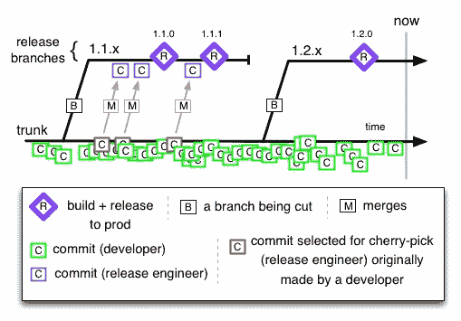
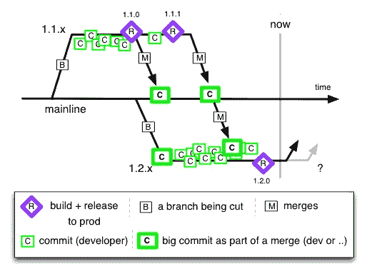

# 什么是基于主干的开发？

> 原文：<http://paulhammant.com/2013/04/05/what-is-trunk-based-development/?utm_source=wanqu.co&utm_campaign=Wanqu+Daily&utm_medium=website>

更新:查看新的基于主干的开发资源网站，名为，呃，[TrunkBasedDevelopment.com](https://trunkbaseddevelopment.com)，一定要告诉你的同事关于它和这个高吞吐量分支模型。

# 这是什么…

它是软件开发的分支模型。在历史上，它也被称为“主线”(见下文)。

这需要更多的专注和严谨，而不是(在共享的源代码控制服务器上)根据突发奇想创建一个分支。虽然您可以在没有持续集成(CI)的情况下完成这项工作，就像许多开源项目一样，但是对于企业开发，您必须将 CI 链接到主干上，以加强“提交是好的”的多个方面。

在这篇文章中，我并没有说开发人员在他们自己的工作站上通过“本地”分支来适应他们每小时的活动。这都是关于共享回购的，其中多个开发人员为了更大的利益集成/合并他们的日常工作:)



基于主干的开发(TBD)是所有开发人员(对于一个特定的可部署单元)在源代码控制下提交到一个共享分支。那个分支将被通俗地称为主干，甚至可能被命名为“主干”。开发人员可能在他们自己的开发工作站上进行一些多分支开发(比如用 Git ),但是当他们“完成”一个变更或一个 bug 修复时，它应该回到共享主干。如果它不在那里，它就不是“完成”——注意那个省略的小谎言。另请参见下面关于拉取请求的部分。

分支是为发布而创建的。开发者不允许在那个共享的地方做分支。只有发布工程师致力于那些分支，并且确实创建了每个发布分支。如果需要的话，他们也可以挑选个别的提交到那个分支。当一个版本被另一个版本取代后，这个分支很可能会被删除。

后备箱作为一种模式，已经使用了二十年左右。最初是由开源社区推动的，但在“企业领域”却不那么受欢迎，因为 ClearCase(和其他人)发布了其他分支模型，成为主流。今天，谷歌和脸书正在实践一种 TBD 式的分支模式。如果不准确，那就足够接近了。无论是谷歌还是脸书公布了他们对 TBD 的使用，对它的关注度都在上升。

## 但是有分支啊！

是的，有，但是关于释放。“发布分支”是策略。在被另一个发布分支取代之前，这个发布分支会存在一段时间，当它被创建时，它会从主干中获取所有内容。在合并方面，只支持从主干到发布分支的精选。对于很多企业来说，只会合并 bug 修复。对于脸书(他每周从发布分支上线十次)，如果利益相关者优先考虑，增强的合并也会发生。

几乎所有人都同意将 bug 固定在主干上并合并到**到**发布分支，而不是固定在发布分支上并合并到主干。通常，可以提交到发布分支的人员会减少。

## 拉请求仍然是分支！

好的，GitHub 开创了将拉请求作为开发工作流的先河。这与 TBD 非常兼容，因为一个特性/任务被安排在一个还没有在主干/主节点上但可以很快实现的地方。通常，代码审查在那里进行，CI 会自动给出一个意见，即 PR 分支是否有资格合并到主干/主节点中。如果一切正常，PR 将合并回主/干线，然后删除，留下一个平滑的干线/主时间轴。当然，稍后作为拉请求主题的特性/任务分支应该是一个人或一对人的分支，并且非常短暂(比如一天)。也有变化——“分叉”和起源的简单分支都是很好的拉式请求选择。应使用的唯一存储库读/写权限指南。

## 开发商的义务

开发人员不会通过任何提交来中断构建。这需要大量的训练，也许这就是为什么谷歌和脸书的入职程序对开发者来说是冗长的。提交的回滚/恢复是一种防止由此造成的损失(损失时间)的策略。更复杂的公司将使用提交前验证。开发人员养成了习惯:通过同步到主干的最新版本，从根/从头开始构建，仔细检查他们的功能更改，然后提交，来证明提交是好的。在早期，包括在 ThoughtWorks 中，开发人员有一个“令牌”来证明他们没有破坏构建——在他们经历验证周期时，没有其他人可以拿着鸡。为了这个，橡皮鸡已经用了十多年了，但是任何东西都可以(感谢 Jez 的链接)。

## 连续累计

持续集成，如 Jenkins，开始执行该任务，并贯穿于构建管道(构建、测试、部署、测试等)中。它可能会检测到失败，很可能是因为开发人员没有证明他们的提交或做令牌的事情。另一个问题可能是开发人员在提交之前没有添加新的源文件。这将很容易/很快得到补救，并且“前滚”的情况是可以的。

## 需要“太长时间”才能完成的更改

开发人员使用一种称为抽象分支(BbA)的技术来确保他们可以在更长的时间内完成更复杂的更改。我已经写了很多次了。马丁·福勒[强调它的重要性](http://martinfowler.com/bliki/BranchByAbstraction.html)，而[杰斯·亨布尔](http://continuousdelivery.com/2011/05/make-large-scale-changes-incrementally-with-branch-by-abstraction/)也写了关于它的文章。它降低的风险是分支机构的扩散，以及那些“临时”分支机构不能按预期的时间表完成。

## 我自己的案例研究

从 2005 年开始，[从疯狂的分支转向 TBD](//paulhammant.com/2013/03/11/legacy-app-rejuvenation) (一家美国外汇交易银行)。

# 基于主干的开发概述

快速提醒一下 TBD 是什么:

*   开发人员或多或少地致力于单个主干
*   发布工程师(或构建员)创建分支，并或多或少地专门挑选分支
    *   只有当缺陷**不能**在主干上重现时，才允许在发布分支上修复它，并精选回主干。

如果你理解了发布分支的概念，那就值得记住:

*   基于主干的开发意味着**普通开发人员**不会致力于发布分支。
*   基于主干的开发意味着您将删除“旧的”发布分支，而不将它们合并回主干。

# 什么绝对不是 TBD

## 开发人员承诺的多个分支

包含相同源文件的分支，即。参考上面的 BbA 你应该这样做。通常，高级开发人员会声称他们有一个特殊的案例，并希望在分支上进行。缺陷是共享源代码控制服务器上分支的扩散，它们“临时”生命的长度，以及当有许多开发人员和对一个或另一个地方的大量提交时合并的困难。

这一点被反复讨论，甚至被那些喜欢树干这个概念的人讨论。我将在沙地上划一条线，并且说你不应该为特性创建分支(在共享回购上),不管它们需要多长时间，也不管它们是否超过了发布日期。你应该改学 BbA。

## 不在那个分支上做 CI 管道

当然，作为个人实践，你可以防止破坏，许多开源团队会认为他们没有 CI 也很好。但是对于有几十个开发者的企业来说，你需要全面的 CI。

## 相关性的手动版本号维护

可构建组件的依赖关系可以用版本化的方式来表达。

例如，Log4J 目前的版本是 1.2.17，由 Apache 维护。你不能把他们的源代码拉到你的源代码控制中。您将依赖于一个二进制文件，并为您自己的构建文件烘焙版本号(在源代码控制下)。

对于您自己的东西，可能是在 CI 的不同阶段构建的，您不应该为特定的构建使用版本号。借用 Maven 的习惯用法，你应该依赖 CI 下的移动目标。比如“我们的通信-1.1-快照”，但要确保在“正确的”CI 构建阶段构建它。你不打算那样生活，但是如果你不编译，不测试所有东西的最新版本，你就不能持续集成。

CI pipeline 中的一个更核心的实现**将使用我上面建议的有争议的“1.1 快照”之外的东西。它(以及 Maven 本身)在企业开发中是一个有争议的东西。对于 Subversion 或 Perforce 安装，存储库修订号可以是您使用的版本号——“1.1-12345”。或者，内部版本号可能是流行的(所有 CI 工具都可以为它们执行的脚本提供一个内部版本号)。**

## 不从“根”执行 CI

在常规配置中，CI 应该从根/从头开始构建您的所有东西，而不依赖于之前运行中构建的任何东西。一些更复杂的 CI 基础设施(如 ThoughtWorks Studios 的 Go)在战术上使用预构建的部分有一个更可证明的/指纹化的方法，但是常规的安装应该从零开始构建(越快越好)。

这是“所有东西的最新版本”目标的另一个变体。

# 连续版本的并行开发

一些企业同时开发一系列版本。他们打算使用运行时切换进行暗部署，但也可能在生成的二进制文件中有到子集功能的构建时切换，这取决于他们想要在 CI 阶段测试什么。他们可能为同一个主干设置了多个 CI 管道，这证明了“amazon_one_click=true”和“amazon_one_click=false”交替构建并通过测试。这两个失败中的任何一个仍然是提交失败，并且受到回滚/恢复的影响。

你只需要为你期望发布的版本设置不同排列的切换管道。如果“管理”取消了一个版本的功能(通过单次切换激活)，或者对版本重新排序，那么您应该尽快重新配置 CI 管道。CI 很快阐明了“重新规划”的成本和时间影响，以及由此产生的每个主干的通过/失败视图。你永远不会去测试不合理的切换排列。

顺便提一下，极限编程社区正确地建议，连续发布的连续开发是更可取的。

# 用词不当

## 主线是别的东西

好的，经典的“主线”是主干的同义词，对于基于主干的开发，人们也用“主线”来描述。问题是“主线”也是 ClearCase 社区从 1993 年开始使用的，指的是一个浪费和延迟的分支模型，比如:



这也是一个“较晚”的集成设计，而 TBD 是一个“最早”的集成，这是一个关键的概念，也是开发过程中降低成本的最大推动者。这个分支模型的另一个现实是，分支挂在发布分支上，应该是临时的。

所以，总而言之，主线对许多软件开发者来说意味着别的东西。

## 功能切换

我最近听到人们把 TBD 称为“特性切换”。马丁·福勒[为这个行业将这种长期的做法命名为](http://martinfowler.com/bliki/FeatureToggle.html)。它通常与 TBD 一起使用，但不是必须如此。它可以与任何分支模式一起使用，并且可能与开发软件服务并将其投入使用一样古老。

在之前的一个客户那里，我们也谈到了构建时切换。对于 maven 来说，这些是这样的配置文件:

```
# with amazon one click
mvn -p amazon_one_click install

# without amazon one click
mvn install 
```

因此，对于客户端来说，运行时的切换与构建时的切换是不同的(Maven 概要文件)，但有些可能两者都是。如前所述，CI 渠道将为合理的切换排列启动提交。

# 持续交付(和部署)

这是从简单的 TBD 和 CI 用法的一个进步。Jez 有一本著名的书[连续交付](http://www.amazon.com/dp/0321601912?tag=contindelive-20)是必读书。

# 感谢…

Jez Humble 为勘误表，和一个很好的报价“分支不是问题，合并是问题”(这是一种方式陈述一个问题，TBD 正试图解决)

### 更新

2016 年 6 月 30 日——当然，我们会对拉取请求微笑。

* * *

* * *