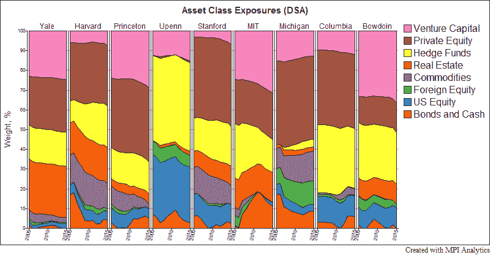

# 风险投资初级词典- Mattermark

> 原文：<https://mattermark.com/venture-capital-dictionary/?utm_source=wanqu.co&utm_campaign=Wanqu+Daily&utm_medium=website>

**TL；大卫:这是一本关于风险资本语言的初级读本。**

之前在 Mattermark，我们发表了一篇[VC](https://mattermark.com/want-learn-venture-capital/)初学者指南。我们忽略的是一本内部人士喜欢在沙丘路办公室里流传的行话词典。

当然，本词典并不完全代表法律条款、晦涩的证券法和艺术术语中的所有单词和短语。但我们希望这一资源能够成为创始人、有抱负的投资者、记者和只是好奇的人了解更多信息的跳板。

为了实现我们的目标，我们决定按主题而不是按字母顺序组织词典。(我们的字典是一项正在进行的工作。如果您希望看到任何术语的定义，或者如果您有自己的定义，可能会改进或补充我们所写的内容，请随时通过电子邮件与我分享。)

简要说明:无论我们在哪里逐字使用来自权威书面资料的定义，我们都使用标准的括号风格引用它。在其他情况下，我们一定会提供链接和其他支持信息。

## 基础知识

#### **私募股权**

1.  不在公开市场上交易的公司股票。
2.  通常，在美国，私募股权投资者通常被认为是后期公司的资本提供者。

#### **风险投资**

1.  “独立管理的专用资金池，专注于对私有高增长公司的股权或与股权相关的投资。[……]在美国以外，这个词经常被用作私募股权和/或杠杆收购的同义词。”(勒纳、利蒙和哈迪蒙，2012 年)

#### **风险投资/私募股权公司**

1.  为管理一个或多个风险投资基金而成立的组织。

#### **风险投资/私募股权基金**

1.  “私募机构定期募集的资金池。通常以有限合伙制的形式，私募股权基金通常有 10 年的寿命，但也有可能延长几年 (勒纳、利蒙和哈迪蒙 2012)

## 投资创业公司的投资者

#### **合格投资者**

1.  **美国* :* 满足 1940 年投资公司法规定的基于净值或收入的某些测试的个人或机构。

阅读更多:

*   定义“合格投资者”的规则因国家而异。 [维基百科很好的总结了](https://en.wikipedia.org/wiki/Accredited_investor) 这些各国的规则。
*   如果你不确定自己的认证资格，最好咨询律师或国家私募股权或风险投资协会。这些 VC 协会 [的名单可以在这里](https://www.mycapital.com/companies/venturecapitalassociation_national.php) 找到。

#### **朋友&家人**

1.  典型的非专业投资者，他们通过家庭、大学或专业关系与初创公司创始人保持密切联系，从而向初创公司提供资本。

#### **天使**

1.  独立富裕的个人将自己的钱投资到创业公司，通常作为更广泛投资策略的一部分。
2.  所谓的“超级天使”符合上述定义，但也拥有非凡的洞察力、经验和在创业生态系统中的人脉。

用在句子中:“当然，那个老石油巨头对初创公司进行天使投资，但我们正在寻找像罗恩·康韦和斯科特·班尼斯特这样的超级天使的引荐者。”

#### **加速器**

1.  该计划旨在通过指导、中介联系以及为参与公司的小部分股权提供服务和基础设施(如办公场所)来加速初创公司的发展。

#### **种子投资人**

1.  向非常早期的创业公司投入资本的机构投资者。种子投资者被认为是风险资本家的一个子集。

阅读更多信息:

#### **风险投资家**

1.  机构投资者，他们将资金投入到私人的早期技术公司。风险资本家通常是种子投资者之后的下一批投资者。

注: 从技术上来说，风险资本家是私募股权投资者的一个子集，但在美国的普通用法中，风险资本家被认为是独立于私募股权的。

#### **私募股权投资者**

1.  私募股权投资者是机构投资者，他们向处于后期阶段的科技公司投入相对较大的资金，以推动扩张，为并购活动融资，或者在公司首次公开募股之前帮助公司渡过难关。

#### **企业风险投资(CVC)**

1.  公司对公司外部的新公司或公司内部的商业概念进行投资的计划。这些公司通常以公司子公司的形式组建，而不是有限合伙企业。(勒纳、利蒙和哈迪蒙，2012 年)

阅读更多信息:

## 投资者投资者

#### **有限合伙人**

1.  “有限合伙制的投资者，如风险投资基金。有限合伙人可以监督合伙企业的进展，但如果他们保留有限责任，就不能参与其日常管理。”(勒纳、利蒙和哈迪蒙，2012 年)

注 :有许多类型的投资者可以成为投资工具的有限合伙人。一般来说，他们都被认为是合格的投资者。以下是可能投资风险资本基金的投资者类型的例子。

#### **家族办公室**

1.  一家私人咨询公司，主要管理超高净值投资者(即可投资资产超过 1 亿美元的个人或家庭)的财富、税收和遗产规划。

#### **养老基金**

1.  代表政府或公司的中介机构管理的集合投资基金，目的是为雇员提供养老金。通常，养老基金将其资产投入风险资本，作为其风险资本投资策略的一部分。

阅读更多:

#### **捐赠基金**

1.  许多大学、医院、基金会和其他非营利机构持有的长期金融资产池。

阅读更多:

Markov Processes International 发布了一份报告，可视化显示了几所顶尖大学捐赠基金中不同资产类别的相对份额。请注意，在所有情况下(宾夕法尼亚大学除外)，风险资本和私募股权投资在 2005 年至 2015 年间占大多数大学捐赠的 25%至 50%。

#### **基金中的基金(FoF)**

1.  代表投资者在众多风险资本或私募股权公司之间分配资产的投资工具，而不是直接投资于私人公司。

注: 一般来说，基金的基金为一组与常规风险投资和私募股权公司类似的有限合伙人服务。然而，基金投资组合中的不同基金通常是为满足各类投资者的需求而设计的。例如， [共同基金](https://www.commonfund.org/) 的设立是为了汇集和管理来自规模较小的大学捐赠基金的资产。

## 角色阵容

#### **分析师**

1.  风险投资公司中资历最浅的人，通常是刚毕业的大学生。分析师的主要作用是建立关系网，并在情报收集方面充当风险企业的“地面哨兵”。分析师的任务还包括执行初步筛选、业务分析和市场研究。

阅读更多:

#### **关联**

1.  关联角色是层级结构中的下一级。这些职位是典型的“合伙人”职位，向拥有研究生学位的申请人或在风投公司工作了几年的分析师开放。合伙人的任务通常是尽职调查研究、从投资组合公司获得进展报告，以及在投资前景和做出最终投资决策的合伙人之间充当中间人。

#### **校长/副校长**

1.  委托人通常会在基金投资组合公司的几个董事会任职，帮助寻找这些公司被收购的机会。主要职位通常是合作伙伴地位阶梯上的下一级。

#### **风险合伙人**

1.  弗雷德·威尔逊说:“风险合伙人是风险投资公司请来帮助他们进行投资和管理投资的人，但不是合伙企业的正式和永久成员。”。与常驻企业家不同，风险合伙人通常会在任期内为公司争取多项交易。

阅读更多:

#### **合作伙伴**

1.  合伙人的工作描述与负责人和风险合伙人相似。他们也是投资组合公司的董事会成员，花大量时间建立关系网。然而，合伙人还承担着更高层次的职责，例如确定公司将投资的新兴技术领域，确定并发展与这些领域关键参与者的关系，评估基金业绩并向有限合伙人传达，以及每隔五到七年左右再筹集一只基金。

## VC 经济学

#### **基金期限**

1.  大多数风险投资基金筹集的资金数量有限，运营时间也有限。一旦达到基金的目标规模，资本就归基金管理，通常为期十年。基金经理通常可以自行决定将基金期限延长 2 至 3 年，通常以 1 年为增量。

#### **投资期限**

1.  基金将大部分资本投入其投资组合公司的时期，通常为三至五年。

#### **收获期**

1.  基金通过并购、首次公开募股、技术许可协议和其他方式开始看到投资回报的时期。

#### **内部收益率**

1.  “投资资本可获得的年化有效复合回报率，也称为投资收益率。(对风险投资公司而言)，资金在一项投资中被套牢的时间越长，为获得足够的内部回报率而必须收回的原始投资的倍数就越高。”(勒纳、利蒙和哈迪蒙，2012 年)

注 : Ramsinghani 给出了一个更简单的解释:“越快以尽可能高的价格出售投资组合中的公司，内部回报率就越高。这通常是事情变得棘手的地方。快速退出包括出售一家初创公司，这可能会与市场环境的现实和崇高的创业理想发生冲突。”(6，Ramsinghani 2014)

阅读更多信息:

#### **J 曲线**

1.  基金生命周期内内部收益率曲线的形状，包括投资期和收获期。

*注*:J 曲线之所以这么叫，是因为它看起来像一个大写字母 J，种。

阅读更多信息:

Source: Ramsinghani, Mahendra. The Business of Venture Capital: Insights from Leading Practitioners on the Art of Raising a Fund, Deal Structuring, Value Creation, and Exit Strategies. Second edition. The Wiley Finance Series. Hoboken, New Jersey: Wiley, 2014\. p 5.

#### **现金对现金返还**

1.  “一种计算回报的简化方法，通过将从投资中获得的资金总额(或返回的现金和投资组合的当前价值的组合)除以最初承诺的金额。”(勒纳、利蒙和哈迪蒙，2012 年)
2.  这是“投入资本的倍数”或简称 MOIC 的同义词。

*举例* :假设一个投资者向一家给定的投资组合公司承诺 1000 万美元。为方便起见，我们还假设她没有参与任何后续投资。投资组合公司被收购，投资者从收购中获得 5000 万美元的收益，这意味着投资的现金回报率(或 MOIC)为 500%。

阅读更多:

*   [Macabacus 发表了一个很好的提要](http://macabacus.com/venture-capital/returns) 内部收益率和现金对现金收益率的区别。Macabacus 还详细说明了用于计算每个指标的方法。

#### **管理资产**

1.  风险投资基金代表其有限合伙人管理的金融资产的总市值。

#### **管理费**

1.  风险基金对其管理服务收取的年费，通常为管理资产的 2%,但也有一些变化。

*注* :管理费用于支付基本工资、租金、法律及其他服务费、营销费用以及基金在管理过程中可能发生的其他附带费用。

The origins of carried interest.

#### **附带权益，或“附带”**

1.  公司对特定投资产生的利润收取的费用，通常为 20%。这有助于使有限合伙人的利益与管理基金的普通合伙人的利益保持一致。

*趣味词源注:* 附随利益(Carried interest)起源于 16 世纪，当时货物被运过大西洋和太平洋。为了支付船只的费用和补偿航行的风险，船长通常会从出售运输货物所产生的利润中提取 20%的费用。(Kocis 2009 年)

阅读更多:

*   围绕附带权益的一些金融技术问题超出了本条目的范围。有一篇 [的维基百科文章](https://en.wikipedia.org/wiki/Distribution_waterfall) 非常好，是关于所谓的“分配瀑布”的，它提供了一些关于如何/何时/是否将附带权益分配给风险投资或私募股权基金的普通合伙人的见解。
*   加州最大的养老基金之一、风险投资的主要投资者加州公务员退休基金(CalPERS)发布了一个方便的幻灯片，里面有附带权益计算的例子。
*   投资公司 [Duane Morris 也对](http://www.duanemorris.com/site/static/private_equity_fund_distribution_waterfalls.pdf) 的附带权益做了很好的解释。
*   ValueWalk 在一项关于附带权益和基金表现的小型研究中，从 CalPERS 的私募股权表现报告网站发布了一些 [有趣的数据](http://www.valuewalk.com/wp-content/uploads/2015/08/SSRN-id2640498.pdf) 。

## 交易的艺术

#### **融资轮次**

1.  融资轮是一种证券发行，其中公司从投资者那里获得资本，以换取股权、贷款或其他一些财务安排。

*注* :创业融资通常发生在多个轮次或阶段。标准的命名方案是用字母表中的一个字母标记每一轮，从 A 开始，从 A 开始递增。但最近，种子投资者的兴起给命名带来了一些困惑。有些人将从种子投资者那里筹集的资金称为“系列种子”，而其他人，如 Y Combinator，自吹自擂的加速器项目，将这些首轮融资前的轮次称为“AA 轮次”。

#### **领投人**

1.  某轮融资中的主要资本提供者，通常是同一家公司。

阅读更多:

#### **辛迪加**

1.  也参与某一轮投资的投资者网络。

#### **投资前估值**

1.  在当前融资轮的任何额外投资之前对公司的估值。

阅读更多:

#### **投资后估值**

1.  “融资轮中支付的每股价格与融资轮后发行在外的股份的乘积。根据经验，前期资金价值加上新筹集的资金。只有在没有股票赎回或权证发行的情况下，这条经验法则才是正确的。”(勒纳、利蒙和哈迪蒙，2012 年)

#### **尽职调查**

1.  在进行投资、建立业务伙伴关系或其他长期约束协议之前，对业务进行调查的过程。

阅读更多:

#### **条款清单**

1.  合伙协议或股票购买协议结构的概述，通常在最终有约束力的合同中起草更正式的语言之前进行协商并达成一致。

#### **稀释**

1.  与新一轮融资相关的创始人和现有股东拥有的公司股权份额的减少(勒纳、利蒙和哈迪蒙，2012 年)

#### **下一轮**

1.  相对于前一轮，公司估值下降的一轮。这可能会触发投资协议中的反稀释条款。

#### **反稀释条款**

1.  置于优先股协议中的财务机制，用于在公司以低于优先股股东购买股份时的估值进行未来一轮融资时，维持投资者在公司中的股份百分比。

注 :反稀释保护有几种类型，但创业投资协议中最常见的被称为“棘轮”

阅读更多:

#### **清算优先权**

1.  “在优先股协议中，确保与公司清算相关的任何股息或付款优先于普通股的条款。”(勒纳、利蒙和哈迪蒙，2012 年)

阅读更多信息:

#### **资本化表**

1.  初创公司的投资者名单，包括股东姓名、持股数量、持股比例以及哪类股票归谁所有。

#### **权证**

1.  在未来某一时刻以某一价格购买公司直接发行的股票的期权。

#### **可转换票据**

1.  一种金融工具，在投资协议规定的特定条件下，将欠投资者的债务转换为投资者拥有的公司股权。

*注* :可转换票据是在非常早期的公司存在巨大不确定性的情况下，对基础公司进行估值的挑战的一种常见解决方案。这一估值过程通常由首轮投资者负责。一旦确定了公司的估值，可转换票据的持有人就可以将贷款的未偿还余额(即初始本金加上持有期间的任何应计利息)转换为公司的股权，与公司的估值成比例。

也就是说，可兑换纸币的世界有点太复杂，无法用一个词条来解释，它应该有自己的字典。例如，可转换票据可能附带任何数量的金融和法律条款，包括估值上限、折扣等。我们没有解释所有这些术语，而是链接了一些关于可转换票据的优秀资源:

#### **安全提示**

1.  “未来权益简单协议”的缩写，这种金融工具非常类似于可转换票据，只是它们不是债务工具。

阅读更多:

*   Y Combinator 是第一个实现安全注释的人， [在他们的网站](https://www.ycombinator.com/documents/) 上有解释。他们还有国家外汇管理局协议样本和一份非常详细的“国家外汇管理局入门指南”，为国家外汇管理局的持有者描绘了多种投资方案。

## 文献学

布拉德·菲尔德和杰森·门德尔森，*风险交易:比你的律师和风险资本家更聪明*，第二版(新泽西州霍博肯:威利出版社，2013 年)。

詹姆斯·m·科西斯，编辑。，*私募股权内幕:专业投资者手册*，威利金融系列(新泽西州霍博肯:威利，2009)。

Joshua Lerner、Ann Leamon 和 G. Felda Hardymon，*风险资本、私募股权和创业融资:积极投资的力量*(新泽西州霍博肯:约翰·威利&出版社，2012 年)。

摩哂陀·拉姆辛哈尼，《风险资本的商业:领先从业者对筹资艺术、交易结构、价值创造和退出战略的见解》，第二版，威利金融系列(新泽西州霍博肯:威利，2014 年)。

## 加入成千上万的商业人士阅读 Mattermark 每日时事通讯。投资者和经营者每日及时发布的必读文章摘要。