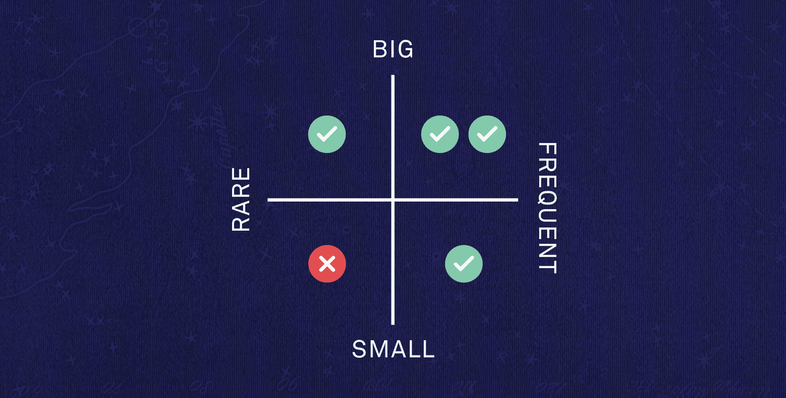

# 不是所有的好产品都能做成好生意

> 原文：<https://blog.intercom.io/good-products-bad-businesses/?utm_source=wanqu.co&utm_campaign=Wanqu+Daily&utm_medium=website>

我们愿意相信，如果你用一个好的产品解决了一个真正的问题，一个成功的软件企业就会奇迹般地诞生。这是无法保证的。

产品第一的企业的流行导致了对创造一个可持续发展的企业的短视。我想起了我经常为创始人画的这个三角形；没有两边是足够的。

我经常看到创业者陷入一些非常具体的陷阱，并与之斗争。与其指名道姓，我将分享我鼓励的一般原则。

## 1.小心小的、罕见的问题

你可以打造一款出色的产品来解决上述任何一个象限中的问题，其中有三个象限非常适合你:

有些问题持续存在是因为它们根本不值得解决。

*   **常见的大问题**例如，在文档上协作、与客户沟通、与队友聊天等。这是一个很棒的地方。
*   **常见的小问题**例如，安排通话、分享图片、记录费用。这是一个好地方。
*   **大的、不常见的问题**例如，开展员工调查、预订复杂的商务旅行、准备深入的报告。这是一个好地方。

这是风险所在的第四象限。小的、罕见的问题可能是可取的和可行的，但不那么可行。人们不会为此付你很多钱(如果有的话)，你也不能轻易通过广告或赞助赚钱，因为根据定义，你的参与度相当低。

最终，如果你发现自己陷入了这个陷阱，作为一个产品你可能会成功，但作为一个企业你仍然会失败。有些问题持续存在是因为它们根本不值得解决。

## 2.小心不要提供廉价复杂的产品

要在非常便宜的产品基础上获得成功的产品业务，你需要遵循一套特定的规则来保持你的单位经济健康。

如果你每月只收 5 美元:

*   你无法证明任何真正的[客户获取](https://www.intercom.com/blog/customer-acquisition/)成本是合理的(正面的口碑可能非常重要)
*   你不能提供太多的支持(所以你的产品必须相对来说没有 bug 并且非常直观)
*   当然，注册的新客户不需要你的帮助(所以你需要设计一个零接触的入职流程)

单位经济学不在乎那些冠冕堂皇的理由，他们只是坐在那里，向你吐槽现实

以客户为中心的创始人很难做到这一点。每个人都想为他们的顾客做正确的事，他们想帮助他们采用他们的产品，并支持他们使用它。但是单位经济学不关心那些无中生有的理由，他们只是坐在那里，向你吐槽现实。

如果建立一个新客户需要 4 个小时，而你向他们收取 19 美元/月的费用，实际上你需要一年多的时间才能从这个客户身上赚钱。这还不包括 [CAC(客户获取成本)](https://www.intercom.com/blog/what-is-customer-acquisition-cost/)或他们流失的可能性。如果你已经模拟出了这一点，并相应地为自己融资，那么这是可行的，但如果你是自举，你就完了。

这里的关键点不是“总是建立零接触入职”；这并不总是可能的。有些任务需要手动干预，这是你无法控制的。但是你可以控制你的价格，所以这就是你如何解决它。如果你断定没有人会为它买单，而且它不是自动完成的，那么也许这是一个不值得解决的问题。

你应该做很多不可扩展的事情，但是建立一个不可扩展的商业模式不是其中之一。

## 3.小心解决人们不知道或不关心的问题

当我看到无数个“你所有的[文件|账户|社交档案|图片]都在一个地方”类型的产品时，我很担心。整合工作流通常是一件好事，但整合不相关的数据很少有用，从功能优先的角度推销这些类型的产品会加剧这种情况。

你不能把解决方案卖给没有买过问题的人。大多数人处理生活中的低效率和矛盾，并简单地记住他们发布到 FB 和 Instagram 的照片。

对许多产品来说，问题不在于质量，而在于顾客生活中问题的优先性。如果你的潜在客户不关心解决他们的问题，这是一个好迹象，你也不应该。

## 4.当心解决你不能亲身经历的问题

最好的软件是并行创建和消费的。它的制造者是它的用户，它的用户是它的制造者。这意味着，有些类型的问题是创始人在职业生涯早期无法解决的:如果你只在非常小的公司工作过，你将很难建立一个维基或内部网，因为你从未经历过他们试图解决的挫折。如果你只是零零星星地招聘，那么你永远不需要招聘软件，如果你从未处理过数百人的员工，你就不具备建立人力资源系统的能力。

你可以自学，你可以做大量的研究，你可以深深地沉浸在这个领域中，但它可能不是最适合你的[“创始人/市场】](http://cdixon.org/2011/06/20/foundermarket-fit/)。我有一个很好的理论，认为这类问题最好用两种方法之一来解决:

*   一个从一家公司分离出来的小团队，一心想要取代他们在以前的工作中不得不使用的最糟糕的工具。
*   一个大型团队，有一个正在挣扎的产品，他们构建了一个内部工具来解决问题，并意识到这可能比他们最初的产品想法更有价值。

对问题的亲身经历是解决方案的重要组成部分。

产品与问题相匹配，因此，如果你对问题的理解模糊不清(例如，“公司需要内部共享信息”)，那么你的解决方案也会同样模糊不清，在这种情况下，最终会看起来像一个博客，而你糟糕的营销团队将很难证明为什么不止如此。

如果你的理解很敏锐(例如，“公司需要存储和共享常见问题解答、政策、法律文档和操作指南。他们需要保持更新。他们需要宣布任何变化，并且必须控制对某些信息的访问”)那么解决方案及其产品的营销就变得更加敏锐。

## 质量是不够的

你可以用具有非凡美学的伟大产品来解决上述任何问题。除了生意，一切都会朝着正确的方向发展。但是可持续性是一个重要的特征。如果一种产品不能推动一项业务，那么它的质量就会随着价值的降低和竞争的出现而消失。许多伟大的产品都忘记了这一点:生存是最好的产品策略。