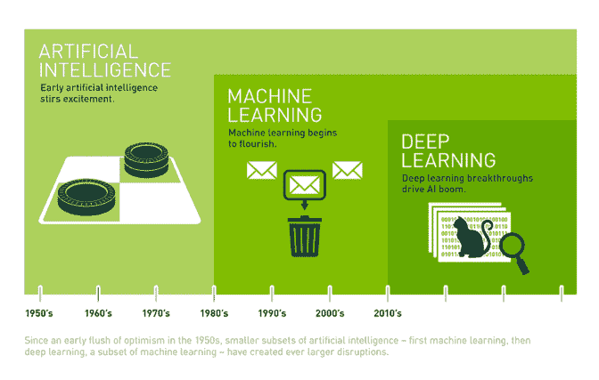
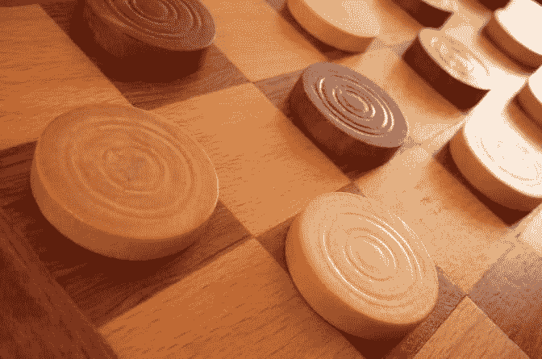

# AI、机器学习、深度学习的区别？NVIDIA 博客

> 原文：<https://blogs.nvidia.com/blog/2016/07/29/whats-difference-artificial-intelligence-machine-learning-deep-learning-ai/?utm_source=wanqu.co&utm_campaign=Wanqu+Daily&utm_medium=website>

这是由资深科技记者迈克尔·科普兰(Michael Copeland)撰写的解释深度学习基础的系列文章的第一部分。

人工智能是未来。人工智能是科幻小说。人工智能已经是我们日常生活的一部分。所有这些说法都是正确的，只是取决于你指的是什么味道的人工智能。

例如，当谷歌 DeepMind 的 AlphaGo 程序在今年早些时候的棋盘游戏 Go 中击败韩国大师 Lee Se-dol 时，AI、机器学习、[深度学习](https://developer.nvidia.com/deep-learning)等术语被媒体用来描述 DeepMind 是如何获胜的。而这三者都是 AlphaGo 大败李世石的部分原因。但它们不是一回事。

认为它们之间关系的最简单的方法是将它们想象成与人工智能的同心圆——首先出现的想法——最大，然后是机器学习——后来开花，最后是深度学习——推动了今天的人工智能爆炸——两者都在其中。

## [<picture class="aligncenter wp-image-34236 size-large"><source type="image/webp" srcset="https://blogs.nvidia.com/wp-content/uploads/2016/07/Deep_Learning_Icons_R5_PNG.jpg-672x427.png.webp 672w, https://blogs.nvidia.com/wp-content/uploads/2016/07/Deep_Learning_Icons_R5_PNG.jpg-300x191.png.webp 300w, https://blogs.nvidia.com/wp-content/uploads/2016/07/Deep_Learning_Icons_R5_PNG.jpg-768x489.png.webp 768w, https://blogs.nvidia.com/wp-content/uploads/2016/07/Deep_Learning_Icons_R5_PNG.jpg-676x430.png.webp 676w, https://blogs.nvidia.com/wp-content/uploads/2016/07/Deep_Learning_Icons_R5_PNG.jpg-328x209.png.webp 328w, https://blogs.nvidia.com/wp-content/uploads/2016/07/Deep_Learning_Icons_R5_PNG.jpg.png.webp 1080w" sizes="(max-width: 672px) 100vw, 672px"> </picture>](https://blogs.nvidia.com/wp-content/uploads/2016/07/Deep_Learning_Icons_R5_PNG.jpg.png)

## **从萧条到繁荣**

自从 1956 年一些计算机科学家在达特茅斯会议上聚集在这个术语周围，并诞生了人工智能领域以来，人工智能一直是我们想象的一部分，并在研究实验室中酝酿。在此后的几十年里，人工智能时而被宣布为我们文明最光明未来的关键，时而被扔进科技的垃圾堆，成为一个过于激进的轻率想法。坦率地说，直到 2012 年，两者都有一点。

在过去的几年里[人工智能爆发了](https://blogs.nvidia.com/blog/2016/01/12/accelerating-ai-artificial-intelligence-gpus/)，尤其是自 2015 年以来。这在很大程度上与 GPU 的广泛可用性有关，它使并行处理变得更快、更便宜、更强大。它还与几乎无限的存储和各种条带的大量数据(整个大数据移动)的同时发生有关，包括图像、文本、事务、映射数据等。

让我们来看看计算机科学家是如何从 2012 年之前的萧条走向繁荣，并释放出每天被数亿人使用的应用程序的。

## **人工智能**——**机器展示的人类智能**

[<picture loading="lazy" class="wp-image-34224 size-large"><source type="image/webp" srcset="https://blogs.nvidia.com/wp-content/uploads/2016/07/checkers_philip-taylor-1-672x445.jpg.webp 672w, https://blogs.nvidia.com/wp-content/uploads/2016/07/checkers_philip-taylor-1-300x199.jpg.webp 300w, https://blogs.nvidia.com/wp-content/uploads/2016/07/checkers_philip-taylor-1-768x509.jpg.webp 768w, https://blogs.nvidia.com/wp-content/uploads/2016/07/checkers_philip-taylor-1-676x448.jpg.webp 676w, https://blogs.nvidia.com/wp-content/uploads/2016/07/checkers_philip-taylor-1-328x217.jpg.webp 328w, https://blogs.nvidia.com/wp-content/uploads/2016/07/checkers_philip-taylor-1.jpg.webp 1024w" sizes="(max-width: 672px) 100vw, 672px"> </picture>](https://blogs.nvidia.com/wp-content/uploads/2016/07/checkers_philip-taylor-1.jpg) 

King me: computer programs that played checkers were among the earliest examples of artificial intelligence, stirring an early wave of excitement in the 1950s.

回到 1956 年夏天的会议，那些人工智能先驱的梦想是建造复杂的机器——由新兴的计算机实现——拥有人类智能的相同特征。这就是我们认为的“通用人工智能”的概念——拥有我们所有的感官(甚至更多)、所有的理性，并像我们一样思考的神奇机器。你已经在电影中无休止地看到这些机器作为朋友——C-3PO——和敌人——终结者。一般的人工智能机器仍然留在电影和科幻小说中是有充分理由的；我们做不到，至少现在还不行。

我们能做的属于“狭义人工智能”的概念。能够像我们人类一样或者更好地完成特定任务的技术。狭义人工智能的例子包括 Pinterest 等服务上的图像分类和脸书上的人脸识别。

这些都是实践中狭义人工智能的例子。这些技术展示了人类智慧的某些方面。但是怎么做呢？这种智慧从何而来？让我们进入下一个循环，机器学习。

## **机器学习**——**一种实现人工智能的途径**

[<picture loading="lazy" class="wp-image-34225 size-large"><source type="image/webp" srcset="https://blogs.nvidia.com/wp-content/uploads/2016/07/spam_fit-672x391.jpg.webp 672w, https://blogs.nvidia.com/wp-content/uploads/2016/07/spam_fit-300x175.jpg.webp 300w, https://blogs.nvidia.com/wp-content/uploads/2016/07/spam_fit-768x447.jpg.webp 768w, https://blogs.nvidia.com/wp-content/uploads/2016/07/spam_fit-676x394.jpg.webp 676w, https://blogs.nvidia.com/wp-content/uploads/2016/07/spam_fit-328x191.jpg.webp 328w, https://blogs.nvidia.com/wp-content/uploads/2016/07/spam_fit.jpg.webp 1180w" sizes="(max-width: 672px) 100vw, 672px"> </picture>](https://blogs.nvidia.com/wp-content/uploads/2016/07/spam_fit.jpg) 

Spam free diet: machine learning helps keep your inbox (relatively) free of spam.

[机器学习](https://www.nvidia.com/object/machine-learning.html)最基本的是使用算法来解析数据，从中学习，然后对世界上的一些事情做出决定或预测。因此，机器不是用一组特定的指令手工编写软件例程来完成特定的任务，而是使用大量的数据和算法来“训练”机器，使其具有学习如何执行任务的能力。

机器学习直接来自早期人工智能人群的思想，多年来的算法方法包括决策树学习、归纳逻辑编程。[聚类](https://developer.nvidia.com/discover/cluster-analysis)、[强化学习](https://blogs.nvidia.com/blog/2018/08/02/supervised-unsupervised-learning/)，贝叶斯网络等等。正如我们所知，没有一个实现了通用人工智能的最终目标，即使是狭义的人工智能也是早期机器学习方法无法达到的。

***要了解更多关于深度学习的信息，请收听我们的 AI 播客第 113 集，由英伟达的威尔·雷米***

事实证明，多年来机器学习最好的应用领域之一是计算机视觉，尽管它仍然需要大量的手工编码来完成这项工作。人们可以进去编写像边缘检测过滤器这样的手动编码分类器，这样程序就可以识别一个对象在哪里开始和停止；形状检测以确定它是否有八个边；识别字母“S-T-O-P”的分类器。从所有这些手动编码的分类器中，他们将开发算法来理解图像，并“学习”确定它是否是一个停车标志。

很好，但还不够好。尤其是在雾天，标志看不清，或者被树遮住了一部分。直到最近，计算机视觉和图像检测才接近人类，这是有原因的，它太脆弱，太容易出错。

时间和正确的学习算法让一切变得不同。

## **深度学习**——**一种实现机器学习的技术**

[<picture loading="lazy" class="wp-image-34226 size-large"><source type="image/webp" srcset="https://blogs.nvidia.com/wp-content/uploads/2016/07/orange_cat-1-672x448.jpg.webp 672w, https://blogs.nvidia.com/wp-content/uploads/2016/07/orange_cat-1-300x200.jpg.webp 300w, https://blogs.nvidia.com/wp-content/uploads/2016/07/orange_cat-1-768x512.jpg.webp 768w, https://blogs.nvidia.com/wp-content/uploads/2016/07/orange_cat-1-676x451.jpg.webp 676w, https://blogs.nvidia.com/wp-content/uploads/2016/07/orange_cat-1-328x219.jpg.webp 328w, https://blogs.nvidia.com/wp-content/uploads/2016/07/orange_cat-1.jpg.webp 960w" sizes="(max-width: 672px) 100vw, 672px"> </picture>](https://blogs.nvidia.com/wp-content/uploads/2016/07/orange_cat-1.jpg) 

Herding cats: Picking images of cats out of YouTube videos was one of the first breakthrough demonstrations of deep learning.

早期机器学习人群中的另一种算法方法，人工神经网络，出现了，并在几十年内基本消失。神经网络受到我们对大脑生物学的理解的启发——所有神经元之间的相互联系。但是，与任何神经元都可以在一定物理距离内连接到任何其他神经元的生物大脑不同，这些人工神经网络具有离散的层、连接和数据传播方向。

例如，你可以拿一幅图像，把它分割成一堆小块，输入到神经网络的第一层。在第一层的单个神经元，然后将数据传递到第二层。第二层神经元完成它的任务，以此类推，直到产生最后一层和最终输出。

每个神经元都为其输入分配一个权重——它相对于正在执行的任务的正确或不正确程度。最终输出由这些权重的总和决定。所以想想我们的停车标志的例子。停车标志图像的属性被分割开来，由神经元进行“检查”——它的八边形形状，它的消防车红色，它独特的字母，它的交通标志大小，以及它的运动或不运动。神经网络的任务是判断这是否是一个停车标志。它会根据权重得出一个“概率向量”，这实际上是一个经过高度训练的猜测。在我们的例子中，系统可能有 86%的信心认为图像是一个停止标志，7%的信心认为它是一个限速标志，5%的信心认为它是一个卡在树上的风筝，等等——然后网络架构告诉神经网络它是否正确。

甚至这个例子也超越了它本身，因为直到最近人工智能研究社区都在回避神经网络。它们在人工智能的早期就已经存在，并且在“智能”方面产生的东西很少。问题是，即使是最基本的神经网络也是计算密集型的，这并不是一种实用的方法。尽管如此，由多伦多大学的 Geoffrey Hinton 领导的一个小型异端研究小组坚持不懈，最终使超级计算机运行的算法并行化，并证明了这个概念，但直到部署了[GPU](https://www.nvidia.com/object/what-is-gpu-computing.html)后，这一承诺才得以实现。

如果我们再回到停车标志的例子，当网络被调整或“训练”时，很有可能会出现错误的答案——很多。它需要的是训练。它需要看到成千上万，甚至数百万的图像，直到神经元输入的权重被调整得如此精确，以至于它几乎每次都能得到正确的答案——有雾或没有雾，阳光或雨水。在这一点上，神经网络已经教会了自己什么是停止标志；或者你母亲的脸在脸书的情况下；或者一只猫，这是吴恩达 2012 年在谷歌做的。

Ng 的突破是利用这些神经网络，从本质上使它们变得巨大，增加层数和神经元，然后通过系统运行大量数据来训练它。在 Ng 的案例中，它是来自 1000 万个 YouTube 视频的图像。Ng 将“深度”放在深度学习中，深度学习描述了这些神经网络中的所有层。

今天，通过深度学习训练的机器在某些场景下的图像识别比人类更好，从猫到识别血液中的癌症和 MRI 扫描中的肿瘤指标。谷歌的 AlphaGo 学习了这种游戏，并通过一遍又一遍地与自己对弈来训练它的围棋比赛——它调整了自己的神经网络。

## **得益于深度学习，人工智能拥有光明的未来**

深度学习已经实现了机器学习的许多实际应用，并扩展到人工智能的整个领域。深度学习分解任务的方式让各种机器辅助看起来可能，甚至有可能。无人驾驶汽车，更好的预防性医疗保健，甚至更好的电影推荐，都在今天或即将到来。人工智能是现在和未来。在深度学习的帮助下，人工智能甚至可能达到我们长期以来想象的科幻小说状态。你有 C-3PO，我要了。你可以留着你的终结者。