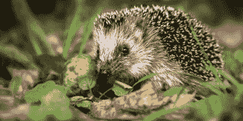
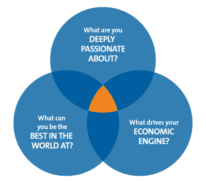

# 来自 MindTools.com 的刺猬概念战略工具

> 原文：<https://www.mindtools.com/pages/article/hedgehog-concept.htm?utm_source=wanqu.co&utm_campaign=Wanqu+Daily&utm_medium=website>

<picture alt="Hedgehog Concept - Using the Power of Simplicity to Succeed" data-test="article-image"><source srcset="//www.mindtools.com/media/Resized-Images/Articles/Strategy_Tools/23_GI_611310594_MarenWinter_2x1.jpg" media="(min-width:1400px)"> <source srcset="//www.mindtools.com/media/Resized-Images/Articles/Strategy_Tools/24_GI_611310594_MarenWinter_2x1.jpg" media="(min-width:1050px)"> <source srcset="//www.mindtools.com/media/Resized-Images/Articles/Strategy_Tools/25_GI_611310594_MarenWinter_2x1.jpg" media="(min-width:700px)"> </picture>

MarenWinter

做商业中的刺猬，拥抱简单。

如果你可以选择做一只狐狸或刺猬，你愿意做哪一个？

许多人会选择做一只狐狸。毕竟，狐狸是美丽的，光滑的，狡猾的。刺猬是一种在欧洲、亚洲和非洲发现的小而多刺的动物，与此相反:缓慢、安静且步履沉重。

那么，狐狸和刺猬与你的组织的成功有什么关系呢？总之，一切！这都是关于学习简单的艺术，像刺猬一样，为你的组织创造一个清晰的焦点。

在这篇文章中，我们将看看刺猬的概念，并讨论为什么在商业中，做刺猬比做狐狸更划算。

## 刺猬是什么概念？

刺猬的概念是基于古希腊的一个寓言，说:“狐狸知道很多事情，但是刺猬知道一件大事。”

在寓言中，狐狸使用了许多策略试图抓住刺猬。它偷偷摸摸，猛扑，赛跑，装死。然而，每一次，它都被打败了，它柔软的鼻子被刺扎着。狐狸永远不知道刺猬知道如何完美地做一件大事:保护自己。

哲学家以赛亚·伯林在他 1953 年的文章《刺猬和狐狸》中运用了这个寓言并将其应用于现代世界柏林把人分成两组:狐狸和刺猬。[1]

他认为狐狸同时追求许多目标和兴趣。结果是他们的思维分散，没有重点，最终成就甚微。然而，刺猬简化了世界，专注于一个单一的、总体的愿景，然后他们就实现了。

商业研究员兼顾问吉姆·科林斯在他 2001 年的经典著作《从优秀到卓越》中提出了这个观点柯林斯认为，如果组织能够确定他们最擅长的一件事——他们的“刺猬概念”,他们就更有可能成功。[2]

当一个组织已经确定了它的刺猬概念，它的领导者应该投入所有的精力和资源去实现它。柯林斯认为，当情况变得艰难时，只有专注于自己擅长的领域的组织才能生存和发展。

## 如何应用刺猬概念

您可以通过进行三个独立的评估来找到您组织的刺猬概念:

1.  了解你的员工真正热爱什么。
2.  确定组织在哪些方面比其他人做得更好。
3.  确定它擅长的创收领域。(柯林斯称之为“理解你的经济引擎”)

所有三个答案重叠的地方就是您的组织策略的“最佳点”，如下图 1 所示。

#### 图 1–刺猬概念

版权所有 2001 吉姆·科林斯。最初发表在《从优秀到卓越:为什么有些公司实现了飞跃…而有些没有》一书中。经柯提斯·布朗有限公司许可转载

让我们详细地看一下每个评估，并检查将 Hedgehog 概念应用到您的组织中可以采取的步骤。

### 第一步:找到你的激情

想想你在工作中对什么有激情。是什么让你在早上起床，并让你自愿工作到很晚？

然后，考虑你的员工最感兴趣的是什么。组织的[目的](/pages/article/find-purpose-work.htm) *如何激励他们？当你雇佣新的团队成员时，你会寻找什么样的动机和价值观？*

 *然后，看你所在组织的[使命和愿景声明](/pages/article/newLDR_90.htm) *。它的核心价值观是什么，你的员工认同吗？*

 *### 第二步:了解你最擅长什么

在这里，你的目标是了解你的组织在哪些方面比别人做得更好。如果你不能在你的核心业务上成为世界第一，那么这不应该是你的刺猬概念。

同样重要的是，要知道你的组织永远不会在哪些方面做得最好。当你考虑这些弱点时要诚实，并且记住在某些领域不是最好的也没关系——理解你的组织能够擅长什么要强大得多。

诸如 [SWOT 分析](/pages/article/newTMC_05.htm) *，[核心能力分析](/pages/article/newTMC_94.htm) *和 [USP 分析](/pages/article/newTMC_11.htm) *等工具将揭示你已经做得很好的地方，并帮助你确定你可以在哪些方面出类拔萃。***

 ***### 第三步:发现你的经济引擎

为了拥有强大的经济引擎，您的组织必须了解如何产生持续的现金流和盈利能力，并将这种洞察力表达为单一的“经济分母”这也被称为“每 X 利润”，其中“X”是对您的组织的长期成功具有最大和最可持续影响的单一衡量标准。

一些常见的经济特征包括:

*   每位顾客的利润。
*   每个员工的利润。
*   每个位置的利润。
*   每个地理区域的利润。
*   每生产一个零件的利润。
*   每个品牌的利润。
*   每笔销售利润。

你采用的“X”可以针对你的业务或行业。例如，大多数航空业历史上使用“每座位英里总收入”然而，西南航空公司采用“每架飞机的利润”作为分母。

关注飞机，而不是座位里程，意味着西南航空采取了与竞争对手不同的战略决策。因此，它已成为美国最持续盈利的航空公司。[3]

#### 获取免费时事通讯

每周学习基本职业技能，外加获得奖金**基本策略清单，免费！**

[Read our Privacy Policy](/privacy-policy)

### 第四步:寻找重叠部分

一旦你看了模型的三个圆圈，看看它们重叠的地方。在那里你会发现你的刺猬概念:应该指导你的组织战略的中心愿景。

例如，想象你的组织中的人热衷于创新，热衷于造福弱势群体。你意识到你有能力成为世界上最优秀的开发负担得起的水过滤系统和便携式水载体。你有一个很好的慈善网络，而且你有大批量销售大客户的经验。

因此，一个可能的 Hedgehog 概念是开发一个便携式水过滤系统，发展中国家的人们可以用它来过滤河水。你可以将这些产品批量出售给慈善机构。

如果你的刺猬概念现在还不明显，不要担心。您可能需要做一些额外的分析或探索不同的组合，以找到最适合您的核心愿景。

### 第五步:回顾并交流你的策略

一旦你找到了圈与圈之间的重叠区域，看看你现有的[策略](/pages/article/what-is-strategy.htm) *，问问你自己它是否符合你的刺猬概念。*

 *你可能会发现，根据你所学到的东西，制定一个经过修订的战略 *，你的组织会从中受益。*

 *你需要让你的团队成员[加入到新战略的](/pages/article/newPPM_82.htm) *中来。首先解释什么是刺猬概念，并说明为什么调整战略以反映其真正的激情、才能和经济能力对您的组织如此重要。(将你的解释与人们的个人激情和价值观联系起来，可能是赢得他们支持的有效方法)。*

 *如果您的分析结果可能会导致您的组织发生重大变化，那么有效地计划和管理这种变化是至关重要的。我们关于[变革管理](/pages/article/newPPM_87.htm) *的文章可以帮你做到这一点。*

 *一旦实施，您的新的、适当调整的战略将为您的团队成员、供应商和客户提供长期关注，从而提高参与度、生产率和盈利能力。

#### 要点

刺猬的概念最初是基于一个古希腊寓言，它说:“狐狸知道很多事情，但刺猬知道一件大事。”商业研究员和顾问吉姆·科林斯在他有影响力的著作《从优秀到卓越》中用这个概念来比喻商业

这个概念可以帮助你的组织专注于三个主要领域:激情、才能和“经济引擎”通过了解这些维度中的每一个，更重要的是，它们重叠的地方，您可以确定将引导您的组织走向有意义的长期成功的关键焦点。*********