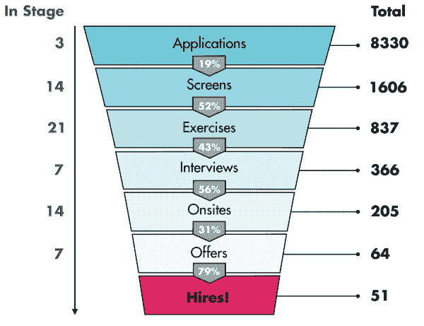

# 如何招募–休息中的 Rands

> 原文：<http://randsinrepose.com/archives/how-to-recruit/?utm_source=wanqu.co&utm_campaign=Wanqu+Daily&utm_medium=website>

从招聘的角度来看，我合作过的最好的工程经理通过两次招聘建立了她的声誉。事情是这样的:

我:“我们需要建立一个 iOS 团队，虽然我们有才华的工程师，但我们没有时间对当前的团队进行 iOS 培训，招聘会更快。”

她:“太好了，我们应该雇用谁？”

我:“这是最完美的侧写。我们永远不会得到他，但他是一个令人难以置信的，著名的 iOS 工程师，他不仅多产，而且是一个非凡的老师。他会是这个队的最佳人选。我们需要像他这样的工程师。”

她:“为什么不雇佣他？”

我:“你永远得不到他。每个人都在向他扔东西。”

三个月后，我认为我们没有机会签下录取通知书的长镜头雇员。两个月后，同样的故事。我提到了一个高不可攀的职位，紧接着就雇佣了那个特定的工程师。

你认为有诡计。你认为我们在这些工程师身上投入了大量资金，但我们没有。标准薪酬方案。你认为我们承诺了一个不可能的角色——我们没有。与一群才华横溢的工程师一起构建 iOS 应用程序的第一个版本。

除了每天挤出时间来做招聘工作之外，别无他法。

**工程招聘规则**

让我们从基本规则开始。对于您团队中的每个空缺职位，您需要每天花一个小时进行招聘相关的活动。将投资限制在你时间的 50%。没有公开申请？我将在下面描述你仍然需要定期做的重要的和正在进行的工作。

花点时间消化一下前面的段落，因为它可能会让很多工程经理感到震惊。我 50%的时间？是的。*但我们有一个功能齐全、才华横溢的招聘机构。*那太棒了，会让你的生活变得更好，但你 50%的时间仍然有效。为什么？很高兴你问了。

在你能做的建立和维护一个健康和高效的工程团队的工作清单上，为你的团队发现、招募、销售和雇佣人员的工作很可能是你能做的最重要的工作。你团队中的人类不仅负责所有的工作；他们是文化的心脏。我们花了很多时间谈论高科技文化，但简单的事实是，文化是由从事这项工作的人建立和维护的。你塑造文化的能力是你雇用多样化的人的能力的一个功能，这些人将成为文化的补充。

我们开始吧。

**招聘入门**

思考招聘工作的一个好方法是深入研究招聘流程是如何整合在一起的。这是:

[T2】](https://i0.wp.com/randsrepose.wpengine.com/wp-content/uploads/2016/09/rands-fixed-once-more.png)

这是 Rands 软件联盟的假设漏斗图，我们正在招聘！我喜欢漏斗图，因为它们有助于将多个信息镜头框入一个易于理解的视图。

*   申请——申请某个角色或从内部或外部获得的人。
*   筛选–通过第一轮筛选过程的人。
*   合格–通过更严格的筛选过程的人。想想编码挑战或技术电话屏幕设计，以收集更多的信号。
*   面试——进入正式面试流程的人。
*   现场——在大楼里接受采访的人。
*   出价——收到出价的人。
*   雇员——接受他们提议的人。

这张假的图表大约持续了六个月。“In Stage”数字显示候选人在每个阶段平均花费的时间，中间的灰色百分比数字显示候选人通过某个阶段的百分比，右边的“Total”数字显示该期间每个阶段的候选人总数。

在我们讨论你应该把 50%的时间花在哪里之前，我们首先需要确保我们与招聘团队达成了两项协议:

1.  就你的管道中候选人的状态和定义达成一致。上面的假图表只是一个例子，你的流程可能会不同。那些状态是什么？考生如何进入和退出特定状态？
2.  定义了#1 之后，您现在需要同意让访问这些信息变得极其容易。

有了所有这些报告并顺利运行，您可以了解招聘流程不同部分的效率，并可以提出有根据的问题。候选人在哪里花的时间最多，为什么？我们在编码练习和面试中收集了最多的信号——通过率不应该更低吗？候选人在这个过程的每一部分花费多长时间？这是我们希望他们拥有的体验吗？

本文假设你有一个功能齐全、才华横溢的招聘团队。这些人对你有效地完成招聘工作至关重要。他们的部分工作是提供一个清晰一致的视角，既能看到整个招聘渠道的健康状况，也能看到任何候选人在任何州的状况。当你有了这个，你会更好地理解在哪里投资你的时间。

**发现、理解和愉悦**

这篇文章不是关于传统的招聘渠道和你已经在做的熟悉的工作。这篇文章是关于你忽略的招聘工作。让我们称之为工程招聘管道，这是一个建立在我上面描述的漏斗之上的管道。我们不同的状态不是基于我们如何衡量候选人的进步，而是基于候选人在整个过程中不断发展的心态。我认为有三种状态:发现、理解和愉悦。

**发现**，首先，是任何合格候选人的心态，他们还不知道你的团队和你的公司有这个机会。你的工作是首先找到这些人，并帮助他们发现在这家公司与你一起工作的愿望。

用招聘术语来说，那些在招聘中找到这些候选人的人就是“线人”。他们的工作是看你的工作描述，然后找到符合要求的人。招聘者把他们的网撒得很宽，尽可能多的用合格的候选人填满这个漏斗。在探索过程中，寻找资源也是你的工作，但你的时间更有针对性，因为你对这项工作了如指掌。更重要的是，你很可能直接和你知道能做这项工作的人一起工作。让我们通过建立必做清单来操作这个事实。

列个清单。打开一个空白的电子表格，开始输入，因为你会想要获取一堆不同的数据，随着数据的增长，你会想要以不同的方式对其进行分割。这是一份名单，上面列有每一个和你共事过的人，以及你想再次共事的人。你必须再次和他们一起工作。

每个人。不管他们是不是工程师。继续打字。不管他们有没有空。写下他们的名字，他们目前的公司，他们目前的角色，以及为什么他们会在这个名单上。完成了吗？好吧，放一天再回来。你错过了重要的人类。

必须列表有两个用例。首先，每当我的团队有新的工作机会时，我会打开名单，看看名单上是否有人符合要求，然后给他们发一封友好的邮件。你好。你好吗得到了一个演出，我**必须**再次与你合作。咖啡？如果我们最近没说过话，这个人和我经常会去喝咖啡，不管他们对这个角色有没有兴趣，因为**他们是好朋友**。大多数情况下，他们对目前的工作很满意。有时他们会认识可能符合条件的人。很少，非常少，他们会来面试。喝完咖啡后，我更新了电子表格中剩余的列:上次联系日期、当前状态、后续步骤和记录当前上下文的注释。

必做清单的第二个用例是我的月度回顾。大约每个月，不管我的团队中是否有相关的公开职位，我都会查看一下名单，看看最近我没有和谁说过话。邮件时间到了？好:*嗨。你好吗咖啡？*同样，他们很少对换工作感兴趣，但如果他们碰巧在找，我会再次与他们合作。

投入到“发现”状态的时间回报会比我们即将到来的“理解”和“愉悦”状态低很多，因为很难衡量进展。目前有 42 个人在我的必选名单上，如果我一年能让他们中的一个出现在大楼里，我会很兴奋。然而，这些是我的人，花在这个网络上的时间几乎总是以与我是否能雇用他们无关的方式获得意想不到的回报。这些是我的人，他们知道其他人可能适合这份工作，或者我应该见见他们。他们用有趣的方式观察世界，我想听听那些观察。

在 Discover 中，您正在对您的网络进行有针对性的战略投资。这些人出现在你的必去名单上的原因是你已经亲眼看到了他们所能做的工作。你在前世与这些人建立了一种纽带，你时间的这些小投资加强并重申了这种纽带。这个网络的价值是这些连接的数量和强度的函数。

**了解**。一名候选人通过了非常拥挤的漏斗顶部，到达了评估部分。如果你看看假设的漏斗数字，这个候选人在统计上不太可能达到录用阶段。不管这个特定的候选人是否得到了一份工作，你的工作就是去了解。

这里的招聘漏斗重点是，“他们有必要的技能吗？”面试流程旨在从候选人那里收集信息并进行三角分析。在理解过程中，你的重点是再次考虑候选人的心态。当他们被技能鉴定问题困扰时，他们也在想，“这个工程团队是谁？，”“他们看重什么？、“他们要去哪里？”

作业。现在离开你的数字设备，问一个随机的工程师，他是你面试的一部分，循环我上面问的三个问题。完成了吗？好，和另一个工程师一起做。答案对比如何？是同样的叙述吗？这是一个引人注目的故事吗？

对工程团队文化的解释通常是偶然的。面试的最后几分钟，你问应聘者:“你有什么问题要问我吗？”提出这个懒惰的问题，是希望候选人用一个乏味的普通问题来回答，比如“在这里工作感觉如何？”你用你练习已久的独奏会“我爱这里！”和“我们正在解决难题！”六个月前听起来很棒，但现在听起来，嗯，是排练过的。

你的责任是确保候选人理解你的使命、文化和价值观。虽然他们会在面试中有组织地获取一些内容，但你需要确保这是一个人负责任地、清晰地讲述工程故事的工作。这不是采访；关键是要清楚地解释他们可能工作的地方的形状——额外加分——在讨论你公司的特点时，你会有机地了解他们。

有两种情况可供候选人通过理解。场景 A:他们收到了一份工作邀请，花时间去理解为一次丰富的工作邀请对话铺平了道路，并让他们在到达目的地时立即投入工作。情景 B:他们没有得到一份工作，但是他们清楚地了解了你、你的团队的特点和你的使命。招聘人员称花在面试上的时间为“候选人经历”，我建议，不管他们是否得到了一份工作，理解是优秀候选人经历的基石。

**欣喜**。恭喜你！你在向一个工程师出价。回头看看这些漏斗比率，你可以看到这是一个统计上不太可能的事件。我们别搞砸了，好吗？

当我们提出报价时，新经理会错误地认为，“我们已经录用了！”有经验的经理和招聘人员知道“他们不坐在那张椅子上，就不会在这里。”如果你和你的招聘团队已经完成了你的工作，那么提供工作只是一种形式，因为你已经知道他们的生活状况和目标。Offer 构建、演示和谈判是另外一篇文章，但如果谈判过程出乎意料地艰难或充满惊喜，这显然表明你错过了求职经历中的关键信息。

他们接受了！万岁！我们还没有完成，因为他们还没有坐在那张椅子上。让我们欢迎他们。让我们取悦他们。

噩梦般的场景是候选人拒绝了他们已经接受的提议。我认为这是职业上的不良行为，但这比你想象的要经常发生。设身处地为他们想想:他们可能已经有了一份工作，每个人都知道他们的名字，他们知道哪里有好咖啡。即使在电话筛选、在家编码练习、一整天的面试、另外两个电话和各种电子邮件之后，你和你的工程团队仍然是一个未知数。在午夜，当怀疑的恶魔出现时，你代表一个不确定的未来，而你在快乐时光的工作就是帮助他们想象他们在这里的未来。

回想我在这种状态下的经历，我会想到在接受了邀请后我会怎么做。在收到和接受报价的最初高潮过后，我该做什么？我重读了录取通知书。我回顾一下好处。我上公司网站**检查每个字**。我在找什么？为什么我要继续研究？我继续审视我的决定。

录取通知书是一份重要的文件。它包含了薪酬和福利的明确细节，这些都是重要的事实，但在这个考虑的关键时刻，我希望这些未来的同事能对一封真正的聘书感到高兴。

我在开学前一周寄出了真正的录取通知书。我每次都会写一张便条，记录以下内容:

1.  我目前对公司、团队和我们共同挑战的观察。
2.  我希望新员工参与的前三个大型项目，为什么我认为这些项目很重要，为什么我认为新员工是唯一有资格参与这些项目的人。
3.  我尽我所能，解释新员工的成长道路。

这封信里没有什么应该是新闻。事实上，如果这封信有什么令人惊讶的地方，那就是漏斗的某个地方出了差错。这封信的目的是承认我们已经完成了招聘工作，我们现在开始工作的工艺。

在接受报价后的时间里，大多数公司会送一张便条…一份礼物。我收到了(并感谢)鲜花、一个玻璃容器和简短的手写笔记。贴心的礼物，但是小心思。在一个新员工正在考虑改变职业生涯的时候，我希望他们仔细考虑一下重大的想法。我希望他们理解他们加入的人类和他们的使命。我希望他们具体了解他们将从事的工作，我希望他们了解他们职业的潜在优势。

**你 50%的时间**

招聘工作是一项共同的责任。是的，你可以用不到 50%的时间成为一名成功的招聘经理。是的，所有的漏斗工作都可以由招聘人员完成；我许多最好的招聘举措都来自于观察和与有才华的招聘人员一起工作。

我想避免的情况是，招聘经理将整个招聘过程委托给他们功能齐全、才华横溢的招聘团队。为了发现、理解和愉悦，你需要学习和完善一些关键的领导技能。在 Discover 中，它是理解持续的意外收获网络的力量，在 understanding 中，它是理解如何讲述你的公司的故事以及能够理解候选人的故事。最后，在愉悦方面，这是在候选人的担忧和风险厌恶情绪最强烈的时候，辨别什么是让他们愉悦的最佳方式的能力。

招聘和工程必须有一个象征性的多倍关系，因为他们一起做的工作——建立一个健康高效的团队——决定了你的团队和公司的成功。