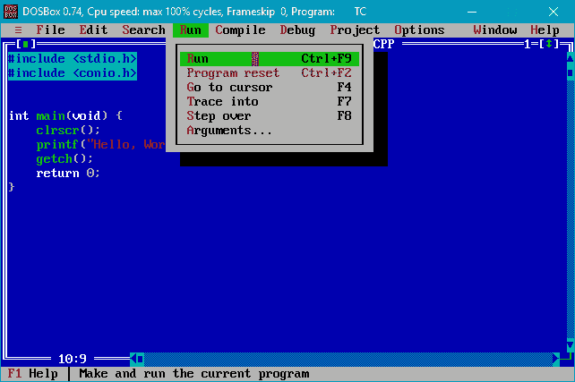

# 知识债务

> 原文：<http://amir.rachum.com/blog/2016/09/15/knowledge-debt/?utm_source=wanqu.co&utm_campaign=Wanqu+Daily&utm_medium=website>

# 知识债务

<time pubdate="">September 15, 2016</time>

当你是一名程序员时，有太多的东西需要学习。想想你第一次写“你好，世界！”程序。对我来说，那是在四年级。我们学了 C++，老师已经把程序手写在黑板上让我们抄写。我们使用 Turbo C++，我们把它复制到软盘上，这样我们就可以在家里进行实验。

当时，我并不认为 Turbo C++是*的编辑*。我没把*当成 IDE* 。对我来说， **Turbo C++ *就是* C++** 。据我所知，这是编程的唯一方法。我其实不知道“编译”是什么意思。我不知道你为什么需要那块。我不知道`main`做了什么，也不知道`printf`怎么能接受我传递的任何论点。我只是从黑板上复制了程序，点击`Run`，在屏幕上得到输出。

这太棒了。编程应该是这样教的。你应该在弄清楚它是如何工作的之前做很多事情。在一段时间内，你应该有意忽略那些分散注意力的细节。

最终，你会长大。当你写你的第一个“大”程序时，你会知道`#include`做什么。当您开始从 shell 运行可执行文件时，您将知道来自`main`的输出到哪里。当你学习变量参数时，你就会知道`printf`是如何处理参数的。

* * *

知识债务并不仅仅存在于向这个世界迈出第一步的四年级学生身上。在我知道共享库如何工作之前，我用 C++ [编码。在知道底层 web 服务器如何处理请求之前，我开发了一个 web 应用程序；在我知道如何为不同的目标编译编译器之前，我为嵌入式 Linux 编程；在我告诉你什么是“应用生命周期”之前，我创建了一个 Android 应用。还是那句话，这是*伟大的*。在编写第一个 Python 应用程序之前，你绝对应该*而不是*了解元类(有些人会说永远不要)。](/blog/2016/09/17/shared-libraries/)

这些都是我从事专业编程时的“知识债务”。把它们放在一边让我快速进步，而不会被细节轰炸。但是知识债和技术债一样，应该是暂时的。

> 你应该有意识地、有策略地决定哪条信息是你现在不需要的。但是你也应该有意识地、有策略地(T2)决定何时偿还债务。

知识债务就像金融债务。这是一种*工具*——你需要明智地使用它来获利。假设你想开始一个小生意。为了将来赚更多的钱，预先承担一些债务可能是一个很好的决定。但是像金融债务一样，你需要根据你的情况来定义你的债务参数。承担太多可能是危险的，但承担太少也是危险的。决定何时以及如何偿还债务也很重要。欠债太久会让你支付太多的利息，但是试图大量偿还会阻碍你的进步。

和金融债一样，知识债也不只是新手才有。大公司的负债和小企业主一样多，甚至更多。他们也借了更多的债。正如四年级的我需要推迟学习编译器一样，年长的我需要推迟学习 CPython 解释器的内部实现。

成为一名程序员就是要处于一种持续学习的状态。让知识债务*积累*会慢慢让你的职业生涯和生产力停滞不前。如果你在某个对你的工作至关重要的领域有知识债务，你会发现编写新功能需要更多的时间和精力，而修复 bug 需要更多的时间和精力。你偿还债务的时间越长，你付出的“时间利息”就越多。

> 花时间去了解你所使用的技术的内部运作会让你工作得更快，更省力，对你的专业能力更有信心。

我相信知识债务是平庸的程序员和伟大的程序员的区别。**伟大的程序员不会安于不知道；但是他们现在也不知道如何学习 T4。他们处于一个持续的循环中:借债，记下债务，然后在适当的时候再回来。**

* * *

今天就确定你的知识债务——找出你*需要*理解的东西，以便在你的工作中做得更好。寻找机会并偿还。好起来。

<small>**Discuss** this post at [Hacker News](https://news.ycombinator.com/item?id=12505639), [/r/Programming](https://www.reddit.com/r/programming/comments/52wjdy/knowledge_debt/), or the comment section below.</small>
<small>**Follow** me on [Twitter](https://twitter.com/AmirRachum) and [*Facebook*](https://www.facebook.com/amir.rachum.blog)</small> *<small>**Thanks** to Hannan Aharonov, [Yonatan Nakar](http://stackoverflow.com/users/110028/snakile), [Shachar Ohana](https://www.linkedin.com/in/shacharoo/) and [Ram Rachum](http://r.rachum.com) for reading drafts of this.</small>*

#### *类似帖子*

