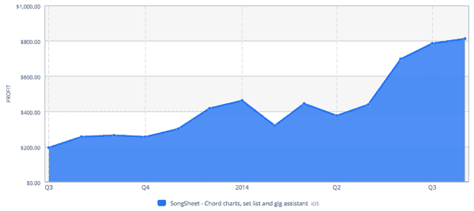
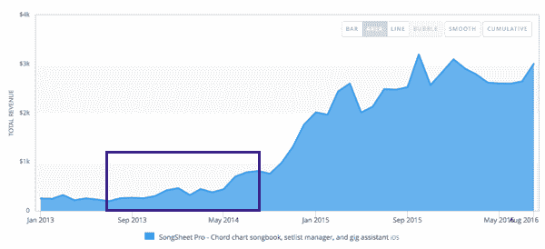
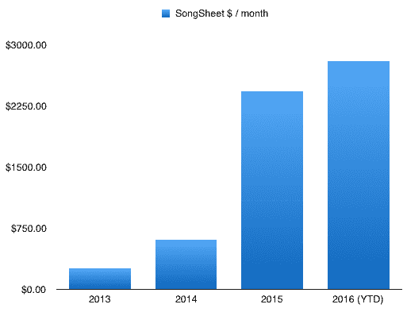
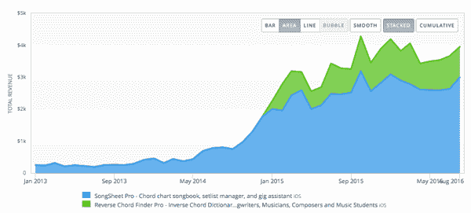
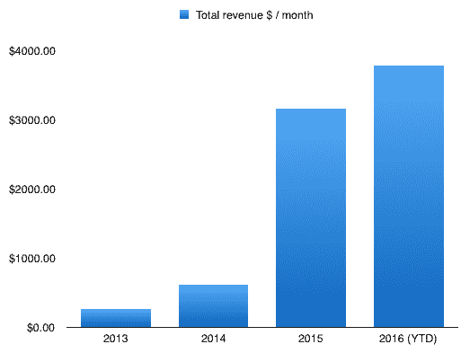

# 我是独立开发者-第 3 部分

> 原文：<http://gabrielhauber.net/devBlog/2016/09/14/indie-dev-part-3/?utm_source=wanqu.co&utm_campaign=Wanqu+Daily&utm_medium=website>

自从我上次写下我成为(或试图成为)独立 iOS 开发者的旅程以来，已经有很长一段时间了。事实上，鉴于本系列的最后一篇帖子是在 2014 年 9 月写的，因此已经整整两年了。考虑到从那时起许多人写信给我询问下一部，并且从那时起发生了这么多事情，我想是时候我终于写下那个更新了:)

## 概述

如果你以前没有读过它们，我建议你在继续写这篇文章之前先读一下[第一部分](/devBlog/2014/07/27/i-am-an-indie-ios-dev)和[第二部分](/devBlog/2014/09/06/indie-dev-part-2)。同时，这里有一个非常简短的总结:

2014 年上半年，我作为一名开发人员来到了职业生涯的十字路口。在我非常耐心和善解人意的妻子的帮助下，我们做出了一个决定:从大家庭借钱，直接购买我和一个朋友开发的 SongSheet 应用程序的知识产权，并试图将其转化为生活。交易于 2014 年 7 月 1 日结束，从那时起，我成了一名“独立人士”。

考虑到我们拥有的资金，有一个时间限制:如果到年底事情还没有解决，我们可能不得不卖掉我们的房子，偿还贷款，然后想出一些新的事情来做。

我也有一个计划:

1.  积极升级 SongSheet 应用程序本身的功能。
2.  实施更好的在线营销，从一个更好的网站开始。
3.  应用商店优化(ASO)改进。
4.  将 SongSheet 的触角延伸至 iPhone。
5.  可能尝试其他收入模式(如 IAP 免费)。

## 怎么样了？

简而言之，我没有成功。但这也不是世界末日。总而言之:

*   我们仍然有我们的房子:)贷款没有完全还清，但我们正在稳步还款。
*   收入增长很快，但还不够快(见下文)。第二个应用程序(反向和弦查找器 Pro)的添加带来了变化，但还不够。
*   出于需要，我做了一些自由职业工作。由于我在 SongSheet 上展示的能力，找到这份工作更容易了。我设法获得了一些短期到中期的合同(都是兼职的),填补了财务上的缺口，但这花费了我很多时间来开发 SongSheet。
*   我严重低估了让 SongSheet 在 iPhone 上正常工作的复杂性(这可能是另一篇博文的主题)。我实际上只是在上周发布了这个*，比我最初的计划晚了大约 18 个月。*
*   收入仍在增长，我已经非常接近我最初希望的全职独立制作人了。

## 收入增长

当我最后一次写这篇文章时，这是 SongSheet 截至 2014 年 8 月底的月收入情况(所有数据均以我的母语澳元计):

这是 SongSheet 截至 2016 年 8 月底的收入情况(为了更好地理解后一个图表，我突出显示了第一个收入图表的位置):

那是相当大的进步，我肯定你会同意的。在 2015 年初之前，这是一个陡峭的上升，之后增长速度继续放缓。虽然令人印象深刻，但增长还远远不够快；到 2014 年底，SongSheet 的月收入仍然不到 2000 美元，如果这是我唯一的收入来源，这大约是我实际需要实现收支平衡的 1/4 到 1/3。

作为另一个对比，下面是 SongSheet 自发布以来的月平均收入图表:

2013 年的平均价格是 264 美元/月。到目前为止，2016 年迄今的平均价格为 2800 美元/月，如果目前的趋势继续下去，最终价格将会更高。这是 10 倍的增长！我*知道*这个应用有潜力，我相信即使是现在，我也只是刚刚开始发掘它。

但这还不是故事的全部。SongSheet 在 2015 年 1 月加入了一个姐妹 app:[反向和弦查找器 Pro](http://reversechord.com) 。

我没有开发反向和弦查找器的原始版本，它已经在应用程序商店存在多年了。然而，最初的开发人员不再有时间给予它适当的关注(事实上，它已经有相当长一段时间没有更新了)，所以他四处找人接手。由于它是一个音乐应用程序，我看到了一个绝佳的机会，可以在我的投资组合中添加一个可以与 SongSheet 完美搭配的应用程序。

我们达成了一项协议，允许我支付一笔小额预付款，以及为期 2 年的基础金额+版税百分比。这是以这样一种方式构建的，我非常确定，鉴于该应用程序前一年的平均月收入约为 550 美元/月，我应该每月都在该应用程序上获利。

有了一点点爱，Reverse Chord Finder 从低谷反弹，2015 年平均创收 733 美元/月，2016 年至今平均创收 980 美元/月。诚然，这些数字不会改变世界，但这仍然是我朝着最终目标迈出的又一大步。自从接手以来，我一直在更新用户界面，使其能够在现代 iPhones 上工作，我重写了和弦查找引擎，并添加了一系列本地化内容(我希望以后能就最后一个主题写一篇博客)。

我希望反向和弦寻找器也能在它和 SongSheet 之间做交叉推广；到目前为止，我还没有真正坚持到底(因为各种原因)，但从现在到年底，我在这个领域有所进展，并很高兴看到接下来会发生什么。

总之，这是截至 8 月底的综合应用收入图:

这是迄今为止每年的平均月收入:

不错，离我的目标也不是很远。我现在需要做的就是把前几个月的收入翻一番。考虑到我已经将总收入翻了两番*已经翻了四倍*，再翻一倍似乎根本不是什么大事。

## 收入模式

如何在 App Store 上实现应用程序的商业化仍然是一个热门话题。我对当前讨论的印象表明，一个近乎普遍的共识是，预付已经死了；只有广告支持的订阅或其他 IAP 模式才是可行的。与这种明显的趋势相反，我固执地(或懒洋洋地？)坚持预付模式。(在这篇文章中，我不会试图证明我在这方面的决定；我将把它留给另一个人。)

鉴于此，我对这两款应用的定价做了进一步的实验。

你可能还记得我在本系列的第二篇文章，我进行了以下实验:

1.  我把 SongSheet 的价格从通常的 4.99 美元降到了 0.99 美元
2.  每隔一周，我就把价格提高一级。
3.  当我觉得我已经确定了实现最高收入的价格层级时，我终止了价格上涨。

虽然较低的价格带来了较高的下载量，但额外的下载量不足以抵消较低的价格。结果，我确定了 6.99 美元的新标准价格。除了一些短期的价格变化，我在 2015 年 2 月初进一步将价格提高到 7.99 美元(没有像以前一样进行任何正式的实验)。在看到这一水平上有希望的结果后，我在 2015 年 3 月底再次将价格提高到 9.99 美元。就在那时，我的勇气耗尽了，我不愿意再把价格推高了。然而，每次价格上涨都会增加收入，这表明我可能在太低的水平上终止了我最初的实验。

同样令人鼓舞的是，我的几个较大的竞争对手也大幅提高了价格。考虑到像 SongSheet 这样的应用程序是音乐人一直在使用的工具(SongSheet 的许多用户几乎每天都在音乐会上使用它)，我认为与消费者认为是“一次性”购买的许多其他应用程序(例如游戏)相比，预先购买更容易证明其价值。

我上一次提价发生在几周前，当时我预计 SongSheet 的 iPhone 版本即将发布(我决定将 iPhone 版本作为独立于 iPad 版本的*应用程序发布，这也可能是另一篇博客文章的主题)。用于 iPad 的 SongSheet(现在称为 SongSheet Pro，以区别于 iPhone 版本)现在售价为 14.99 美元。这比以前的正常价格上涨了 50%。它做得很好。我选择这个价格是为了让新的 iPhone 版本能以 iPad 版本 9.99 美元的旧价格销售。*

我对定价模式的主要担忧是，它可能会对我的总体收入增长曲线产生什么影响。我的意思是:更低的价格可能意味着现在更低的收入。然而，如果它导致我的应用程序有更多的忠实用户，那么长期的*增长曲线*可能会更陡峭，因为口碑效应会有更多的人与之合作。不幸的是，这不是你可以轻易试验的事情；无论如何，都需要多年的数据(我认为)来回答这个问题。

我用 Reverse Chord Finder 做了一个类似的定价实验，在我接手之前，它的定价是 9.99 美元:

1.  我把它的价格从 9.99 美元降到了 1.99 美元。
2.  每两周我就提价一次。两个星期的时间是试图在某种程度上过滤掉每周变化的噪音。
3.  一旦我再次达到原价，我就终止实验。

我学到了什么？就像 SongSheet 一样，它以 9.99 美元的价格赚了最多的钱，所以我把它留在了那里。

如果你有一个预先付费的应用程序，不要害怕尝试价格——你可能会发现你多年来一直收费不足，留下了很多钱。(当然，反过来说，你可能已经超额收费了；但是不实验就不知道了)。

我强烈推荐你阅读 [Michael Jurewitz 关于应用程序商店定价的博客系列](http://jury.me/blog/2013/3/31/understanding-app-store-pricing-part-1)，这是一篇关于如何为你的应用程序确定理想价位的精彩讨论。

## 我现在所处的位置

上周(确切地说是 9 月 7 日)我终于发布了 SongSheet 的 iPhone 版本。有了它，我还利用我现在有两个付费 iPhone 应用程序的事实，创建了一个包含 Reverse Chord Finder 和 SongSheet 的应用程序捆绑包。这是我的应用程序组合(写这篇博文时应用程序的价格是正确的):

一旦发行结束，我应该对持续收入的新水平有一个很好的想法；初步迹象非常积极。大约一个月前，我也完成了一份合同，还没有找到其他工作，所以从某种意义上说，我现在是全职独立制作人，我喜欢这份工作:)接下来的几周对决定我的长期未来非常重要。

与此同时，我和妻子正准备飞往美国，参加在印第安纳波利斯举行的[发布会](https://releasenotes.tv/conference/)(9 月 27-29 日)。如果你要去的话，我们希望你能过来打个招呼！我们还将在洛杉矶呆几天(我们将于 9 月 23 日到达洛杉矶)，然后在奥斯汀呆几天。我们将于 10 月 3 日飞回澳大利亚的家。

