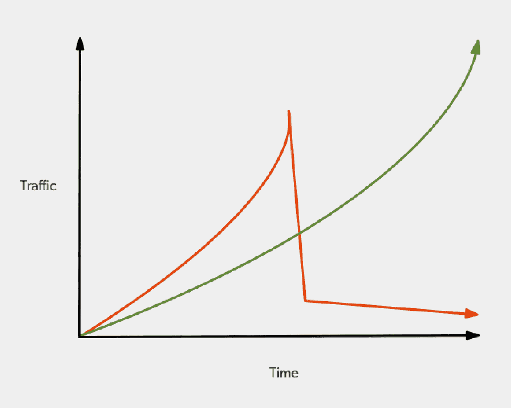
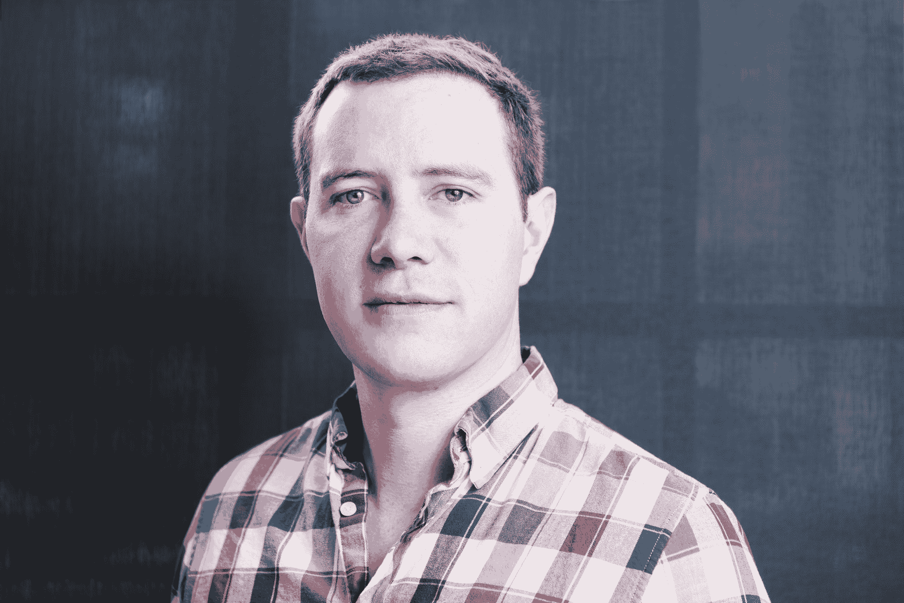
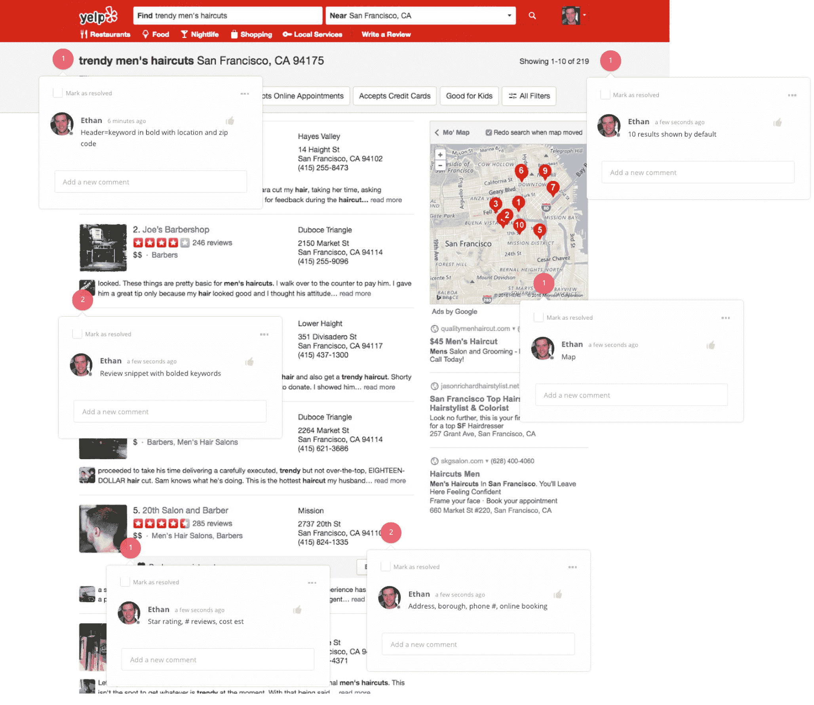

# 帮助每月达到 2000 万访问量的 SEO 技巧|第一轮评论

> 原文：<http://firstround.com/review/the-seo-tips-that-helped-tally-20-million-visits-a-month/?utm_source=wanqu.co&utm_campaign=Wanqu+Daily&utm_medium=website>

在**[yummy](http://www.yummly.com/ "null")**推出三个季度后，其首席增长官 **[伊森·史密斯](https://www.linkedin.com/in/ethanucsb "null")** 目睹了这个美食探索平台在一个月内的第 1000 万次访问。然而，像大多数持久的食谱一样，它并没有因为灵感的迸发而成为大众的最爱。Yummly 的搜索引擎优化策略，帮助这家初创公司成为 iPhone、iPad 和 Android 的最佳全球食谱应用，这一策略历经多年，可以追溯到史密斯的第一家公司。

Smith 的职业生涯始于用户体验设计师和研究员。在 [Wize](http://www.wize.com/ "null") 的时候，他管理产品、设计和营销，直到 Nextag 收购了产品评论初创公司。自 2010 年以来，他在 Yummly 担任过各种职务，包括产品主管和增长副总裁，帮助该网站每月访问量超过 2000 万次。除了 Yummly，他还积极为诸如[瓦内洛](https://wanelo.com/ "null")、[T5](https://wanelo.com/ "null")[Vinted](https://www.vinted.com/ "null")和[图钉](https://www.thumbtack.com/ "null")等初创公司提供战略建议，以促进增长和 SEO。

在这次独家采访中，史密斯分享了为什么搜索引擎优化的一个特定拐点会导致代价高昂的误解和失误。他概述了如何识别和回避它们，并确定了高性能搜索引擎优化的关键原则。对于任何对 SEO 失去信心或碰壁的公司来说，史密斯的策略可以帮助你改进和重振你的战略。

# 搜索引擎优化的范式转变

产品-市场匹配的概念引起共鸣的一个原因是，产品和市场这两个要素之间的平衡和依赖是其名称中的核心。但是，当许多创业公司想到 SEO 时，脑海中往往会跳跃到狡猾的策略和黑客攻击的增长方式。事实是，优化只是作为一个强大的搜索引擎的等式的一部分的理解。当搜索规则改变时，策略也必须改变。在过去的五年里，史密斯看到创业公司忽视了一个转变，这个转变改变了 SEO 的很大一部分。

“搜索引擎优化的新时代始于 2011 年初，当时谷歌推出了对其搜索结果排名算法的改变 [Panda](https://en.wikipedia.org/wiki/Google_Panda "null") 。曾经非常简单的算法被改进以惩罚低质量的瘦网站。史密斯说:“主要基于关键词密度和页面排名的公式已经一去不复返了。“在过去的搜索引擎优化中，人们可以用伪装的文本以微小的字体重复和隐藏一系列关键词，以增加单词密度和页面排名。一个 SEO 经理的工作就是找到这样的漏洞并加以利用，直到谷歌拍拍你的手腕，补上缺口。因为惩罚是短暂的，人们会尽快回去寻找和利用另一个漏洞。”

与惩罚通过反向链接人为提升页面排名的谷歌企鹅一起，熊猫给 SEO 带来了某种新的世界秩序。“虽然企鹅过滤器的大部分工作都是公开的，但熊猫还有更多未知之处。例如，如果你的网站被熊猫惩罚，可能需要*年*才能从它那里被释放，这是如何发生的还不清楚，”史密斯说。“以下是我反复看到的情况:创始人创办公司。他不是 SEO 专家，但听说这很重要。他四处打听，被告知要发布 5000 万个页面。这家初创公司以 10 万英镑起步，流量不断上升。然后，它又推出了 100 万个页面。更多的流量来了。然后它发布了 5000 万页。交通量猛增。然后几个月后，交通坦克。创始人疯狂地试图重新获得流量。几个月过去了，但什么都没用。”

Aggressive SEO (red) versus gradual SEO (green)

# 良好内容和参与的时代

得知谷歌调整其算法来奖励好的内容和用户体验并不是什么惊天动地的事情，但困难的部分是弄清楚*如何*采取行动来实际获得这些好处。“需要的不仅仅是行为上的改变，而是心态上的转变。史密斯说:“几乎每一个快速获取流量的计划最终都会把地毯从你的身下拉出来。“你必须为长远考虑；你想要的增长曲线更平缓，更平稳。它在早期不会看起来很好，但如果你坚持不懈，它会带来明显更多的长期流量。”

这里是开始踏上稳定曲线的地方:

# 使用谷歌的指南——而不是你的猜测——来定义什么是好的。

如果提高你的内容质量和流量是你的目标，有杠杆拉，但不要以为你可以选择哪些。“大多数人本能地认为自己是内容和用户体验方面的权威。史密斯说:“对于 SEO 来说，这并不重要。“重要的是谷歌定义的好内容和好参与。注意，我说的不是什么客观上的好，而是什么主观上的*被 Google 定义为*好。谷歌有一套指导方针——大约 150 页[——并雇佣了数千名高质量的评分员根据他们的指导方针对网页和网站进行评分。”](https://static.googleusercontent.com/media/www.google.com/en//insidesearch/howsearchworks/assets/searchqualityevaluatorguidelines.pdf "null")

你的页面越像那些被谷歌标记为好内容的页面，你的“内容质量”就越好，你的页面在排名中的排名就越靠前。“这就像任何运动或棋盘游戏一样。史密斯说:“有些规则可能没有意义，但你必须遵守它们，才能赢得时间。“例如，搜集和总结内容对用户来说可能是一件非常有用的事情，但谷歌认为它不是。对于 Yummly 来说，有很多评论或有“烹饪模式”的食谱排名很高，因为谷歌认为这些能让食谱质量更高。”

当谈到谷歌的内容质量指南时，它的大主题是吃，代表专业知识，权威和值得信赖。“该指南详细说明了各种主题所需的专业知识标准。例如，医疗建议应该来自具有适当认证的个人或组织，但是为因病死亡的人的配偶举办的论坛也被认为是专家。区别因素是什么样的生活经历是可信地给予他人价值所必需的。该指南提出了一个很好的指导性问题:“页面要很好地实现其目的，需要什么样的专业知识？”"

史密斯与一些公司合作，帮助他们建立特定类别的高 EAT 分数。“为了在购物中获得高 EAT 分数，Wanelo 会显示每个产品的评论和照片，以及退货政策和运输信息。他说:“为了展示 Wanelo 是一家声誉卓著的公司，它在新闻页面上突出了《纽约时报》、《T2 财富》和其他可信媒体出版物的新闻报道。“对于本地服务，图钉突出显示了从业者的从业年限，他们是否有执照，他们完成了多少工作，最重要的是，许多 5 星评论。”

有了 SEO，你就可以义正言辞。如果是后者，遵循谷歌的指导方针，而不是你的直觉。

除了谷歌几百页的搜索引擎优化指南，史密斯强调了一些不被重视的技巧，供你调整搜索引擎优化策略时参考。

Ethan Smith

# 保持良好的卫生。

SEO 的一个不被重视的方面与你做什么关系不大，与你不做什么关系更大。这不是那种性感的增长黑客，但也很重要。“太多的人继续采用在熊猫时代之前行之有效的增长战略，但这种战略现在对他们不利。不要花费精力去试图摆脱熊猫的处罚；把你的精力放在良好的卫生和保养上。这种策略包括在测试新的搜索引擎优化策略*和*之间取得平衡，跟踪你的页面，以尽早发现问题，防止未来的惩罚。”

以下是 Smith 关于保持良好 SEO 卫生的一些建议:

计划每周对你的网站进行一次开放式抓取。很多时候，公司的网站会有杂乱的谷歌索引页面，他们不想被索引，也不知道。“大多数人不明白的是，谷歌会索引他们想要的任何页面。这与你在网站地图上放了什么无关。这是关于谷歌能找到的任何它会索引的页面，除非你告诉他们不要这样做，”史密斯说。“每周对你的网站进行一次开放式抓取，寻找不应该出现的页面。发现这些对提高 SEO 至关重要——也是良好卫生习惯的一部分。使用[尖叫青蛙](https://www.screamingfrog.co.uk/seo-spider/ "null")等工具抓取你的站点和 QA。”

跟踪你的页面数量，有多少被抓取，有多少被索引，有多少有流量。“注意这些数字中的任何重大差异。所以，如果你有 1000 个页面，但只有 200 个被抓取，警报应该响起。或者抓取了 1000 个页面，但是只有 200 个被索引。或者 1000 个被编入索引，但只有 10 个有流量，”史密斯说。“你希望你所有的网页被抓取每周的基础上，95%的索引率与大多数获得流量。”

Sample Hygiene Report

消除附带的索引页。值得重复的是:如果*你*认为你的页面很重要，这并不重要；关键是谷歌认为重要的东西。谷歌会通过经常抓取、索引和发送流量来告诉你你的页面是否重要。谷歌不喜欢有很多薄页面的网站。一旦爬虫捕捉到这些“薄”页面，就把它们处理掉。如果您无意或不知不觉地发现“薄”页面被编入索引，请不要感到惊讶。

“取决于他们的网站架构，初创公司可能会意外地创建和索引大量的页面，而不知道它对 SEO 的影响，”Smith 说。“例如，Yummly 的 1800 万用户都有个人资料页面。这几百万个页面是 Yummly 特性集的核心，因此非常有用。然而，很少有人在谷歌上搜索个人资料页面——他们搜索的是鸡肉砂锅食谱。问题是，谷歌会将这些个人资料页面归类为太薄，并对我们进行处罚。为了避免这种情况，我们对允许索引哪些页面非常谨慎。”

一旦你找到了“薄”页，有一些前进的方法。“消除它们的最好和最快的方法是通过在 robots.txt 文件中禁用它或使用 Google 网站管理员工具中的目录删除工具来删除整个目录。你也可以用 noindex 标签或者通过返回 404/410 错误代码来删除单个页面，”Smith 说。“但是要保持警惕，因为还有其他方式会突然出现‘瘦’页面。许多网站的每个页面都有 HTTPS 和 HTTP 版本；这意味着每一页都会被索引两次。网页可以用或不用“www”。“在 Yummly，我们注意到我们的开发服务器——如 DEV1.yummly.com、DEV2.yummly.com 等——创建了我们网站的重复版本。如果我们没有发现它，我们会意外地有 10 个版本的网站被编入索引，导致重复内容问题。”

**扁平化你的内部链接架构**。Pagerank 雕刻已死。现在重要的是足够的链接和 pagerank。你越能扁平化你的内部架构，你的每个页面就越能获得足够的 pagerank，你的流量就会增加得越多。“大多数内部链接只偏向几页。你可能有最新文章的内部链接。如果你有一千页，最近的帖子可能有十页。那么你就没有链接到其他 990，这向谷歌发出信号，这些页面不重要，所以它们不会有流量，”史密斯说。“取而代之的是，链接你的所有页面，这样谷歌就有很多途径找到你网站上的所有页面，而不仅仅是其中的一小部分。所以，如果你展示一个易于使用的数码相机，不要只是链接到其他相机。链接到其他易于使用的类别，如耳机或电视。垂直交叉链接*和水平交叉链接*创建了一个连接更紧密的扁平链接架构。”

# 先偷。然后创新。

史密斯花了三年时间在 Wize 找到并调整的增长战略，仅在三个月后就开始在 Yummly 发挥作用。考虑到 SEO 的长期发展需要时间，初创公司在刚起步时承受不起陡峭的学习曲线。“担心你的核心产品的创新，而不是你的搜索引擎优化。史密斯说:“这并没有广为人知，但大多数成功的成长型团队和公司都从竞争对手那里吸取了最有效的策略，在内部加以应用，然后加以改进。“徐老也不例外。大多数可行的方法在开始时并不明显，所以初创公司要花大量时间重新发明轮子。”

史密斯在研究中获得了成功——不仅是次要的，而且是主要的。“我们寻找最成功的搜索引擎优化公司。我们深入分析他们的网站和策略，以了解什么在起作用。然后，我们试图与负责搜索引擎优化的人取得联系，直接询问他们哪些有效，哪些无效，”他说。“不要只研究和接触你主观上认为可能感兴趣的人。我们使用[sixtrix](https://www.sistrix.com/ "null")和 [SimilarWeb](https://www.similarweb.com/ "null") 评估竞争对手的流量和参与度。对于 Yummly 来说，我们关心某些增长指标——比如整体流量、高 [SERP](https://en.wikipedia.org/wiki/Search_engine_results_page "null") 排名和稳定的增长轨迹——来识别哪些网站拥有最有效的 SEO 策略。然后我们找到在这些公司工作的人，主动询问他们是否愿意接受电话。我从来不会边喝咖啡边聊天。我做了功课，带了一份针对他们网站特定部分的尖锐问题清单。”

史密斯联系的人中有 90%与他分享技术。“他们可能不会说所有的事情，但如果我有具体的问题，他们会回答。结合其他对话，这有助于我们的战略保持最新。当然，我也会向他们提供对我们有用的想法，这样交流对双方都有利，”他说。“这听起来很简单，但许多只是从远处研究。我们既喜欢接触其他增长专家，也喜欢跨网站测试与流量相关的共同属性，如 [Yelp](https://www.yelp.com/ "null") 、 [Zillow](http://www.zillow.com/ "null") 和 [Houzz](http://www.houzz.com/ "null") 。其实不要只看竞争对手，要看你范畴之外的。我们实际上从猫途鹰的页面结构中学到了很多。"

在 Yummly，Smith 使用了这两种类型的研究——以及他的个人经验——成功地改进了它的分类页面。“我们在我的上一家公司推出了分类页面，在那里我们可以找到关键词，并创建针对这些关键词的页面。所以我们在 Yummly 做了同样的事情，基于结构化的分类法，比如购物类别和过滤器。因此，数码相机会有一个页面，每个滤镜也会有一个页面，比如价格在 50 美元到 100 美元之间的数码相机，”他说。“它起作用了，但不太好。通过与同行的交流和与其他网站的模式匹配，我们意识到我们的结构化分类法没有使用人们在 Google 表单中搜索的单词。然后我们找到了人们实际上在谷歌上搜索的短语，比如“用于野生动物摄影的数码相机”，并为这些术语策划了分类页面。这样效果更好，因为页面与人们在搜索框中输入的实际查询完全匹配。”

# 将 SEO 视为收购。

根据史密斯的说法，大多数大公司之所以非常成功，是因为它们在发展过程中非常积极进取。 [Airbnb 很早就利用 Craigslist 来开拓更广阔的市场。Pinterests 给你所有的脸书朋友发邮件，告诉他们你跟踪了他们，而你没有。Linkedin 很容易意外地向你的整个联系人列表发送邀请。史密斯说:“最成功的公司也非常积极——通过电子邮件营销、付费广告和推荐——但*没有* SEO。“过去，SEO 的成功青睐最积极进取的公司。在谷歌熊猫或企鹅之后，成功青睐那些采取稳定的长期增长方法的公司。在 SEO 方面要有闯劲，首先你要部署资源，但不要做得太多太快，那不符合你的实际战略。”](https://growthhackers.com/growth-studies/airbnb "null")

在移动时代，大多数人会声称网站不再重要，或者 SEO 已死。“事实是，当被用作收购工具时，SEO 比以往任何时候都更有效。事实上，除了游戏应用，Pinterest、Yelp 和 Houzz 等最成功的应用都将网络搜索引擎优化作为主要的应用获取渠道，”史密斯说。“大多数 SEO 访问者来到一个网站，看几页，然后离开。很容易把这些路人用户斥为没有价值。目标是让搜索引擎优化访问者回来。无论是让某人注册，使用吸引人的功能还是下载应用程序。从获取渠道来看，SEO 可能是推动长期生命周期价值的最有效渠道之一。”

对于 SEO，你永远不可能 100%自信。但是一旦你知道了这一点，你就更有可能擅长于此。

# 你(认为你)需要的 SEO 团队

你可能犯的第一个错误——尤其是作为一家初创公司——是认为你需要一个团队或个人从一开始就致力于 SEO。“你的搜索引擎优化策略和路线图可能来自你公司内部的某个人，但它也很可能来自——也很可能应该来自——一个顾问或咨询师，”史密斯说。“在 Wize，当我们的顾问 [Leo Haryono](https://www.linkedin.com/in/leo-haryono-33b2851 "null") 给我他的初始配方时，我们度过了难关，我照着他的配方做了。我知道我最终可能会得出同样的结果，但让他加入帮助我们缩短了学习过程。”

一旦你获得了一些牵引力和流量，一个 SEO 雇佣或顾问应该加入进来。“对于大多数消费品公司来说，每月大约有 10 万次访问。“搜索引擎优化经理的角色不仅仅是对已经开始奏效的东西加倍下注，而是通过我提到的方法，构建真正好的内容，提高参与度，建立公关/营销反向链接，”史密斯说。“在这一点上，SEO 人员需要成为产品决策的利益相关者，并应该就内容创作者或产品在其工作中应该考虑的参数提出建议。确保这个人可以指出他们在另一家公司建立的搜索引擎优化引擎，并解释她是如何用不花大钱的工具增加流量的。使用 Google 或 Bing 网站管理员工具以及免费或低级版本的 Majestic SEO 或 Sistrix 可以做很多事情。如果她不能清楚地传达这两个要素，就暂停一下，转而介绍其他人。”

在这一点上，一个创业公司应该加倍使用 SEO，但是要通过巧妙的建立现有的团队和产品。“你有一个团队和一个专门的 SEO 人员或顾问。现在它是关于以一种有意的方式同步和扩展团队。如果评论是你业务增长的杠杆，那么在你的核心产品中嵌入钩子，鼓励用户写评论。史密斯说:“Airbnb 在创造将搜索引擎优化融入核心产品的挂钩方面做得很好。" Nerdwallet 是另一个很好的例子。通过加入一个真正伟大的金融作家大军，他们已经能够拥有伟大的搜索引擎优化。它的重点不是围绕奇怪的技巧和隐藏的文本，而是围绕人们寻求的主题撰写高质量的文章。

# 将这一切结合在一起

搜索引擎优化发生了翻天覆地的变化。随着谷歌熊猫和企鹅的推出，游戏在过去五年里发生了变化。问题是很多人处理 SEO 的方法并没有随之改变。通过良好的卫生习惯和对谷歌指南的理解，初创公司可以避免落入陷阱，这些陷阱可能会在未来几年惩罚他们的流量和 pagerank。计划每周对您的网站进行一次抓取，以识别并清除您网站上的“瘦”页面。采取主动措施，使你的链接结构扁平化。从第一天开始 SEO，但是不要太激进太快——无论是你的战略还是你在 SEO 雇佣上的投资。游戏的名字是慢而稳赢得比赛。相反，投资于好的内容，将 SEO 作为一种获取工具。对长远有信心；快速修复导致快速下降。

“对于 SEO，即使你找到了识别每一个变量的方法，你也无法控制每一个变量。你可以改变一个标题标签，但是有一千个其他的因素你无法控制，从而影响结果。关于因果关系和相关性的挑战比比皆是，”史密斯说。“如果有一件事我希望创业公司从 SEO 中学到，那就是它是一场马拉松，而不是短跑。快速收缩肌肉在这里没有任何好处——事实上，它们可能会给你带来麻烦。耐力和意识是 SEO 带来的回报。我希望人们将增长黑客换成增长收获。这才是真正有效的方法。”

*摄影由* *[邦妮雷伊米尔斯](http://www.bonnieraemillsphoto.com/ "null")* *。*