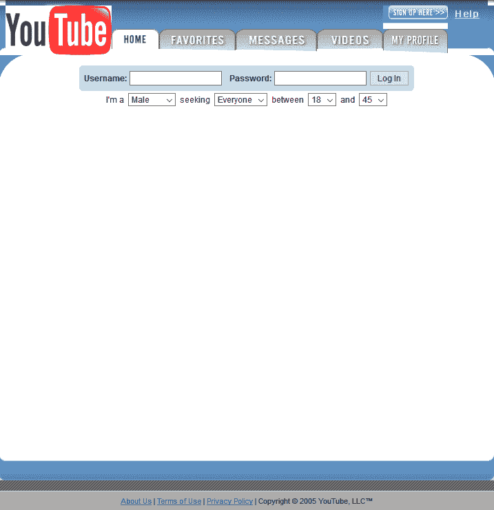

# 十年前的今天，谷歌收购了 YouTube

> 原文：<http://venturebeat.com/2016/10/09/google-acquired-youtube-10-years-ago/?utm_source=wanqu.co&utm_campaign=Wanqu+Daily&utm_medium=website>

你错过了明年 2022 年 GamesBeat 峰会的一个环节吗？所有会议现在都可以在我们的点播库中观看。[点击这里开始观看](https://attendees.bizzabo.com/412979/agenda?date=1666742400000)。

* * *

十年前的今天，谷歌以当时高达 16.5 亿美元的价格收购了 YouTube。在这中间的几年里，我们对“大型初创公司收购”的概念已经发生了翻天覆地的变化——我们[正看着你，WhatsApp](https://venturebeat.com/2014/02/19/facebook-acquires-messaging-behemoth-whatsapp-for-16-billion/)——但尽管如此，YouTube 代表了近代史上最引人注目和最重要的科技初创公司收购之一。

自那以后，技术领域发生了很大的变化。带宽已经扩大，智能手机已经成为一种东西，视频已经成为一项大业务，因为它为出版商提供了一个有利可图的渠道，向观众提供广告，平台从中分一杯羹。这就是为什么脸书正在大力投资媒体，而 T2 越来越把 YouTube 当成二等公民。

YouTube 很大。它拥有超过 10 亿的月活跃用户(MAUs ),这些用户每年观看价值 46，000 年的内容。但是非官方的[报告显示](http://www.wsj.com/articles/viewers-dont-add-up-to-profit-for-youtube-1424897967)这个视频流媒体平台仍然没有为其母公司带来利润，尽管据称它去年为[带来了 90 亿美元的收入](http://www.musicbusinessworldwide.com/youtube-will-earn-9bn-in-revenue-this-year-towering-over-spotify/)。然而，单纯从规模和知名度来说，YouTube 仍然是谷歌(和 Alphabet)的一个有价值的产品，仍然是互联网上最大的在线视频目的地。

但是这一切是怎么开始的呢？这里有一个快速回顾。

## 开始的时候…

由贝宝前雇员查德·赫利、陈士骏和贾韦德·卡里姆创建的 YouTube 域名于 2005 年 2 月 15 日注册。但最初的计划更类似于脸书的早期愿景，*相对于*一个为人们的吸引力评级的约会网站。事实上，YouTube 最初被设想为一个视频版本的 HotOrNot，这个网站的早期版本被证实为互联网档案馆捕获的。

<noscript></noscript>

上图:YouTube:2005 年 4 月 28 日

卡里姆在 2006 年接受《时代周刊》采访时解释道:“我对 HotOrNot 印象深刻，因为这是第一次有人设计了一个网站，任何人都可以上传其他人都可以看到的内容。”。“这是一个新概念，因为在那之前，总是网站所有者提供内容。”

第一个上传的视频来自卡里姆本人，时间是 2005 年 4 月 23 日，标题是“动物园里的我”由于它在历史上的显著地位，它已经获得了超过 3000 万的浏览量，尽管事实上它只是 19 秒钟相当普通的聊天。

<iframe loading="lazy" title="Me at the zoo" src="https://www.youtube.com/embed/jNQXAC9IVRw?feature=oembed" frameborder="0" allow="accelerometer; autoplay; clipboard-write; encrypted-media; gyroscope; picture-in-picture" allowfullscreen="">视频</iframe>

在 2005 年 5 月作为测试产品向公众开放后，YouTube 很快就变得越来越受欢迎——由足球运动员罗纳尔迪尼奥主演的耐克视频在 2005 年 9 月成为第一个浏览量超过 100 万的视频(原版已经不在网上了)。

<iframe loading="lazy" title="Cross Bar" src="https://www.youtube.com/embed/KNwLn85I75Y?feature=oembed" frameborder="0" allow="accelerometer; autoplay; clipboard-write; encrypted-media; gyroscope; picture-in-picture" allowfullscreen="">视频</iframe>

据报道，该平台在 2005 年 12 月正式向公众推出时，每天有 800 万次点击，当时该公司从红杉资本(Sequoia Capital)获得了 350 万美元的投资。到 2006 年 3 月，YouTube 又获得了 800 万美元的投资，到夏天，每月有超过 1 亿个视频被 2000 万用户观看。

随着 YouTube 越来越受欢迎，在收购之前，YouTube 与 CBS 达成了一项关于短片视频节目[的协议，而谷歌则与主要音乐唱片公司签署了单独的协议，为两人在 2006 年 10 月 9 日的正式合作奠定了基础。](https://venturebeat.com/2006/10/09/google-moves-closer-to-youtube-deal/)

时任谷歌首席执行官的埃里克·施密特在一份声明中说:“YouTube 团队建立了一个令人兴奋的强大的媒体平台，补充了谷歌组织世界信息并使其普遍可用的使命。”。“我们的公司拥有相似的价值观；我们都始终将用户放在第一位，并致力于创新以改善他们的体验。我们是为用户、内容所有者和广告商提供极具吸引力的媒体娱乐服务的天然合作伙伴。”

在此后的十年里，除了吸引人们的疯狂的病毒视频数量之外，许多里程碑式的时刻帮助塑造了我们今天所知道的 YouTube。这里有几个。

## 1.YouTube 合作伙伴

2007 年 5 月，YouTube [推出了](https://www.youtube.com/watch?v=KNwLn85I75Y)其合作伙伴计划，这是一项帮助其最受欢迎的 YouTube(和 YouTube)赚钱的计划。这是 YouTube 发展过程中的一个关键时刻，因为它基本上给予了一些用户生成内容(UGC)与 YouTube 的专业合作伙伴(如哥伦比亚广播公司)相同的地位，并向像 [Lonelygirl15](https://www.youtube.com/profile?user=lonelygirl15) 这样的家庭视频制造商开放了收入共享和促销机会。

## 2.总统辩论

YouTube 和 CNN 在 2007 年合作了一系列电视总统辩论，候选人通过 YouTube 回答公众提出的问题。这是一次里程碑式的合作，代表了 YouTube 作为主流媒体和网络作为选民和政治家之间桥梁的一个重要里程碑。

## 3.广告(ad 的复数)

在尝试了各种格式一段时间后，2007 年末，谷歌[终于展示了](https://venturebeat.com/2007/08/22/youtube-to-introduce-semi-transparent-ads/)它的新广告将会是什么样子:它们将[构成半透明的覆盖图](https://youtube.googleblog.com/2007/08/you-drive-youtube-experience.html)，出现在视频的下半部分。

在此期间，谷歌和 YouTube 的广告变得越来越复杂，但这一切都是从那时开始的。

## 4.租金

尽管 YouTube 已经免费提供了一些老的完整长度的故事片，但在 2010 年 1 月，它[进入了电影租赁市场](http://www.nytimes.com/2010/01/21/technology/internet/21youtube.html)，从独立电影制作人的五部电影开始。该服务后来被[扩展为](https://venturebeat.com/2010/05/04/youtube-rental/)，尽管它从未像网飞那样成功。

## 5.上线

2010 年，谷歌[确认了一项在全球免费直播印度板球超级联赛的交易](https://youtube.googleblog.com/2010/03/indian-premier-league-bowls-wicked.html)，该公司声称这是第一次在全球直播的重大体育赛事。那年晚些时候，《街机之火》在麦迪逊广场花园[进行了现场直播](https://youtube.googleblog.com/2010/08/join-arcade-fire-live-from-madison.html)，随后 YouTube 在 2011 年 4 月[推出了其官方直播平台](https://youtube.googleblog.com/2011/04/youtube-is-going-live.html)。

## 6.目标市场

在过去的 18 个月里，YouTube 启动了一项针对在线视频市场(相当大的)细分市场的严格计划。

2015 年 2 月， [YouTube Kids 推出了专注于家庭娱乐的](https://venturebeat.com/2015/02/23/youtube-kids-launches-on-android-and-ios/)，而六个月后， [YouTube Gaming 推出了作为观看其他人玩视频游戏的中心的](https://venturebeat.com/2015/08/25/youtube-gaming-launches-tomorrow/)。那年晚些时候，YouTube 音乐[出现了](https://venturebeat.com/2015/11/12/youtube-music-launches-for-android-and-ios/)，专门帮助音乐迷发现音乐。

2015 年 10 月，YouTube [推出了 YouTube Red](https://venturebeat.com/2015/10/21/google-wants-you-to-pay-9-99-per-month-for-ad-free-youtube/) ，这是一项每月 10 美元的服务，摒弃了广告，提供离线访问，以及其他福利，包括访问 Google Play 音乐和[原创节目](https://venturebeat.com/2016/02/10/youtube-reds-first-4-original-shows-are-available-now-as-part-of-10-monthly-subsription/)。

放眼全球，谷歌的既定目标之一是瞄准“下一个 10 亿”互联网用户。上周，该公司[宣布了一款全新的独立 YouTube 应用](https://venturebeat.com/2016/09/27/google-india-all-in/)，专为印度市场打造，具有离线访问和粒度设置，允许用户选择视频分辨率。

从新的[社交中心](https://youtube-creators.googleblog.com/2016/09/youtube-community-goes-beyond-video.html)到[版主激励计划](http://www.bbc.co.uk/newsbeat/article/37439673/youtube-launches-scheme-to-offer-rewards-to-users-who-report-videos)，YouTube 在不断迭代，没有显示出停滞不前的迹象，即使——从各方面来看——它还没有确定利润。

YouTube 在过去十年里发生了很大的变化，但开创这一切的三位企业家赫尔利、陈和卡里姆后来怎么样了？

## 他们现在在哪里？

据说查德·赫利通过将他的公司卖给谷歌赚了大约 4 亿美元，他担任 YouTube 首席执行官[直到 2010 年](https://gigaom.com/2010/10/28/419-youtubes-hurley-to-step-down-as-ceo/)。在那之后，他和陈士骏继续创立了 Avos Systems，这是一家类似于互联网孵化器的公司，收购初创公司([包括 Delicious](https://venturebeat.com/2011/04/27/youtube-delicious-avos/) )并建立产品和公司。2013 年，Avos [推出了一款名为 Mixbit 的视频编辑应用](https://venturebeat.com/2013/08/08/rip-mix-burn-youtube-founders-launch-mixbit-to-challenge-vine-instagram/)，后来随着 Hurley 和陈[分道扬镳](https://venturebeat.com/2014/06/06/youtube-cofounders-part-ways-will-spin-off-mixbit/)，该应用成为 Avos 的唯一焦点。赫尔利的其他投资包括篮球的金州勇士队和即将推出的足球俱乐部洛杉矶足球俱乐部。

据报道，陈士骏从这笔交易中赚了大约 3 亿美元，他曾在 YouTube 担任首席技术官(CTO ),直到 2008 年离开(T1 ),尽管之后他仍留在谷歌。2014 年 Avos Systems 剥离 Mixbit 后，陈加入了谷歌风投。

贾韦德·卡里姆(Jawed Karim)是 YouTube 三位联合创始人中最不知名的，这主要是因为他在该公司的角色。虽然他参与了 YouTube 概念的起草和项目的启动，但卡里姆实际上从未成为正式员工，因为他当时正在斯坦福大学学习。卡里姆继续担任该公司的非正式顾问，尽管他的股份比陈和赫尔利少，但据报道，当谷歌打电话时，他仍然套现约 6000 万美元。

卡里姆后来创办了 Youniversity Ventures，或称 [Y Ventures](http://www.yventures.com) ，投资了许多值得关注的初创公司，包括 Eventbrite 和 Airbnb。

**VentureBeat 的使命**是成为技术决策者获取变革性企业技术知识和进行交易的数字城市广场。[发现我们的简报。](https://info.venturebeat.com/website-preference-center.html)