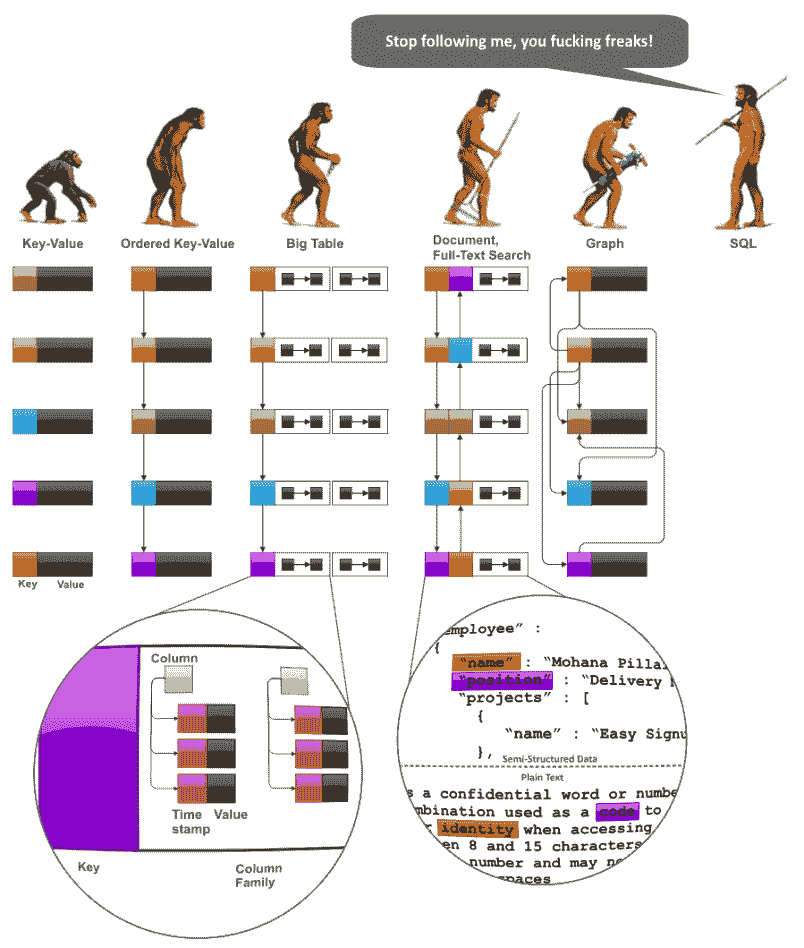
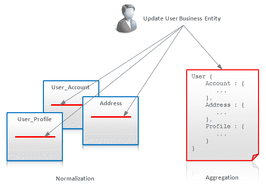
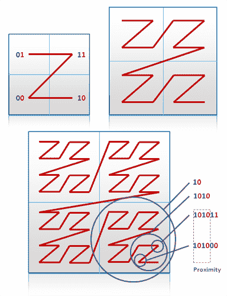
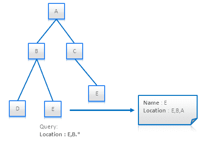

# NoSQL 数据建模技术——高度可扩展的博客

> 原文：<https://highlyscalable.wordpress.com/2012/03/01/nosql-data-modeling-techniques/?utm_source=wanqu.co&utm_campaign=Wanqu+Daily&utm_medium=website>

NoSQL 数据库经常用各种非功能性标准进行比较，比如可伸缩性、性能和一致性。NoSQL 的这一方面在实践和理论中都得到了很好的研究，因为特定的非功能属性通常是使用 NoSQL 的主要理由，分布式系统的基本结果，如 [CAP 定理](http://en.wikipedia.org/wiki/CAP_theorem)也适用于 NoSQL 系统。与此同时，NoSQL 数据建模没有得到很好的研究，也缺乏关系数据库中的系统理论。在本文中，我从数据建模的角度对 NoSQL 系统家族进行了简短的比较，并对几种常见的建模技术进行了总结。

我要感谢丹尼尔·柯克多夫审阅了这篇文章并清理了语法。

为了探索数据建模技术，我们必须从一个或多或少的 NoSQL 数据模型的系统视图开始，它最好能揭示趋势和相互联系。下图描绘了主要 NoSQL 系统系列的假想“演变”,即键值存储、BigTable 风格的数据库、文档数据库、全文搜索引擎和图形数据库:

[](https://highlyscalable.files.wordpress.com/2012/02/overview2.png)

NoSQL Data Models


首先，我们应该注意到，SQL 和关系模型通常是很久以前为与最终用户交互而设计的。这种面向用户的性质具有广泛的含义:

*   最终用户通常对汇总的报告信息感兴趣，而不是对单独的数据项感兴趣，SQL 非常关注这一方面。
*   没有人能指望人类用户显式地控制并发性、完整性、一致性或数据类型有效性。这就是 SQL 非常关注事务保证、模式和引用完整性的原因。

另一方面，事实证明，软件应用程序并不经常对数据库内聚合感兴趣，并且至少在许多情况下能够控制完整性和有效性本身。除此之外，这些特性的消除对商店的性能和可伸缩性有着极其重要的影响。这也是数据模型开始新一轮进化的地方:

*   键值存储是一个非常简单，但是非常强大的模型。下面描述的许多技术完全适用于这个模型。
*   键值模型最大的缺点之一是对需要处理键值范围的情况适用性差。有序键值模型克服了这一限制，并显著提高了聚合能力。
*   有序键-值模型非常强大，但是它没有为值建模提供任何框架。一般来说，值建模可以由应用程序完成，但是 BigTable 风格的数据库走得更远，将值建模为映射的映射，即列族、列和带时间戳的版本。
*   文档数据库推进了 BigTable 模型，提供了两个显著的改进。第一个是具有任意复杂度的方案的值，而不仅仅是映射中的映射。第二个是数据库管理的索引，至少在某些实现中是这样。全文搜索引擎也提供灵活的模式和自动索引，从这个意义上说，它们可以被认为是一个相关的种类。主要区别在于，文档数据库按字段名称对索引进行分组，而搜索引擎则按字段值对索引进行分组。还值得注意的是，一些键值存储，如 Oracle Coherence，通过添加索引和数据库内条目处理器，逐渐转向文档数据库。
*   最后，图数据模型可以被认为是进化的一个分支，起源于有序的键值模型。图形数据库允许非常透明地对业务实体建模(*这取决于*)，但是分层建模技术使得其他数据模型在这个领域也非常有竞争力。图形数据库与文档数据库相关，因为许多实现允许一个模型一个值作为地图或文档。

## NoSQL 数据建模概述

本文的其余部分将描述具体的数据建模技术和模式。作为前言，我想提供一些关于 NoSQL 数据建模的一般性说明:

*   与关系建模相反，NoSQL 数据建模通常从特定于应用程序的查询开始:
    *   关系建模通常由可用数据的结构驱动。主要设计主题是“**我有什么答案？”**
    *   NoSQL 数据建模通常由特定于应用程序的访问模式驱动，即要支持的查询类型。主要设计主题是**“我有什么疑问？”**
*   与关系数据库建模相比，NoSQL 数据建模通常需要对数据结构和算法有更深的理解。在这篇文章中，我描述了几个众所周知的数据结构，它们并不特定于 NoSQL，但是在实际的 NoSQL 建模中非常有用。
*   数据重复和反规范化是一等公民。
*   关系数据库对于分层或类似图形的数据建模和处理不是很方便。图形数据库显然是这一领域的完美解决方案，但实际上大多数 NoSQL 解决方案对这类问题都惊人地强大。这就是为什么本文专门用一个单独的章节来介绍分层数据建模。

尽管数据建模技术基本上与实现无关，但这是我在撰写本文时想到的特定系统的列表:

*   键值存储:Oracle Coherence、Redis、京都内阁
*   大表风格的数据库:Apache HBase、Apache Cassandra
*   文档数据库:MongoDB、CouchDB
*   全文搜索引擎:Apache Lucene，Apache Solr
*   图形数据库:neo4j、FlockDB

## 概念技术

这一节专门介绍 NoSQL 数据建模的基本原则。

### (1)反规格化

非规范化可以定义为将相同的数据复制到多个文档或表中，以便简化/优化查询处理，或者将用户的数据放入特定的数据模型中。本文中描述的大多数技术都以某种形式利用了反规范化。

通常，反规范化有助于以下权衡:

*   *查询数据量*或每次查询的*IO*对*总数据量*。使用反规格化，可以将处理一个查询所需的所有数据集中到一个地方。这通常意味着，对于不同的查询流，将以不同的组合访问相同的数据。因此，我们需要复制数据，这增加了总数据量。
*   *处理复杂度* VS *总数据量*。建模时规范化和随之而来的查询时连接明显增加了查询处理器的复杂性，尤其是在分布式系统中。反规范化允许以查询友好结构存储数据，以简化查询处理。

**适用性**:键值存储、文档数据库、大表风格的数据库

### (2)骨料

NoSQL 的所有主要流派都以这样或那样的方式提供了软模式能力:

*   键值存储和图形数据库通常不对值进行约束，因此值可以由任意格式组成。还可以通过使用组合键来改变一个业务实体的多个记录。例如，用户帐户可以被建模为一组具有组合键的条目，如 *UserID_name、UserID_email、UserID_messages* 等等。如果用户没有电子邮件或消息，则不会记录相应的条目。
*   BigTable 模型通过一个*列族*中的可变列集和一个*单元*的可变数量的*版本*来支持软模式。
*   文档数据库本质上是无模式的，尽管其中一些允许使用用户定义的模式来验证输入的数据。

软模式允许人们形成具有复杂内部结构的实体类(嵌套实体),并改变特定实体的结构。该功能提供了两个主要功能:

*   通过嵌套实体最小化一对多关系，从而减少连接。
*   屏蔽业务实体之间的“技术”差异，并使用一个文档集合或一个表格对异构业务实体进行建模。

这些设施如下图所示。该图描述了电子商务业务领域的产品实体的建模。最初，我们可以说所有产品都有一个 ID、价格和描述。接下来，我们发现不同类型的产品有不同的属性，如书籍的作者或牛仔裤的长度。其中一些属性具有一对多或多对多的性质，就像音乐专辑中的曲目一样。接下来，有可能一些实体根本不能使用固定类型建模。例如，牛仔裤的属性在不同品牌之间并不一致，每个制造商也不相同。在关系规范化数据模型中克服所有这些问题是可能的，但解决方案远非完美。软模式允许使用单个集合(产品)来模拟所有类型的产品及其属性:

[](https://highlyscalable.files.wordpress.com/2012/02/soft-schema2.png)

Entity Aggregation


反规范化嵌入会极大地影响更新的性能和一致性，因此应该特别注意更新流。

**适用性**:键值存储、文档数据库、大表风格的数据库

### (3)应用程序端连接

NoSQL 解决方案很少支持连接。由于“面向问题”的 NoSQL 特性，连接通常在设计时处理，而在关系模型中，连接在查询执行时处理。查询时连接几乎总是意味着性能损失，但是在许多情况下，可以使用反规范化和聚合(即嵌入嵌套实体)来避免连接。当然，在许多情况下，连接是不可避免的，应该由应用程序来处理。主要使用案例有:

*   多对多关系通常由链接建模，并且需要连接。
*   当实体内部是频繁修改的主题时，聚合通常不适用。通常最好是记录发生的事情，并在查询时连接记录，而不是更改值。例如，消息传递系统可以被建模为包含嵌套消息实体的用户实体。但是如果消息经常被追加，那么最好将消息作为独立的实体提取出来，在查询时加入到用户中: [](https://highlyscalable.files.wordpress.com/2012/03/aggregates-joins.png)

**适用性**:键值存储、文档数据库、BigTable 风格的数据库、图形数据库

## 通用建模技术

在本节中，我们将讨论适用于各种 NoSQL 实现的通用建模技术。

### (4)原子集合体

许多(尽管不是全部)NoSQL 解决方案的事务支持有限。在某些情况下，可以使用分布式锁或[应用程序管理的 MVCC](https://highlyscalable.wordpress.com/2012/01/07/mvcc-transactions-key-value/ "Implementation of MVCC Transactions for Key-Value Stores") 来实现事务行为，但是通常使用聚合技术来建模数据，以保证一些 ACID 属性。

为什么强大的事务机制是关系数据库不可避免的一部分，原因之一是规范化数据通常需要多位置更新。另一方面，聚合允许将单个业务实体存储为一个文档、行或键值对，并自动更新它:

[](https://highlyscalable.files.wordpress.com/2012/02/atomic-aggregate1.png)

Atomic Aggregates


当然，作为数据建模技术的原子聚合并不是一个完整的事务解决方案，但是如果存储提供了原子性、锁或测试和设置指令的某些保证，那么原子聚合是适用的。

**适用性**:键值存储、文档数据库、大表风格的数据库

### (5)可枚举键

无序的键-值数据模型最大的好处可能是，只需对键进行哈希运算，就可以将条目划分到多个服务器上。排序使事情变得更加复杂，但有时应用程序能够利用有序键的一些优势，即使存储不提供这样的功能。让我们以电子邮件消息的建模为例:

1.  一些 NoSQL 商店提供原子计数器，允许人们生成顺序 id。在这种情况下，可以使用 *userID_messageID* 作为组合键来存储消息。如果知道最新的消息 ID，就有可能遍历以前的消息。对于任何给定的消息 ID，也可以遍历前面和后面的消息。
2.  可以将消息分组到桶中，例如，每日桶。这允许从任何指定的日期或当前日期开始向后或向前遍历邮箱。

**适用性**:键值存储

### (6)降维

降维是一种允许将多维数据映射到键值模型或其他非多维模型的技术。

传统的地理信息系统使用某种变化的四叉树或 R 树作为索引。这些结构需要就地更新，并且当数据量很大时操作起来很昂贵。另一种方法是遍历 2D 结构，将其展平成一个简单的条目列表。这种技术的一个众所周知的例子是 Geohash。Geohash 使用类 Z 扫描来填充 2D 空间，并且根据方向将每次移动编码为 0 或 1。用于经度和纬度移动的比特与移动一样是交错的。编码过程如下图所示，其中黑色和红色位分别代表经度和纬度:

[](https://highlyscalable.files.wordpress.com/2012/02/geohash-traversal1.png)

Geohash Index


如图所示，Geohash 的一个重要特性是能够使用逐位代码邻近度来估计区域之间的距离。Geohash 编码允许使用普通数据模型存储地理信息，如保存空间关系的排序键值。在[6.1]中描述了 BigTable 的降维技术。关于 Geohashes 和其他相关技术的更多信息可以在[6.2]和[6.3]中找到。

**适用性**:键值存储、文档数据库、大表风格的数据库

### (7)索引表

索引表是一种非常简单的技术，它允许用户利用内部不支持索引的存储中的索引。这种存储中最重要的一类是 BigTable 风格的数据库。其思想是创建和维护一个特殊的表，表中的键遵循访问模式。例如，有一个主表，存储可以通过用户 ID 访问的用户帐户。按指定城市检索所有用户的查询可以通过一个附加表来支持，其中 city 是一个键:

[](https://highlyscalable.files.wordpress.com/2012/02/index-table.png)

Index Table Example


每次更新主表或以批处理模式更新索引表。无论哪种方式，都会导致额外的性能损失，并成为一致性问题。

索引表可以被认为是关系数据库中物化视图的模拟。

**适用性**:大表格风格的数据库

### (8)综合关键指数

组合键是一种非常通用的技术，但是当使用具有有序键的存储时，它非常有用。与二级排序结合的组合键允许人们建立一种多维索引，该索引基本上类似于前面描述的维度减少技术。例如，让我们取一组记录，其中每个记录都是一个用户统计数据。如果我们要按用户来自的地区聚集这些统计数据，我们可以使用格式为 *(State:City:UserID)* 的键，如果该存储支持通过部分键匹配选择键范围(如 BigTable 风格的系统所做的那样)，则允许我们迭代特定州或城市的记录:

```

SELECT Values WHERE state="CA:*"
SELECT Values WHERE city="CA:San Francisco*"

```

[](https://highlyscalable.files.wordpress.com/2012/03/composite-key-index.png)

Composite Key Index


**适用性**:大表格风格的数据库

### (9)使用组合键的聚合

组合键不仅可以用于索引，还可以用于不同类型的分组。让我们考虑一个例子。有大量的日志记录，记录了互联网用户的信息以及他们对不同网站的访问。目标是统计每个网站的独立用户数量。这类似于以下 SQL 查询:

```

SELECT count(distinct(user_id)) FROM clicks GROUP BY site

```

我们可以使用带有 UserID 前缀的组合键来模拟这种情况:

[](https://highlyscalable.files.wordpress.com/2012/02/composite-key-collating1.png)

Counting Unique Users using Composite Keys


其思想是将一个用户的所有记录放在一起，这样就有可能将这样一个帧提取到内存中(一个用户不能产生太多的事件),并使用哈希表或其他方法来消除站点重复。另一种技术是为一个用户提供一个条目，并在事件到达时将站点附加到这个条目中。然而，在大多数实现中，条目修改通常不如条目插入有效。

**适用性**:有序的键值存储，大表风格的数据库

### (10)反向搜索-直接聚合

这种技术更多的是一种数据处理模式，而不是数据建模。然而，使用这种模式也会影响数据模型。该技术的主要思想是使用索引来查找符合标准的数据，但是使用原始表示或全扫描来聚集数据。让我们考虑一个例子。有许多日志记录，记录了互联网用户及其从不同站点的访问信息( *click stream* )。假设每个记录都包含用户 ID、用户所属的类别(男性、女性、博客作者等)、用户来自的城市以及访问的站点。目标是根据受众中出现的每个类别的唯一用户(即，符合标准的用户集合)来描述符合某些标准(站点、城市等)的受众。

很明显，使用像 *{Category - >【用户 id】}*或 *{Site - >【用户 id】}*这样的倒排索引可以有效地搜索符合标准的用户。使用这样的索引，可以交叉或统一相应的用户 id(如果用户 id 存储为排序列表或位集，这可以非常有效地完成)并获得受众。但是描述的受众类似于聚合查询，如

```

SELECT count(distinct(user_id)) ... GROUP BY category

```

如果类别数量很大，使用倒排索引无法有效处理。为了解决这个问题，可以构建一个形式为 *{UserID - >【类别】}* 的直接索引，并对其进行迭代以构建最终报告。该模式描述如下:

[](https://highlyscalable.files.wordpress.com/2012/02/invert-direct1.png)

Counting Unique Users using Inverse and Direct Indexes


最后要注意的是，我们应该考虑到随机检索受众中每个用户 ID 的记录可能是低效的。人们可以通过利用批处理查询处理来解决这个问题。这意味着可以预先计算一定数量的用户集(针对不同的标准),然后可以在一次直接或反向索引的完整扫描中计算这批受众的所有报告。

**适用性**:键值存储、大表风格的数据库、文档数据库

## 层次建模技术

### (11)树聚集

树甚至任意的图(借助于非规范化)可以被建模为单个记录或文档。

*   当树被一次访问时，这种技术是有效的(例如，获取整个博客评论树来显示带有文章的页面)。
*   搜索和任意访问条目可能会有问题。
*   在大多数 NoSQL 实施中，更新效率很低(与独立节点相比)。

[](https://highlyscalable.files.wordpress.com/2012/02/tree-aggregation.png)

Tree Aggregation


**适用性**:键值存储、文档数据库

### (12)邻接表

邻接表是一种简单的图形建模方式——每个节点都被建模为一个独立的记录，其中包含直接祖先或后代的数组。它允许通过节点的父节点或子节点的标识符来搜索节点，当然，也允许通过每次查询一跳来遍历一个图。对于深度或广度遍历，这种方法对于获取给定节点的整个子树通常效率低下。

**适用性**:键值存储、文档数据库

### (13)物化路径

物化路径是一种有助于避免递归遍历树状结构的技术。这种技术可以被认为是一种反规格化。其思想是通过所有父节点或子节点的标识符来确定每个节点的属性，这样就可以确定该节点的所有后代或前任节点，而无需遍历:

[](https://highlyscalable.files.wordpress.com/2012/02/materialized-paths2.png)

Materialized Paths for eShop Category Hierarchy


这种技术对全文搜索引擎特别有用，因为它允许将层次结构转换成平面文档。从上图中可以看出，*男鞋*类别中的所有产品或子类别都可以使用一个简单的类别名称的简短查询来检索。

物化路径可以存储为一组 id 或一串串联的 id。后一个选项允许使用正则表达式搜索满足某个部分路径标准的节点。该选项如下图所示(路径包括节点本身):

[](https://highlyscalable.files.wordpress.com/2012/02/materialized-paths-2.png)

Query Materialized Paths using RegExp


**适用性**:键值存储、文档数据库、搜索引擎

### (14)嵌套集合

[嵌套集合](http://en.wikipedia.org/wiki/Nested_set_model)是建模树状结构的标准技术。它广泛应用于关系数据库，但也完全适用于键值存储和文档数据库。其思想是将树的叶子存储在一个数组中，并使用开始和结束索引将每个非叶子节点映射到一个叶子范围，如下图所示:

[](https://highlyscalable.files.wordpress.com/2012/02/nested-sets.png)

Modeling of eCommerce Catalog using Nested Sets


这种结构对于不可变数据来说非常有效，因为它占用的内存很少，并且允许在不遍历的情况下获取给定节点的所有叶子。然而，插入和更新的代价相当高，因为添加一片叶子会导致大量的索引更新。

**适用性**:键值存储、文档数据库

### (15)嵌套文档拼合:带编号的字段名称

搜索引擎通常处理平面文档，即每个文档都是字段和值的平面列表。数据建模的目标是将业务实体映射到普通文档，如果实体具有复杂的内部结构，这可能是一个挑战。一个典型的挑战是映射具有分层结构的文档，即内部具有嵌套文档的文档。让我们考虑下面的例子:

[](https://highlyscalable.files.wordpress.com/2012/02/nested-documents-1.png)

Nested Documents Problem


每个商业实体都是某种简历。它包含一个人的名字和他或她的技能列表以及技能级别。为这样一个实体建模的一个显而易见的方法是创建一个带有*技能*和*级别*字段的普通文档。该模型允许用户按技能或级别搜索人员，但是结合两个字段的查询容易导致错误匹配，如上图所示。

[4.6]中提出了克服这个问题的一种方法。该技术的主要思想是将每个技能和相应的级别索引为一对专用字段 *Skill_i* 和 *Level_i，*，并同时搜索所有这些对(其中查询中 OR-ed 项的数量高达一个人的最大技能数量):

[](https://highlyscalable.files.wordpress.com/2012/02/nested-documents-3.png)

Nested Document Modeling using Numbered Field Names


这种方法实际上不具有可伸缩性，因为查询复杂性随着嵌套结构的数量而快速增长。

**适用性**:搜索引擎

### (16)嵌套文档展平:邻近查询

使用[4.6]中描述的另一种技术可以解决嵌套文档的问题。这个想法是使用邻近查询来限制文档中单词之间的可接受距离。在下图中，所有技能和级别都在一个字段中进行索引，即 SkillAndLevel，查询表明“优秀”和“诗歌”这两个词应该一个接一个:

[](https://highlyscalable.files.wordpress.com/2012/02/nested-documents-2.png)

Nested Document Modeling using Proximity Queries


[4.3]描述了在 Solr 上使用这种技术的成功案例。

**适用性**:搜索引擎

### (17)批量图形处理

像 neo4j 这样的图形数据库非常适合探索给定节点的邻域或者探索两个或几个节点之间的关系。然而，大型图形的全局处理不是非常有效，因为通用图形数据库不能很好地扩展。分布式图形处理可以使用 MapReduce 和消息传递模式来完成，例如，在我以前的文章的[中描述的。这种方法使得键值存储、文档数据库和 BigTable 风格的数据库适合处理大型图形。](https://highlyscalable.wordpress.com/2012/02/01/mapreduce-patterns/ "MapReduce Patterns, Algorithms, and Use Cases")

**适用性**:键值存储、文档数据库、大表风格的数据库

## 参考

最后，我提供了一个与 NoSQL 数据建模相关的有用链接列表:

1.  键值存储:
    1.  [http://www . devshed . com/c/a/MySQL/Database-Design-Using-key value-Tables/](http://www.devshed.com/c/a/MySQL/Database-Design-Using-KeyValue-Tables/)
    2.  [http://antirez.com/post/Sorting-in-key-value-data-model.htm](http://antirez.com/post/Sorting-in-key-value-data-model.html)l
    3.  [http://stack overflow . com/questions/3554169/基于文档和基于键值的数据库之间的差异](http://stackoverflow.com/questions/3554169/difference-between-document-based-and-key-value-based-databases)
    4.  [http://DBMS musings . blogspot . com/2010/03/distinguished-two-major-types-of _ 29 . html](http://dbmsmusings.blogspot.com/2010/03/distinguishing-two-major-types-of_29.html)
2.  BigTable 风格的数据库:
    1.  [http://www . slide share . net/ebenhewitt/Cassandra-data model-4985524](http://www.slideshare.net/ebenhewitt/cassandra-datamodel-4985524)
    2.  [http://www . slide share . net/mattdennis/Cassandra-data-modeling](http://www.slideshare.net/mattdennis/cassandra-data-modeling)
    3.  [http://no SQL . mypopescu . com/post/17419074362/Cassandra-data-modeling-examples-with-Matthew-f-Dennis](http://nosql.mypopescu.com/post/17419074362/cassandra-data-modeling-examples-with-matthew-f-dennis)
    4.  [http://s-expressions . com/2009/03/08/h base-on-designing-schemas-for-column-oriented-data-stores/](http://s-expressions.com/2009/03/08/hbase-on-designing-schemas-for-column-oriented-data-stores/)
    5.  [http://jimbojw.com/wiki/index.php?title = Understanding _ h base _ and _ BigTable](http://jimbojw.com/wiki/index.php?title=Understanding_Hbase_and_BigTable)
3.  文档数据库:
    1.  [http://www . slide share . net/MongoDB/MongoDB-schema-design-Richard-kreuters-mongo-Berlin-preso](http://www.slideshare.net/mongodb/mongodb-schema-design-richard-kreuters-mongo-berlin-preso)
    2.  [http://www . michaelhamrah . com/blog/2011/08/data-modeling-at-scale-MongoDB-mongoid-callbacks-and-de normalizing-data-for-efficiency/](http://www.michaelhamrah.com/blog/2011/08/data-modeling-at-scale-mongodb-mongoid-callbacks-and-denormalizing-data-for-efficiency/)
    3.  [http://seancribbs . com/tech/2009/09/28/modeling-a-tree-in-a-document-database/](http://seancribbs.com/tech/2009/09/28/modeling-a-tree-in-a-document-database/)
    4.  [http://www.mongodb.org/display/DOCS/Schema+Design](http://www.mongodb.org/display/DOCS/Schema+Design)
    5.  [http://www.mongodb.org/display/DOCS/Trees+in+MongoDB](http://www.mongodb.org/display/DOCS/Trees+in+MongoDB)
    6.  [http://blog . fiesta . cc/post/11319522700/walk through-MongoDB-data-modeling](http://blog.fiesta.cc/post/11319522700/walkthrough-mongodb-data-modeling)
4.  全文搜索引擎:
    1.  [http://www . search workings . org/blog/-/blogs/query-time-joining-in-Lucene](http://www.searchworkings.org/blog/-/blogs/query-time-joining-in-lucene)
    2.  [http://www . lucidimagination . com/devzone/technical-articles/Solr-and-RDBMS-basics-design-your-application-best-both](http://www.lucidimagination.com/devzone/technical-articles/solr-and-rdbms-basics-designing-your-application-best-both)
    3.  [http://blog . grid dynamics . com/2011/07/Solr-experience-search-parent-child . html](http://blog.griddynamics.com/2011/07/solr-experience-search-parent-child.html)
    4.  [http://www . lucidimagination . com/blog/2009/07/18/the-span query/](http://www.lucidimagination.com/blog/2009/07/18/the-spanquery/)
    5.  [http://blog . MGM-TP . com/2011/03/non-standard-way-of-use-Lucene/](http://blog.mgm-tp.com/2011/03/non-standard-ways-of-using-lucene/)
    6.  [http://www . slide share . net/MarkHarwood/proposal-for-nested-document-support-in-Lucene](http://www.slideshare.net/MarkHarwood/proposal-for-nested-document-support-in-lucene)
    7.  [http://mysolr.com/tips/denormalized-data-structure/](http://mysolr.com/tips/denormalized-data-structure/)
    8.  [http://sujitpal . blogspot . com/2010/10/de normalizing-maps-with-Lucene-payloads . html](http://sujitpal.blogspot.com/2010/10/denormalizing-maps-with-lucene-payloads.html)
    9.  [http://Java . dzone . com/articles/hibernate-search-mapping-entit](http://java.dzone.com/articles/hibernate-search-mapping-entit)
5.  图表数据库:
    1.  [http://docs . neo4j . org/chunked/stable/tutorial-comparising-models . html](http://docs.neo4j.org/chunked/stable/tutorial-comparing-models.html)
    2.  [http://blog . neo4j . org/2010/03/modeling-categories-in-graph-database . html](http://blog.neo4j.org/2010/03/modeling-categories-in-graph-database.html)
    3.  [http://skillsmatter.com/podcast/nosql/graph-modelling](http://skillsmatter.com/podcast/nosql/graph-modelling)
    4.  [http://www . umi ACS . UMD . edu/~ Jimmy Lin/publications/Lin _ Schatz _ mlg 2010 . pdf](http://www.umiacs.umd.edu/~jimmylin/publications/Lin_Schatz_MLG2010.pdf)
6.  降维:
    1.  [http://www . slide share . net/mmalone/scaling-GIS-data-in-non-relational-data-stores](http://www.slideshare.net/mmalone/scaling-gis-data-in-nonrelational-data-stores)
    2.  [http://blog . not dot . net/2009/11/Damn-Cool-Algorithms-Spatial-indexing-with-quad trees-and-Hilbert-Curves](http://blog.notdot.net/2009/11/Damn-Cool-Algorithms-Spatial-indexing-with-Quadtrees-and-Hilbert-Curves)
    3.  [http://www.trisis.co.uk/blog/?p=1287](http://www.trisis.co.uk/blog/?p=1287)

### 像这样:

像 装...

### *相关*