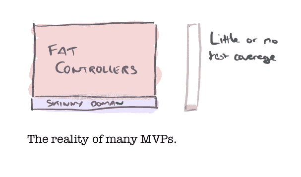
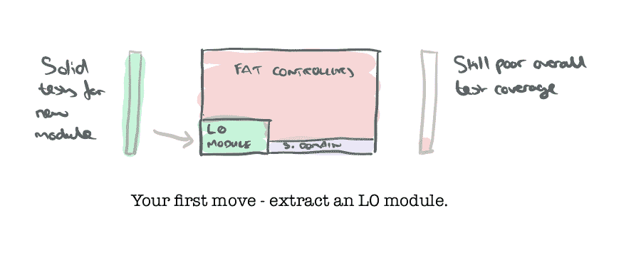
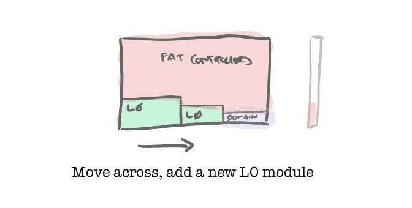
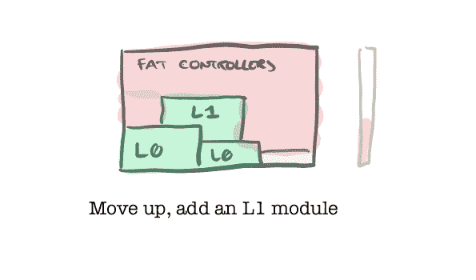
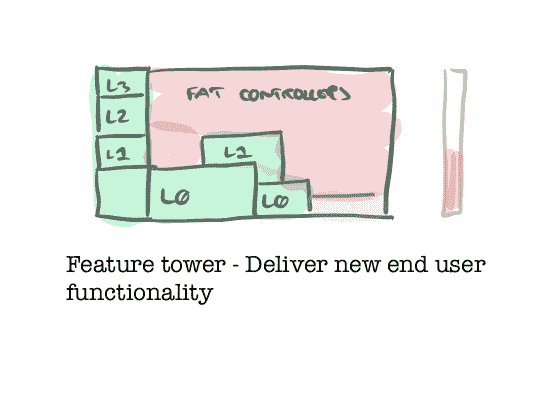

# 超越 MVP |晨报

> 原文：<https://blog.acolyer.org/2016/11/01/getting-beyond-mvp/?utm_source=wanqu.co&utm_campaign=Wanqu+Daily&utm_medium=website>

今天有些不同，不是一篇新的论文，我想停下来思考一下我们一直在阅读的来自[东尼·霍尔](https://blog.acolyer.org/2016/10/18/hierarchical-program-structures/)、[芭芭拉·利斯科夫](https://blog.acolyer.org/2016/10/21/a-design-methodology-for-reliable-software-systems/)和[大卫·帕纳斯](http://blog.acolyer.org/2016/10/31/designing-software-for-ease-of-extension-and-contraction)等人的设计建议。特别是，如何将它应用到我自己的代码库中，以及我在许多早期创业公司中遇到的情况:

> 你的 MVP 看起来正走向产品市场契合，现在呢？

你迅速建立了你的 MVP。关键是快速学习和迭代。它表面上看起来很精致(因为它做了什么)，但实际上，它更像是这个系统最终可能的草图。我将使用一个 webapp 的例子(例如，支持一个 SaaS 产品)，但它实际上可以是任何类型的代码库。在这样的代码库中，我通常希望看到“胖”的控制器，它们的方法看起来像[事务脚本](http://martinfowler.com/eaaCatalog/transactionScript.html)，如果有的话，下面还有一个非常瘦的域模型。这可能不是很枯燥(控制器方法中重复的小逻辑)。就[级别](http://blog.acolyer.org/2016/10/31/designing-software-for-ease-of-extension-and-contraction)而言，它相当简单，您可能会看到直接来自控制器方法的简单出站 HTTP 请求。你只有很少的测试，到目前为止，测试主要包括在你的浏览器中加载网站，点击并验证一切正常。

这是许多快速组装的原型的现实。事态不一定是坏的，只要你认识到它是什么。如果结果是你不得不把它们都扔掉，那么做更多的事情可能是过度工程化了。

*更新:我应该指出，我在这里描述的是一种经常遇到的情况——如果你能避免一开始就遇到这种情况，那就更好了。例如，从第一天开始的 CI 和 CD，围绕初始事务脚本的一些测试(如果这是初始实现方法)以及随后的重构，从一开始就是非常好的事情！*

但是现在你已经开始有一些真正的用户了，看起来你已经有了一个可以构建的核心产品。您开始对代码库的状态感到不舒服——它很乱，并且您注意到当您不得不在某些方面做出改变时，您会感到有点不安。当你只有手工测试时，很难确定你没有破坏任何东西。

你接下来做的事会对项目的长期成功产生重大影响。你有一些真正的用户，你想保持势头，当你从头开始建立第二个系统时，让所有外部进展停滞几周或更长时间是没有意义的。因此，在现有的代码基础上继续进行黑客攻击是很有诱惑力的，而且每个人都知道对现有的代码基础进行改造测试也是非常困难的。如果你的产品是成功的，这是导致内爆的路径，当你有更多的用户和牵引力(和代码)时，内爆就会发生！)比你现在多。

这里有一个替代计划，可以带你去一个更好的地方，一个更快乐的未来:

#### 最基本的。

*   如果您还没有这样做(理想情况下是在您第一次创建项目时)，现在是您必须将 CI 放在适当位置的时候了。即使你现在没有任何测试，也要做好准备来运行你的空测试套件。
*   配置您的 CI，以便在测试套件通过时持续部署到临时区域。这个临时区域是您的第一个安全区域，这样您就可以在为您的用户投入使用之前，在类似生产的环境中(而不仅仅是在您自己的机器上)测试工作。(在这个阶段，我们不会关心多个分支、每个开发人员的按需登台站点等等，这只是您的基本拯救计划)。
*   允许从试运行升级到生产。(例如，参见[如何在 Heroku](https://devcenter.heroku.com/articles/pipelines) 上进行设置)。

#### 增量改进

现在，您已经准备好开始代码库的工作了(如果您跳过了任何基础知识，请在继续下一步之前返回并关注它们)。使用您从编写初始 MVP 中获得的见解，好消息是您现在处于一个更好的位置来做一些 Parnas 提到的[艰难思考](http://blog.acolyer.org/2016/10/31/designing-software-for-ease-of-extension-and-contraction)，并勾画出一个域模型、模块集合(基于信息隐藏)，以及 [*使用层次*](http://blog.acolyer.org/2016/10/31/designing-software-for-ease-of-extension-and-contraction) 可能看起来像什么。

*   取一个你的候选 0 级模块，用一组健壮的测试对它进行编码，保证它能达到你的预期。
*   适当地重构代码库的其余部分，使其位于这个新模块之上。如果你有一个胖的事务脚本控制器，这可能意味着其中一些逻辑的一小部分被移出，变成对你的新模块的调用。

恭喜你。你只是找到了一点点坚实的基础，你可以建立！

你下一步去哪里？你有很多动作可以做:

*   您可以按照与处理第一个模块相同的流程处理下一个 L0 模块。

*   如果您已经构建并测试了给定级别的 *L* 模块需要*使用*的所有 *L-1* 模块，那么您可以将*上移*并构建更高级别的(1+)模块。同样，重构代码库的其余部分以适当地使用它(随着这个过程的进行，那些事务脚本应该开始变得稍微好一点)。(因此，请注意，在您开始向上移动之前，您不需要构建所有的 0 级模块*，只需构建该部分系统所必需的模块即可)。*

我喜欢从坚实的基础向上工作的原因之一是为更高层次的模块编写测试用例。假设您有一个 0 级模块，它发出一些出站 HTTP 请求。该模块的测试可能会使用返回 json fixtures 的存根 HTTP 传输。现在您正在构建和测试使用它的 1 级模块。您不希望在 L1 测试中为 L0 模块保留 HTTP 请求和响应。这是您的测试用例中的信息泄漏，并且它将导致脆弱的测试用例，需要大量的维护。因为我们已经对 L0 模块进行了可靠的测试，所以我们可以假设，如果我们正确地调用它，它会做它应该做的事情。因此，我们可以适当地使用存根和模拟来确保较高级别的模块正确地使用较低级别的模块，并正确地解释任何返回的结果，而不需要将这些模块内部的任何细节泄露到测试用例中。

*   你可以做的另一个动作可能最好被描述为“功能塔”。正如我前面所说的，如果你的应用程序/服务的所有外部可见的进展在你重做系统内部的时候都停止了，那你就很幸运了。解决这个问题的一个方法是从上到下(或者我应该说是从下到上)处理新功能的垂直切片。在这里，您在栈中的每一层构建足够健壮的、经过适当测试的功能，自下而上地工作，以支持一个新的功能区域，将它添加到现有功能的旁边。

黄金法则是，每当您添加一些功能时，您都在改善代码库的整体健康状况，而不是增加未测试的事务脚本的数量。

不断重复这些动作，直到你突破到系统最顶层的日光中。在我们一直使用的 webapp 示例中，您现在应该已经有了非常简单的经过测试的控制器方法，每个方法大约有 5-10 行。你会对代码库感觉更好，并且对使用它更有信心。

在一篇博文里听起来总是那么容易:)。但很可能不是我刚才画的直线线性过程。我之前说“*勾画出*”领域模型、模块集合和用户层次结构的原因是，我希望您在前进的过程中继续学习和适应。也许最初的削减现在有 80%是正确的，但是当你处理细节和适应新的变化和需求时，你发现还有 20%需要调整。

我上面的概述是在重构一个整体以改善其内部结构的背景下提出的，但是如果你想的话，同样的基本方法也可以用于提取微服务——只要你还注意到所有可能增加的[额外设计复杂性。我想我还应该提到用于重构现有(通常更大)系统的](https://blog.acolyer.org/2016/09/13/data-on-the-outside-versus-data-on-the-inside/)[扼杀者模式](http://www.martinfowler.com/bliki/StranglerApplication.html)。允许团队在 strangler 接口之上和之下并行工作可能是有用的，但是我个人的偏好(特别是对于返工 MVP 风格的项目)仍然是自下而上的。

让我们结束这一切吧。你迅速建立了你的 MVP。代码库适合这个目的，但是它开始感觉混乱，很难自信地改变。你下一步选择做什么有很大的影响。因为您需要保持速度，所以不断扩展您的事务脚本是很诱人的。这样你可能会获得一些短期的优势，但是这条路最终会导致进程停滞不前，导致你害怕修改错误的软件，以及每次你试图修复旧软件时都会引入新的错误。因为您的事务脚本本质上只是使用“有序步骤序列”方法组织的，而这种方法是 [Parnas 针对](http://blog.acolyer.org/2016/10/31/designing-software-for-ease-of-extension-and-contraction)提出的警告，因此在面对变化时会很脆弱，您在构建新功能时也不会获得什么优势。很快，董事会将会质疑为什么开发速度如此之慢，以及该公司是否开始超越其最初的工程领导地位。相反，如果你走我推荐的道路(或者其他一些实现类似目标的方法)，那么代码库的健康程度将会提高。你可以自信地做出改变，也更容易让新人加入进来，扩大你的团队。此外，通过围绕一系列更强大的“虚拟机”(70 年代的论文喜欢这样称呼它们)，或者我们今天可能会说的更强大的抽象来构建系统，那么随着您利用这些构建模块，您开发新功能的速度将会加快。你将比停留在事务脚本和弱模块结构的团队更快地移动*。*

该你了。