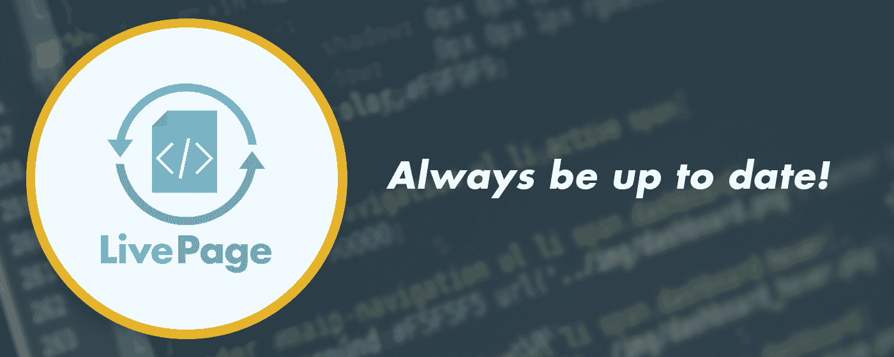
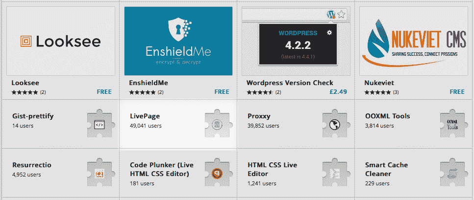

# 从我的 Chrome 扩展货币化中吸取的教训

> 原文：<https://mikerogers.io/2016/10/29/lessons-learnt-from-monetising-my-chrome-extension.html?utm_source=wanqu.co&utm_campaign=Wanqu+Daily&utm_medium=website>

# 从我的 Chrome 扩展货币化中吸取的教训

发布于<time datetime="2016-10-29">2016 年 10 月 29 日</time>

[T2】](https://chrome.google.com/webstore/detail/livepage/pilnojpmdoofaelbinaeodfpjheijkbh?hl=en?utm_source=blog&utm_medium=web&utm_campaign=followup)

2016 年 7 月，我[开始对我的 Chrome 扩展](/2016/07/03/why-im-charging-for-livepage) [LivePage](https://chrome.google.com/webstore/detail/livepage/pilnojpmdoofaelbinaeodfpjheijkbh?hl=en?utm_source=blog&utm_medium=web&utm_campaign=followup) 收费，这是我在 2011 年构建的一个简单的开发工具，用于在构建网页时重新加载网页。

我没有举办大规模的“我很快就要靠被动收入生活了”的派对，也没有投资广告。我只是改变了价格，然后去了当地的酒吧。我有点怀疑人们是否愿意为免费了这么多年的东西付费，但随着销售的开始，我毫不怀疑这是最好的选择。

## 两个月后的收入

做了两个月的付费 chrome 扩展后，我总共赚了 170.35 英镑，其中大部分是在我取消免费试用后赚的。

| 安装类型 | 每日平均印象 | 每日平均安装次数 | 月销售总额 |
| --- | --- | --- | --- |
| 自由的 | Five hundred and sixty | Fifty-five | £0 |
| 年度订阅(试用) | Four hundred and forty-one | Thirty-two | £28.82 |
| 仅限年度订阅 | Four hundred and eighty-nine | eight | £141.53 |

对于我在业余时间免费开发的一个扩展来说，这些是非常棒的结果。

如果销售额继续以大致相同的速度增长(每月约 100 英镑)，我可能会每年花一个月的时间专门支持 LivePage，或者其他任何我感兴趣的副业项目。这太不可思议了！

## 未付费安装

由于 LivePage 最初是开源的，我从来没有担心过人们会分享付费的副本(用 chrome extensions 做起来超级容易！).事实上，在 GitHub repo 的 LivePage 上，我甚至包括了如何运行开发版的说明。

让我们了解一下免费安装的数量，在 2016 年的大部分时间里，当 LivePage 免费时，它平均每周有 2.5 万名用户。在成为年度订阅(试用)的第一个月之后，它已经增长到大约 30，000 周用户，而只实现了 95 的销售额。

加个小价格就把周用户提升了这么多，太疯狂了！我怀疑自己能否将这些用户转化为付费用户，但我确实在选项页面添加了一条注释，要求用户在谷歌 Chrome 商店留下评论。

## 排名下降&取消免费试用

当 LivePage 免费的时候，我在 Chrome 网上商店类别的[开发者工具](https://chrome.google.com/webstore/category/ext/11-web-development?_feature=4stars)中排名居中。换成免费试用后，排名突然下降。

网上的快速搜索表明，在扩展中添加翻译将有助于弥补排名的下降。在通过 Chrome 网络商店工具投资人工翻译后，我注意到排名没有变化。我确实开始获得更多的国际(非英语)销售。

事实证明免费试用是罪魁祸首。Chrome 网络商店排名的一个主要信号是卸载率。我发现，当免费试用启用时，卸载率急剧增加，我怀疑是因为用户更喜欢卸载然后升级。

取消免费试用后，我的销售额增加了，排名停止下降。如果我要再次发布一个商业化的扩展，我不会为免费试用而烦恼，相反，我会专注于国际化(翻译和简单复制)&可能还有广告。

## 保持开源并增加登陆页面

我设法保持扩展完全开源(在 GNU Affero 通用公共许可证下)，这太棒了。但更好的是，自从收费以来，我的用户一直在推动我(并帮助我)添加有用的功能。我要特别感谢安迪·理查森，他帮我制作了一个[像样的登陆页面](https://livepage.mikerogers.io/)！

我仍然对在开源环境中开发付费产品保持警惕。尽管我肯定会推动人们开源他们的源代码，这样人们就可以在上面使用一些 OSS。

## 支持

总体支持请求(这是我转向付费模式的主要原因)已经下降到一个可持续的水平。我仍然收到来自用户的电子邮件，请求免费拷贝，请求帮助他们开发 bat shit 疯狂的开发环境(边喝啤酒边问我吧！)或者只是在 chrome 网上商店提交糟糕的评论(例如，“扩展很棒，但如果它能驾驶我的车，我会给它 5 颗星。所以才 4 星！”).幸运的是，他们现在很少了。

我确实试验了内置在支持系统中的 Chrome 网络商店(如上图)，但是它缺乏功能性，所以我选择禁用它。我对 Chrome 网上商店的主要不满是，当用户提交一张票或评论时，它不会发送通知。我能看到用户是否提交了一张罚单的唯一方法是登录 Chrome 网络商店开发者面板，在“用户反馈”链接中看到“(1)”。我决定禁用这个功能，因为我完全可以看到自己忘记检查仪表板&无意中打扰了用户。

## 结论

我真的很高兴我决定为我建造的东西收费。它向我自己证实了 LivePage 是一个人们会为之付费的产品&我可以创造人们乐于为之付费的东西。我不会因为它的销售而退休，远远不会，但我可以证明有更多的时间从事其他项目&继续开发 LivePage。

