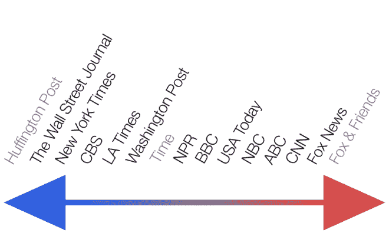
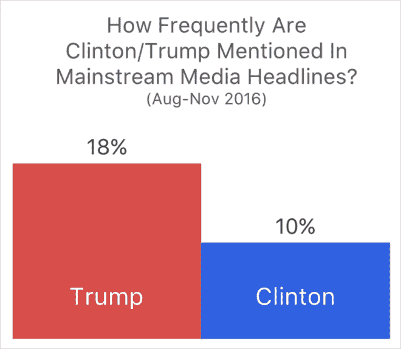
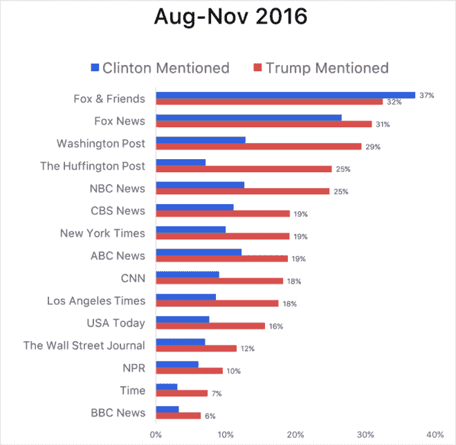
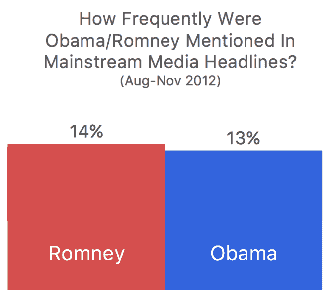
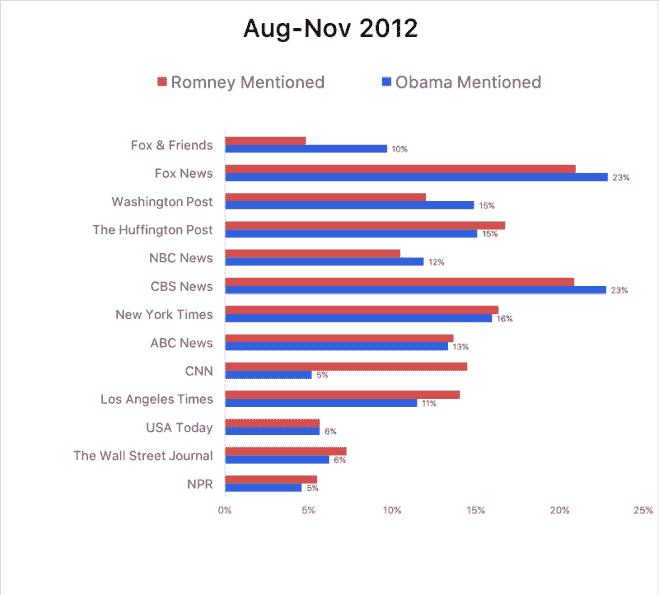
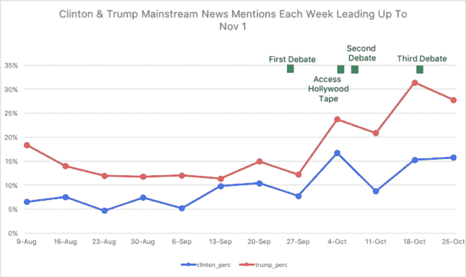
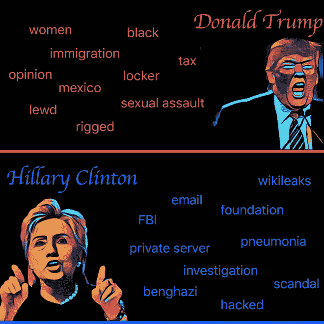
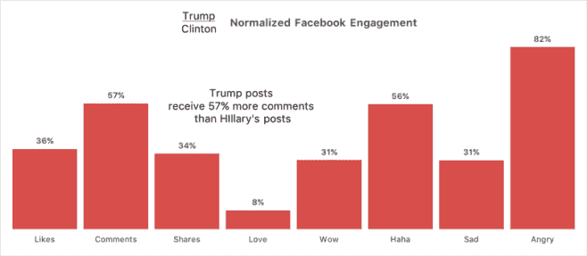
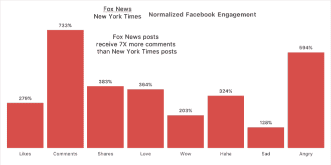

# Newco Shift |通过分析 400 万条脸书帖子，我发现了川普和希拉里

> 原文：<https://shift.newco.co/what-i-discovered-about-trump-and-clinton-from-analyzing-4-million-facebook-posts-922a4381fd2f?utm_source=wanqu.co&utm_campaign=Wanqu+Daily&utm_medium=website>

在脸书，标题往往比文章本身更重要。大多数标题是浏览的，而不是点击的——想想你自己的脸书行为；你多久点击一次链接？正因为如此，标题框定了我们对主题的立场，甚至不需要阅读内容。它快速、简单，我们*感到*见多识广。但就政治而言，这种新闻订阅浏览行为创造了一个可能变得危险无知的选民群体。

这些相同的标题也留下了 2016 年政治叙事的面包屑，我们可以对其进行分析。在这项研究中，我们关注四件事:

1.  探索不同媒体来源对“特朗普”和“克林顿”的媒体报道频率和偏见*(标题)*
2.  对比 2016 年社交媒体关注度和 2012 年奥巴马与罗姆尼竞选期间的社交媒体关注度*(标题)*
3.  描述 2016 年大选期间主流媒体在描述特朗普和克林顿时提出的其他话题*(头条)*
4.  量化脸书观众对希拉里和川普参与度的差异*(《脸书邮报》参与度)*

<noscript></noscript>

T4】

**分析设置**

在收集了来自 500 多个来源的超过 400 万个脸书帖子之后，我挑选了 15 个关于脸书的顶级来源。因为资料来源的选择应该受到高度审查，以避免偏见，所以我选择使用由伯克利数据科学小组过去进行的一项研究确定的跨政治领域的主流资料来源。除了这些来源，我还包括《赫芬顿邮报》、《《福克斯和朋友们》》和《时代周刊》,以更新伯克利的研究，还有一些最近变得更加活跃的脸书来源——伯克利的研究是几年前进行的。

<noscript></noscript>

所选资料来源基于伯克利数据科学研究，2013 年，[https://datascience.berkeley.edu/data-media-map-bitly/](https://datascience.berkeley.edu/data-media-map-bitly/)

**希拉里和唐纳德:无情的媒体报道**

命名实体识别( [NER](https://en.wikipedia.org/wiki/Named-entity_recognition) )是一项机器学习任务，它以无监督的格式从非结构化文本中识别、提取和标记事物——人、公司、位置等。在这项研究中，我使用斯坦福大学的 [NLTK](http://www.nltk.org/_modules/nltk/tag/stanford.html) 机器学习软件从脸书的标题和帖子描述中提取出“希拉里”和“川普”。*量化每位候选人出现在头条新闻中的频率，可以让我们进行统计比较。*构建该数据的另一种方法是在可用的标题中对‘trump’和‘Clinton’进行基本的字符串匹配(尽管这不太准确)。

例如，NER 允许我们从下面的推文中提取“[Person]，Obama”和“[Location]，Sun Stop”:

[https://twitter.com/campaignrpoz/status/513525809416781824](https://twitter.com/campaignrpoz/status/513525809416781824)

将这种方法应用于来自前 15 大媒体来源的近期头条新闻，我们发现在过去 3 个月中，Donald Trump 出现在脸书帖子中的频率几乎是 Hillary Clinton 的两倍。这还不考虑每个候选人正在做的社交媒体广告——这个 2 倍的提及频率只是前 15 大新闻来源发布的有机文章。

<noscript></noscript>

顶级媒体来源发布的所有内容中提及“克林顿”或“川普”的百分比

当我们分析每个候选人对特定媒体来源的报道时，我们惊讶地发现，极右翼和极左翼来源用尽了更多的内容槽来发布关于对立候选人的故事。为什么？两位候选人都受到了攻击。福克斯(特朗普的支持者)经常攻击克林顿，而许多其他消息来源(克林顿的支持者或中立者)在头条新闻中攻击特朗普的频率高于宣传克林顿的频率。

<noscript></noscript>

顶级媒体来源发布的所有内容中提及“克林顿”或“川普”的百分比

**与之前的选举相比:2016 年有所不同**

如果我们对 2012 年的选举重复上述研究，并在 2012 年的标题中搜索“米特罗姆尼”和“巴拉克奥巴马”，我们会发现 2012 年的选举报道要平衡得多。(2008 年没有足够的脸书数据来重复奥巴马和麦凯恩竞选周期的研究)。

<noscript></noscript>

顶级媒体来源发布的所有内容中提及“奥巴马”或“罗姆尼”的百分比

我们可以对 2012 年的报道进行细分，看到一些显著的差异，但总体来看，报道更加均衡。

<noscript></noscript>

顶级媒体来源发布的所有内容中提及“奥巴马”或“罗姆尼”的百分比

回到 2016 年大选，我们发现直到总统辩论开始的前一个月，报道一直持续稳定。丑闻、代言和公开辩论引发了前所未有的社交媒体关注。在第三次总统辩论之前的几周，顶级媒体发布的所有内容中有 30%以上提到了克林顿或特朗普的名字。

<noscript></noscript>

在大选最后 3 个月内，顶级新闻媒体每周发布的提及川普或希拉里的头条新闻的百分比

**情感极性——对于这个数据集来说非常具有挑战性**

在这项研究中，有一个维度我们没有探索——主流媒体在报道特朗普和克林顿时有多积极或消极？这是一个使用 NLP 来自动化的特别困难的任务，例如“唐纳德·特朗普喜欢暴力”，或者“希拉里·克林顿支持企业贪婪”将产生冲突的情感结果。我当然不会为了情感而手动审查和分类数百万个句子..。Lexalytics 提供行业领先的商业级文本情感分析软件，我与他们合作进行了一个快速测试。我们查看了只提到一名候选人的标题，并为特朗普和克林顿提到的标题生成了平均情绪得分。不幸的是，这些结果在统计学上并不显著。鉴于时间紧迫，我没有机会再看一眼，但也许当选举后的混乱平静下来时，我们可以用监督学习的方法重新审视这一点。无论如何，特别感谢我在 [Lexalytics](https://www.lexalytics.com/) 的朋友们，他们提供了情绪预测积分、技术支持和反馈。如果你需要为社会倾听或文本情感分析产生快速的结果，绝对推荐与他们合作。

这些标题中还包括哪些话题？

一种用来对比两个不同文本语料库的技术是，当“克林顿”或“特朗普”出现在标题中时，看看还使用了哪些其他单词。要做到这一点，我们可以看看[加权对数优势比](https://en.wikipedia.org/wiki/Odds_ratio)，这是一种常见的技术，用于区分哪些单词最有可能在两个不同的文本语料库中使用，这在您想要排除语料库之间重叠的单词或短语时特别有用。为了正确地做到这一点，我们使用词干(克林顿~克林顿的，和川普~川普的)并移除常见的[停用词](https://en.wikipedia.org/wiki/Stop_words) (if、and、or、but 等)来清理文本。我们将标题分割成特朗普提及或克林顿提及的语料库，并计算每个剩余单词的加权对数优势比，以比较这两组标题。我们发现两个候选人都有大量负面词汇。

<noscript></noscript>

顶级新闻来源提及“川普”或“克林顿”时使用频率最高的词

从统计数据来看，两位候选人都受到了媒体的持续攻击——政治叙事毫无疑问是负面的… *,顺便提一下，整个选举可以有效地用上图来概括。*

**唐纳德·特朗普:社交媒体参与大师**

我关注的最后一件事是川普和希拉里脸书观众的激活/参与度。首先，我查看了川普和希拉里已核实的脸书页面上的帖子。在过去的几个月里，每个候选人都以大致相同的节奏发布帖子，尽管唐纳德分享了更多的照片和状态更新，希拉里分享了更多的链接和视频(*每种类型的内容通过脸书新闻订阅算法传播的方式不同)*)，但我决定将每个候选人的每种帖子类型聚集在一起。此外，由于唐纳德的脸书页面目前拥有约 1350 万粉丝，希拉里的脸书页面拥有约 880 万粉丝，因此我对结果进行了归一化处理——此分析基于每 100 万脸书粉丝的平均参与度。我们发现，在每个维度上，唐纳德·特朗普在其页面上的社交媒体参与度都明显高于希拉里的页面。

> 凭借其内容和受众，唐纳德·特朗普(Donald Trump)在社交媒体上找到了产品市场契合点。

作为如何解读下图的一个例子，唐纳德在其页面上发布的平均内容比希拉里在其页面上发布的平均内容产生的评论多 57%。

<noscript></noscript>

特朗普与脸书订婚，每 100 万脸书粉丝正常化

同样有趣的一点是，如果我们重复《福克斯新闻频道时报》和《纽约时报》的相同比较，我们会看到一个更大的不平衡:福克斯新闻频道产生的评论平均比《纽约时报》的脸书帖子多 7 倍以上。

<noscript></noscript>

福克斯-NYT-脸书订婚，正常化每 100 万脸书粉丝

**总结**

1.  每当一种新的传播媒介达到一定规模时，政治叙事就会转变，以跟上并利用这种优势。罗斯福(电台)，JFK 和里根(电视)，奥巴马(互联网)，川普(社交媒体)。*下一个重大转变会是什么？？VR？*
2.  我们的脸书新闻源非常个性化。广播和电视让世界*感觉*像一个更小的地方，但有了机器学习和个性化的新闻订阅，社交媒体在将内容传递给你之前会对其进行微聚焦——给你你想要的东西，但让你无法接触和了解不同的观点。加入“是的，我同意”的狂潮很容易，但是现在需要更多的时间、批判性思维、好奇心和精力去发现、倾听和吸收与我们自己的信念相反的观点和内容。
3.  机器学习并不完美，但这些发现的统计意义值得反思。我们的媒体提供了我们做出明智决策所需的信息吗？脸书不是一家媒体公司，但脸书是在扶持好的还是坏的 wrt 媒体？联合还是分裂？我们如何才能发现不带偏见的，或双面的内容来源？普通公民**是否关心**他们是否能轻易获得双面或不带偏见的内容/头条新闻？
4.  社交媒体的兴奋和危险在于，媒体发布标题和文章的速度如此之快，以至于很难对叙述进行事实核查。真相不再那么重要了——人们在没有充分分析或思考的情况下从一个话题转移到另一个话题。候选人刚刚发推特或发布了什么疯狂的事情吗？你不会相信他们明天说了什么… 标题写得快，消化起来简单，观众很快转移到下一个标题。*由于“点击诱饵”出版的激励和回报，数字出版商和标题制作者受到了很多负面的关注，但也许真正的数字大规模杀伤性武器是有才华的标题制作者，他们说服选民相信 10 个字标题中的想法、观点或谎言，而不用为他们的影响负责？* ***不是指责，只是一种思想:p***
5.  负面的选举周期不一定对我们的民主有害——言论自由是健康的，是我们国家的基础。但是攻击的风格很重要——我认为在问题上攻击候选人可以帮助选民获得对政策或立场的不同看法。但是也许“不正当的”、“肮脏的”和“可悲的”言辞是贬低和转移注意力的。如果走得太远，也许会使民主倒退？
6.  关于这个数据集，以及我收集的大约 2 . 5 亿个额外的数据点，还有更多可以探索的，这些数据点与候选受众和评论线程相关..就等着被分析了。如果你想帮忙解决社交媒体的混乱，伸出援手吧🙂帕特里克·马丁切克[at]Gmail . com

这篇文章的标题是在我在 headlines.ai 的朋友的帮助下创建的——如果你是一名作家、博客作者、社交媒体经理或广告商，他们的产品可以让你轻松提高点击率。他们会给你一次免费试用🙂**T3】联系@ headlines . aiT5】**