# 如何设计更好的纽扣——粉碎杂志

> 原文：<https://www.smashingmagazine.com/2016/11/a-quick-guide-for-designing-better-buttons/?utm_source=wanqu.co&utm_campaign=Wanqu+Daily&utm_medium=website>

按钮是交互设计中常见的元素。虽然它们看起来是非常简单的 UI 元素，但它们仍然是最重要的创建元素之一。在今天的文章中，我们将介绍为了**创建改善用户体验的有效控件**你需要知道的基本事项。如果你想尝试用不同的方式设计原型和线框，你可以免费下载并测试 *Adobe XD* 。

按钮是交互设计中常见的元素。虽然它们看起来是非常简单的 UI 元素，但它们仍然是最重要的创建元素之一。

在今天的文章中，我们将讨论为了**创建改善用户体验的有效控件**你需要知道的基本事项。如果你想尝试用不同的方式设计原型和线框，你可以免费下载并测试 [Adobe XD](https://adobe.ly/2dHvgEx) 。

## smashing mag 上的进一步阅读:

## 使按钮看起来像按钮

用户如何理解一个元素是一个按钮？答案很简单。视觉提示帮助人们确定可点击性。在可点击的元素上使用适当的视觉符号，使它们看起来像按钮，这很重要。

More after jump! Continue reading below ↓

<aside class="feature-panel">

遇见 [**粉碎邮件简讯**](/the-smashing-newsletter/) 前端有用的小技巧，设计& UX。订阅并**获得“智能界面设计清单”**——一个**免费的 PDF 包**，有 150 多个问题可以在设计和构建几乎*任何东西*时问自己。

</aside>

### 形状

根据网站或应用程序的风格，安全的做法是将按钮*做成方形或圆角方形*。矩形按钮很久以前就被引入数字世界，用户对它们非常熟悉。

[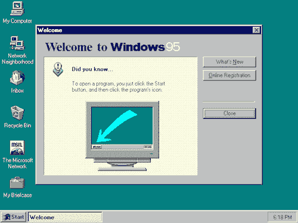](https://cloud.netlifyusercontent.com/assets/344dbf88-fdf9-42bb-adb4-46f01eedd629/093bf80e-304a-4a7f-985c-e0b595a4ed65/windows-95-at-first-run-large-opt.png)

Windows 95 at first run: notice that every button, including famous 'Start' button, has a rectangular shape. Image credit: [Wikipedia](https://en.wikipedia.org/wiki/Windows_95). ([Large preview](https://cloud.netlifyusercontent.com/assets/344dbf88-fdf9-42bb-adb4-46f01eedd629/093bf80e-304a-4a7f-985c-e0b595a4ed65/windows-95-at-first-run-large-opt.png))

当然，你可以更有创意，使用其他形状，(圆形，三角形，甚至自定义形状)，但请记住，独特的想法可能会有一点风险。你需要确保人们可以很容易地将每个不同的形状识别为一个按钮。

[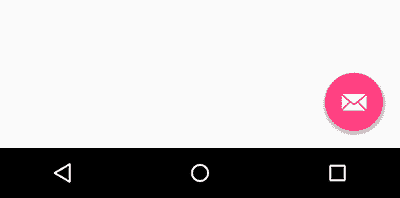](https://cloud.netlifyusercontent.com/assets/344dbf88-fdf9-42bb-adb4-46f01eedd629/96bebd8c-9bc4-4898-a6ca-2628276fbcf4/floating-action-button-preview-opt.png)

Here, the Floating Action Button (FAB), which represents the primary action in an Android application, is shaped like a circled icon.

无论你选择什么形状，一定要在你的界面控件中保持一致性，这样用户就能识别所有的 UI 元素。

为什么一致性如此重要？嗯，因为用户会记住细节，不管是有意识还是无意识。例如，用户会将特定元素的形状关联为“按钮”因此，保持一致不仅有助于设计美观，还能为用户提供更熟悉的体验。

下图完美的说明了这一点。在应用程序的一个部分使用三种不同的形状(例如系统工具栏)不仅会让用户感到困惑，而且是不正确的设计实践。

[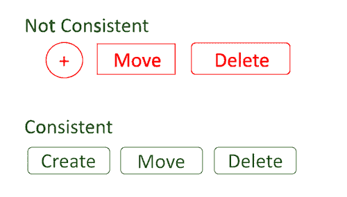](https://cloud.netlifyusercontent.com/assets/344dbf88-fdf9-42bb-adb4-46f01eedd629/040ebc8f-3960-4452-a478-786a72d8a2d9/consistent-large-opt.png)

There's nothing wrong with creativity and experimentation, but keep the design coherent. ([Large preview](https://cloud.netlifyusercontent.com/assets/344dbf88-fdf9-42bb-adb4-46f01eedd629/040ebc8f-3960-4452-a478-786a72d8a2d9/consistent-large-opt.png))

### 阴影和高光

阴影是有价值的线索，告诉用户他们在看哪个 UI 元素。投影使元素在背景中突出，并使其容易被识别为可点击或可点击的元素，因为凸起的对象看起来像是可以被按下的(点击或点击)。即使是扁平的按钮(确切地说，几乎是扁平的)，这些微妙的暗示仍然存在。

[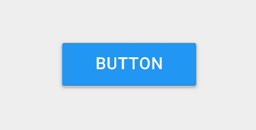](https://cloud.netlifyusercontent.com/assets/344dbf88-fdf9-42bb-adb4-46f01eedd629/b1e848cc-3878-4558-8c62-e2782c31782b/button-casts-a-subtle-shadow-preview-opt.png)

If a button casts a subtle shadow, users tend to understand that the element is interactive.

## 清楚地标记按钮

用户避免没有明确含义的界面元素。因此，UI 中的每个按钮都应该有一个合适的标签或图标。根据最小惊讶原则进行选择是一个好主意:如果一个必要的按钮有一个高惊讶系数的标签或图标，那么可能需要改变标签或图标。

### 清晰明确的标签

可操作界面元素上的标签，比如一个按钮，应该总是和它能为用户做什么联系在一起。当用户理解按钮的动作时，他们会感觉更舒服。像“提交”这样的模糊标签，或者像下面例子中这样的抽象标签，并不能提供足够的动作信息。

[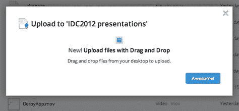](https://cloud.netlifyusercontent.com/assets/344dbf88-fdf9-42bb-adb4-46f01eedd629/7da97a3a-fc4d-4416-a85a-b5a761af243a/designing-interface-elements-that-make-people-wonder-what-they-do-preview-opt.png)

Avoid designing interface elements that make people wonder what they do. Image credit: [uxmatters](https://www.uxmatters.com/mt/archives/2012/05/7-basic-best-practices-for-buttons.php)

动作按钮应该确认任务是什么，这样用户就能确切地知道当他们点击按钮时会发生什么。使用动作动词来指明按钮*的作用是很重要的。例如，如果用户注册一个账户，一个写着“创建账户”的按钮会告诉他们按下按钮后的结果。对任务来说是明确而具体的。这种明确的标签起到了及时帮助的作用，让用户有信心选择正确的操作。*

[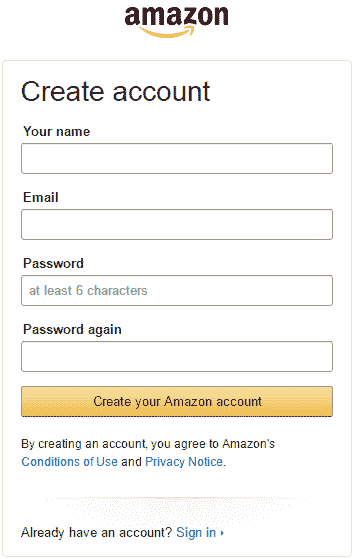](https://cloud.netlifyusercontent.com/assets/344dbf88-fdf9-42bb-adb4-46f01eedd629/9e8aa978-c12b-4385-b1af-9dcfb1bc3356/button-s-label-preview-opt.png)

A button's label should say exactly what will happen when the user presses it. Image credit: [Amazon](https://www.amazon.com/)

## 将按钮放在用户可以找到的地方

不要让用户去猎取按钮；将按钮放在用户容易找到或期望看到的地方。

### 位置和顺序

如果你正在设计一个本地应用程序，当选择一个合适的按钮位置和顺序时，你应该遵循平台 GUI 指南。为什么？因为应用*符合用户期望的一致设计*节省了人们的时间。

[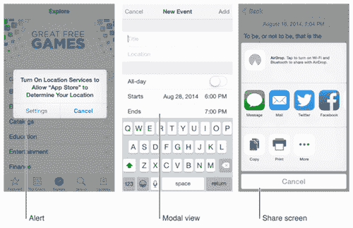](https://cloud.netlifyusercontent.com/assets/344dbf88-fdf9-42bb-adb4-46f01eedd629/062fb732-6ea9-45f5-9ea9-80e6795b64f1/web-based-apps-large-opt.png)

Image credit: [Apple](https://developer.apple.com/library/safari/documentation/UserExperience/Conceptual/MobileHIG/Modal.html). ([Large preview](https://cloud.netlifyusercontent.com/assets/344dbf88-fdf9-42bb-adb4-46f01eedd629/062fb732-6ea9-45f5-9ea9-80e6795b64f1/web-based-apps-large-opt.png))

对于基于网络的应用程序，你应该考虑哪种放置方式最适合你的用户。确定这一点的正确方法是通过*测试*。

如果你设计的是手机导航，那么关注按钮位置的最佳实践是值得的。文章[底部导航设计的黄金法则](https://www.smashingmagazine.com/2016/11/the-golden-rules-of-mobile-navigation-design/)涵盖了这个主题。

## 让用户更容易与按钮交互

按钮的大小和视觉反馈在帮助用户与它们交互方面起着关键作用。

### 尺寸和填充

您应该考虑一个按钮相对于页面上的其他元素有多大。与此同时，你需要确保你设计的按钮足够大，以便人们进行交互。

[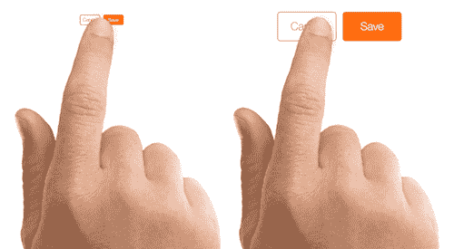](https://cloud.netlifyusercontent.com/assets/344dbf88-fdf9-42bb-adb4-46f01eedd629/f44e986d-fdd9-477d-b424-ae4643c50093/smaller-touch-targets-large-opt.png)

Smaller touch targets are harder for users to tap than larger ones. Image credit: [Apple](https://developer.apple.com/design/tips/). ([Large preview](https://cloud.netlifyusercontent.com/assets/344dbf88-fdf9-42bb-adb4-46f01eedd629/f44e986d-fdd9-477d-b424-ae4643c50093/smaller-touch-targets-large-opt.png))

当点击被用作你的应用或网站的主要输入方法时，你可以依靠[麻省理工学院触摸实验室](https://touchlab.mit.edu/publications/2003_009.pdf)的研究来为你的按钮选择合适的大小。这项研究发现，手指垫的平均尺寸在 10-14 毫米之间，指尖为 8-10 毫米，因此 10 毫米 x 10 毫米是一个很好的最小触摸目标尺寸。当鼠标和键盘是主要的输入方法时，按钮尺寸可以稍微减小以适应密集的 ui。

[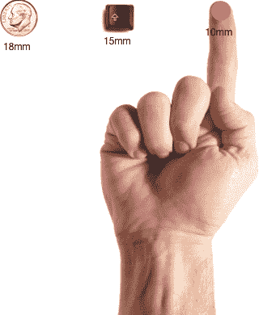](https://cloud.netlifyusercontent.com/assets/344dbf88-fdf9-42bb-adb4-46f01eedd629/b3496b2c-6d80-41cb-9ec7-fbc1108d8dea/10mm-x-10mm-is-a-good-minimum-touch-target-size-preview-opt.png)

10mm x 10mm is a good minimum touch target size. Image credit: [uxmag](https://uxmag.com/articles/excerpt-from-the-new-book-the-mobile-frontier)

您应该考虑按钮元素的大小，以及可点击元素之间的*填充*，因为填充有助于分离控件，并给用户界面足够的喘息空间。

[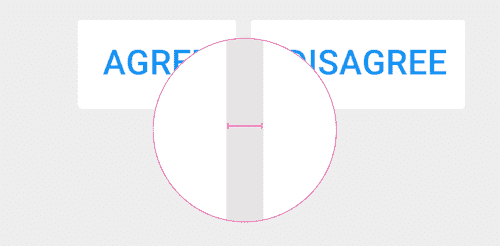](https://cloud.netlifyusercontent.com/assets/344dbf88-fdf9-42bb-adb4-46f01eedd629/59ebde25-ec4b-483f-b783-b100020f15a7/padding-between-buttons-large-opt.png)

Here is an example of padding between buttons. Image credit: [Material Design](https://material.google.com/components/dialogs.html#dialogs-specs). ([Large preview](https://cloud.netlifyusercontent.com/assets/344dbf88-fdf9-42bb-adb4-46f01eedd629/59ebde25-ec4b-483f-b783-b100020f15a7/padding-between-buttons-large-opt.png))

### 提供视觉反馈

这个需求不是关于按钮最初对用户来说是什么样子；它是关于 UI 元素的交互体验。通常，按钮不是单状态对象。它有*多状态*，和*提供视觉反馈*给用户，指示当前状态应该是一个最优先的任务。这张来自[材料设计](https://material.google.com/)的有用插图清楚地展示了如何传达不同的按钮状态:

[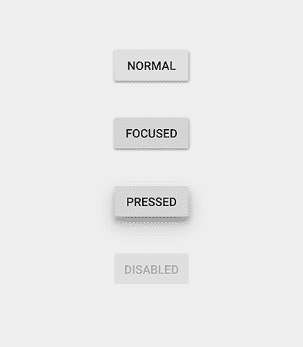](https://cloud.netlifyusercontent.com/assets/344dbf88-fdf9-42bb-adb4-46f01eedd629/dc4efadf-d849-4763-92aa-fa79792dc633/hover-tap-states-and-active-states-of-the-button-preview-opt.png)

Make sure you consider the hover, tap, and active states of the button. Image credit: [Material Design](https://material.google.com).

[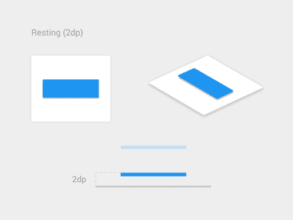](https://cloud.netlifyusercontent.com/assets/344dbf88-fdf9-42bb-adb4-46f01eedd629/2fca8a5e-3e37-4f36-9530-b098971f187b/animation-shows-the-buttons-behavior-in-action.gif)

This animation shows the button's behavior in action. Image credit: [Behance](https://www.behance.net/gallery/23056487/Material-Design-Button-Animation). ([Large preview](https://cloud.netlifyusercontent.com/assets/344dbf88-fdf9-42bb-adb4-46f01eedd629/2fca8a5e-3e37-4f36-9530-b098971f187b/animation-shows-the-buttons-behavior-in-action.gif))

## 视觉上突出显示最重要的按钮

确保设计强调主要或最突出的动作。使用颜色和对比度来保持用户对动作的关注，并将按钮放在用户最容易注意到的显著位置。

### 行动号召按钮

重要的按钮(比如 CTA)是用来*引导用户*采取你希望他们采取的行动。要创建一个有效的行动号召按钮，一个能抓住用户注意力并吸引他们点击的按钮，你应该使用与背景相比对比度高的颜色，并将按钮放在用户的路径上。

如果我们看一下 [Gmail 的 UI](https://mail.google.com/) ，界面非常简单，几乎是单色的，除了‘发送’按钮。用户一写完消息，就会立即注意到这个漂亮的蓝色按钮。

[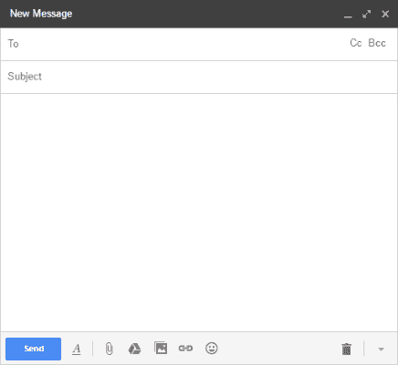](https://cloud.netlifyusercontent.com/assets/344dbf88-fdf9-42bb-adb4-46f01eedd629/17a1387c-9bc4-4868-af2a-b3c9f5275687/adding-one-color-to-a-grayscale-ui-preview-opt.png)

Adding one color to a grayscale UI draws the eye simply and effectively.

同样的规则也适用于网站。如果你看一下下面的[行为](https://www.behance.net/)例子，首先会引起你注意的是一个“注册”行动号召按钮。在这种情况下，颜色和位置比文本更重要。

[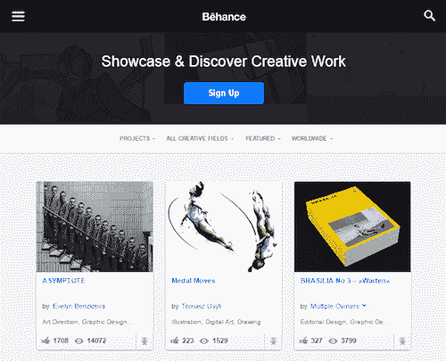](https://cloud.netlifyusercontent.com/assets/344dbf88-fdf9-42bb-adb4-46f01eedd629/112e498d-7960-491a-a61d-b19d6a22e59e/the-most-important-call-to-action-button-large-opt.png)

The most important call-to-action button stands out against the background. ([Large preview](https://cloud.netlifyusercontent.com/assets/344dbf88-fdf9-42bb-adb4-46f01eedd629/112e498d-7960-491a-a61d-b19d6a22e59e/the-most-important-call-to-action-button-large-opt.png))

### 主要和次要按钮的视觉区别

你可以找到另一个在表单和对话框中用按钮吸引用户注意力的例子。在选择主要和次要行动时，视觉区分是帮助人们做出可靠选择的有用方法:

*   与按钮相关联的主要积极动作需要承载更大的视觉权重。它应该是视觉上占主导地位的按钮。
*   次要动作(如“取消”或“返回”等选项)应该具有最弱的视觉权重，因为减少次要动作的视觉突出性可以最大限度地降低潜在错误的风险，并进一步引导人们走向成功的结果。

[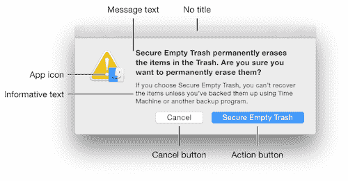](https://cloud.netlifyusercontent.com/assets/344dbf88-fdf9-42bb-adb4-46f01eedd629/c1b1ac22-dd7a-44ea-81a8-72aa4e3085a7/primary-action-is-stronger-in-colour-and-contrast-large-opt.png)

Notice how the primary action is stronger in color and contrast. Image credit: [Apple](https://developer.apple.com/library/mac/documentation/UserExperience/Conceptual/OSXHIGuidelines/WindowAlerts.html). ([Large preview](https://cloud.netlifyusercontent.com/assets/344dbf88-fdf9-42bb-adb4-46f01eedd629/c1b1ac22-dd7a-44ea-81a8-72aa4e3085a7/primary-action-is-stronger-in-colour-and-contrast-large-opt.png))

## 按钮设计清单

虽然每个设计都是独一无二的，但每个设计都有一些共同之处。这就是拥有一份好的设计清单的原因。为了确保你的按钮设计适合你的用户，你需要问几个问题:

*   用户是否认为你的元素是一个按钮？思考设计如何传达启示。让一个按钮看起来像一个按钮(使用大小，形状，阴影和颜色)。
*   按钮的标签是否提供了一个清晰的信息告诉我们点击后会发生什么？命名一个按钮，解释它是做什么的，通常比使用一个通用的标签更好，(比如“OK”)。
*   你的用户能容易地找到按钮吗？你把按钮放在页面上的什么位置和它的形状、颜色以及标签一样重要。考虑用户在页面中的路径，把按钮放在用户容易找到或期望的地方。
*   如果你的视图中有两个或更多的按钮，(如对话框)，**具有主要动作的按钮视觉权重最大吗？**通过对每个按钮使用不同的视觉权重，清楚地区分两个选项。

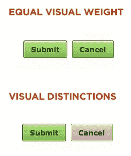

When looking at the visual distinction for 'Submit' button, it should be visually dominant over the other button. Image credit: Lukew

## 结论

按钮是创建流畅用户体验的重要元素，因此值得关注它们的最佳基本实践。快速回顾一下:

*   让按钮看起来像按钮。
*   给按钮贴上标签，标明它们为用户做了什么。
*   将按钮放在用户可以找到或期望它们在的地方。
*   让用户很容易与每个按钮进行交互。
*   让最重要的按钮清晰可辨。

当你设计自己的按钮时，从最重要的开始，记住*按钮设计总是关于识别和清晰*。

### 推荐阅读

> 本文是 Adobe 赞助的 UX 设计系列的一部分。新推出的[体验设计应用](https://adobe.ly/2dHqYbP)专为快速流畅的 UX 设计流程而设计，创建交互式导航原型，并在一个地方进行测试和共享。您可以在 [Behance](https://adobe.ly/1U9LS0E) 上查看用 Adobe XD 创建的更多鼓舞人心的项目，也可以访问 Adobe XD 博客以获得最新信息。Adobe XD 经常更新新功能，因为它处于公测阶段，你可以[免费下载并测试它](https://adobe.ly/2dHqYbP)。

 (ms, il, aa)