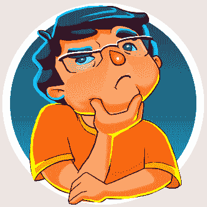
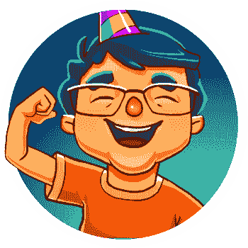

# 编程改变了我的生活

> 原文：<http://blog.professorbeekums.com/2016/11/programming-has-changed-my-life.html?utm_source=wanqu.co&utm_campaign=Wanqu+Daily&utm_medium=website>

Sometimes I look back on my life and wonder what it would have been like if I had never started programming. Obviously my career would be different, but I believe that programming has fundamentally changed how I think. Who I am as a person has changed significantly due to solving as many software problems as I have and the changes have been for the better.

Teenage me was severely flawed. That guy formed opinions very quickly with little evidence or thought put into it. That alone wouldn’t be so bad if he also didn’t hate being wrong. He hated being wrong so much that he would stick to his poorly formed opinions regardless of how well the arguments against him were. And no opinion was greater than the one that nothing was ever his fault. There was always someone else to blame for anything that went wrong. I’m surprised I still have friends from back when I was that guy.

Going to college was like hitting a brick wall. It is extremely difficult for a person with the above character flaws to make it through a year of computer science classes. The reason is due to the nature of writing code. Despite all the advances in AI, computers are pretty dumb. They do *exactly* what you tell them to do. No more. No less. But you can’t just tell them to do things like you would ask another human being to do something. Computers have their own language: code.

Talking to a computer is not like talking to a human. Computers have no opinions. They don’t care about being right or being wrong. They just do what they’re told. That means that you can NOT simply be stubborn and win an argument with a computer through sheer force of will. Computers don’t care that you yell at them.

If you wrote code that doesn’t work, there is only one way to get that code to work: figure out what you did wrong.

That was an important paradigm shift from what I was doing in my life. My primary activity, programming, required me to constantly think about what *I* was doing wrong. Stubbornness only resulted in me sitting in my chair, fuming, yelling at a computer that didn’t care that I was yelling at it, and making no progress. I needed to stop being angry and start thinking about what I was doing wrong if I wanted to get programming assignments done in time. Often that required using a different approach than my initial one. There goes my tendency to stick with poorly thought out initial opinions!

This kind of personal growth did not end after college. If anything it accelerated when I started working professionally. I once spent several days working on a single piece of code. An initial opinion was formed and I started writing the code. I invested several days of my heart and soul there. I struggled with an endless stream of things going wrong and plugging holes every time one popped up. I was sure that my initial approach was the right one and each hole I fixed would be the last one. There never was a last one.

By the end I was prepared to deliver a broken product to my boss and say “this is the best I can do”. I was frustrated and couldn’t take it anymore. Then I realized my entire approach was wrong. I threw out all the work I had spent so much time in and re-wrote everything in two hours.
**Two hours.**

That is all it took to do what I needed to do. It was a harsh reminder that initial opinions are nearly worthless and that stubbornness only results in wasted time.

There have been many other harsh reminders over the years. Software development is a rapidly changing field. Accepted practices change and new technology is constantly being developed. Some developers choose to stick with what they know and only what they know. They are finding out that in software development, you learn or you become obsolete. End of story. Even if they can convince non-technical managers running a company that their old ways are the best way, that will only lead to a sub-optimal development team. Companies who accept this become extremely vulnerable to competitors who don’t.

The lessons I learned from programming did not stay exclusive to my career as a software developer. They carried over into all other aspects of my life. I’m a much less angry and much more tolerable person to be around for those close to me. I also think more pragmatically when making decisions, whether it is figuring out how much to save for retirement or eating healthier. Most importantly, I have accepted that some things are just hard. Some problems have no easy answers. Often times the only solution is to hunker down and do the work to figure things out.

There’s no telling if I would have learned these lessons some other way. It doesn’t matter though. In the life I lived, programming has taught me these lessons. Programming has changed my life for the better.

If you are interested in learning to code: [try my lessons!](//professorbeekums.com/lessons/learntocode/list)

**Hi there! I hope you enjoyed this post.**

如果你有，我会很感激你花时间看看我的产品:

[**Dynomantle**](https://www.dynomantle.com)

你是否为整理笔记、成千上万的书签、电子邮件或其他数字材料而苦恼？你会因为无法复制“生产力大师”的习惯而感到难受吗？

Dynomantle 可以提供帮助。这是一种知识管理工具，旨在与您现有的习惯相结合。你不需要新习惯。Dynomantle 围绕着你工作，而不是让你强迫自己围绕着一个工具工作。

[Signup for free!](https://www.dynomantle.com)