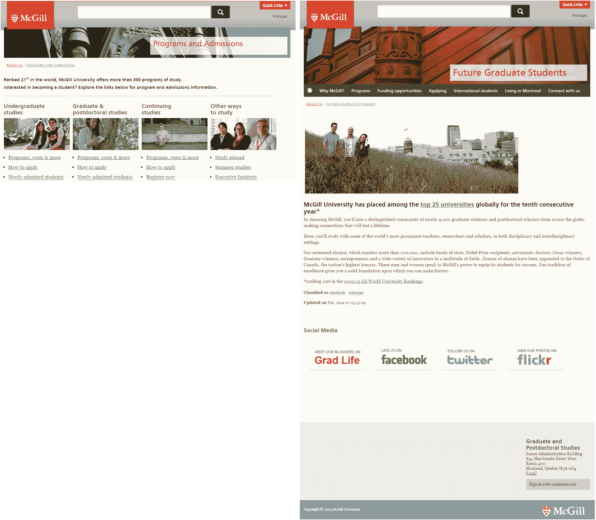
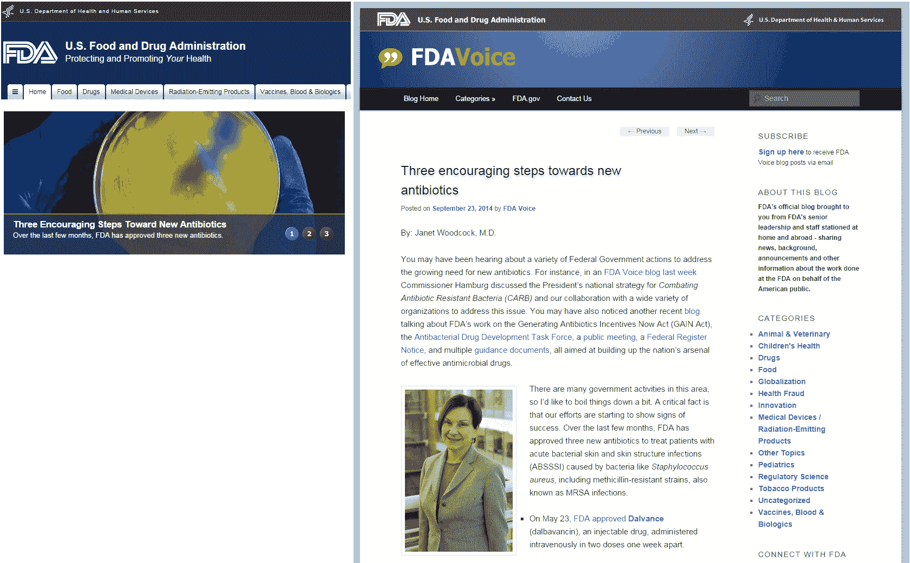

# 一个链接就是一个承诺

> 原文：<https://www.nngroup.com/articles/link-promise/?utm_source=wanqu.co&utm_campaign=Wanqu+Daily&utm_medium=website>

任何违背的承诺，无论大小，都会削弱信任和可信度。一个追求者邀请你约会，但他没有出现。一位家长说她会玩游戏，但从来没有。一个网站上的链接写着*产品&服务*，但却打开了一个注册页面。这些被破坏的承诺让一个人感到被引诱、恼怒、不受尊重、失望和被欺骗。总之，没什么好的。另一方面，当一个链接确实实现了它所宣称的功能时，人们会无缝地、自信地浏览这个网站。

## 链接应该独立

当[进行](http://www.nngroup.com/reports/how-to-conduct-eyetracking-studies/) [眼球追踪研究](http://www.nngroup.com/books/eyetracking-web-usability/)时，我经常观察到人们如何试图浏览最少量的内容，以获得足够的信息继续进行。人类天生追求效率和最小化[互动成本](http://www.nngroup.com/articles/interaction-cost-definition/):他们节约注视点(他们直视的事物数量)。通常，他们首先只浏览文本和那些他们认为有助于快速理解内容并推进任务的 UI 元素。

在一种经常观察到的[页面扫描模式](http://www.nngroup.com/reports/how-people-read-web-eyetracking-evidence/)、[斑点模式](https://www.nngroup.com/articles/text-scanning-patterns-eyetracking/)中，人们以一种看似随机的方式进行扫描，当仔细分析时，就会发现他们看的项目似乎与他们想要的有关，或者被认为与大部分内容重要或不同。这些项目包括:

*   标题
*   子弹
*   内容(单词)的形状与用户正在寻找的相似
*   当他们寻找包含数字的[值时(例如温度或重量)](http://www.nngroup.com/articles/web-writing-show-numbers-as-numerals/)
*   当他们寻找经常包含大写字母的项目时(例如国家和州的缩写)
*   按钮，当它们有可见的符号时，如矩形框和阴影
*   链接，当它们[看起来与普通文本](http://www.nngroup.com/articles/guidelines-for-visualizing-links/)不同时(例如当它们有不同的颜色时，被加下划线或加粗)

因此，当链接和按钮的格式不同于周围的文本时，它们会吸引用户的注意。因此，许多用户实际上并没有阅读相邻的内容，而是将链接视为独立的项目。因此，当脱离上下文单独阅读时，链接中使用的术语应该是可以理解的。(这种做法也有利于[屏幕阅读器用户](http://www.nngroup.com/articles/accessible-design-for-users-with-disabilities/)。)例如，交易词如 *go、* *more、*和 *read more、*表示描述性短语，如*与专家、产品和服务聊天、*或*飞机上出生的婴儿。*

最好的链接是[突出的和描述性的](http://www.nngroup.com/articles/writing-links/)。人们应该能够阅读一个表达性的链接或按钮术语，确定[信息气味](http://www.nngroup.com/articles/information-scent/)的强度，决定他们是否想要点击链接，点击它，等到下一个页面加载，当它加载时扫描页面，并立即确认他们在正确的位置。在许多情况下，网站会确认用户的假设，用户会自信地继续浏览或阅读。

## 确认这个人的假设

一旦用户点击一个链接，网站就有责任满足或违背链接的承诺。理想情况下，目标页面应该提供提示，告诉用户他们已经到达了正确的位置，以及如何继续前进。确认用户假设的有效方法包括:

*   将预期的内容放置在默认的可视区域，而不是强迫用户滚动、单击或点击来显示它
*   一个可理解和可见的页面标题
*   如果链接到 applet，显示 applet，或者至少是 applet 工作流程的第一步
*   如果链接到表单，默认情况下显示一些字段
*   一张与眼前主题非常相关的图片

## 描述模糊的不正确页面

有时链接和按钮文本设置了一个期望，但是链接到了一个不是用户期望的地方。更糟糕的是，它甚至可能不完全清楚这个页面是关于什么的。在这些情况下，用户被迫做出假设并寻找正确的路径。例如，加拿大麦吉尔大学的网站在*毕业生&
博士后研究*部分提供了*项目、费用&更多*的链接。寻找学费信息并点击链接的人会发现一个不提供学费信息的页面，甚至是任何有学费信息的页面链接的提示。

项目费用&更多*导致一页关于麦吉尔大学是前 25 所大学之一。用户可能希望看到一个学费和其他估计费用的表格，但却看到一个没有学费链接的死结页面，IA 中也没有任何建议。*

在另一个例子中，考虑从 GoDaddy.com 给一个想要购买一个网络域名的人的电子邮件。行动号召是一个名为*的绿色大按钮，点击输入最小值/最大值。*它强烈建议点击它将导致一个表单输入域名投标。然而，点击它会打开一个登录页面(虽然这是惯例，但仍然会打断用户的思路，增加他们[离开网站](http://www.nngroup.com/articles/login-walls/)的机会)，然后会导致一个页面，其中包含一个有两个域的表，其中一个是用户拥有的。此页面不是为域名输入最低或最高出价的地方。相反，这个人必须扫描这个页面，看到*域名购买*标题(不容易看到，因为它的位置看起来像是页面顶部促销横幅的一部分)，阅读与第二个域名一起出现的*等待客户最低/最高报价*消息，并点击第二个域名的链接。只有这样，该网站打开*设置 xxx.com*灯箱域名服务，用户可以输入最低和最高出价。

按钮文本表明它将链接到一个带有输入最低和最高出价字段的表单，但它加载的是:一个登录页面，需要登录，一个列出多个域的表格，需要定位一条消息并链接到该域，最后是一个输入最低和最高出价的表单。

## 带有明显确认的预期页面

一些链接名称清楚地描述了它们通向哪里，并且随后的页面让用户清楚地知道它们在他们期望的地方。例如，美国美国食品药品监督管理局网站上旋转木马中的一个故事标题写着*走向新抗生素的三个令人鼓舞的步骤。*当那个故事被点开，没有惊喜。这一页载有关于抗生素的正确文章。标题出现在页面顶部，文章紧随其后。

链接文本和它链接到的页面上的标题是一样的，这对用户来说是一个强有力的确认。

在另一个例子中，在 ISoldMyHouse.com，用户正在查看她计划出售的房子的房产列表，并且想要安排开放参观。点击蓝色的*预约开房*按钮后，会出现一个包含几个项目的表单，向用户确认她已经步入正轨，包括:

*   橙色粗体标题包含关键字*开放参观……*
*   同一标题还确认了与清单相关的具体数字。(注意:对于列出多处房产的人来说，在这里显示房产地址会有所帮助，这样他们就不需要回忆与每处房产相关的号码。)
*   该表单包含开放日的日期和时间等字段，外加一个按钮，用于提交名为 *Add Open House，*的表单，该表单还确认了与该页面相关联的特定操作。

按钮意味着下一页的动作，并导致人们可以与之互动的预期形式。

## 摘要

无论是没有遵守的日期，没有扔出的球，还是网站上请求时没有加载的产品页面，放弃承诺都是不礼貌的，不好的做法，从长远来看会伤害你的组织。所以，在你做出不打算遵守的承诺之前，请三思。相反，遵循这个简单的两步计划:

1.  写描述性的，真实的链接文本，和
2.  立即显示用户期望看到的内容——就在链接的目标页面上。

