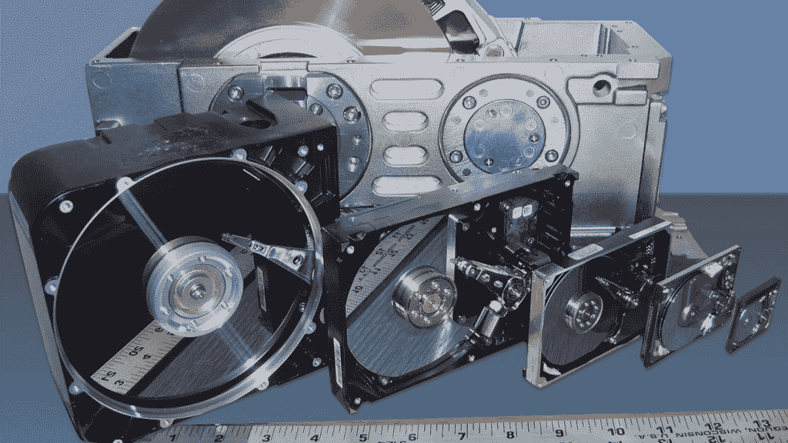
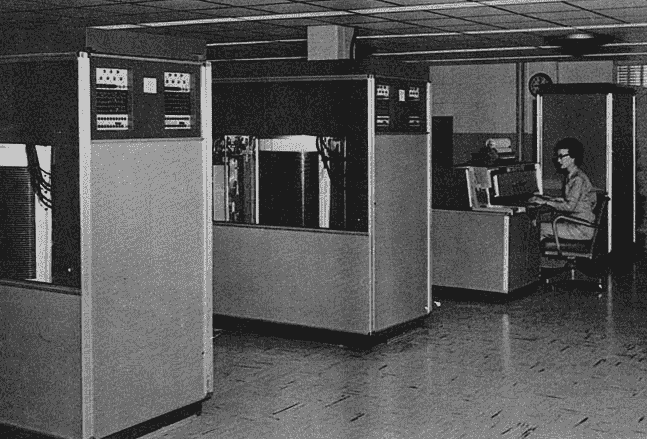
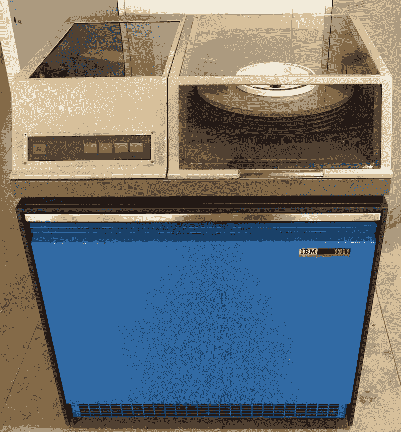
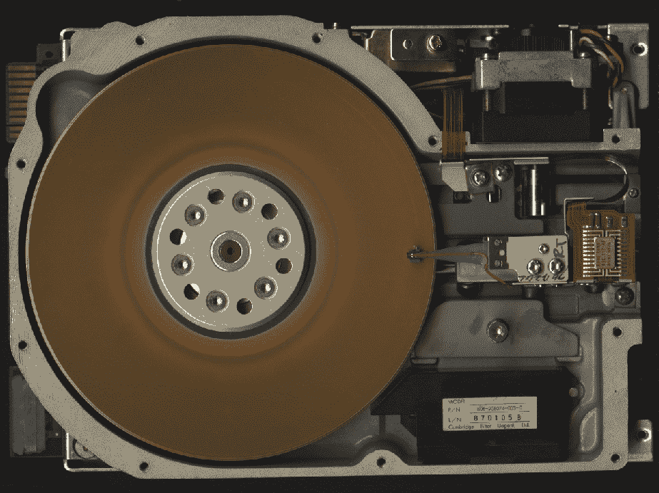
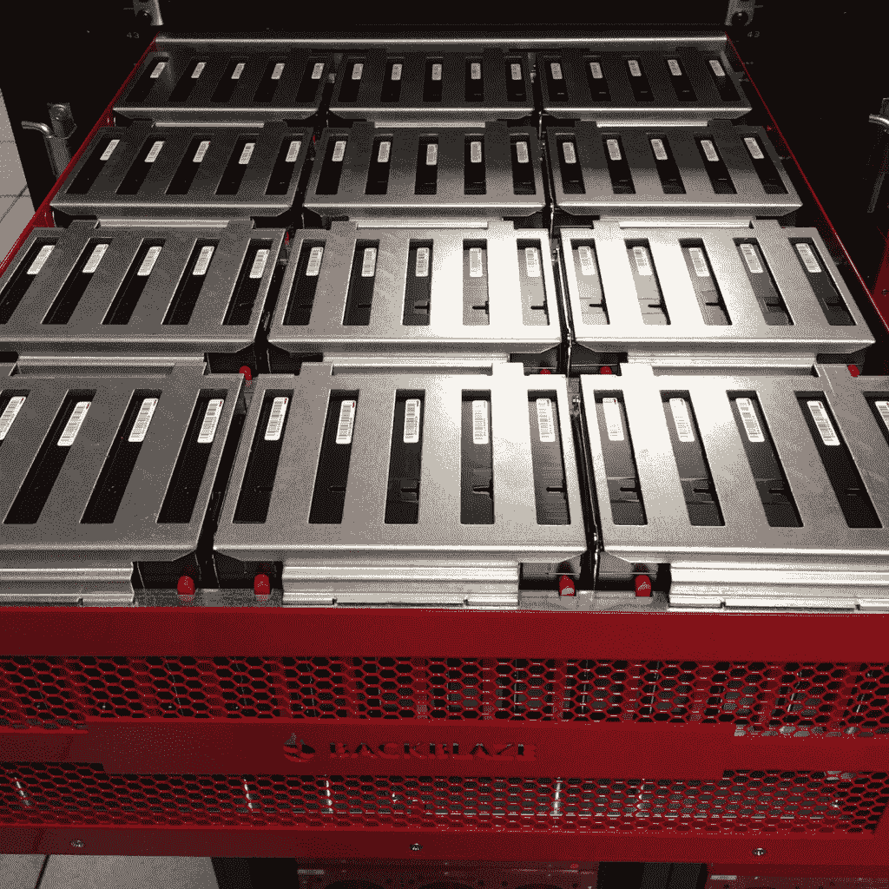
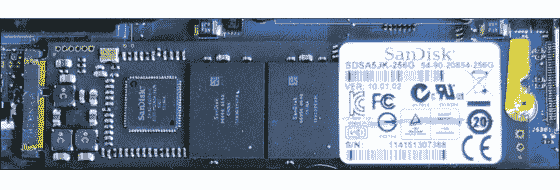

# 硬盘的历史

> 原文：<https://www.backblaze.com/blog/history-hard-drives/?utm_source=wanqu.co&utm_campaign=Wanqu+Daily&utm_medium=website>

[T2】](https://www.backblaze.com/blog/wp-content/uploads/2016/11/history-of-hard-drive.jpg "history-of-hard-drive")

2016 年是历史悠久的硬盘驱动器(HDD)诞生 60 周年。虽然新计算机越来越多地转向固态硬盘(SSD)作为主存储，但 HDD 仍然是低成本、高容量数据存储的冠军。这是我们仍然在储物盒中使用它们的一个重要原因。让我们乘坐 Wayback 机器兜一圈，看看硬盘的历史。让我们也想想未来会怎样。

## 它始于 RAMAC

[T2】](https://www.backblaze.com/blog/wp-content/uploads/2016/11/BRL61-IBM_305_RAMAC.jpeg "brl61-ibm_305_ramac")

IBM 制造了第一台基于硬盘驱动器的商用计算机，并将其命名为 RAMAC——会计和控制随机存取方法的缩写。它的存储系统被称为 IBM 350。RAMAC 很大——它需要一整个房间来操作。仅硬盘存储系统就有两个冰箱那么大。里面堆放着 50 个 24 英寸的盘片。

为此，RAMAC 的客户最终只有不到 5MB 的存储空间，没错，是*兆字节*的存储空间。IBM 的营销人员不想让 RAMAC 存储更多的数据。他们*不知道如何说服客户他们需要更多的存储空间。*

IBM 客户支付了 3200 美元来获得访问和存储这些信息的特权。*一个月*。(IBM 租赁了它的系统。)这相当于 2016 年每月差不多 28000 美元。

六十年前，[数据存储费用](https://www.backblaze.com/blog/cost-of-cloud-storage/)每月每兆字节 640 美元。按照 IBM 1956 年的存储价格，一部新的 iPhone 7 每月要花费 2050 万美元。RAMAC 也很难放进你的口袋里。

## 即插即用

如今，你可以在一张邮票大小的 SD 卡上安装 2TB 的容量，但在半个世纪前，这是一个非常不同的故事。IBM 继续改进早期的硬盘存储，但是系统仍然又大又笨重。

到 20 世纪 60 年代初，IBM 的大型机客户渴望更大的存储容量，但他们没有空间继续安装冰箱大小的存储设备。因此，IBM 的聪明人想出了一个解决方案:可移动存储。

1962 年推出的 IBM 1311 磁盘存储驱动器推动了 IBM 1316 磁盘包的使用，使 IBM 的大型机客户可以根据需要(或负担能力)扩展存储容量。IBM 大幅缩小了磁盘的尺寸，从直径 24 英寸缩小到 14 英寸。9 磅重的磁盘组可以放入一个现代洗衣机大小的装置中。每个包可以容纳大约 2MB。

[T2】](https://www.backblaze.com/blog/wp-content/uploads/2016/11/IBM_1311-1.jpg "ibm_1311-1")

就我而言，我记得在 20 世纪 70 年代中期，当我还是个孩子的时候，参观了一个数据中心，近距离看到了可移动的 IBM 磁盘包。它们看起来和你用来携带生日蛋糕的大小和尺寸差不多:大型密封塑料容器，顶部有把手。

计算机已经从商业世界中昂贵的珍品转变为完成工作所需的日益重要的设备。IBM 的 System/360 被证明是非常受欢迎和有影响力的大型计算机。IBM 创建了不同的模型，但需要跨 360 产品线的灵活存储。因此，IBM 创建了一个标准的硬盘设备互连。其他制造商采用了这项技术，于是一个山寨产业诞生了:第三方硬盘存储。

## 个人电脑革命

直到 20 世纪 70 年代，计算机还是巨大、昂贵、非常专业的设备，只有最大的企业、大学和政府机构买得起。电子元件价格的下降、存储芯片密度的增加以及其他因素催生了一个全新的产业:个人电脑。

最初，个人电脑的存储能力非常有限，几乎可以忽略不计。一些人使用穿孔纸带进行存储。其他人使用录音带。最终，个人电脑会将数据写入软盘驱动器。随着时间的推移，硬盘驱动器的价格下降到足以让个人电脑用户也能拥有一台。

[T2】](https://www.backblaze.com/blog/wp-content/uploads/2016/11/Winchester-Festplatte.jpg "winchester-festplatte")

1980 年，一家名为 Shugart Technology 的年轻新贵公司推出了一款 5MB 硬盘驱动器，设计用于当时的个人电脑。它的直径不足 5.25 英寸。硬盘的价格是 1500 美元。事实证明，它非常受欢迎，成为整个 80 年代个人电脑事实上的标准。舒加特更名为希捷科技。没错。那辆希捷。

在 25 年的时间里，硬盘技术已经从冰箱大小的设备缩小到直径不到 6 英寸的东西。与接下来的 25 年相比，这算不了什么。

## 突袭的出现

Backblaze 背景故事中的一个重要章节出现在 20 世纪 80 年代末，当时来自加州大学伯克利分校的三名计算机科学家在 SIGMOD 会议上提交的一篇研究论文中创造了“RAID”一词，SIGMOD 会议是一年一度的活动，至今仍在举行。

RAID 是廉价磁盘冗余阵列的首字母缩写。这个想法是，你可以把几个独立的存储设备——在这个例子中是硬盘——组合成一个单一的逻辑单元。在多个设备之间分配读写数据的工作可以使数据移动得更快。这也可以降低你丢失数据的可能性。

伯克利的研究人员并不是第一个提出这个想法的人，这个想法自 20 世纪 70 年代以来一直在反复出现。他们*创造了我们今天仍在使用的首字母缩略词。*

[T2】](https://www.backblaze.com/blog/wp-content/uploads/2016/11/blog_60_drives.jpg "60 drives Storage Pod")

RAID 对于 Backblaze 来说至关重要。RAID 是我们构建存储单元的方式。我们最新的[存储盒设计](https://www.backblaze.com/blog/open-source-data-storage-server/)将 60 个独立硬盘组装成四个 RAID 阵列。Backblaze 然后通过实施我们自己的 [Reed-Solomon](https://www.backblaze.com/blog/reed-solomon/) 擦除编码机制在我们的[Backblaze vault](https://www.backblaze.com/blog/vault-cloud-storage-architecture/)上工作，进一步发展了这一概念。

借助我们最新的[存储盒](https://www.backblaze.com/b2/storage-pod.html)设计，我们已经能够将 480TB 的容量压缩到一个占据 4U 机架空间的机箱中，或者说大约 7 英寸的设备机架垂直高度。这与 RAMAC 冰箱大小的 5MB 存储空间相差甚远。事实上，存储容量增加了 9600 万倍。

## 更大、更好、更快、更多

在整个 20 世纪 80 年代和 90 年代，硬盘和个人电脑制造商不断创新，不可逆转地改变了市场。5.25 英寸硬盘很快让位于 3.5 英寸硬盘。(在 Backblaze，我们仍然在存储盒中使用专为现代台式机设计的 3.5 英寸硬盘。)当笔记本电脑越来越受欢迎时，驱动器再次缩小到 2.5 英寸。如果你现在用的是带硬盘的笔记本电脑，很可能是 2.5 英寸的。

对更好、更快、更可靠和更灵活的存储的需求也催生了不同的接口:IDE、SCSI、ATA、SATA、PCIe。驱动器制造商通过提高主轴速度来提高性能，主轴速度是驱动硬盘驱动器的马达速度。每分钟 5，400 转(RPM)是标准转速，但 7，200 转会产生更好的性能。Seagate、Western Digital 和其他公司加大了投入，推出了 10，000 RPM 并最终达到 15，000 RPM 的驱动器。

IBM 是商用硬盘的先驱，几十年来为市场带来了无数硬盘创新。2003 年，IBM 将其存储部门出售给日立。[我们在 Backblaze 使用的许多日立硬盘](https://www.backblaze.com/blog/hard-drive-failure-rates-q3-2016/)可以追溯到 IBM。

## 固态硬盘

即使硬盘驱动器在早期的计算机系统中找到了一席之地，基于 RAM 的存储系统也正在被创造出来。计算机内存的高昂成本、复杂性、尺寸以及保持供电工作的要求，阻止了基于内存的存储以任何有意义的方式流行起来。虽然非常专业，但昂贵的系统在超级计算机和大型计算机市场上得到应用。

最终，非易失性 RAM 变得足够快、可靠和便宜，固态硬盘可以大规模生产，但这仍然是循序渐进的。它们非常昂贵。到 20 世纪 90 年代初，你可以花 1000 美元，或者每兆 50 美元，为一台电脑购买一个 20MB 的固态硬盘。相比之下，旋转硬盘的成本已经降到了每兆 1 美元以下，而且还会进一步下降。

[T2】](https://www.backblaze.com/blog/wp-content/uploads/2012/02/blog-ssd-closeup.jpg "SSD closeup")

真正的突破发生在基于闪存的固态硬盘的推出。到 2000 年代中期，三星、SanDisk 和其他公司向市场推出了闪存固态硬盘，作为硬盘驱动器的替代品。固态硬盘变得更快、更小、更丰富。现在，PC、MAC 和智能手机都包含各种形状和大小的闪存，并将继续朝着这个方向发展。固态硬盘提供更好的性能、更高的能效，并支持更薄、更轻的计算机设计，因此这不足为奇。

古老的旋转硬盘已经有 60 年的历史了，但在每千兆字节的成本方面仍然独占鳌头。SSD 制造商越来越接近与硬盘持平，但他们仍需数年才能达到这一点。一个老式的旋转硬盘仍然给你最好的回报。

不过，我们可以做梦。整个夏天，我们的[安迪·克莱恩](https://www.backblaze.com/blog/author/andy/)开始想知道希捷的新 60TB 固态硬盘在我们的一个存储舱中会是什么样子[。他不得不猜测价格，但根据目前的市场估计，一个基于](https://www.backblaze.com/blog/seagate-60tb-ssd-36pb-storage-pod-next/) [SSD](https://www.backblaze.com/blog/how-reliable-are-ssds/) 的 60 驱动器存储盒将花费 Backblaze 大约 120 万美元。

安迪没有在 Backblaze 的会计部门结交任何朋友，所以这可能不会很快发生。

## 未来

随着计算机和移动设备从硬盘转向固态硬盘，人们很容易将硬盘视为一项即将过时的传统技术。不过，我还是鼓励你谨慎一点。似乎每隔几年，就会有人宣布硬盘报废。与此同时，硬盘制造商一直在寻找保持相关性的方法。

毫无疑问，硬盘市场正处于衰退和转型期。硬盘销量逐年下降。消费者转向固态硬盘，或者完全放弃 MAC 和 PC，更多地在移动设备上工作。

不管怎样，硬盘的创新和发展仍在继续。我们正在用 8TB 硬盘填充我们自己的存储盒[。10TB 硬盘已经上市，甚至更高容量的 3.5 英寸硬盘也即将上市。](https://www.backblaze.com/blog/hard-drive-failure-rates-q3-2016/)

硬盘制造商不断提高面密度，也就是你可以在磁盘上存储的信息量。他们还找到了将更多盘片放入单个驱动机构的方法，然后[用氦气](https://www.backblaze.com/blog/hgst-8tb-drives-helium-makes-them-fly/)填充。遗憾的是，这并没有让硬盘悬浮起来，粉碎了我创造一个 Backblaze 数据中心飞艇的幻想。

那么，SSD 是数据存储的唯一未来吗？暂时不会。希捷仍然坚信硬盘驱动器的未来。其首席财务官估计，硬盘还将存在 15-20 年。研究人员预测，未来十年上市的硬盘将存储比现在多一个数量级的数据——100TB 或更多。

认为这是不可能的？想象一下，在 1956 年，你把一个 10TB 的硬盘交给一个 RAMAC 的运营商，告诉他们手中这个 3.5 英寸的设备比他们面前的那个大盒子多存储 200 万倍的数据。他们会认为你疯了。