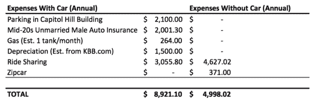
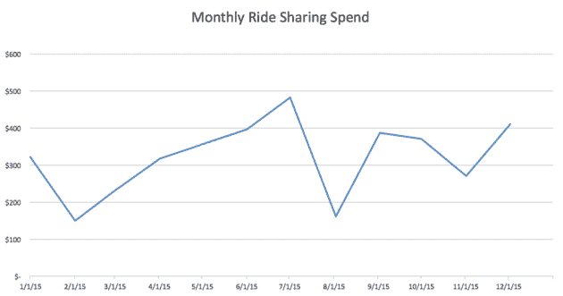

# 我是如何抛弃我的车，去全优步的

> 原文：<http://benjamingilbert.net/how-i-ditched-my-car-and-went-full-uber/?utm_source=wanqu.co&utm_campaign=Wanqu+Daily&utm_medium=website>

*注:本帖原载于 2016 年 3 月 8 日*geek wire 上的

去年 5 月，我终于扣动了扳机:我处理掉了我的车，一辆 2013 款本田思域。作为西雅图著名的国会山社区的居民，我支付了高昂的停车费。此外，作为一名 25 岁左右的未婚男性，保险公司也没有给我任何优惠。出于所有常见的原因，我定期服用 UberX:与朋友见面吃饭、喝酒，或者偶尔去工作。如果我时间不够的话，6 美元的市区乘车费比停车费要便宜得多。

我一直开着我的车去户外探险，去郊区出差，以及理论上的“假设”情景。我算了一下数字，然后开始面对现实:我一年在买车上花了几千美元，而我甚至没有好好利用它。我认为卖掉我的车是值得的，看看我是否能在不牺牲太多我在有车的日子里享受的便利的情况下省钱。我会带着优步去任何地方，并加入 Zipcar 参加那些罕见的远方活动。

自从我去了“全优步”后，我通过不买车每年节省了 4000 美元。

根据 Mint.com 2015 年的数据，这些数字是如何分解的:

Expenses calculated by extrapolating the cost during the months of 2015 with a car and without a car to a full 12 months.

在我的生活中，与拥有汽车相关的压倒性成本是停车费和汽车保险。根据 KBB.com 的折旧计算器，由于折旧，我每年损失 1500 美元。

令人疯狂的是，拼车这一行项目的增长是如此之少。以下是我每月的拼车支出:

[T2】](http://cdn.geekwire.com/wp-content/uploads/2016/03/bengilbert2.png)

除了 8 月份我背包旅行时的大幅下降，我的拼车支出只增长了 50%。大多数时候，当我现在服用优步时，我以前也会服用:去吃饭或喝酒，去市中心开会，或赶去工作。唯一的增量成本来自于我无法走得更远的差事和对打开应用程序更随心所欲的态度；我现在可以称优步是无罪的，所以我在以前不会这样做的边缘情况下这样做。我还加上了一年几辆 Zipcars 的成本，但这相对来说微不足道。

成本节约很大，但我认为最大的好处是生活质量的提高。想象一个世界，在那里你真的永远不用担心停车的问题。酒后驾车是不可能的。在那里，交通时间总是可以用来提高工作效率，或者和朋友去某个地方进行不受干扰的谈话。另一个好处是:我从来不会在交通高峰时被困在方向盘后面。

还有一些其他神奇的东西使这个工作。首先，我们正处于拼车的蜜月期。优步和 Lyft 正在提供疯狂的激励措施，让客户将他们的服务融入他们的日常生活。我有 Capital One Quicksilver 卡，目前在优步购物可以享受 20%的折扣。有一段时间，Lyft 也在西雅图进行了疯狂的促销活动，我在那里享受了 50%的折扣，但这种不可持续的战略似乎已经过去了。在过去的一年里，我大部分的交通时间都是和优步一起度过的，因为它被证明是最可靠的服务，取件时间更短，更不用说它提供的杀手信用卡了。

对此有一些警告。这种生活方式是可能的，因为我在城市生活和工作。它也有，我喜欢称之为，“朋友和家庭税。”我现在无意中依赖我身边的人，因为我再也不能开车去远足或周末旅行了。当然，我可以租我预算的 Zipcar，但是当一个朋友有一辆自己的车时，他们最终只是自愿开车。一天结束时，还有一项成本没有反映在电子表格中:为那些慷慨的志愿者购买的饮料和饭菜。

总而言之，去全优步是一个巨大的净胜利。现在还不是每个人都适合这种方式，但是随着交通运输变得越来越自主(降低成本)，越来越智能地实现规模经济(像优步 Hop 这样的公司)，这种方式可能很快就会实现。

与此同时，如果你考虑遵循这个没有汽车的剧本，这里有一个专业提示:提高你的闲聊技巧。否则你会在尴尬的沉默中开着普锐斯到处跑。