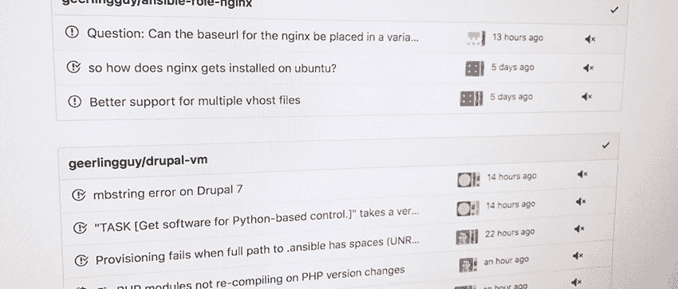

# 我为什么关闭 PRs (OSS 项目维护者笔记)| Jeff Geerling

> 原文：<http://www.jeffgeerling.com/blog/2016/why-i-close-prs-oss-project-maintainer-notes?utm_source=wanqu.co&utm_campaign=Wanqu+Daily&utm_medium=website>

我在 GitHub 和其他地方维护许多开源项目(在撰写本文时已经超过 160 个)。在过去几年中，我已经合并和/或关闭了数千个拉请求(pr)和补丁，我想在这里总结一下我*没有*合并许多 pr 的许多原因。

我的一些项目有共同维护者，但大多数只有我一个人。[总线系数](https://en.wikipedia.org/wiki/Bus_factor)很低，但是我通过授予非常开放的许可和鼓励分叉来抵消它。我还在我的 OSS 项目维护上投入了一定的时间(平均每周 5-10 小时),并且每年有大约 1000 美元的个人预算投入到支持我的项目的基础设施上(遗憾的是，这比大多数使用我的项目投入 OSS 的*盈利性公司都多)。*

我不喜欢在没有合并的情况下关闭一个 PR，因为一个 PR 意味着有人足够喜欢我的项目并做出贡献。但有时这是必要的。我不是想做一个混蛋(我通常会从感谢贡献者开始，试图减轻关闭 PR 的打击)，我只是在确保项目的持续健康。以下是我如何维护我的项目的原则，希望通过阅读它们，你会更加理解为什么我选择关闭 PRs 而不是合并。

## 评估拉取请求的原则

对于我维护的项目(实际上，对于我工作的大多数软件来说)，我认为以下原则是最重要的，如果 PR 不符合这些原则，我通常会关闭它:

### 所有东西都应该通过自动化测试

我维护的几乎每个项目都至少全面覆盖了 Travis CI、Jenkins 或其他 CI 系统中的“快乐之路”。如果你打破我的测试，我就打破你的脸。除了极少数例外，如果所有测试都没有通过，我不会合并一个 PR。我也不会合并有大量新的，未经测试的功能的 PRs。我不要求 100%的单元测试覆盖率，但是所有快乐的路径都应该被测试。

### 维护能力>完整性

我不是迎合所有人。我通常迎合自己。对于我 98%的 OSS 项目，我实际上是在生产中使用它们(通常是几十或几百个项目)。所以我对他们的现状很满意。我不会添加增加我的维护负担的东西，除非它是非常引人注目的功能或明显的错误修复。我不能维护一个我不完全了解的系统，所以我喜欢保持事情更轻松，减少边缘案例，而不是增加我没有时间偿还的[技术债务](http://martinfowler.com/bliki/TechnicalDebt.html)。

### 迎合 80%的用例

我看到很多一次性功能的 PRs，这是我个人从未见过的。确实有一些独角兽系统需要在一些不知名的应用程序中配置复杂的细节...但是我不打算在我的项目中包含这样的代码，因为(a)我不使用它，所以我不能保证它，以及(b)它增加了维护开销——即使它是一个“简单”的增加。如果你是独角兽之一，请叉我的作品。我不会生气的！我的公共项目几乎总是旨在解决[最常见的问题](https://en.wikipedia.org/wiki/Pareto_principle)；我试图通过分叉或扩展我的工作来使它更容易深入。

### 使用正确的语法

通常，我在自动化测试中内置了自动语法检查。但当我不这样做时，请确保基本的东西，如间距、变量命名约定、行尾、[空格而不是制表符](https://www.youtube.com/watch?v=SsoOG6ZeyUI)，等等，都遵循项目的一般风格。我会经常合并代码，然后自己修改风格，但不这样做更好，我更愿意合并没有风格怪癖的 PR。

### 不要改变建筑

(除非先在某期讨论。)

我曾经有过 PRs，其中整个项目架构或者测试架构被换出。我永远不会合并这样的东西，除非它已经在一个问题中被彻底讨论(和批准)过。事情之所以是现在这个样子，通常是有原因的(事实上，有很多原因)。我并不是说我的架构或测试平台总是*正确的*，但是我不会加入那些让我更难理解我自己的项目如何工作的大规模变化。

### 一次修改不要超过 50 行代码

(除非你有非常充分的理由。)

我经常收到有人提交 PR 的通知，我跳过去查看它，我看到 20 个文件发生了变化，在 12 次提交中添加了 800 行代码。如果这是以前在某个问题中讨论过的架构变化，我可以理解这样的大型 PR，我会花时间通读它。但是任何超过 50 行的修改，我的大脑都没有能力在不到一个小时内完成一次好的代码审查。

## 结论:“否”是默认设置

关于这个过程的最大讽刺之一是，一些打开问题和随后的 pr 并且是最难解决的人是那些希望在他们自己的项目中解决一个问题，但是在代码被合并后会立即消失的人。他们意识到(通常不会明确地意识到)如果他们能说服*我*维护他们的雪花代码，他们就能省去持续的技术负担。

如果贡献者愿意与项目建立长期关系，我愿意放弃对架构的一些控制。但是他们必须证明我可以信任他们。我所启动项目的一些最佳贡献者是那些在他们的盈利性工作中使用项目的人，但他们每周贡献一两个小时来帮助处理问题队列，关闭无效问题，并提交 PRs 进行简单的 bug 修复(特别是与他们最熟悉的项目部分相关)。

对任何维护 OSS 项目的人来说:确保你有一套完善的原则来评估 PRs。当一份公关不符合你的标准时，你可以随意说“不”。如此多的项目由于接受了太多的新特性而没有评估它们的长期可维护性而偏离了轨道，而这个问题可以通过一个简单的两个字母的单词来避免。