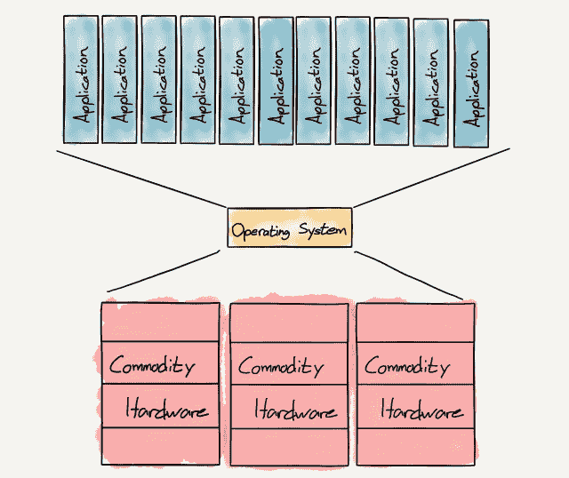

# Alexa:亚马逊的操作系统——本·汤普森的战略

> 原文：<https://stratechery.com/2017/amazons-operating-system/?utm_source=wanqu.co&utm_campaign=Wanqu+Daily&utm_medium=website>

操作系统的概念非常简单:它是一个管理计算机的软件，使软件可以通过一组一致的接口访问计算机的硬件资源。

[T2】](https://i0.wp.com/stratechery.com/wp-content/uploads/2017/01/FullSizeRender.jpg?ssl=1)

操作系统对科技公司有着特殊的吸引力，因为它具有独特的属性，位于图表的中心:

*   首先，通过将硬件抽象化，操作系统将硬件提供商的竞争降低到纯粹的性能(与锁定相对)。从短期来看，这增加了硬件提供商之间的竞争，这有利于操作系统，从长期来看，当性能变得“足够好”时，硬件实际上已经商品化，允许操作系统获取价值链中的大部分利润。
*   第二，通过为软件提供一套一致的接口，操作系统产生了网络效应:操作系统的用户越多，为该操作系统开发的软件应用程序就越多；这反过来又推动了更多的用户，进一步增加了开发商的潜在市场。从长远来看，这导致开发者和用户都被锁定。
*   第三，根据定义，操作系统与最终用户有直接的界面，拥有用户关系对于它在整个生态系统中创造的杠杆作用来说是非常有价值的。

技术的大部分历史，尤其是在消费者领域，都与拥有操作系统有关。

#### Windows:完美的商业模式

当然，最著名的操作系统是 Windows，它仍然是拥有一个操作系统是多么强大的最好例子:

*   Windows 培养并受益于个人电脑中几乎每一个硬件的竞争，导致性能的大幅提升和价格的大幅下降。
*   与此同时，[由于 IBM](https://stratechery.com/2013/apple-open-and-learning-from-history/) ，Windows(确切地说是 DOS，Windows 的命令行界面驱动的前身)成为了企业的默认操作系统，这意味着开发者几乎立刻就有了一个巨大且快速增长的市场，这在我上面描述的良性循环中增加了 Windows 的吸引力。
*   然后，Windows 利用其用户所有权建立了另外两大业务:首先是 Office 系列，然后是 Windows Server 系列产品。

最终结果是有史以来最完美的商业模式之一:商品化的硬件供应商竞相让 Windows 电脑更快更便宜，而软件开发商同时让同样的 Windows 电脑更强大，更难离开。而且，一直以来，微软收取的授权费基本都是纯利润。 [1](#fn1-2396 "Remember, software has basically no marginal costs")

#### 移动操作系统

在移动领域，微软试图重施故技，结果却被谷歌的安卓抢走了市场，安卓不仅比 Windows Mobile 更好，而且免费；对谷歌来说不幸的是，Android 在确保微软永远无法从移动操作系统的瓶颈中获利的目标上是如此成功，以至于谷歌自己在赚钱时也受到了阻碍。Android 提供了有价值的数据，并间接为谷歌基于搜索的利润引擎做出了贡献，但它远不如 Windows。

与此同时，苹果一直有一种不同的商业模式:销售硬件。不过，这种硬件因其自己的操作系统而有所不同；由于智能手机市场的巨大规模，这使得其收入和利润远远超过了鼎盛时期的微软，但这种模式比 Windows 的模式更加脆弱:苹果不仅要承担制造硬件的固有风险，而且根据定义，只能拥有市场的少数份额。首先，没有一家公司能够为世界生产足够多的手机，其次，为每一个客户服务会毁掉使商业模式如此成功的利润率。推而广之，这意味着 Android 的双头垄断，导致大多数开发者服务于两个市场；苹果仍有一条护城河，但它远不如微软过去那么深。

#### 谷歌和互联网操作系统

消费者操作系统的简史并没有看起来那么完整:Android 和 iOS 已经取代了 Windows 的重要性，但事实上，早在史蒂夫·乔布斯(Steve Jobs)于 2007 年开启现代智能手机时代之前，Windows 就已经失去了它的锁定地位。互联网使得用来访问互联网的电脑操作系统变得无关紧要，互联网上最具统治地位的公司是谷歌。

当然，根据严格的定义，谷歌不是一个操作系统，但实际上谷歌是互联网的操作系统。考虑我上面提到的操作系统的质量:

*   虽然可以通过输入 URL 直接访问网站，但在实践中，桌面时代的大多数网站都是通过搜索访问的，类似于通过通用操作系统访问计算机硬件。而且，正如硬件供应商别无选择只能将自己商品化一样，网站别无选择只能尽可能地让自己对谷歌友好。
*   开发者和用户之间的相互作用创造了一个良性循环，这个循环创造了 Windows 锁定；在谷歌的例子中，相互作用是在用户和他们产生的数据之间。假设你有两个完全相同的搜索引擎，给一个 51%的搜索，给另一个 49%:前者会比后者稳定地变得更好，仅仅是因为有更多的数据可以迭代。谷歌的现实要极端得多:该公司一开始就比竞争对手拥有技术和工程优势，这为它赢得了市场份额，随后又为它提供了进一步提高质量领先优势的数据，为它赢得了更多的市场份额；最终结果是建立在用户选择上的垄断。
*   随着时间的推移，谷歌利用其与用户的关系建立了自己的产品套件，或者在许多情况下，收购公司给了它新的增长机会。

得益于“操作系统”的新商业模式:广告，谷歌能够负担得起这些收购。广告对于传统的计算机操作系统来说没有多大意义，因为它们需要成为应用程序的平台——没有广告的空间。然而，谷歌是一个吸引注意力的平台，而不是应用程序，而注意力正是广告商所渴望的。从这个意义上来说，商业模式并没有太大的不同:操作系统是价值链的瓶颈，钱总是流向这个瓶颈。

#### 脸书的幸运之旅

在移动领域，最重要的瓶颈是脸书(以及中国的微信):普通用户每天在脸书、Messenger 和 Instagram 上花费近一个小时，结果是可以预见的:

*   脸书的“供应商”，在这种情况下是出版商，已经完全商品化，不仅把他们的内容放在脸书，甚至使用脸书的首选格式；他们别无选择。
*   脸书的网络效应可能是最直接的:它是你认识的人(这是 Snapchat 如此具有威胁性的原因之一)。
*   脸书对用户的所有权也通过其商业模式得到回报:脸书不仅拥有近 20 亿人的关注，它还拥有比任何公司都更好的关于我们是谁和我们喜欢什么的数据；毕竟是我们自己告诉公司的。

脸书在移动领域的主导地位之所以如此迷人，是因为从很多方面来看，这都是一个幸运的意外:桌面上的脸书设计成更类似于计算机操作系统的东西，抽象出底层操作系统，并在其上构建应用平台。而且，当手机崛起时，脸书试图打造自己的手机，并确信这是拥有用户的唯一途径。

正如我刚才提到的，应用平台与基于广告的商业模式根本不兼容；推而广之，基于广告的业务不一定与它运行的操作系统相冲突。以谷歌为例，该公司是在 Windows 平台上发家的；iOS 和 Android 的统治地位使得脸书只是一个应用程序，这是该公司可能发生的最好的事情。

#### 亚马逊手机故障

亚马逊犯了和脸书一样的错误:确信它需要自己的操作系统和直接接触用户，公司[制造了历史上最差的手机之一](https://stratechery.com/2014/amazons-whale-strategy/)。由于各种原因，该产品被误导了，其中大部分原因是可以预见的:iOS 和 Android 可能是双头垄断，但他们共享的开发者锁定可以说不亚于 Windows(正如微软自己发现的)。

更重要的是，亚马逊试图通过硬件和操作系统的差异化来销售手机，就像苹果一样，但该公司在组织和文化上与 iPhone 制造商有着天壤之别。你不会因为你真的想制造好产品而制造好产品，你会通过创造制造好产品的条件来制造好产品，而亚马逊[根深蒂固的模块化和服务文化](https://stratechery.com/2016/the-amazon-tax/)完全不适合打造高度差异化的实体产品。

然而，让亚马逊成为如此令人印象深刻的公司的一个原因是模块化和多重押注的意愿:2014 年 10 月 24 日，亚马逊对 Fire Phone 业务进行了 1.7 亿美元的冲销；两周后，该公司推出了亚马逊 Echo。

#### 亚马逊的操作系统

[很明显，在第一天【the Echo 比 Fire Phone 更有吸引力:](https://stratechery.com/2014/daily-update-initial-thoughts-microsoft-office-amazon-echo-wirelurker/)

*   实体设备(Echo)只是亚马逊新的个人助理 Alexa 的一个管道。至关重要的是，Alexa 是一项云服务，亚马逊在文化、组织结构和体验方面非常适合这项服务的发展。
*   Echo 创造了自己的市场:一个基于语音的家庭个人助理。至关重要的是，在家里，智能手机不一定是最方便的设备，也不一定是最简单的输入法:通常情况下，你的智能手机正在充电，与设备交谈不会像在其他地方那样带来社交负担。
*   有一个生态系统需要组装:越来越多的“智能”产品，从灯泡到开关，正在上市，但几乎每个试图成为联网家庭核心的公司都依赖于智能手机。

亚马逊抓住了机会:首先，Alexa 从第一天起就非常精通，特别是在速度和准确性方面(这两个因素在鼓励经常使用方面比回答琐事问题的能力重要得多)。然后，该公司迅速采取行动，从两个方向构建其生态系统:

*   首先，该公司创建了一个简单的“技能”框架，允许智能设备连接到 Alexa，并通过相对严格的口头框架进行控制；在真空中，它不如 Siri 解释自然语言的尝试优雅，但实现起来要简单得多。在去年的 CES 上，回报已经很明显了: [Alexa 的支持无处不在](http://www.theverge.com/2016/1/7/10719202/amazon-alexa-ces-2016-takeover-smart-home)。
*   其次，“Alexa”和“Echo”是不同的名字，因为它们是不同的产品:Alexa 是语音助手，很像 AWS 和 Amazon.com， [2](#fn2-2396 "To be clear, AWS was <em>not</em> built using spare Amazon.com capacity, but was built to provide a services infrastructure for Amazon.com") Echo 是 Alexa 的第一个客户，但几乎不是它的唯一客户。今年 CES 的公告主要是运行 Alexa 的产品，包括 [direct Echo 的竞争对手](https://www.cnet.com/products/lenovo-smart-assistant-with-amazon-alexa/)、[灯](https://www.cnet.com/products/c-by-ge-lamp-with-alexa/)、[机顶盒](https://www.cnet.com/news/dont-lift-a-finger-let-amazon-alexa-change-the-channel/)、[电视](http://variety.com/2017/digital/news/amazon-tv-4k-fire-tv-westinghouse-1201951335/)，还有[更多](http://variety.com/2017/digital/news/amazon-tv-4k-fire-tv-westinghouse-1201951335/)。

简而言之，亚马逊正在构建家庭操作系统——它的名字叫 Alexa——它拥有你可能期望的操作系统的所有品质:

*   各种硬件厂商都在排队打造支持 Alexa 的设备，不可避免地会互相竞争以提高质量和降低价格。
*   越来越多的设备和电器正在接入 Alexa 易用灵活的框架，这为护城河创造了条件:电器比软件贵得多，而且更耐用，这意味着每个购买使用 Alexa 的东西的人都不太可能更换

这就剩下了商业模式，这可能是亚马逊最大的优势:谷歌[没有真正的语音业务](https://stratechery.com/2016/google-and-the-limits-of-strategy/)，苹果[目前正在为 iPhone 和 Apple Watch 缴纳战略税](https://stratechery.com/2016/amazon-echo-expand-the-nest-failure-microsoft-and-slack/)；如果它在未来开发 Siri 设备，它可能会获得可观的利润率。

与此同时，亚马逊不需要在 Alexa 上赚一分钱，至少不需要直接赚:绝大多数购买是在家里发起的；今天，这可能意味着创建一个购物清单，但在未来，这将意味着订购交付的东西，对于 Prime 客户来说，未来已经到来。Alexa 只是让这变得更容易，进一步推进亚马逊成为物流提供商的目标——基本上为所有人和所有事提供[和](https://stratechery.com/2016/the-amazon-tax/)。

### *相关*