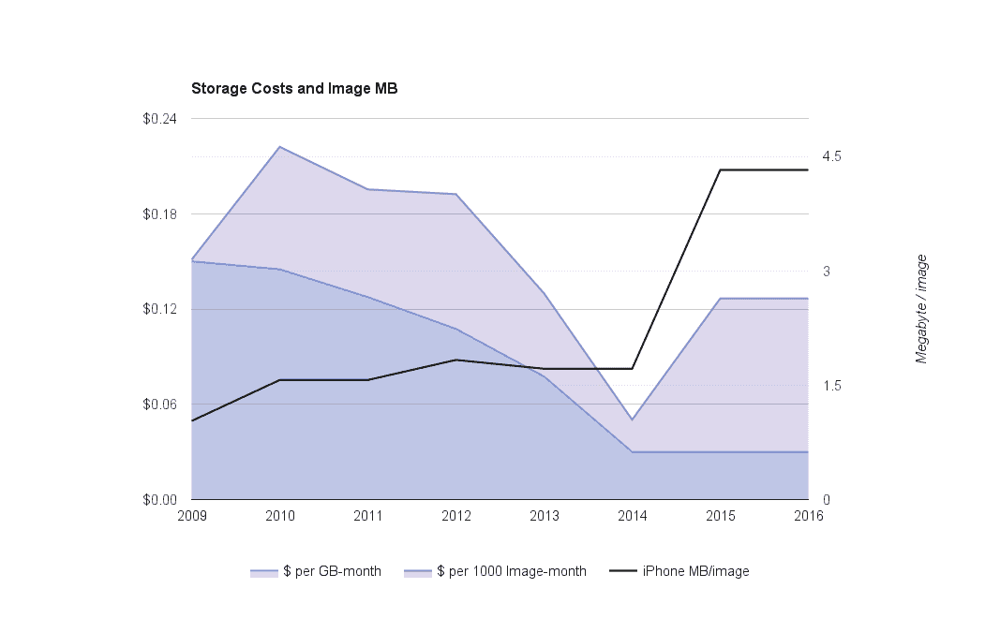
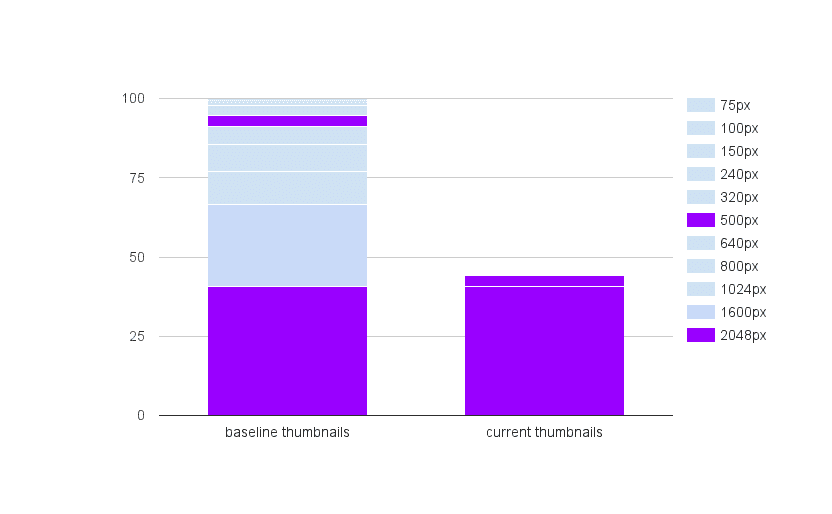
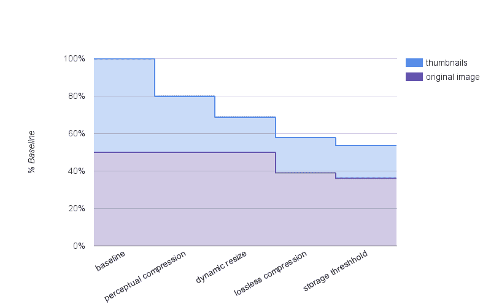

# 没有字节的一年| code.flickr.com

> 原文：<https://code.flickr.net/2017/01/05/a-year-without-a-byte/?utm_source=wanqu.co&utm_campaign=Wanqu+Daily&utm_medium=website>

运营 Flickr 这样的服务的最大成本驱动因素之一是存储。我们已经描述了多年来降低这一成本的多种技术:使用 [COS](https://yahooeng.tumblr.com/post/116391291701/yahoo-cloud-object-store-object-storage-at) 、[在 GPU 上动态创建大小](http://code.flickr.net/2015/06/25/real-time-resizing-of-flickr-images-using-gpus)和[感知压缩](http://code.flickr.net/2015/09/25/perceptual-image-compression-at-flickr/)。这些项目非常成功，但我们的存储成本仍然很高。
在 2016 年年初，我们挑战自己更进一步——在一整年内不需要新的存储硬件。使用多种技术，我们达到了目的。

## 成本故事

一点粗略的计算表明，存储成本是一个真正的问题。在流量非常高的一天，Flickr 用户上传了多达 2500 万张照片。这些照片平均每张需要 3.25 兆字节的存储空间，总计超过 80tb 的数据。天真地存储在类似于 S3 的云服务中，这一天的数据每年将花费超过 30，000 美元，并且每年都会继续产生成本。

一个非常大的服务将拥有超过 2 亿的活跃用户。以每一千张图像计算，类似于 S3 的存储服务每年将花费超过 2.5 亿美元(或 1.25 美元/用户年)，外加网络和其他费用。随着新用户注册和现有用户继续加速拍照，这种情况变得更加复杂。幸运的是，我们的成本，以及每个大型服务的成本，与天真地储存在 S3 不同，但仍然很可观。

 每字节成本有所下降，但来自 iPhone 类平台的每张图片的字节数有所增加。每张图像的成本没有显著变化。 

随着时间的推移，存储成本会下降。例如，S3 成本从 2009 年的每月每千兆字节 0.15 美元下降到 2014 年的每月每千兆字节 0.03 美元，云存储供应商为不常访问的数据添加了低成本选项。NAS 供应商也大幅降低了价格。

不幸的是，这些每字节的低成本*被其他力量抵消了。在 iPhones 上，提高相机分辨率、连拍模式和添加短动画(实时照片)已经快速增加了每张图片的字节数，足以保持每张图片的存储成本*大致不变。而 iPhone 的图片远不是最大的。**

为了应对这些成本，照片存储服务已经追求多种产品选择。举几个例子:存储较低质量的图像或重新压缩，向用户收取数据使用费，整合广告，销售相关产品如印刷品，以及将存储与手机购买捆绑在一起。

也有许多控制存储成本的工程方法。我们勾画了一些，并涵盖了我们在下面实施的三个:调整我们的存储系统的阈值，将现有的节省方法推广到更多的图像，以及部署无损 JPG 压缩。

## 调整存储阈值

随着我们对这个问题的深入研究，我们详细研究了我们的存储系统。我们发现，我们的设置是基于对高写入和删除负载的假设，但这并不成立。我们的存储相当静态。一旦上传，用户很少删除或更改图片。我们还有两个不同的以防万一空间。我们的存储中有 5%是为快照保留的空间，这对撤销意外删除或写入非常有用，还有 8.5%是保留的空闲空间。这导致我们大约 13%的存储未被使用。行业经验表明，磁盘应该保持 10%的空闲空间以避免性能下降，但是我们发现 5%对于我们的工作负载来说已经足够了。因此，我们将两个以防万一的区域合并为一个，并将自由空间阈值降低到那个水平。这是我们解决这个问题最简单的方法(到目前为止)，但是它带来了巨大的收益。通过几处简单的配置更改，我们释放了超过 8%的存储空间。

 调整存储阈值 

## 扩展现有方法

在我们之前的帖子中，我们已经描述了缩略图大小的动态生成和感知压缩。结合这两种方法将缩略图存储需求降低了 65%，尽管我们在 2014 年之前上传的许多图像中没有应用这些技术。一个很大的原因是:对旧文件的大规模更改本身就有风险，并且需要大量的时间和工程工作来安全地完成。

因为我们担心动态缩略图生成的进一步推出会给我们的调整大小基础设施带来沉重的负担，所以我们只针对不太受欢迎的图像的缩略图进行删除。使用这种方法，我们能够仅用四个 GPU 来处理完整的调整大小负载。该过程给我们的存储系统带来了沉重的负担；为了最大限度地减少影响，我们跨卷随机化了我们的操作。整个过程花费了大约四个月的时间，比我们的存储阈值调整带来的收益更大。

 缩略图尺寸数量递减 

## 无损 JPG 压缩

Flickr 长期以来一直致力于保持上传图片的完整无损。这为我们能够减少多少存储空间设置了一个底线，但是有一些工具可以无损压缩 JPG 图像。两个众所周知的选项是 Dropbox 的 [PackJPG](http://www.elektronik.htw-aalen.de/packjpg/) 和[轻子](https://blogs.dropbox.com/tech/2016/07/lepton-image-compression-saving-22-losslessly-from-images-at-15mbs)。这些工具的工作原理是解码 JPG，然后使用更有效的方法非常仔细地压缩它。这通常会使 JPG 收缩约 22%。从 Flickr 的规模来看，这意义重大。缺点是这些重新压缩器使用大量的 CPU。PackJPG 在单核上以大约 2MB/s 的速度压缩，或者对于一个价值 1pb 的 JPG 大约需要 15 个核年。Lepton 使用多个内核，速度为 15MB/s，比 packJPG 快得多，但使用的 CPU 时间大致相同。

这种 CPU 需求也使按需服务变得复杂。如果我们重新压缩 Flickr 上的所有图像，我们可能需要数千个内核来处理我们的解压缩负载。我们考虑对访问压缩图像设置一些限制，比如要求用户登录才能访问原始图像，但最终发现，如果我们只针对很少访问的私有图像，解压缩只会偶尔发生。此外，限制我们压缩的图像的最大尺寸限制了我们每次解压缩的 CPU 时间。我们将其作为现有服务堆栈的一个组件推出，不需要任何额外的 CPU，对用户体验的影响也很小。

对用户的原始照片进行无损压缩可能是我们风险最高的方法。我们可以轻松地重新创建缩略图，但损坏的源图像无法恢复。我们方法的关键是一个重新压缩-解压缩-验证策略:在删除未压缩的源图像之前，每个重新压缩的图像都被解压缩并与其源图像进行比较。

这仍然是一项正在进行的工作。我们已经压缩了许多图像，但是完成整个语料库是一个漫长的过程，我们已经在年中达到了零新存储设备的目标。

## 在计划阶段

我们有几个其他的想法，我们已经研究过，但还没有实施。

在我们当前的存储模式中，我们为每幅图像都准备了原件和缩略图，分别存储在两个数据中心。该模型假设图像需要在任何时间点相对快速地可见。但不活动超过几个月的帐户的私人图像不太可能被访问。我们可以“冻结”这些图像，删除它们的缩略图，并在休眠用户返回时重新创建它们。对于一个典型的帐户来说，这个“解冻”过程不到 30 秒。此外，对于私人(但不是休眠的)照片，我们可以转到每个缩略图的单个未压缩副本，将压缩副本存储在第二个数据中心，该数据中心将根据需要进行解压缩。

我们甚至可能不需要磁盘上每个休眠原始图像的两个副本。我们已经拟定了一个模型，在这个模型中，我们将一个拷贝放在一个速度较慢但未得到充分利用的基于磁带的系统上，而将另一个拷贝留在磁盘上。这将降低停机期间的可用性，但由于这些图像属于休眠用户，影响将是最小的，用户仍然可以看到他们的缩略图。这里的微妙之处在于数据的放置，因为磁带系统上的寻道非常慢。根据构成“休眠”照片的细节，这些技术可以轻松减少 25%以上的存储空间。

我们还研究了重复数据消除，但我们发现重复率在 3%的范围内。用户在他们的设备上确实有许多他们自己的*图像的副本，但是这些被我们的上传工具排除了。我们还研究了使用替代图像格式来存储缩略图。 [WebP](https://developers.google.com/speed/webp/) 可以比普通的 JPG 更紧凑，但我们使用感知压缩让我们接近 WebP 字节大小，并允许更快的调整大小。 [BPG](http://bellard.org/bpg/) 项目提出了一个*大大小于*的基于 H.265 的编码，但是有 IP 和其他问题。*

有几个类似的视频优化可用。尽管 Flickr 主要关注图像，但视频通常比图像大得多，占用的存储空间也大得多。

## 结论

 优化过几个版本 

自 2013 年以来，我们优化了近 50%的存储使用。我们最近的努力帮助我们在没有购买任何额外存储的情况下度过了 2016 年，我们仍然有几个可用的选项。

Peter Norby、Teja Komma、Shijo Joy 和 Bei Wu 组成了我们零存储预算项目的核心团队。许多其他人协助这项努力。