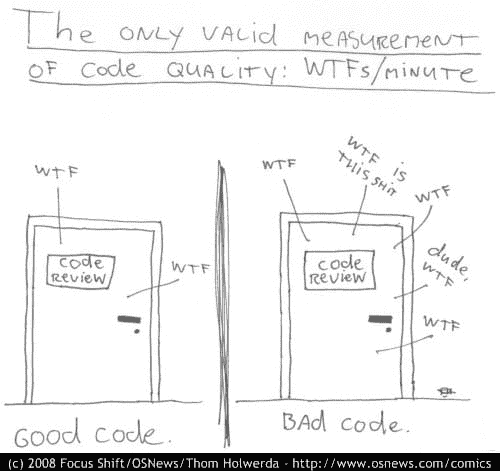
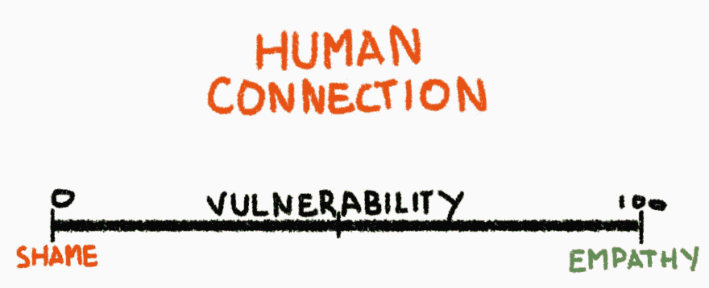

# 软件行业的羞辱仪式——开发社区👩‍💻👨‍💻

> 原文：<https://dev.to/pavsaund/rituals-of-shaming-in-the-software-industry?utm_source=wanqu.co&utm_campaign=Wanqu+Daily&utm_medium=website>

软件开发人员的职业生涯可能会很坎坷。从一开始，你就面临着你不知道如何解决的技术挑战。有些人很容易掌握概念和原理，而另一些人则很难。这是一个不断学习的艰难过程。不断的失败，成功只差一个分号。

在这个过程中，最大的挑战不是技术上的，而是社会上的。在每个转弯处，你都会发现新的奇迹和新的挑战。当你开始一项新的工作或职位时，发布一篇博客文章，提交一个拉动式请求，甚至制作一个产品。会有人排着队告诉你，你错得有多离谱，结果是；你怎么不够好。我是来告诉你，你是！

我不是羞耻、同情或脆弱方面的专家，但我有一个声音和一个提高意识的渠道。阅读时请记住这个意图。

## 羞耻和内疚

内疚和羞耻是一个硬币的两面。它们从相似的地方产卵，但是有完全不同的结果。让我们进入定义。

> 有罪:对犯罪负责的事实；道德罪责- [免费字典](http://www.thefreedictionary.com/guilt)
> 
> 羞耻:一种痛苦的情绪，这种情绪是由于相信自己因为自己的行为、思想、环境或经历而低人一等，或被他人认为低人一等，不值得喜爱或尊重- [免费字典](http://www.thefreedictionary.com/shame)

换句话说，内疚是对自己的所作所为感到难过。羞耻是对自己的身份感到不舒服。

负罪感是你能感同身受并从中吸取教训的东西，而羞愧会让你质疑自己的价值。

在整个软件开发中，羞耻和内疚被用作一种强大的破坏性力量。开发人员在社交媒体、问答和其他在线平台上争论并居高临下地发言。他们以极高的标准要求他人，并在他们没有达到标准时让他们知道。他们还确保不仅让你知道你的工作不够好，而且你也不够好。

## 软件行业的惯例

### 打破构建

[T2】](https://res.cloudinary.com/practicaldev/image/fetch/s--i3Uo6d23--/c_limit%2Cf_auto%2Cfl_progressive%2Cq_auto%2Cw_880/http://codingwithempathy.com/wp-content/uploads/2017/01/Breaking-build-shame-rituals.jpeg)

标准是对软件项目进行某种持续集成(CI)或部署设置(CD ),以监控开发人员的每次签入。CI 过程通常在最终的构建工件上构建并运行测试，以在不同的时间间隔验证其完整性。

许多团队都有某种仪式，在这种仪式中，提交了破坏构建的变更的开发人员会被公开点名。也许是在团队聊天时，或者你需要戴一顶有趣的帽子或服装。

被称为破坏构建的人可能会让人感到不安。一两次可能会很有趣，但当它变成一场相互指责的游戏时，你就开始对此产生抵触情绪了。也许你开始对你的编码方式变得很保守？也许你变得太有防御性，你不想学习新的东西？也许当下一个人打破了构建，你可以跳到他们身上，把他们叫出来？

年轻的开发人员可能会因为专注于不破坏东西而崩溃，并错过宝贵的学习机会。这里有一个反映这一点的故事:“[当你打破了夜间构建](http://softwareengineering.stackexchange.com/questions/79041/how-to-apologize-when-you-have-broken-the-nightly-build)时如何道歉”。

### 拉式请求和代码审查

[T2】](http://www.osnews.com/story/19266/WTFs_m)

通过任何[拉动请求](http://codingwithempathy.com/2017/01/03/adding-empathy-pull-requests/)或[代码审查](http://codingwithempathy.com/2016/09/27/long-live-code-reviews-code-reviews-dead/)，你都是在向他人展示你的工作，让他们进行评估并给出反馈。问题是当代码审查被用作看门人的功能，并由高级开发人员根据他们自己的偏好来管理标准时。评论的范围可以从“我这辈子从没见过这么糟糕的代码”到“不够好”。

我完全支持[坦率的反馈](http://codingwithempathy.com/2016/08/16/communicating-with-candor-when-honesty-alone-isnt-enough/)，但是当一个开发者在提交代码时受到骚扰，那么你就是在羞辱他们。此外，由于被审查的工作是由开发人员直接产生的，因此很容易将他们与“他们是糟糕的开发人员”联系起来。完全错过了一个学习机会。

### 如果你不做 X，你就不是一个好的开发者

软件开发是一个发展速度极快的领域，因此许多人都在疲于应付。一方面，有这么多的编程语言。另一方面，有很多技术和实践需要学习。

> “如果你不做 TDD，你就不是一个好的开发者”——互联网上的一些开发者

当你将这种过多的选择与基于你不知道的事情表明你作为开发人员的价值低于标准的陈述结合起来时，那么这只是在等式上增加了另一层耻辱。

### 传统模式

许多开发人员认为遗留代码是一种浪费，应该感到羞耻并不惜一切代价避免。因此，任何已经存在了一定时间的代码，无论是否经过测试，都会成为遗留代码。这种态度表明，你羞愧地相信遗留代码是不好的，然后它可以被用作警告。

> "你现在不想写遗留代码，是吗？"斯科特·福特(谈到羞耻)

代码在生产中已经并正在交付价值，这绝对没有错。这可能不容易理解，但是是什么让你认为你的代码在 5 年后对下一个开发者来说是可以理解的呢？实际上，你写的代码有可能在 5 年内被使用吗？

### 在我们的工具中——git 责备

甚至我们的工具也带有负面的语气，比如`git blame`。Git 是一个很棒的版本控制系统，它允许你以分布式的方式制作很棒的软件。命令很简单，但功能强大，似乎有一种方法可以用该工具做几乎任何事情。

其中一个命令`git blame`，在试图找出谁写了一行代码时特别有用。这里的问题是措辞。你甚至在谈论做这件事的开发者之前，就已经假定了责备的心态。也许与开发者交谈是你的下一步，然后你会带着你内心深处的“责备”离开。这反过来会改变谈话的情绪或语气。只是一个工具里的一个词，但这个词本身是有分量的。

## 多样性

科技行业的多样性受到了很多关注，有正面的也有负面的。然而，还有很长的路要走。当阅读关于人们为什么退出科技行业的文章时，很容易认为“他们不够强硬”或“他们只是在抱怨”。

来自典型少数族裔背景的人很有可能在进入这个行业之前就已经背负着耻辱。当遇到上述排外文化时，有些人决定离开就不足为奇了。

## 用脆弱扑灭耻辱

[T2】](https://res.cloudinary.com/practicaldev/image/fetch/s--E6nMwj8e--/c_limit%2Cf_auto%2Cfl_progressive%2Cq_auto%2Cw_880/http://codingwithempathy.com/wp-content/uploads/2017/01/Human-connection.jpeg)

布伦布朗博士是一名可耻的 T4 漏洞研究员，他已经花了数年时间深入研究这些难题。她把自己的发现写在书中，并在 [TED 演讲中分享。](https://www.ted.com/speakers/brene_brown)

根据布朗博士的说法，当被脆弱和同情淹没时，羞耻感将不复存在。脆弱、开放、诚实和关心是逆转羞耻影响的方法。允许更深层次的人际关系。

## 这并不全是坏事

我描绘了一幅相当黯淡的画面，描绘了这个行业的负面影响，但也有很多希望。多元化和包容性正在兴起，同情、怜悯和工作场所的快乐是这些天的热门话题。

有一些播客涉及软件开发人员的非技术方面，如 [Developer on Fire](http://developeronfire.com) 、[T8】Code](http://www.greaterthancode.com)(大于代码)&、 [Developer Tea](https://www.developertea.com) 。各公司正在把移情放在核心位置。似乎有一定数量的人允许自己变得脆弱并分享他们的故事。

这可能是我在我的回音室中体验一般信息的方式，但肯定还有很大的改进空间。

## 最后

我不是这方面的专家，而是一个经历过羞耻和脆弱的幽灵的人。我鼓励你去看看布朗博士的作品。

许多开发人员开发了“坚韧的皮肤”来应付甚至避免冲突的策略。其他人足够幸运，能够成为不接受羞辱的团队的一员。归根结底，这是关于信任和建立关系。当[你有了信任](http://codingwithempathy.com/2016/10/25/leading-teams-empathy-providing-psychological-safety/)，那么你就知道个人极限在哪里。

我们应该做得更好。行业中初级/无经验的开发人员比高级/有经验的开发人员要多得多(从某处偶然听到 Robert C. Martin )。也就是说，在态度和指导方面，有很多东西是不会传给下一代的。作为一个行业，我们需要提高对尊重个人重要性的认识。

我们都可以在日常工作和生活中采取一些小措施来减少羞耻。我知道我能做得更好。你呢？

* * *

***本帖原载于[编码同理心](http://codingwithempathy.com/2017/01/10/rituals-of-shaming-in-the-software-industry/)博客***