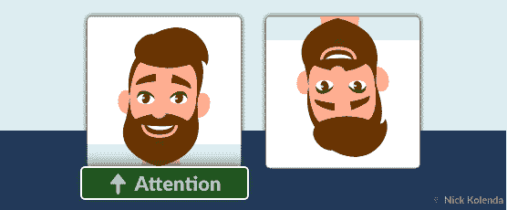
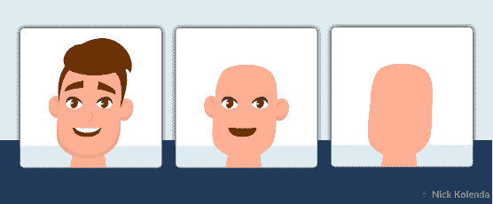
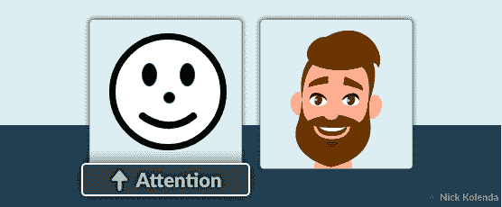

# 哪些刺激能吸引注意力？

> 原文：<https://www.nickkolenda.com/visual-attention/?utm_source=wanqu.co&utm_campaign=Wanqu+Daily&utm_medium=website>

人的图像激活了我们大脑的一个指定区域，称为*颞上沟*(STS；艾利森·皮兹，&麦卡锡，2000)。

特别是，面部会激活*梭状回* (Puce 等人，1996)。

在其他研究中，研究人员发现，与其他物体(例如，衣服；罗，罗素和拉维，2001 年)。

然而，脸需要是直立的(伊斯特伍德、斯迈莱克和梅里克，2003)。由于*面部反转效应*，我们检测反转面部的速度变慢了(Epstein 等人，2006)。

还有，这里有个问题。什么构成了一张脸…嗯…一张脸？我们的大脑什么时候停止识别一张脸？

事实证明，我们的大脑在寻找潜在的几何图形:

> …我们的第一项研究表明，由面部特征提供的整体几何结构，而不是个人特征，是一种文化如何定义情感表达的。(阿罗诺夫，2006 年，第 85 页)

具有讽刺意味的是，示意图面可能比真实面更引人注目，因为它们是用几何形状构建的。

