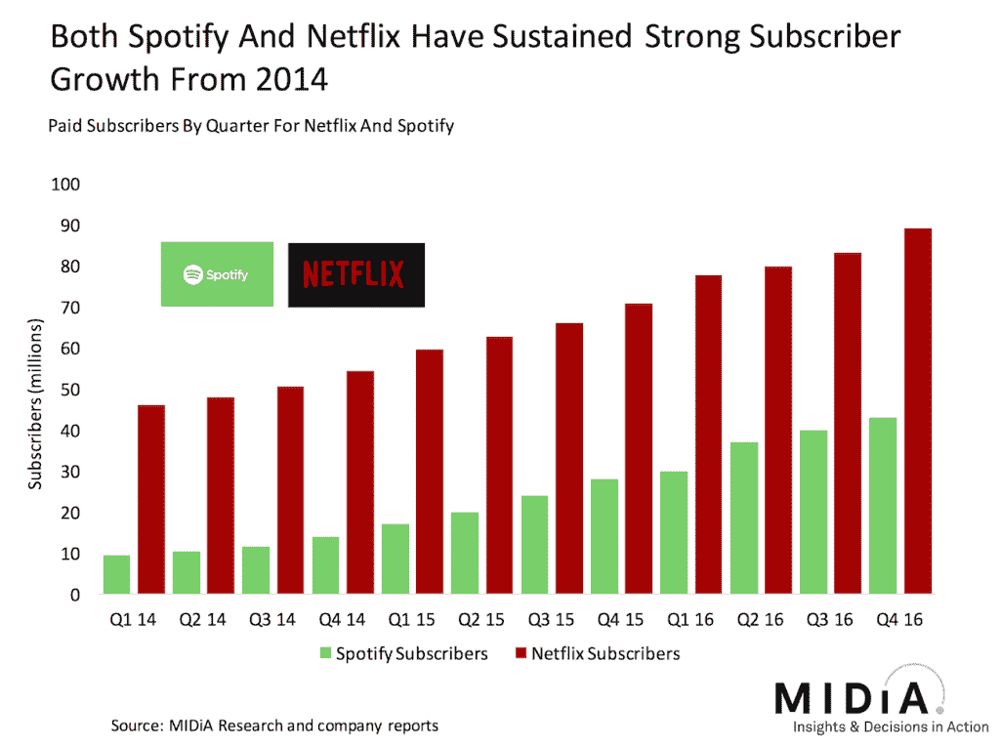
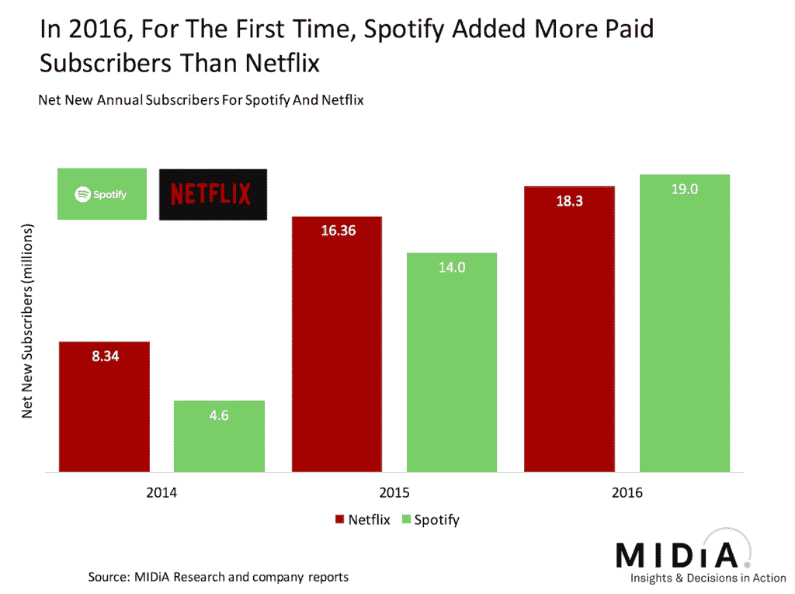
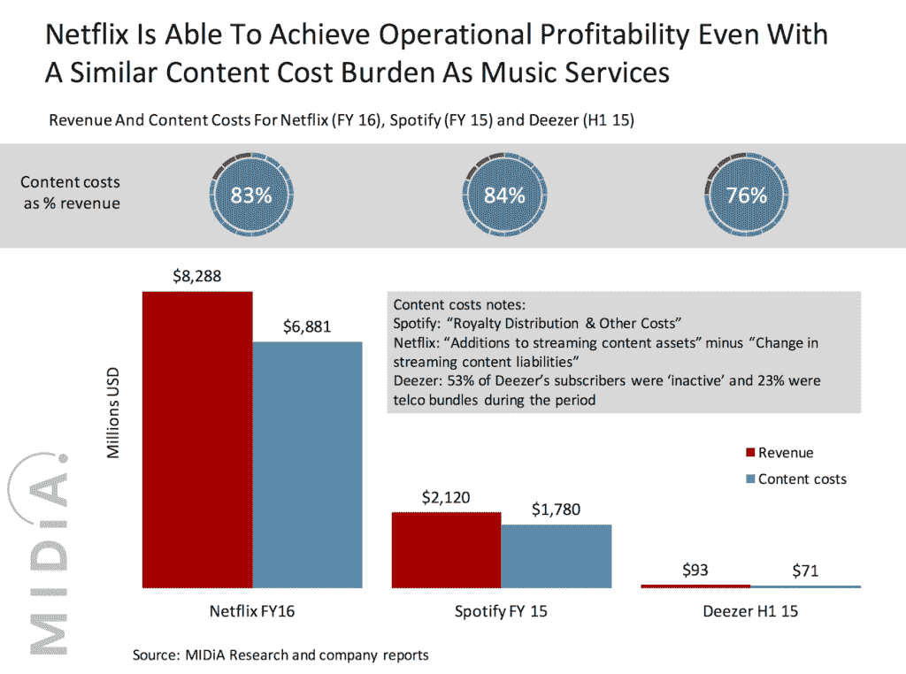
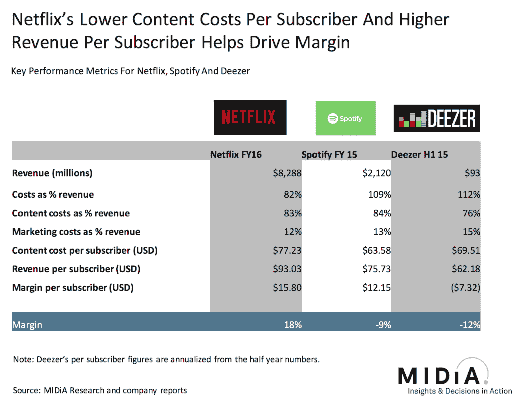

# 为什么网飞可以盈利，而 Spotify(目前)却不行

> 原文：<https://www.midiaresearch.com/blog/why-netflix-can-turn-a-profit-but-spotify-cannot-yet/?utm_source=wanqu.co&utm_campaign=Wanqu+Daily&utm_medium=website>

刚刚庆祝了第十个(流媒体)生日的[,](/blog/netflix-and-the-tenth-anniversary-of-video-streaming/)[网飞紧接着发布了一份强劲的收益报告，宣布第四季度](http://files.shareholder.com/downloads/NFLX/3690976347x0x924415/A5ACACF9-9C17-44E6-B74A-628CE049C1B0/Q416ShareholderLetter.pdf)新增付费用户 580 万，股价上涨了 9%。这对网飞来说是辉煌的一年，在这一年里，它在原创节目上加倍努力，推出了广受好评的热门节目，如《奇异事物》和《办公自动化》,这些节目不符合传统的电视模式。事实上，在网飞找到家之前，15 家电视网拒绝了《奇异事物》,而 OA 的振荡剧集长度(从 1 小时 11 分钟到 31 分钟)会对线性电视时间表造成严重破坏(甚至不考虑其令人费解的情节)。

[T2】](/storage/uploads/blimg/2017/01/netflix-spotify-midia-figure-12.png)

网飞以 8910 万用户结束了 2016 年，以 Spotify 同样强劲的一年为基准的诱惑太强大了，无法抗拒。Spotify(2016 年 6 月庆祝成立 10 周年)在这一年结束时拥有约 4300 万订户，相当于网飞的 48%。但仔细观察这些数字，你会发现另一个增长故事。

[T2】](/storage/uploads/blimg/2017/01/netflix-spotify-midia-figure-21.png)

就净新增用户而言(即年底的付费用户比前一年多多少)，Spotify 比网飞在 2016 年增加的用户略多 100 万。这是 Spotify 的增长第一次超过网飞(以绝对值计算，而不是百分比)。虽然网飞在 2016 年第四季度的 580 万净新用户令人印象深刻，但这是在两个小得多的季度(220 万，340 万)之后，2016 年的平均季度增长率为 460 万。相比之下，Spotify 的增长更加稳定，平均达到 480 万。(请注意，网飞报告的净新增用户数为 710 万，但其中包括 120 万试用用户)。

[T2】](/storage/uploads/blimg/2017/01/netflix-spotify-midia-figure-32.png)

相比之下，网飞的核心地区(美国)已接近饱和，2016 年第四季度仅新增 1400 万净用户。美国现在贡献了网飞增长的 54%。因此，网飞拥有比 Spotify 更成熟的用户基础。然而，网飞正积极追求国际增长，并为此举债。它在 2014 年筹集了 4 亿美元(主要用于欧洲扩张)，在 2016 年又筹集了 10 亿美元(用于资助原创和国际增长——包括国际原创和节目)。当 Spotify 额外筹集了 10 亿美元时，它震惊了整个音乐行业。当网飞这么做时，电视行业的反应更像是温和的(尽管是担忧的)涟漪。另一个有趣的音乐/视频对比:作为回应，亚马逊宣布在 12 月份将现有的 5 个市场扩大到 200 多个市场。这很容易让人想起 2011 年 Deezer 为应对竞争日益激烈的 Spotify 而推出的 200 多个市场。

[T2】](/storage/uploads/blimg/2017/01/netflix-spotify-midia-figure-42.png)

流媒体音乐业务不断恶化的伤口之一是商业可持续性。所有关键的流媒体服务要么在亏损，要么是一家更大公司的一部分(该公司吸收了亏损)。相比之下，网飞 2016 年的流媒体利润率为 18.5%。内容是 Spotify 和 co 的最大成本，但有趣的是，它们与网飞的内容成本一致。看看网飞(2016 财年)、Spotify(2015 财年)和 Deezer(2015 财年),内容成本占收入的比例大致相当。Deezer 的成本份额较低，这反映出它的许多“订户”在此期间处于不活跃状态(占总数的 53%)。

那么，为什么网飞能实现 18%的流媒体利润率，而 Spotify 和 Deezer 却分别为 9%和 12%。(注:网飞报告的整体利润率为 20%，但这包括了利润率高得多的传统 DVD 租赁业务)。音乐和视频流之间的差异可以简单地归结为内容成本的构成方式。最低收入保证(mrg)是流媒体音乐服务的一个关键因素，因为这需要服务保证支付预期的用户增长。如果他们错过了数字，他们仍然支付，但即使他们达到了数字，这意味着他们总是根据明天的数字支付，而不是今天的数字，这对现金流是有害的。这种变化是非常不可预测的。Deezer 在 2014 年凭借“未使用的最低权利担保”抹去了 85%的总运营利润(与 2013 年相比)。

免费用户也给免费音乐服务增加了巨大的权利负担，稀释了收入。因此，Spotify 的订阅收入为 75.73 美元，而网飞为 99.03 美元，尽管它的价格为 9.99 美元，而网飞为 7.99 美元。

但网飞地位更强的主要原因是它拥有如此多的内容，而 Spotify 和 co rent 他们的内容。这意味着网飞能够运用一系列复杂的会计技术来增加公司的利润。网飞的原创节目是一项资产负债表资产，因此可以摊销和抵消成本，以帮助盈利。(例如，网飞有一个现金流项目“流媒体内容资产摊销”，价值超过 48 亿美元)。

那么这一切给我们留下了什么？谁是赢家？音乐还是视频？Spotify 还是网飞？从根本上说，这两项服务都在以令人印象深刻的速度增长，并且在各自的 2016 年表现方面都有很多值得骄傲的地方。总体而言，业务动态大体相似，但网飞的原创内容战略为其带来了竞争优势，无论是在差异化还是会计方面。当然，音乐和电视业务截然不同，Spotify 不能简单地“模仿网飞”。尽管如此，网飞为原创内容战略建立了一个令人信服的案例。毫无疑问，唱片公司担心流媒体服务成为唱片公司，但这可能只是 Spotify 的盈利之路。