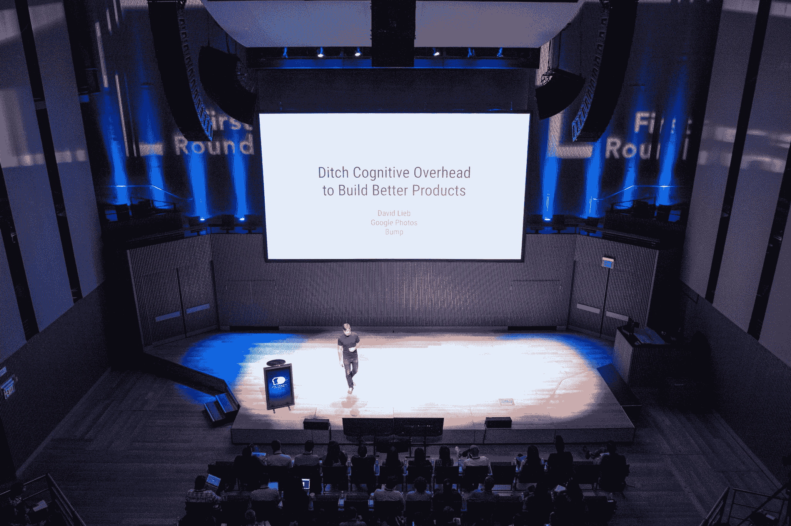
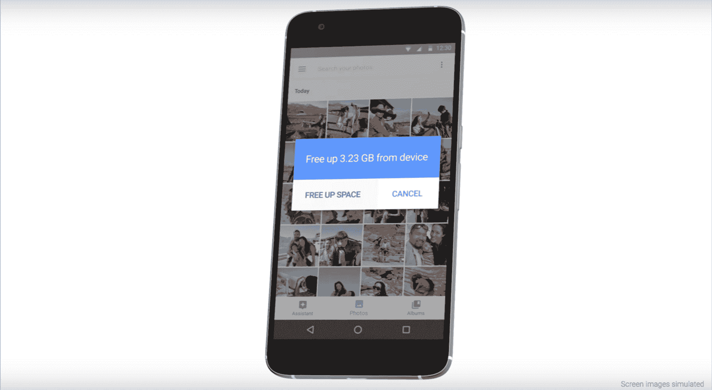

# 认知开销是你产品的霸主——用下面的建议推翻它|第一轮评论

> 原文：<http://firstround.com/review/cognitive-overhead-is-your-products-overlord-topple-it-with-these-tips/?utm_source=wanqu.co&utm_campaign=Wanqu+Daily&utm_medium=website>

**[大卫·利布](https://www.linkedin.com/in/davidlieb "null")** 知道他的公司 [Bump](https://www.crunchbase.com/organization/bump-technologies "null") 要起飞了当陌生人装扮成万圣节的 app。在芝加哥大学时，他开发了这款应用程序，这样他就可以通过物理碰撞新同学的手机来更容易地与他们交换联系信息。颠簸不是暂时的。app 爆了。它被下载了 1.5 亿次，在应用商店中排名第二。苹果甚至在黄金时段播出的广告中突出了 Bump。

Bump 推出五年后，谷歌收购了它。Lieb 现在是**[【Google Photos】](https://photos.google.com/ "null")**的产品负责人，他学到了很多关于 Bump 用户的动力和阻碍因素。例如，该团队心血来潮增加了照片分享功能。当用户开始碰撞照片时，该团队开发了一个新的应用程序 Flock 来简化这一过程。它预测用户想要分享的照片，并可以在没有身体接触的情况下传输它们——这比 Bump 更无摩擦的体验。但是失败了。

根据他在第一轮 CEO 峰会上的讲话，Lieb 指出了羊群给他的启示:认知超载的风险。他定义了这种现象，解释了为什么它很重要，并分享了如何测试它。为了帮助其他产品领导和团队，他破除了四个关于认知超载的神话——以及如何防止它阻碍你的产品。

# 认知简单性与认知开销

除了技术，Bump 成功的核心是将两部手机接触在一起的简单动作。它简单明了且可重复——甚至无需解释就能执行。“是的，产品的简单性确实不是一个新想法。“几十年来，一些最成功的产品最好用简单来形容，”Lieb 说。“但是简单性来自于许多方面:界面上按钮的数量、功能的数量、流程中的步骤或完成一个决策所需的时间，等等。但是最重要的维度是**认知简单性:你的产品有多容易理解**。

认知简单有它的克星:认知超载。“我喜欢我在网上找到的这个定义:**认知开销是指你的大脑必须进行的逻辑连接的数量，以便将所看到的东西联系起来并加以理解。**我不是脑科学家，但我很擅长谷歌搜索，我发现了各种关于人类认知和进化的研究。“有一种观点认为，大脑的工作方式是将遇到的物体和想法分组为抽象概念，然后将这些抽象概念与已知的事物联系起来考虑，”利布说。“让我给你举个例子，早期人类看到了当狮子奔向某物时会发生什么。坏事，对吗？那些能够将这一事件抽象为理解*任何时候*一个物体快速靠近，这可能不是一件好事，嗯，他们往往活得更长，并将这种大脑结构遗传给他们的后代。”

所以我们的大脑天生就是这样运作的——相对于已知的事物和概念来抽象事物和概念——我们让大脑经历的跳跃越多，就越难使用一个产品。“现在，是的，在大多数情况下，我们不再有狮子攻击我们了，但是，考虑一下这个:几十年前，你的用户在桌面上，用一个大的专用屏幕看你的网站。有足够的时间来理解你的复杂产品。没有干扰，没有狮子攻击，”Lieb 说。“手机改变了这一切。今天，我正在走路，躲避一辆汽车，第一次打开你的应用程序——同时收到一条短信、电子邮件提醒和 Twitter 通知。很多事情发生在一个比桌面还小的屏幕上。这种新的分散注意力的方式使得认知简单性比以往任何时候都更加重要。”

David Lieb at First Round's CEO Summit

# 从你的产品中根除认知开销

没有人打算用巨大的认知开销来构建一个产品，但是如果没有对它的预先考虑和认识，它就会发生。“我们看到了 Flock 的预测能力带来的价值——一小部分用户真的很喜欢它们——但对于世界上的其他人来说，这是一个认知迷宫，”Lieb 说。“当你认为人们理解你所增加的价值时——尤其是当它是一个新概念时——你就陷入了认知的误区。”

在这里，Lieb 概述了你在不知不觉中做出的四个假设，以及如何解决它们。

假设#1:只要有可能，最好为你的用户做出选择。

现实:让用户参与决策。这增加了他们的理解和参与。

机器人、人工智能和机器学习的兴起，使产品能够自动为用户做出更好、更多的决策。这是追求产品更少摩擦和更少步骤的一部分。但是根据 Lieb 的说法，反过来可能更好:**帮助你的用户成为这个过程的一部分——这是他们想要的**。

“最成功的产品会让人们更加努力。这似乎违反直觉，但让你的用户按下一个额外的按钮，或者将你可以在一个屏幕上捕捉的流程扩展到三个，”Lieb 说。“用户在你的产品中做出的选择越多，尤其是你本可以为他们做出的选择，产品就越容易使用和理解。”

用户不应该袖手旁观，也不应该在应用中举重若轻。介于两者之间。让他们卷起袖子。

利布看到了这出戏的颠簸和羊群。“使用 Bump，人们实际上必须保持一定距离才能共享他们的联系信息。这是令人难以置信的高摩擦，但它通过让他们负责这个过程来赋予他们权力。他们确切地知道发生了什么以及如何去做，”Lieb 回忆道。“在 Flock 中，人们不知道我们是如何确定他们想要分享的照片的。他们离这个过程如此之远，以至于他们不想分享这个结果。我们了解到所需的行动不仅仅是个性化用户体验。它定义了它。”

Lieb 注意到 Google 相册及其“释放空间”功能也有同样的表现。它旨在对抗当你试图捕捉一段特殊的记忆时出现的可怕的“你没有足够的存储空间来拍摄这张照片”的弹出窗口。该功能本质上是一个按钮，当按下时，会删除任何已经备份到 Google 相册的照片。这已经成为谷歌照片最受欢迎的功能之一。

“你不必是一名工程师，也知道有一种更简单的方法来执行这一过程。该应用程序可以自动删除你手机上备份在其他地方的图像和视频。事实上，我们的一个竞争对手就是这么做的。这就是所谓的优化设备存储，”Lieb 说。“问题是，这在认知上要复杂得多，因为人们觉得自己无法控制。他们最后会问这样的问题:我的照片在哪里？哦不，它们被删除了吗？他们是如何以及何时决定移除哪个的？到底是怎么回事！你最不希望的事情就是让用户认为你删除了他们婚礼的照片或者他们孩子迈出第一步的视频。大多数自动化功能会让用户感到困惑，而不是放心。”

**Lieb 的建议:**规划出你是否、何时以及如何自动化一个特性。询问他人该功能的作用，以了解“为什么”不仅要分析每个用户动作，还要分析他们相应的反应。仅仅因为一些事情看起来简单并不意味着它就是简单的。

假设#2:最好用第一个同类特性来取悦你的用户。

现实:熟悉是采用的首要驱动力。

你有没有听过一个有远见的设计领导者呼吁一个产品看起来和感觉都很普通？这可能感觉像是创新的对立面，但它实际上是采用的潜在驱动力。“我们的大脑将新事物与已知事物联系起来并进行抽象。因此，通过让你的产品看起来和感觉上有点像它正在取代的产品，你实际上可以帮助用户理解它，”Lieb 说。“这并不意味着你应该复制其他产品。这只是意味着你必须考虑如何区分你的特征和你展示它们的方式。通过相对于已知产品定位您的产品来继承基本理解，然后随着您的用户在流程中前进，加入新功能。”

Lieb 的团队在 Flock 学到了认可的力量。作为补充，第一次迭代预测了你想要发送给朋友的照片，并通过应用程序发送出去。“在后来更具粘性的 Flock 版本中，我们能够从熟悉的体验入手，展示我们正在增加的独特价值。没有理由让他们去理解另一个照片应用程序。所以我们在一个复制他们本地相册的画廊里展示他们的照片，”Lieb 说。“然后，当我们提示他们以一种不熟悉的方式提交照片时，感觉就像是某种熟悉事物的更聪明的延续，而不是一系列新的动作。我们改进了我们的产品，让他们不用舀水就能感受到新的感觉。”

打造能引发似曾相识感觉的产品瞬间。后者很快就会消失。前者与记忆或背景相联系和同步。

**Lieb 的建议:**考察你的用户如何导航你的产品，从注册流程到功能执行。然后问他们两个问题:

这个 app 或者产品是干什么用的？

你如何使用它？

“有一个转折。你需要向一个非常特殊的人群问这些问题:那些对认知开销非常敏感的人——可以说是煤矿里的金丝雀，”利布说。你最好的认知探测器是年轻人和老年人。这两个群体的大脑还没有发展出我们这些设计产品的人想当然的产品模式匹配能力。如果你对这些类型的用户进行测试，并且他们能够理解并向你解释你的产品是做什么的以及如何使用，你就处于非常好的状态。我的 star beta 测试人员是我的父母和我的侄子。”

如果你没有年长和年轻的用户来测试你的产品，还有一个解决方案。“如果你做空这两类用户，还有第三种选择。你可以在当地的酒吧找到它们，”Lieb 说。“我对这件事非常认真。喝醉的人很像你在现实世界中遇到的认知有障碍的人，他们很容易分心、忙碌或变化无常。在 Bump，我们会带团队去帕洛阿尔托和旧金山的酒吧，让人们在我们面前使用这个应用程序。然后我们会问他们 Bump 是干什么用的，以及如何使用它。效果真的很好。”

**"** 看看自己的产品，看是否通过了老幼醉酒测试。如果没有，考虑一下你可以让你的产品慢下来的方法，或者你如何让你的用户做更多的工作，或者你如何让它看起来和感觉起来更普通一点，”Lieb 说。

对于你的产品，谁是你最好的认知开销探测器？年轻人，老年人和醉汉。

**假设#3:多样化的功能导致高度参与的用户群。**

现实:建立一致性——而不是多样性——来形成习惯。

产品团队经常被诱惑在产品中加入更多的功能，以增加用户上瘾的可能性——这将使用户不断回来购买更多的功能。然而，多种多样的功能增加了认知负荷，也使得清晰地回答这个问题变得更加困难:这个产品是用来做什么的？

Lieb 分析了数十亿人日常使用的两种产品的功能，以解释它们在认知开销频谱中的位置，因此您可以对自己的产品进行基准测试:

****。“WhatsApp 重视认知的简单性。我记得在 2013 年，当语音和视频通话变得越来越重要的时候，我和创始人简·库姆坐在一起。Lieb 说:“其他消息应用程序都在争先恐后地构建 API，大谈特谈很酷的新功能。“当他说这款产品是为信息服务打造的，团队将继续专注于提供这种体验时，他并没有道歉。他们两年没加语音通话了。你很少在 Dribbble 上看到 WhatsApp 出现在设计师的对话中。你甚至可以称它为最丑的消息应用，但截至 2016 年 2 月，它拥有 10 亿用户，每天发送 420 亿条消息。该团队优先考虑认知的简单性，它显示。"****

******[推特瞬间](https://twitter.com/i/moments "null")** 。“推特时刻在光谱的另一端。当杰克·多西接手时，他想让 Twitter 像看窗外一样容易使用。“他们试图通过瞬间来实现这一点:收集可消化的推文，包括关于热门话题的图片和视频，”利布说。“我喜欢时刻，喜欢使用它，但从认知的角度来看，它模糊了 Twitter 是什么以及它为什么存在的水。创造一个瞬间或浏览它们与写一条推文或浏览你的订阅完全不同。当你作为第一次用户点击这个页面时，你会遇到这样的问题:这个网站是新闻网站吗？谁在创造这些系列？我应该创造他们还是跟随他人？未知太多了。因此，游客可能永远不会看到核心产品，也不会发现它提供了什么。2017 年 1 月， [Moments 在 Twitter](http://www.recode.net/2017/1/26/14394184/twitter-moments-explore-tab-search-update "null") 上被折叠成探索功能。”****

******Lieb 的建议**:为了你的用户，选择你的路线并坚持走下去。雷德·霍夫曼[曾经说过](https://blog.kissmetrics.com/hoffmans-advice-for-entrepreneurs/ "null")大多数人每天使用大约 7 个——相差 2 个——网络产品。打破这种循环极其困难。尤其是在早期，加倍努力保持一致性，这样，如果你打破了这种循环，你就能可靠地实现你的承诺，满足期望并留住用户的注意力。****

****假设 4:速度取胜。****

****现实:时间会培养信任和品质。****

****应用程序开发人员通常只关心速度和更快的性能，但在工作流程中增加几秒钟可以帮助用户更好地了解幕后发生的事情。“研究表明这种现象在旅游网站上是如何发生的。“当用户看到一个平台为他们工作，搜索他们所有的竞争对手以找到最好的交易时，他们相信结果会更加详尽和有价值，”Lieb 说。“毕竟，这个网站爬遍了整个网络，这是我们自己永远无法实现的壮举。但是搜索并没有显示的那么长。通过降低速度，用户有机会处理为他们完成的工作。”****

****取二维码。“看到一个，拿出手机扫描一下。它们是为速度而设计的，但在认知简单性上有所失误，”Lieb 说。“不知道是什么，能不能很快做好也没关系。用户问:是条形码吗？不是。一个网站？好吧。所以我会用我的浏览器？不。哦，我得拍张照，知道了。好的，我会带上我的相机…哦，等等，我不能用我的相机吗？我必须使用一个应用程序。好吧，哪个应用？这一切都发生在一分钟之内。这是一场认知灾难。”****

******Lieb 的建议:**让用户的速度快一毫秒并不总是我们的目标。问问你自己，你可以做哪些选择来增加用户的认可？多几秒钟能让你的用户有时间考虑你增加的价值吗？这可能会教会他们你是如何做的，以及为什么这很重要。A/B 测试特征并寻找重复行为的上升。为您的用户更快地导航进行优化，这表明理解和信心，而不是您的应用程序。****

# ****将战术结合在一起****

****总之，这里有 Lieb 的三个技巧来帮助你(帮助你的用户)减少你的产品中的认知开销:****

******使人工作的*****，不能少。把你的用户放在活动的中间，这样他们就能看到他们周围发生的事情。这可能意味着使用一个按钮作为检查点或扩展一个流程，以确保一个流程(或附加值)被用户接受。让用户做出你本可以轻易为他们做出的选择。这样做将使产品更简单，更易于用户理解。*******

*****降低产品的速度。不要加速。让用户更好地了解窗帘后面和引擎盖下面发生的事情。这将增加他们认可、重视和解释你所做的事情的可能性。你听说过谷歌一次又一次地加速他们的搜索结果，但它实际上反其道而行之。*****

*******让你的产品观感** ***普通*** **。**这不全是新的。大脑将新事物与已知事物联系起来并进行抽象。通过让你的产品看起来和感觉上像它正在取代的旧的乏味的产品，你实际上可以帮助你的用户旋转起来，让他们更快地更好地理解*。当然，区分和选择你要改进的部分，但首先要站在前人的肩膀上。******

******最后，请来了专家们:年轻人和老年人。如果他们不在，去酒吧演示一下。******