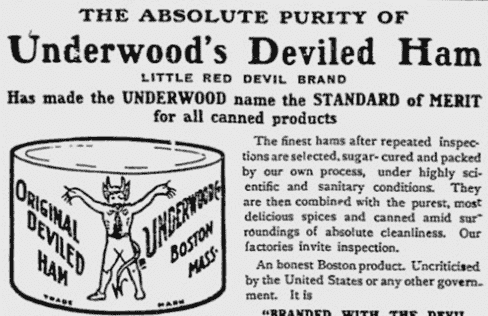

# 品牌合作基金的建立

> 原文：<http://www.collaborativefund.com/blog/the-making-of-a-brand/?utm_source=wanqu.co&utm_campaign=Wanqu+Daily&utm_medium=website>

关于 1850 年以前的生活，一件令人惊奇的事情是，大多数人从未经历过他们出生地以外几十英里以外的世界。

生活是地方性的。你吃了你镇上种植的食物。你的房子是用当地木材建造的。你的衣服是当地女裁缝织的。大宗商品被广泛交易。但是成品是当地的事情。你认识制造它们的人。那个人通常是你自己。

工业革命和内战改变了一切。数百万人突然开始迁移。铁路运输货物比以往任何时候都更远更快。

罗伯特·戈登在他的书《美国经济增长的兴衰》中写道:

> 随着美国城市化程度的提高和实际收入的增加，国内生产的食品和服装份额急剧下降。新型的加工食品被发明出来……内战期间，许多美国人作为联邦士兵第一次体验了罐头食品。

这是历史上最大的突破之一。但这带来了一个问题。

消费者第一次脱离了他们产品的生产。在历史上的大部分时间里，一个糟糕的产品要么是你自己的错，要么可能会被当地商人当面提出。但是罐装食品是由几十家地区供应商一起批量生产的，没有一家供应商是顾客认识的，甚至不能认出来。没有问责制，质量是可怕的。《哈泼斯周刊》在 1869 年写道:“城里人总是处于购买不卫生的(罐装肉)的危险之中；经销商肆无忌惮，公众没有受过教育。”没有人知道该相信谁。

威廉·安德伍德公司解决了这个问题。

安德伍德在 19 世纪 20 年代以泡菜公司起家，是玻璃包装和罐装的先驱。内战爆发后，它满足了人们对罐装肉的需求，完善了一种叫做“魔鬼火腿”的肉类食品。人们喜欢芥末火腿。但是不同的肉罐头生产给整个行业带来了不一致的名声——有时腐烂，有时潮湿，没有两个罐头是一样的。

安德伍德通过创造一个消费者可以识别的火红魔鬼标志来解决这个问题。它添加了一句标语:“打上魔鬼的烙印，但适合神。”

这个标志重现了大部分历史时期面对面交易的熟悉感。无论在美国的哪个地方，看到魔鬼标志的消费者都知道他们买到的是由特定公司按照特定质量标准生产的特定产品。消费者开始将魔鬼标志与他们以前没有的东西联系起来:一致性。

1867 年，安德伍德把这个标志带到华盛顿，并申请了第一个联邦商标。

这是第一个品牌。

1906 年版本的安德伍德辣味火腿

品牌的概念迅速传播开来。

煤油在 19 世纪晚期开始流行，但是，像食物一样，它是不稳定的。1869 年,*美国妇女之家或家政原理*写道:“好的煤油照亮了一切，令人满意。”。但它警告说，不纯的煤油太普遍了，点燃时可能会爆炸。

约翰·d·洛克菲勒解决了这个问题。他把他的公司命名为标准石油，因为他想让顾客知道他的一罐煤油和下一罐没有什么不同。

公司开始流行。“1870 年仅有 120 个商标，”戈登写道，“相比之下，仅在 1906 年就有超过 10，000 个注册商标。”

* * *

私募股权公司 Adventur.es 的首席执行官 Brent Beshore 最近被问及什么是品牌。他回答道:

> 品牌是你可以从任何公司或个人那里预期的可能结果的分布。

这与创造第一个品牌的力量相吻合。安德伍德和标准石油公司并不被认为是市场上最好的产品，尽管它们都相当不错。但是他们建立了强大的品牌，因为消费者确切地知道从他们那里可以期待什么。可能结果的分布很小。品牌并不意味着拥有最高的质量。这甚至与建立信任无关。“你不信任可口可乐品牌，”贝肖尔说。“你知道他们会给你带来什么。”

*知道期待什么*。这就是一个品牌的精髓。

如今，品牌比以往任何时候都更加强大，因为消费者的选择已经激增。过去有三个新闻频道。现在有数百万个博客。这家杂货店过去备有五种牙膏。现在亚马逊提供 87268。

在这个世界上保持相关性需要建立一个强大的品牌。但是我们经常把品牌误认为它的两个表亲:营销和设计。品牌最重要的一点是你不能创造一个。你可以创建一个营销活动。你可以创造一个光滑的设计。两者都非常重要。但品牌必须通过重复来赢得，让人们相信他们昨天经历的就是他们明天可以期待经历的。这很难，而且可能需要很长时间。但它的力量惊人。

当你意识到品牌在很大程度上只是结果的紧密分布时，你会发现强大的品牌可以建立在劣质产品之上。茱莉亚·切尔德曾经请她的主人带她去当地的麦当劳。主持人吓坏了。Child 解释道:“我喜欢麦当劳。始终如一。”莫泰 6 是一个强大的品牌。你很清楚你会得到什么:一个可怜的没有多余装饰的房间，在每个城市都一样。达美乐也一样。这不是世界上最好的比萨饼。但是每次都挺好的，从巴尔的摩到东京。这足以使它成为世界上最畅销的比萨饼。

对品牌的深刻见解是，消费者讨厌惊喜，而不是享受完美的机会。真正令人惊叹的公司将完美与一致性结合在一起。苹果就是一个很好的例子。但它是个例外，一致性仍然是其品牌的主要驱动力。摩托罗拉和黑莓制造了一些令人惊叹的手机。但他们出售的产品系列中包括一些糟糕的手机。结果的分布扩大了。品牌减少了。

可口可乐吃了苦头才明白这一点。其臭名昭著的 1985 年新可口可乐配方适得其反，引起了消费者的反抗，导致可口可乐三个月后恢复了原来的配方。疯狂的是，可口可乐进行了超过 20 万次口味测试，压倒性地显示人们更喜欢新可乐的味道，而不是原来的配方。问题是，盲品测试不能复制消费者在商店购买汽水时的心理体验。在现实世界中，人们并不在乎新可乐味道更好。它尝起来不像可乐。这正是他们所期望的。

几年前，有人给我提供了职业建议:“如果你想成为一名作家，那就找一个大趋势，然后坚持不懈地努力。”

我不知道我是否遵循了它。或者我是否应该。但这是个不错的建议。一些最大的写作“品牌”不是最聪明或最好的，而是最一致的。肖恩·哈尼蒂和雷切尔·玛多没有提供洞察力的顶峰，但是他们的观众确切地知道当他们每晚坐下来观看时他们会得到什么。《华尔街日报》的杰森·茨威格曾经写道:

> 我的工作是每年写 50 到 100 次完全相同的东西，这样我的编辑和读者都不会认为我在重复自己。

这里也是如此。作为一名读者，我知道杰森永远不会偏离他几十年来信奉的财务建议的基本原则太远。对我来说，每周回到他的工作岗位，比阅读一位观点无处不在的专栏作家的文章风险要小。这就是为什么我和成千上万的其他人不断回来。他建立了一个品牌。

* * *

历史充满了相似之处。有时我想知道现代版的安德伍德辣味火腿是什么。让你的产品为人所知的新领域是什么，让我们 150 年后回过头来看时会觉得非常明显？

也许我们会认识到，对速度和规模这两样东西的追求玷污了许多品牌。也许我们会意识到，放慢速度专注于质量和一致性是赢得更多客户的新方法。

150 年前最大的品牌挑战是向顾客发出信号，告诉他们你可以承诺一致性—*在*销售。今天最大的挑战是在一个很容易通过牺牲一致性来快速做大的市场中保持这一承诺——*卖出*。

几乎每个行业都可以看到质量随数量下降。医疗保健满意度随着医院网络的合并而下降。银行在合并成庞然大物时失去了重心。博客张贴垃圾，因为他们寻求点击和数量。在过去的十年里，随着技术让扩展变得前所未有的容易，这种趋势似乎有所抬头。

也许我们会回过头来认识到，做大的最好方法是拥有一个强大的品牌，而建立一个强大品牌的最好方法是一直做好，而不是有时做得很棒。

