# 阴天 3:设计走查–Marco.org

> 原文：<https://marco.org/2017/02/20/overcast3?utm_source=wanqu.co&utm_campaign=Wanqu+Daily&utm_medium=website>

 

[阴天 3](https://overcast.fm/) 现已面世，这是一个巨大的更新，主要是在界面的设计和流程上。从去年夏天开始，我就一直在研究它，通过两年多的测试、使用和客户反馈，我了解了它的情况。

我在 2014 年为 iOS 7 设计了[covery 1.0](https://www.macstories.net/reviews/overcast-review/)，它是那个时代的产物:它使用超薄的文本和线条，搭配鲜明、边缘清晰的全屏白色纸张和半透明的模糊窗格，隐藏的手势背后有许多基本功能。这一基本设计贯穿了每一次更新，直到今天。

我对 3.0 的设计目标是:

1.  **从 iOS 7 更新风格到今天:**更多的启示，更多的曲线，更粗的字体，更少的半透明，更多的触感。应用设计时尚不会一成不变，许多 iOS 7 时代的设计现在看起来已经过时了。
2.  **将所有功能公开:**为以前很难发现或隐藏在隐藏手势后面的任何东西添加可见的控件和启示，例如表格单元格滑动动作和首先需要点击角落“编辑”按钮的动作。

    你不会相信有多少客户要求我添加已经存在的功能，或者找不到像删除剧集这样的基本功能，因为它们在设计中不够明显。

3.  **适应更大的手机:**扩大触摸目标，使单手使用更快更容易，即使只有部分屏幕在触手可及的范围内。我还想减少误击的可能性(和影响)，特别是在屏幕左下和右下边缘周围，我相信这将变得越来越重要，因为未来的 iPhones 可能会变得更薄。

    阴云 1.0 是为 iPhone 5S 设计的。现在，我的大多数客户都使用 4.7 英寸和 5.5 英寸的屏幕，一些基本原则需要重新审视。

### 现在玩屏幕，卡比喻

我首先用一个新的**卡**比喻来改造应用程序其余部分和正在播放的屏幕之间的基本结构，这个卡**从底部向上滑动**，而不是从右侧推入:

[旧 ](https://marco.org/media/2017/02/v3-nowplaying-old.png) [新](https://marco.org/media/2017/02/v3-nowplaying-new.png)

大多数流行的音乐和播客应用程序都采用了滑动播放的方式(包括 iOS 10 音乐应用程序)，所以这符合人们在其他地方已经习惯的方式。

它可以从迷你播放器中平滑地拉起(或者只是点击它)，并且可以通过在正在播放的屏幕上的任何地方向下滑动**来平滑地解散(或者点击“向下”字形)。 [1](#fn:prKwU6CZVedge)**

这个卡片隐喻贯穿于应用程序中的所有其他模态屏幕，它们都以相同的方式工作，加快了常见任务的速度，并大大增强了单手使用。

我还重新设计了正在播放的屏幕。旧版本在隐藏的滚动区显示了插曲注释——你需要在艺术品上滑动才能显示它们，这相对来说很少有人发现。

[旧 ](https://marco.org/media/2017/02/v3-shownotes-old.png) [新](https://marco.org/media/2017/02/v3-shownotes-new.png)

新的 Now Playing 屏幕可以水平滑动，以在左侧显示效果或在右侧显示剧集注释，重要的是，这由插图下方的标准“页面点”指示器指示。 [2](#fn:prKwU6CZVpagedots)

效果和回放弹出窗口被合并成一个效果面板: [3](#fn:prKwU6CZVcontplay)

[旧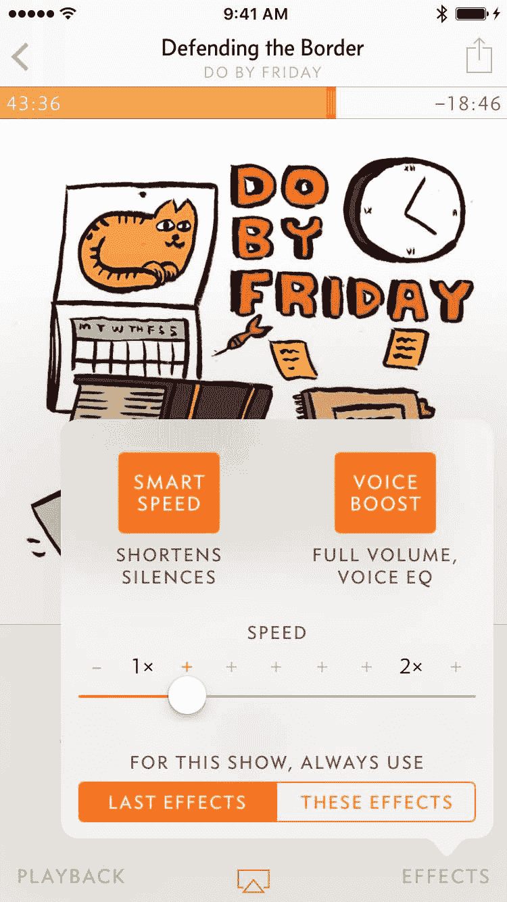 ](https://marco.org/media/2017/02/v3-effects-old.png) [新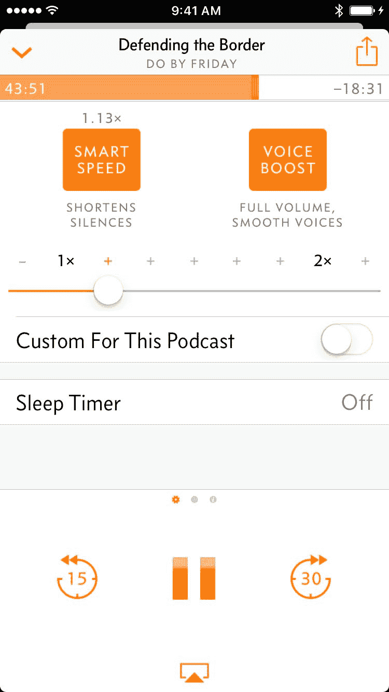](https://marco.org/media/2017/02/v3-effects-new.png)

随着向后/向前搜索区域的收紧，这将关键控件从左下和右下屏幕边缘移开，这在处理大手机时经常被误击。

### 播放列表、专题节目信息和 podcast 屏幕

从 1.0 开始，播放列表可以手动重新排序，但是许多 iOS 用户从来不点击导航栏中的“编辑”按钮，所以许多人甚至不知道他们可以这样做。即使对于那些知道他们可以重新排序剧集的人来说，两步的过程也很麻烦。

新的播放列表屏幕具有全时重新排序手柄，以实现更快的访问和更好的可发现性:

[旧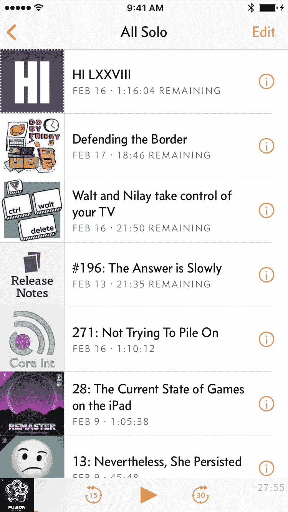 ](https://marco.org/media/2017/02/v3-playlist-old.png) [新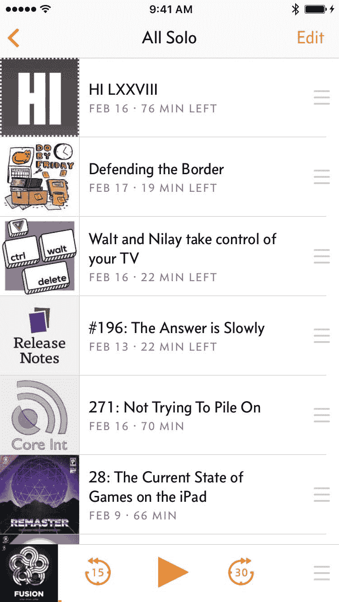](https://marco.org/media/2017/02/v3-playlist-new.png)

迷你播放器现在也更大，更容易抓取，有更大的按钮，当没有播放时隐藏起来。

我还更换了剧集信息 popovers，从发货那天起我就讨厌它:

[旧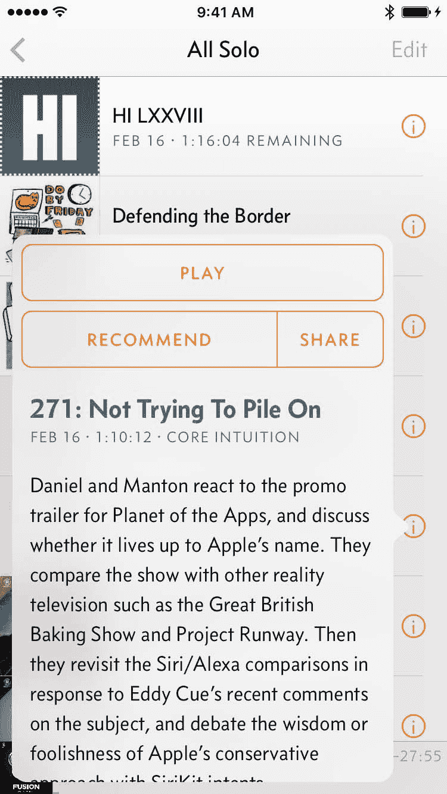 ](https://marco.org/media/2017/02/v3-info-old.png) [新](https://marco.org/media/2017/02/v3-info-new.png)

旧的松饼缺乏与周围环境的对比，空间有限，需要在边界外小心轻敲才能解散，单手时往往很笨拙。

新的插曲信息卡的行为像所有其他阴 3 卡一样:快速向上滑动，然后通过向下滑动任何地方(或从左边缘向内)轻松消除。也可以用 3D Touch 预览[和滑动](https://marco.org/media/2017/02/v3-info-new-preview.png)[快速动作](https://marco.org/media/2017/02/v3-info-new-actions.png)。

### 播放、删除、排队

以前，点击列表中的一集会立即开始播放。当你需要它的时候，这很好，但是意外的输入总是一个问题:我发现很容易意外地开始播放我试图重新安排、删除或查看信息的东西。

许多人也从不滑动表格单元格(或点击编辑按钮)，因此永远找不到删除按钮。自从 1.0 发布以来，我收到了数百封电子邮件，询问如何在不播放剧集的情况下删除它们。

[旧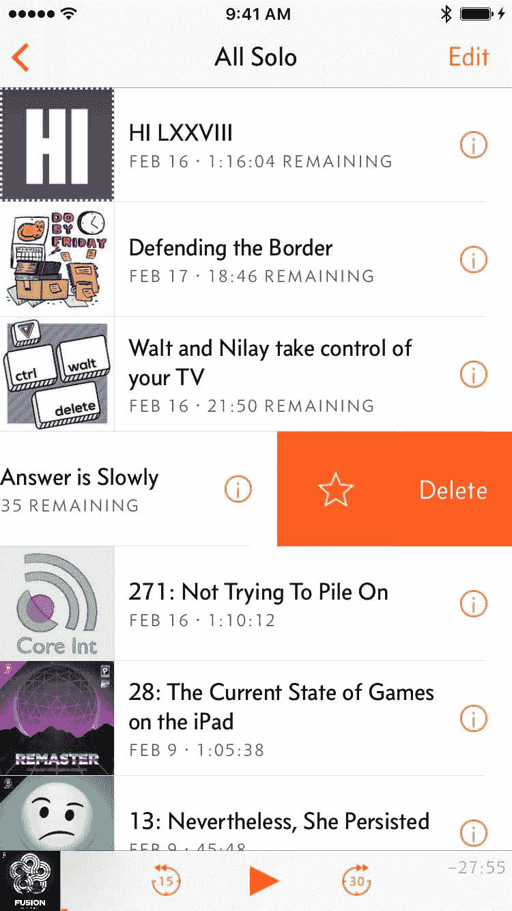 ](https://marco.org/media/2017/02/v3-cellactions-old.png) [新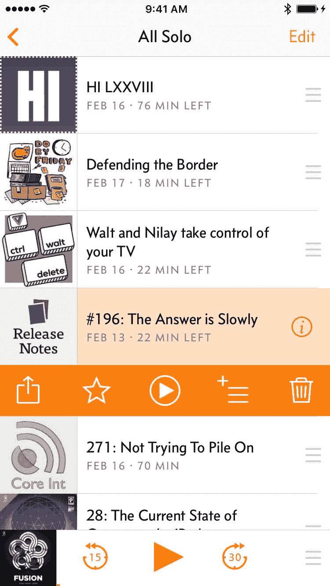](https://marco.org/media/2017/02/v3-cellactions-new.png)

为了解决这些问题，我切换到一个两阶段的方法:点击一集来选择它，它会显示各种动作按钮，然后点击新显示的播放按钮来播放它。

我预计这将是《乌云 3》中最有争议的变化，因为它确实会减慢播放速度，但我发现它的效果**要好得多，也更稳定，大多数习惯于旧方式的人在几天内就会习惯它，它使应用程序更可靠，更容易被每个人发现。**

它也给了我一个地方来放置一个新的按钮:Queue。

[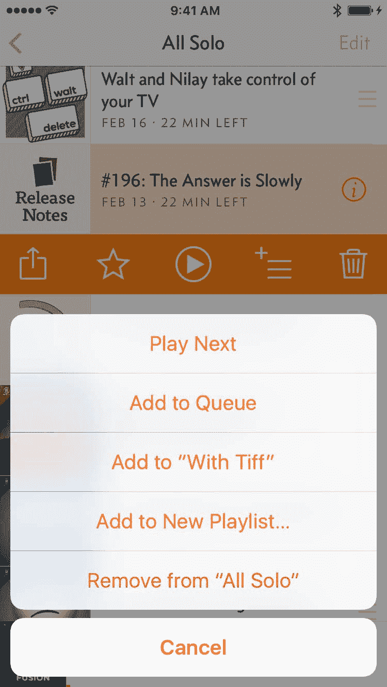T2】](https://marco.org/media/2017/02/v3-cellactions-new-queue.png)

从第一天开始，某种“Up Next”风格的快速队列管理就已经成为了 covery 最受欢迎的特性之一。我花了很长时间才明白这个想法，因为我认为我的播放列表也有同样的作用。他们基本上做到了，但是他们需要两个大的改变:

1.  从界面周围轻松访问，快速将剧集添加到队列中。
2.  ever 3 的手动播放列表的新选项，而不仅仅是“智能”播放列表，符合 iTunes 的定义:手动播放列表只包含你明确添加到其中的内容，而“智能”播放列表(以前是 covery 中唯一的一种)是一套自动包括或排除剧集的规则。许多人希望他们的队列/上一个是手动播放列表。

新的队列功能是简单的覆盖播放列表，在界面中有特殊的位置。如果您已经有一个名为“队列”或默认“所有剧集”的播放列表，则使用该列表，如果没有，则根据需要创建该列表。这些播放列表随处可见，功能齐全，就像其他播放列表一样。

### 混合物

播客屏幕总是有一个巨大的设计缺陷。快速:在旧屏幕上，你如何颠倒剧集的排序顺序，让它从最早的到最新的播放？

[旧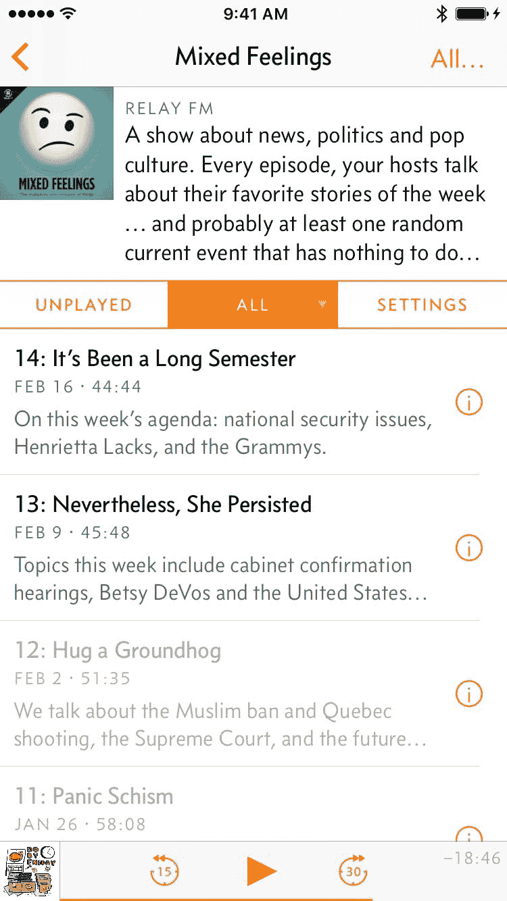 ](https://marco.org/media/2017/02/v3-sort-triangle-old.png) [新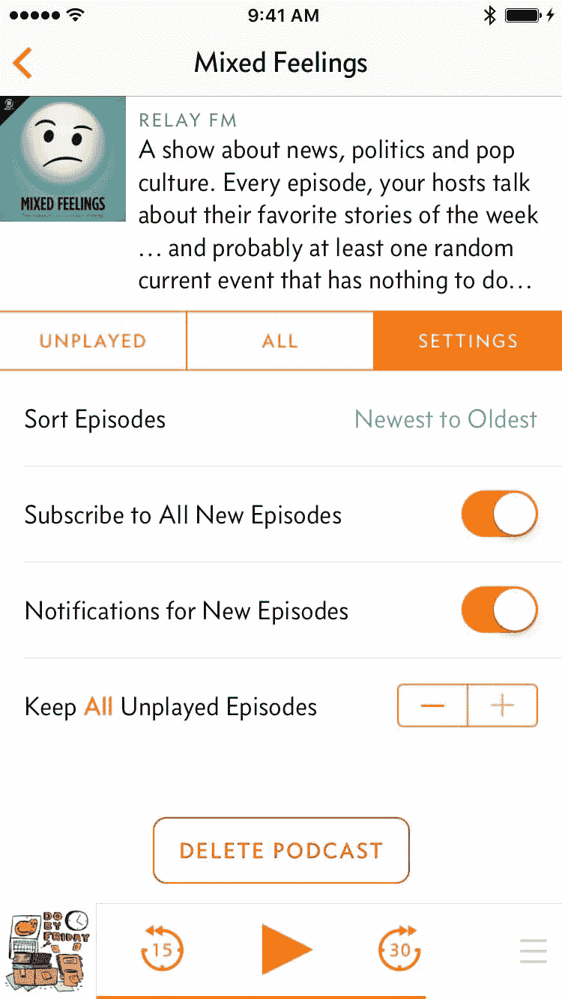](https://marco.org/media/2017/02/v3-sort-triangle-new.png)

iOS 上没有这方面的标准，所以我复制了桌面/web 标准的一个标题上的三角形指示器，可以点击来反转方向。没有人发现这一点，所以我也在每个播客的设置下添加了一个明确标记的选项。

旧的播客目录屏幕**被恼人的事情填满**:你已经订阅的播客会变暗，如果点击会显示恼人的警告，你一次只能添加一个播客，等等。

[旧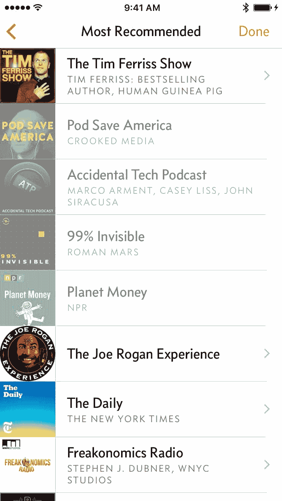 ](https://marco.org/media/2017/02/v3-recommended-old.png) [新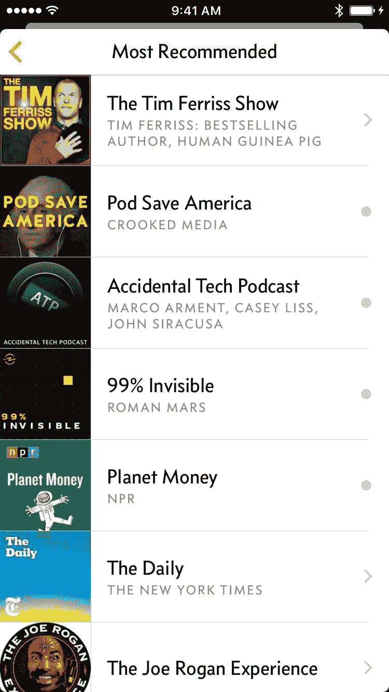](https://marco.org/media/2017/02/v3-recommended-new.png)

现在，任何地方都可以看到一切，无论一集在哪里列出，都可以看到相同的操作，并且您可以添加多个播客，而不必回到每个播客的目录中。(最后。)而且，当然是卡，所以只要往下拖就很容易驳回。

一些其他的新东西:

[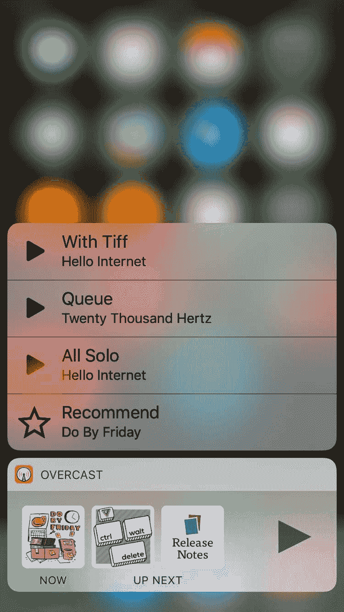 ](https://marco.org/media/2017/02/v3-new-widget.png) [ 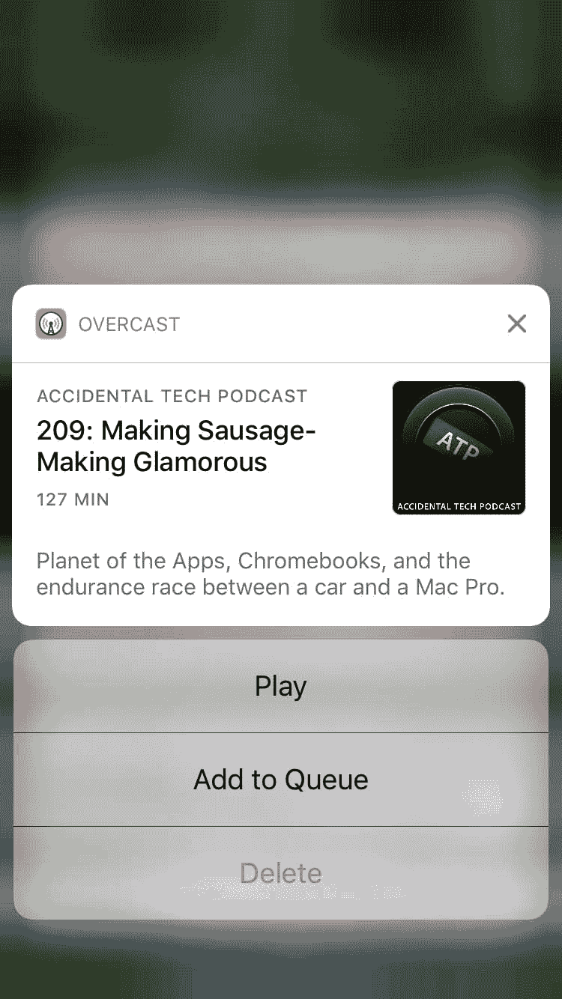](https://marco.org/media/2017/02/v3-new-notifications-full.png)

一个小部件！

丰富的通知！

[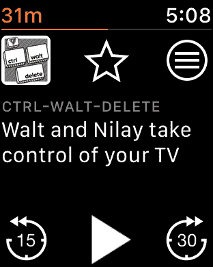T2】](https://marco.org/media/2017/02/v3-watch.png)

一个全新的，速度更快的手表应用程序，终于在 watchOS 3 上运行了！(旧的是 watchOS 1。真的。)

甚至有些迅捷！(这就是应用程序从 7 MB 增长到大约 30 MB 的原因:由于 Swift 还很年轻，所有 Swift 应用程序仍然带有自己定制的 Swift 库。)

### 更好的广告

去年 9 月，当我的唯赞助模式实际上失败了，我增加了谷歌广告时，我不得不吞下两颗苦果:

*   不良广告:我对广告客户或广告内容几乎没有控制权，在我不知情的情况下，这些广告可能会冒犯我的应用程序或对其产生负面影响。我以为我可以设置足够的限制，但实际上，这还不够好。

    谷歌提供了一个广泛的控制面板，让你阻止某些广告类别。大多数明显属于敏感类别，在发布前很容易被禁用，如赌博、毒品等。，但我不断收到顾客的来信，他们看到了冒犯我们两人的其他广告。例如，至少有一个听众看到了一个枪支广告，我从来没有想过在所有“敏感”类别都关闭的情况下，这种广告会被允许。但是*枪支&枪械*不在*的敏感类别*中，仅次于毒品和赌博——它在*商业&工业>安全设备&服务*中。

    所以我继续屏蔽更多的类别，但这不足以产生我一直都能接受的广告。

    其他广告网络也存在，但它们往往更差，或者赚的钱不够多，或者两者兼而有之。

*   我的应用程序中的神秘代码:我必须将闭源的谷歌广告库嵌入到我的应用程序中，并接受它所有令人不安的要求(广告标识符、允许对话框使用蓝牙或联系人等东西，如果广告商需要的话，等等)。).

    这让我在 9 月份有点不安，但后来 11 月份发生了，到 1 月底，我不再喜欢在我的应用程序中嵌入来自美国广告公司的不必要的封闭源代码。

我决定不惜一切代价放弃谷歌广告和织物崩溃报告和分析，这是最近被谷歌收购。

不会再有封闭源代码被嵌入到阴云、 [4](#fn:prKwU6CZVchromecast) 中，我也不会再使用任何第三方分析服务。我相当有信心，如果政府向苹果施压，要求其侵犯消费者的权利和隐私，苹果会支持我，但明智的做法是尽量减少我做出这种假设的公司数量。

幸运的是，谷歌广告的收入相对较少——大约 90%的收入仍然来自付费订阅，而付费订阅现在做得更好。目前，非订阅用户的广告比广告本身更重要，所以我可以用几乎任何东西来代替它们。因此，我推出了自己的有品位的内部广告，带有一流的[隐私](https://overcast.fm/privacy)，显示在“正在播放”和“添加播客”屏幕上:

 [ 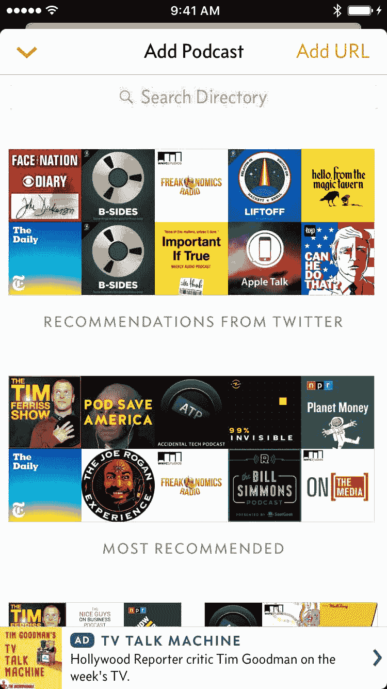](https://marco.org/media/2017/02/v3-ad-directory.png)

现在，Playing 可以显示网站、播客、应用程序或 covery Premium 的广告，而 Add Podcast 屏幕只会显示播客的广告。(想买广告？[取得联系](https://overcast.fm/contact)。)

没错，**播客的广告。**还有什么地方比播客播放器更适合成功地宣传播客呢？轻按一个，你会看到标准的阴订阅屏幕，上面有完整的剧集列表和一键式订阅。

### 去拿吧

这是一个巨大的更新。非常感谢所有让这一切成为可能的顾客。

我希望我已经成功实现了我的设计目标，也希望你喜欢它。

