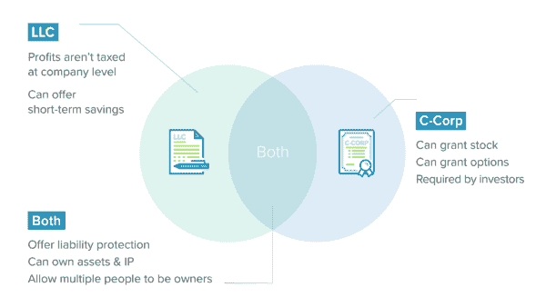

# 阵风|启动更智能

> 原文：<https://launch.gust.com/blog/why-startup-delaware-c-corporation?utm_source=wanqu.co&utm_campaign=Wanqu+Daily&utm_medium=website>

# 为什么你的创业公司应该是特拉华州的公司

艾伦·麦基【古思特公司】产品负责人

【2017 年 3 月 15 日

阵风启动[从合并过程](https://gust.com/launch/pricing)开始，这是建立你的新公司运营的所有其他组成部分的必要的第一步。许多创始人被告知，他们最初应该以有限责任公司的形式成立他们的初创公司，但我们建立的 Gust Launch 对初创公司的法律实体只有一种选择——而且不是有限责任公司。

投资者、经验丰富的创始人和[初创公司律师](https://gust.com/launch/blog/every-startup-needs-a-lawyer)所青睐的[初创公司公认的最佳法律实体类型是特拉华州的 C-公司。出现这种情况的原因有很多，我们会谈到细节。正如](https://gust.com/launch/blog/why-investors-prefer-c-corps) [Mintz Levin](https://www.mintz.com/) 的 Daniel DeWolf 所说，“在特拉华州注册为 C-公司是高增长创业公司的黄金标准。它为许多合格的小企业提供了有限责任、易用性、易于设置、发行股票期权的能力以及销售时的税收优惠。”

所有这些是如何运作的，股份有限公司和有限责任公司有什么不同？这是概要。

## 为什么你应该合并

**1。保护自己免受法律责任**

公司把你，创始人，作为一个私人的人从等式中去掉了，取而代之的是一个新的类似人的实体，它可以做同样的事情，但是从法律的角度来看，它被认为是独立的。这个实体，公司，或多或少可以做你能做的任何事情，比如签合同、买东西或卖东西。关键的区别在于，当出现问题时，比如公司破产，你不会为那些债务承担个人责任。

**2。划分所有权**

公司化的第二个主要好处是能够分割你公司的所有权。你会希望尽快确定谁拥有什么的安排，包括[分割共同创始人的股权](http://blog.gust.com/cofounder-equity-split-framework-objectively-divide-equity/?utm_source=launch-blog&utm_medium=post&utm_campaign=launch&utm_content=why-c-corp)，让这个过程尽可能透明和公平。对于 C 类公司来说，通过[发行股票](https://gust.com/launch/faq/articles/how-do-i-issue-stock)是一个相当简单和容易理解的过程，但对于有限责任公司来说，这个过程要复杂得多。

当你准备好寻找会给你资本以换取股权的投资者时，他们会期望在你的公司中拥有一定的所有权。为了确定他们最终拥有的股份比例，你需要事先了解当前的所有权结构。出于法律原因，大多数[天使投资人](https://gust.com/)和风投也会坚持认为你的公司是[特拉华州的 C-公司](https://gust.com/launch/faq/articles/why-a-c-corporation-why-not-an-llc)，所以如果你不是，那么你需要探索转换成 C-公司——一个非常昂贵和耗时的过程。开始时将你的股份分开，你的公司结构以最终投资为导向，这将在以后节省金钱和时间。

**3。确保至关重要的知识产权属于公司(而非创始人)**

这一块对于高增长的初创公司尤其重要，这些公司往往专注于开发颠覆性的新技术或技巧(而不是像许多其他小企业那样重用已有的商业模式)。这些创业公司的支柱是[知识产权](https://gust.com/launch/blog/intellectual-ip-property-punch-list)，这意味着从公司名称的合法所有权到专利，再到运行你的应用程序的代码。

就像债务一样，你希望这些知识产权资产的所有权属于创业公司，而不是创业者个人。在这种安排下，即使每位创始人离开，他们的贡献仍将留在公司，这有两大好处:首先，这意味着没有人可以纯粹根据他们过去的贡献来决定公司的未来；其次，这为每位贡献者的股权提供了合理的理由。还有一个财务上的好处，那就是知识产权创造的价值可以被认为是公司价值的一部分，这是投资者用来决定向创业公司投入多少资金的主要机制。

## LLC 对 C-Corp 的创业

有限责任公司和股份有限公司的两个主要区别是所有权划分的能力和对收入征税的方式。

我们已经在上面讨论了股权分割——虽然有可能为一个有限责任公司制定分割其所有权结构的变通办法，特别是利润利息(这表明在以后某个日期分割利润的意图，从利息被授予时开始计算)和资本利息(如果公司被清算，这代表公司价值的一部分)，但这些并不能像 C-Corp 的股票那样以明显、相对直观的方式准确地转化为股票或所有权。

除此之外，有限责任公司完全缺乏授予期权的方式，期权是创业公司向员工和顾问提供的一种常见的股权激励形式，或多或少代表了在有利时以折扣价购买公司股票的能力。

由于几乎任何成功的高增长创业公司都会寻求专业投资，这些结构将需要转化为类似的 C-Corp 所有权单位(即股票)。简而言之，那是很多昂贵的律师时间。

由于 C-Corp 中相对直接的所有权划分，税法通常对所有权的处理略有不同。这就是为什么如此多的创始人认为他们应该首先成为有限责任公司的症结所在:有限责任公司的税收较低，因为首席企业被征收双重税。通常的理由是，有限责任公司的收入不在公司层面征税，而是在所有者的收入层面征税。与此同时，C-Corp 的利润作为公司征税，然后作为股息支付时作为个人征税。事实上，这几乎从来不是早期创业公司的现实。初创公司往往会将所有资本再投资于多年的增长，而不是支付股息，这意味着这种“第二”税收负担很少适用。 [1](https://gust.com/launch/blog/why-startup-delaware-c-corporation#footnote)

<noscript>T3】</noscript>

## 为什么是特拉华州？

这个很简单。大多数公司的总部并不在特拉华州。由于这种对州收入的明显不利，特拉华州制定了一系列税收和监管法律(特别是[特拉华州普通公司法](http://delcode.delaware.gov/title8/c001/))和法院系统，这些法律和系统比美国几乎任何其他地方都更有利于公司，使其成为公司和投资者最有利的注册地。税收为他们赢得，税收和监管为你赢得。

对你来说，初创公司创始人的最终结果是，大多数投资者更愿意你在特拉华州成立公司，因为它的法律法规是专业投资集团和初创公司律师所熟悉和青睐的。在某些情况下，有令人信服的理由在其他地方注册，但大多数初创公司通常会坚持在特拉华州注册，并提交一份外国资格表，以便在自己的家乡运营。

虽然个别创业公司可能有特定的情有可原的情况，表明使用有限责任公司形式的价值(如预期立即获得巨额利润)或在另一个州注册，但大多数创业公司最终都被建议注册为特拉华州的 C-Corporations-这就是为什么我们通过 Gust Launch 启动这一流程来启动创始人。

好奇阵风发射公司是如何运作的吗？通过聊天气泡或电子邮件联系 support@gust.com。

## 从区区 300 美元起步，以正确的方式成为特拉华州的首席执行官

* * *

本文仅供参考，不构成税务、会计或法律建议。每个人的情况都不一样！针对你的特殊情况，向税务顾问、会计师或律师寻求建议。