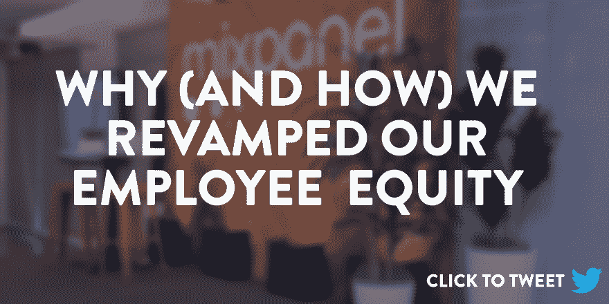

# 我们为什么(以及如何)修改我们的股权计划——Mixpanel

> 原文：<https://blog.mixpanel.com/2017/03/14/employee-equity/?utm_source=wanqu.co&utm_campaign=Wanqu+Daily&utm_medium=website>

直到今天，Mixpanel 的员工权益和大多数其他创业公司一样运作——也就是说，并不完美。

今天，我们宣布对我们的股权计划进行重大调整: **我们已经将加入 Mixpanel 并在此工作至少两年的员工的离职后期权行使期限从标准的 90 天延长至 5 年** 。

这一改变旨在帮助员工在 Mixpanel 获得工作回报。股票期权是我们整体薪酬方案的重要组成部分，但如果有人选择离开公司，他们传统工作方式的一些细微差别会使他们很难实际购买股票。

我们不是轻易做出这个决定的。这种变化对员工有一些明显的好处，但我们做了研究，并做出了深思熟虑的决定。我们坚信，从长远来看，这对我们的员工和公司都是正确的。

本帖将讨论我们做出这一决定并实施变革的过程。它有两个用途:

1.  我很自豪我们做出了这个决定——所以我当然想告诉全世界。
2.  但更重要的是，我们认为这是更多公司应该做出的改变。这是一个艰难的决定，公司越大，这个决定就越难做。Mixpanel 拥有 235 名员工，是实施这一变革的较大公司之一。但通过公布这些，我希望我们可以帮助更多的公司了解这一过程，并做出正确的决定，延长他们的期权行使期。

作为这篇文章的配套，我们还决定开源我们内部用来向高管和董事会推销新股权计划的资料。

## 90 天锻炼期的问题

我只简单描述一下这个问题，因为 Y Combinator 的 [萨姆·奥特曼](http://blog.samaltman.com/employee-equity) 和 Quora 的 [亚当·安吉洛](https://dangelo.quora.com/10-Year-Exercise-Periods-Make-Sense) 已经在很多场合描述得很好了。

在大多数科技公司，员工获得股票期权作为他们薪酬的一部分。期权使员工能够以固定价格从公司购买股票，该价格设定为期权授予时的公平市价。

因此，员工实际上必须付钱才能得到他们的股票。在私营公司，这可能很难做到，原因有很多:

*   这可能会带来财务风险——如果员工购买了他们的股票，而公司没有成功，他们就会赔钱
*   购买股票可能会非常昂贵，这取决于股票被授予时公司的价值
*   一旦股票被购买，员工可能立即就大量“账面”收入(今天的公平市场价值与他们购买股票所支付的金额之间的差额)欠税

因此，为了避免财务风险，员工通常会决定推迟行使他们的期权，直到有财务意义为止。

然而，在大多数公司，行使股票期权的权利在员工离职 90 天后失效。这意味着许多人没有购买他们的股票就离开了——通常会留下很多钱。或者意味着员工觉得被卡住了。

随着包括我们在内的科技公司上市时间越来越长，我们理解早期员工可能希望去其他地方或做其他事情，我们希望在不束缚他们的情况下实现这一点。

这是现状，但也不尽然。

这就是为什么我们请我们的法律副总裁 Justin Lau 研究我们的选择，并就最合理、最公平的员工权益方法提出建议。

他与多家公司的代表进行了交谈，这些公司都选择了更长的锻炼时间，包括 Pinterest、比特币基地、Square 和 Quora。他们谈论了每个公司的决策是如何形成的，如何执行，以及积极和消极的结果是什么，以便 Mixpanel 能够更好地理解这对我们公司和员工意味着什么。

## 支持和反对现状的论点

坚持 90 天锻炼窗口有两个主要理由:

1.  员工保留: 传统上，行使期权的高成本和短时间被视为一件好事——有助于留住员工。因为员工买不起他们的股票(可能价值相当大)，所以他们有“金手铐”，直到公司上市或被收购才会离开。
2.  **股票回购减少稀释:** 当员工选择离开并放弃他们的期权时，这些期权将回到期权池，并可以授予另一名员工(或新员工，以取代离开的人)。

现状往往主要有利于现有股东(创始人、投资者、早期员工)，以及公司退出时仍在公司的员工。

Andreessen Horowitz 写了关于 [延长期权执行窗口的意外后果](http://a16z.com/2016/06/23/options-timing/) ，以及 [他们减轻那些后果的建议](http://a16z.com/2016/07/26/options-plan/) 。两者都值得在你公司的背景下阅读和评估。Triplebyte 已经对其他几个论点进行了相当彻底的分析，如果你在思考这个问题，这也值得一读。

有一些观点支持大幅延长锻炼时间:

1.  **公平:** 股票期权是员工薪酬的一部分，而短暂的行权窗口往往会阻止他们实际获得该薪酬。它不成比例地奖励那些有能力承担风险和执行股票期权的员工。延长锻炼时间可以让更多的人获得他们为创建这家公司所付出的辛勤劳动的回报。
2.  **摘掉手铐:** 留住员工的另一面:留住合适的人。 我们对金手铐没有兴趣；我们希望每个人都在这里，因为他们想这样，而不是因为他们不能离开。我们有很多工作要做，而对于那些刚刚投入时间的人来说，这项工作会困难得多。
3.  **生活质量:** 它让我们的员工安心。公平是一个令人焦虑的话题。当员工不相信他们可以行使他们的选择权时，在公司工作就有机会成本。他们觉得他们没有得到工作的全部补偿。我们不希望员工担心如何支付他们的股票或感到被困。

## 我们降落的地方

正如你所看到的，这些论点给了你做决定时需要考虑的四个主要因素:

*   公平
*   稀释
*   保留时间
*   生活质量

前两者是直接对立的——给人们更多的时间来购买他们赚到的股票是公平的，但通常短暂的行权窗口减少了对其他人的稀释。在这种情况下，我们选择优先考虑**而不是稀释缓解，主要是因为我们相信解决稀释的正确方法是首先雇用正确的人。**

 **留住人才是一个独立的问题，有着多种因素，这些因素存在于对话之外。公司必须采取一种哲学立场。我们要留住每个人吗，即使他们不想留在这里？我们决定不要。我们希望我们的员工愿意留在这里。强迫他们留下来会导致激励错位:他们被激励保持低调，不去冒险。但是如果我们想继续成功，我们需要继续冒险。

我们相信我们的股权是有意义的，如果 Mixpanel 的每个人都相信这一点，我们都会努力工作，承担风险，努力使 Mixpanel 成为一个更好、更成功的公司。

最后，延长锻炼时间对于我们员工的生活质量来说是一个明显的胜利。这是人们正在考虑的事情，我们理解这一点。但我们不希望他们担心如何以及何时需要行使期权。一个延长的窗口让我们的人少了一件担心的事。每个人都很忙，每个人都有很多事情要做；消除不必要的压力是我们能做的最好的事情之一，以帮助我们的员工更快乐、更有效。

## 我们是如何做到的

基于所有这些信息，Justin 为在 Mixpanel 工作至少两年的员工提出了一个为期五年的锻炼窗口。这是一种平衡的方法，既公平又奖励员工在 Mixpanel 的时间。它首先在管理层讨论，然后在董事会讨论。一旦我们都同意这对我们的公司和员工来说是一个更好的选择，并且我们得到了董事会的批准，我们就开始了做出改变的过程。

做出决定后，我们非常依赖我们的法律和财务团队来促进执行。这个项目的规模将与你公司的规模相关联。对于更年轻、规模更小的公司来说，这可能不在考虑范围之内。像这样的变化需要每个员工做出个人选择，是否接受更长的行使窗口并交换他们的选择权。

为了帮助交易，我们在 Mixpanel 决定迁移到一个名为 [eShares](https://esharesinc.com/) 的股权管理平台，我们很高兴这样做了。eShares 不仅允许我们自动化复杂的手动交易，如发行期权和处理期权行使，而且我们还能够对我们的员工实施要约收购，以实施他们期权的新 PTE 期。

该平台需要一些定制，这主要是由我们的法律团队与他们的产品和账户管理团队密切合作推动的，但这是值得的，eShares 在确保事情顺利进行方面非常有帮助。

对我们来说，最重要的一步是向员工传达我们做出这一改变的原因，以及这对他们意味着什么，以便他们做出明智的决定。我们从全体会议中抽出时间，让 Justin 走一遍决定，并解释报价的要素。通过 eShares 平台提供的信息，每位员工都可以评估自己的情况，研究两种选择，并决定是否加入新计划。

## 到目前为止的反馈

正如所料，到目前为止，团队的反馈普遍是积极的。最能引起共鸣的是，我们希望那些想留在这里的人。对高管团队来说是这样，但对其他所有人来说，即使不是更真实，至少也是如此。每个人都希望在一个团队中工作，在这个团队中，每个人都深深地投入到他们正在做的事情中——这是帮助我们更接近那个理想的一步。

如果你的公司也在考虑做出同样的决定，我们很乐意详细讨论我们的流程——只需给 equity@mixpanel.com 发电子邮件。

[T2】](https://twitter.com/intent/tweet?text=Why%20(and%20how)%20we%20revamped%20our%20employee%20equity%20-%20%40mixpanel%20https%3A%2F%2Fblog.mixpanel.com%2F2017%2F03%2F14%2Femployee-equity%2F%3Futm_campaign%3Dequity%26utm_source%3Dtwitter%26utm_medium%3Dsocial%26utm_content%3D031417%20pic.twitter.com%2FFUjvNIPFx3)**