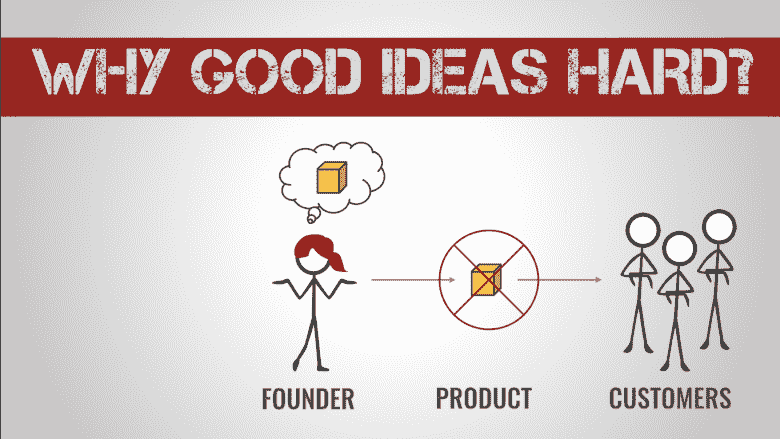
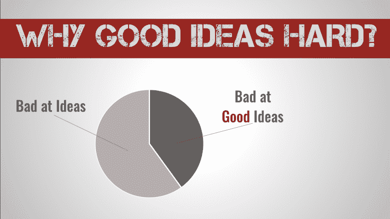
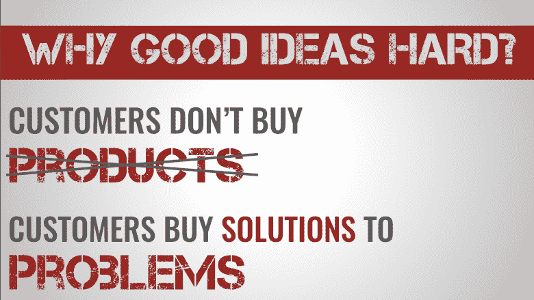
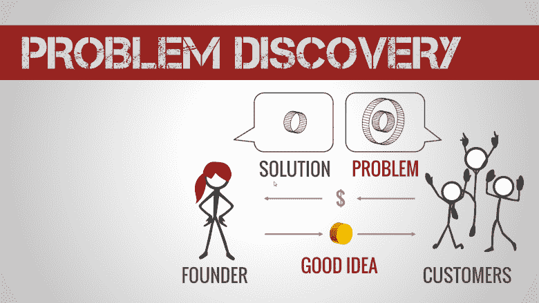
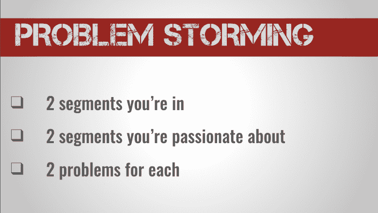
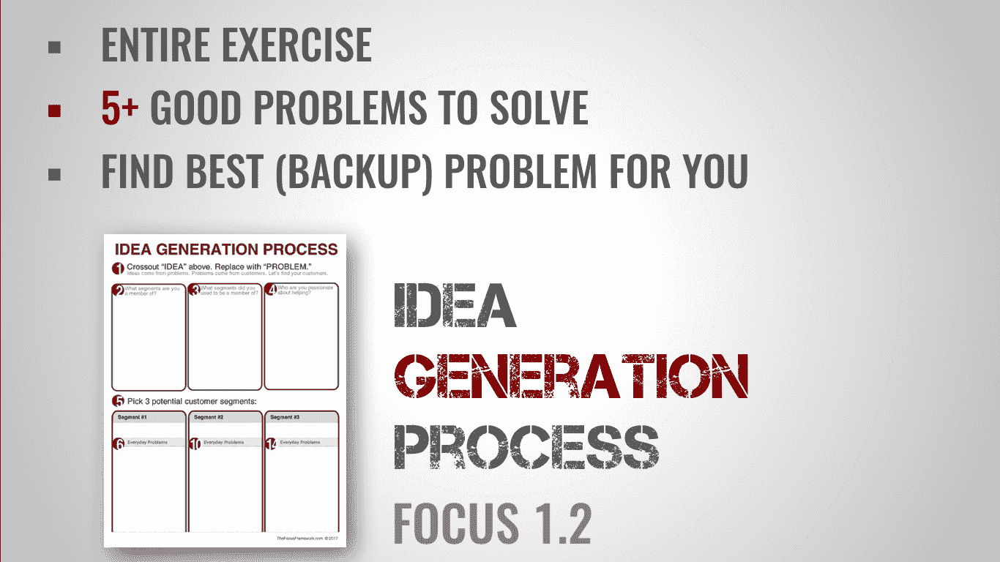

# 找到好的商业点子的秘密——客户开发实验室

> 原文：<http://customerdevlabs.com/2017/03/13/the-secret-to-good-business-ideas/?utm_source=wanqu.co&utm_campaign=Wanqu+Daily&utm_medium=website>

**【更新】**2017 年 3 月 13 日

<iframe class="youtube-player" type="text/html" src="https://www.youtube.com/embed/Giuk17hPL1w?version=3&amp;rel=1&amp;fs=1&amp;autohide=2&amp;showsearch=0&amp;showinfo=1&amp;iv_load_policy=1&amp;wmode=transparent" frameborder="0" allowfullscreen="true">视频</iframe>

好主意很重要。如果你没有想法，你很难开一家公司。

> 但是……只有一个商业想法是远远不够的。

让我告诉你为什么。

想象一下，你有一个非常有激情的想法。你开始兴奋地与潜在客户验证它，但是你得到的反馈是令人失望的。没人感兴趣。没人想买。基本上，全世界都在说:“这很有趣。”(这是说“不，谢谢”的礼貌方式)

只有一个想法，你只有两个选择:

*   放弃你的想法(以及你作为创始人的身份)。
*   忽略你的顾客告诉你的，继续前进。

这两个选择都很糟糕。我不希望你放弃，也不希望你忽视你的客户。

你需要第三种选择，我想推荐一种:**备份业务思路**。

如果你有一套备用的商业想法，你可以虚心听取客户的意见。所以，如果这个世界还没有为第一个想法做好准备，只要你有其他让你兴奋的想法。

> 有备用想法有助于你更快地验证你的主要想法。

### 为什么好的想法很难产生？

要想出好主意，我们必须首先理解为什么它们如此难以实现。

原来，世界上有两种人:

1.  不善于想出商业点子的人。
2.  不善于想出好的商业点子的人。

不认为自己是“创造性思维者”的人不相信自己能想出好的商业点子。

而那些认为自己有创造力的人(包括我自己)每天都会想出一些点子。问题是，不管我们对自己的想法有多兴奋，它们几乎总是很糟糕。

不管你认为自己是谁——有创造力还是没有创造力——我们都不擅长想出好的商业点子。原因如下。

想象有人想出了一个好的商业点子。你认为这个过程是什么样的？

你可能在想某个人，陷入沉思，被某种形式的灵感所触动。此时，他们已经想出了一些出色的新应用、服务或创新小工具。对于这位虚构的创始人来说，不幸的是，他们伟大的新想法注定要失败——他们的客户很可能会拒绝他们。为什么？

客户拒绝产品的原因很简单:

> 客户不买产品。客户购买问题的解决方案。

### 好的商业想法的秘密

我们想不出一种有趣的产品。既然我们知道客户买的是问题的解决方案，那我们就要先从问题入手！

想出好的商业点子的秘诀根本不是关注“点子”，而是关注我们想要解决的问题。

> 想出好主意的终极秘诀是关注问题而不是产品。

### 问题风暴:你获得好主意的秘密武器

为了找出你最适合去解决的问题，让我们来做一个叫做问题风暴的练习。

当我在与创始人的研讨会上做这个练习时，我们提出了至少 5 个需要解决的质量问题。

下面简单介绍一下它的工作原理:

1.  写下你认同的两类人，例如全职妈妈、刚毕业的大学生、素食主义者等..
2.  现在写下你热衷于帮助的两个不同群体，例如资源不足的儿童、滑板爱好者、冥想者等..你现在应该有至少 4 组不同的人写下来。
3.  写出**每个**小组可能正在试图解决**的两个潜在问题**。
    例如，玩滑板的人在公共交通工具上运送滑板可能会有问题，职业妈妈可能会因为没有像全职妈妈那样花那么多时间帮助孩子做作业而感到内疚，等等。

当你完成的时候，你将会有至少 8 个不同的问题需要你去解决，因为…

*   你自己经历过这个问题或者
*   你热衷于为他人解决问题。

这是问题风暴过程的开始。有了 8 个想法后，你至少会有 1 个——可能是 2 个——有希望的问题去研究。

### 下一步是什么

如果你只从这一课中学到一件事，那就是:

> 客户不买产品。客户购买问题的解决方案。

所以好的商业创意的秘密不是关注“想法”，而是关注“问题”当你用客户的问题作为你“想法”的灵感时，你的客户会非常高兴，他们会预付你解决方案的费用:

> 这就是你如何知道你有了一个好主意。

继续解决问题，直到你有至少三个你想解决的问题。一旦你有了这些，是时候[优先考虑那些问题](https://customerdevlabs.com/2013/10/01/picking-customer-segment-startup-weekend-next/)并开始确认[人们正在试图解决它们](https://customerdevlabs.com/2013/11/05/how-i-interview-customers/)！

## 需要帮忙吗？

看看完整的[想法产生过程](https://thefocusframework.com/al/2)。它将帮助您:

1.  探索**所有**你特别适合解决的问题
2.  找出最适合你解决的**问题**
3.  并且想出至少 **5 个让你兴奋的后备想法**

[T2】](https://thefocusframework.com/al/2)

想法产生流程是[焦点框架](https://thefocusframework.com/al/2)工作簿系列的第二个练习。

> FOCUS 将寻找产品与市场匹配的庞大过程分解成可操作的步骤。

如果你想在应用精益创业或商业模式验证过程中得到帮助，看看[焦点框架](https://thefocusframework.com/al/2)。

### *相关*