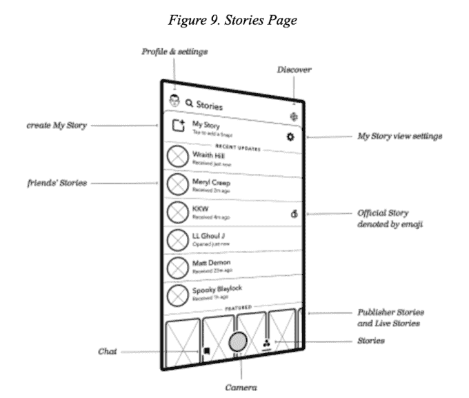
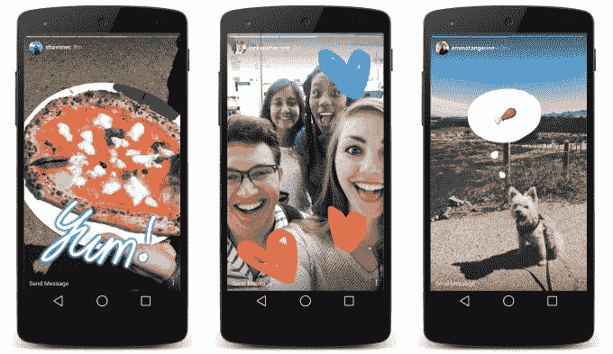
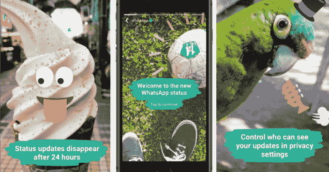
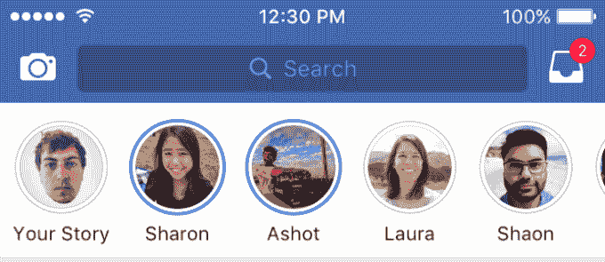

# 故事是新的新闻来源 TechCrunch

> 原文：<https://techcrunch.com/2017/03/26/camera-is-the-new-keyboard/?utm_source=wanqu.co&utm_campaign=Wanqu+Daily&utm_medium=website>

如果相机是新的键盘，那么社交媒体的未来将看起来更像幻灯片，而不是 Word 文档。因此，虽然 Snapchat 发明了故事，但我们将不得不习惯在任何地方使用它们。

我们仍然可以称赞 Snapchat，或者对脸书改变我们每天使用的应用程序感到愤怒，但我们必须接受这就是我们现在的现实。

脸书推广算法分类饲料。Tinder 普及了双方同意连接的是/否刷卡。博客，博客。谷歌，PageRank。ICQ，即时通讯。我们今天使用的许多产品都是基于其他地方首创的宽泛概念。第一批借用/窃取/复制/“受其启发”的应用最终可能会被称为克隆。

然而，最终我们不再将所有权分配给创始者，将羞耻分配给追随者，而是开始研究一个机制如何被独特地实现的复杂性。

Snap 公司的故事运作图

脸书从不回避这种观点。当 [Instagram Stories 推出](https://beta.techcrunch.com/2016/08/02/silicon-copy/)时，首席执行官凯文·斯特罗姆告诉我“这不是关于谁发明了什么。**这是关于一种格式**，以及你如何把它带到一个网络上，并在上面加入你自己的想法。”

几个月后，当[信使日](https://beta.techcrunch.com/2017/03/09/facebook-messenger-day/)启动时，脸书的信息副总裁 David Marcus 反映了这种情绪，他说“**我认为故事格式绝对是一种格式，就像 feed 是一种格式一样。**作为一种格式，它在不同的上下文中才有意义。在我看来，看看外面在做什么，并试着让它适应你所拥有的平台，这是一件非常酷的事情。”

Systrom 更愿意[提供 Snap credit](https://beta.techcrunch.com/2016/08/02/silicon-copy/) ，而 Marcus 似乎有意避免在我们的采访中提到竞争对手的名字。但两家公司都在自己的产品中大力推广这些照片/视频幻灯片，而 [WhatsApp 在一个单独的标签中添加了格式](https://beta.techcrunch.com/2017/02/20/whatsapp-status/)，脸书继续[扩展](https://beta.techcrunch.com/2017/03/15/facebook-stories-roll-out/)[的测试](https://beta.techcrunch.com/2017/01/25/facebook-stories/)其自己的故事功能。T9】

Instagram 故事

如果这个世界上最受欢迎的社交媒体公司没有将这种格式视为分享的必然未来，它就不会迅速将其四大产品转向故事。这本质上是一种沟通，即“我们要么上船，要么被忽略”。

## 新闻提要:故事::文本和链接:照片和视频

当脸书在 2006 年推出新闻订阅时，它是为桌面设计的。它很棒，可以让你在键盘上输入文本状态，复制并粘贴到其他网站的链接，因为呆在家里的电脑上，没有其他有趣的东西可以分享。凭借其宽阔的页边距，它可以展开文本并横向链接广告，这样当你滚动时就很容易浏览。照片更麻烦，需要你用数码相机拍摄，然后上传到你的电脑上，再分享给脸书。

在我们拥有智能手机之前，这还不错。但是现在，脸书和 Snap 都在向视觉沟通(T2)发展。埃文·斯皮格尔在 [Snap 致投资者](https://www.sec.gov/Archives/edgar/data/1564408/000119312517029199/d270216ds1.htm)的 IPO 信中写道，“就像闪烁的光标成为台式电脑上大多数产品的起点一样，我们相信相机屏幕将成为智能手机上大多数产品的起点。”一周后，Messenger Day 产品经理 Tony Leach [告诉我](https://beta.techcrunch.com/2017/03/08/the-camera-is-the-keyboard/)“我们喜欢把相机想象成新的键盘。”

这意味着新闻提要已经过时。

信使日

垂直滚动会在照片和视频之间留下空白。默认情况下，它们并不总是全屏显示。跳过几十个需要大量的拇指工作。

将相隔几分钟或几小时分享的内容视为完全不同的算法排序新闻馈送也不适合现代媒体创作行为。在智能手机出现之前，它的效果更好，那时我们通常在拍摄照片和视频后很久才批量共享它们。社交媒体消费是零星的，而不是每天多次的活动，  所以内容必须是永久的，否则大多数人可能会错过。

在移动的早期，相机质量、存储容量、屏幕尺寸和带宽也限制了我们捕捉多少内容。我们通常只分享我们生活中几天或几年后仍然有趣的重大亮点，并且每天不多次发布。这个 feed 不用担心把同一天的不同照片或视频按错误的顺序排列，混淆叙述。你可以认为这是照相手机 1.0 时代(因为旧翻盖手机上的那些微小传感器更像 0.1)。

WhatsApp 状态

但是随着我们的相机、存储设备、屏幕和网络的改进，我们想要捕捉我们生活中更多的东西——片刻之间的无聊时光，而不仅仅是精彩瞬间。这意味着这些帖子需要整合成一个有凝聚力的故事，确保观众在看到最新或最有趣的帖子之前，了解我们过去帖子的背景。人们一整天都在使用社交媒体。我们开始更频繁地分享，并在那一刻交流，而不是永远代表我们自己，所以让内容永久化只会建立一个不相关的垃圾堆。

与此同时，在手机上打字变得越来越麻烦，复制和粘贴链接也变得越来越麻烦，不需要同时在屏幕上显示多个浏览器标签。无论如何，当我们外出享受生活时，我们有更生动、更紧急的事情要分享。

脸书故事

因此，面对这样一个可怕的事实，即其主要的内容分享媒体对于从键盘到摄像头的转变准备不足，脸书做了它最擅长的事情:适应，即使用户并不总是喜欢它。

*   新闻发布时，数百万人抗议。但是脸书知道社交网络将变得更多的是与他人分享，而不仅仅是整理我们自己的个人资料
*   在尝试通过 HTML5 将旧网站包装在一个应用中的重大失误之后，脸书将移动作为其产品和工程团队的重点，所有用户都追随其脚步
*   当脸书第一次意识到拍照手机 1.0 时代的曙光时，它明智地收购了 Instagram，尽管它已经在开发一款脸书拍照应用
*   脸书将聊天从其主应用中分离出来，并强迫人们单独下载 Messenger。大量用户抱怨他们不想要另一个脸书应用程序…直到他们意识到他们会发多少消息，并且每次节省这些额外的点击是至关重要的。

现在，脸书的应用程序正在适应故事，因为它宁愿被称为抄袭而不是过时。