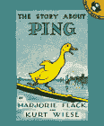

# PING 程序的故事

> 原文：<http://ftp.arl.army.mil/~mike/ping.html?utm_source=wanqu.co&utm_campaign=Wanqu+Daily&utm_medium=website>

<center>

# PING 程序的故事

</center>

是的，是真的！我是 UNIX 版 **ping** 的作者。Ping 是我在一个晚上写的一个几千行的小程序，实际上*每个人*似乎都知道它。:-)

我根据声纳发出的声音给它命名，灵感来自回声定位的整个原理。在大学里，我做过很多声纳和雷达系统的建模，所以“网络空间”的类比似乎非常恰当。这与应用于一个新的问题域的范例完全相同:ping 使用定时的 IP/ICMP ECHO_REQUEST 和 ECHO_REPLY 数据包来探测到目标机器的“距离”。

我为 4.2a BSD UNIX 编写 PING 的最初动力来自于 1983 年 7 月 Dave Mills 博士的一段即兴评论，当时我们正在挪威参加 DARPA 会议，他描述了他在他的“fuzz ball”LSI-11 系统上所做的一些工作，使用定时 ICMP Echo 数据包来测量路径延迟。

1983 年 12 月，我在 BRL 遇到了一些奇怪的 IP 网络行为。回想起米尔斯博士的评论，我很快编写了 PING 程序，它围绕着打开一个 ICMP 风格的 SOCK_RAW AF_INET Berkeley 风格的套接字()。代码编译得很好，但是没有用——没有对原始 ICMP 套接字的内核支持！愤怒之下，我编写了内核支持代码，并在日出之前让一切正常工作。毫不奇怪，在我能够发送我的第一个“ping”数据包之前，查克·肯尼迪(又名“克米特”)已经找到并修复了网络硬件。但从那以后我用过几次。*咧嘴笑*如果我当时知道这将是我一生中最著名的成就，我可能会再努力一两天，增加一些选项。

伯克利的人们急切地收回了我的内核修改和 PING 源代码，从那以后它就成了伯克利 UNIX 的标准部分。由于它是免费的，从那时起，它被移植到许多系统上，包括微软的 Windows95 和 WindowsNT。您可以通过它打印的独特消息来识别它，如下所示:

> ```
> PING vapor.arl.army.mil (128.63.240.80): 56 data bytes
> 64 bytes from 128.63.240.80: icmp_seq=0 time=16 ms
> 64 bytes from 128.63.240.80: icmp_seq=1 time=9 ms
> 64 bytes from 128.63.240.80: icmp_seq=2 time=9 ms
> 64 bytes from 128.63.240.80: icmp_seq=3 time=8 ms
> 64 bytes from 128.63.240.80: icmp_seq=4 time=8 ms
> ^C
> ----vapor.arl.army.mil PING Statistics----
> 5 packets transmitted, 5 packets received, 0% packet loss
> round-trip (ms)  min/avg/max = 8/10/16
> 
> ```

1993 年，也就是我写完《PING》的十年后，协会赠送给我一个精美的卷轴，宣布我是 1979-1993 年颁发给加州大学柏克莱分校计算机系统研究小组的协会 1993**终身成就奖的共同获得者。“颁发给对我们社区深远的知识成就和无与伦比的服务的荣誉。应 CSRG 原则的要求，我们在此承认以下个人和组织为 CSRG 的参与者、贡献者和支持者。‘‘哇！**

想看[源代码](http://ftp.arl.army.mil/pub/ping.shar)？(40k)

在我看来，PING 是*而不是*代表分组互联网 Grouper 的首字母缩略词，这是一个声纳类比。然而，我听说戴夫·米尔斯提供了这个名字的扩展，所以也许我们都是对的。天哪，我还以为政府不喜欢扩大缩写呢！:-)

Phil Dykstra 为 PING 添加了 ICMP 记录路由支持，但在早期很少有路由器处理它们，这使得该功能几乎没有用处。对 IP 报头中可以记录的跳数的限制使其无法测量非常长的路径。

当 LBL 的 Van Jacobson 使用我的内核 ICMP 支持来编写 TRACEROUTE 时，我嫉妒得发狂，因为我意识到他可以在 ping 时通过调制 IP 生存时间(TTL)字段来获得超过 ICMP 生存时间的消息。我希望我想到了这一点！:-)当然，真正的 traceroute 使用 UDP 数据报，因为路由器不应该为 ICMP 消息生成 ICMP 错误消息。

我听过的最好的 ping 故事是在 USENIX 的一次会议上告诉我的，一个网络管理员用一个间歇以太网把 ping 程序和他的声码器程序连接起来，本质上写道:

> ```
> ping goodhost | sed -e 's/.*/ping/' | vocoder
> 
> ```

He wired the vocoder's output into his office stereo and turned up the volume as loud as he could stand. The computer sat there shouting "Ping, ping, ping..." once a second, and he wandered through the building wiggling Ethernet connectors until the sound stopped. And that's how he found the intermittent failure.

## 关于平的故事

这本书的标题与网络无关，但这并不妨碍一位来自乌兹别克斯坦上沃尔特的读者贡献这篇简短但令人愉快的评论，这是在[Amazon.Com](http://www.amazon.com/exec/obidos/ASIN/0140502416/o/)书商网站上短暂看到的，并作为关于*另一个*平的故事的一部分保存在这里。*grin*

> 关于平的故事
> 
> 阅读水平:婴儿-学龄前
> 
> 平装本——36 页(1977 年 8 月)。维京公关；ISBN:0140502416；尺寸(英寸):0.17 x 8.86 x 7.15
> 
> ================================================================
> 
> #### 复习
> 
> 《一只小鸭独游长江的故事》、《平的故事》是一本甜蜜有趣的书，插图丰富多彩。像往常一样的一天，平和他滑稽的大家庭从他称为家的船上出发，寻找“好吃的东西”在这特殊的一天，当船离开时，他意外地被落下。这只小鸭子毫不畏惧，扬子江去寻找他的家人，却在每个转弯处都发现了新的朋友和冒险，还有一点危险。
> 
> 从平的家庭到他发现自己置身其中的训练有素的捕鱼鸟，再到忠实呈现的船只和渔民，这些出色的插图将郁郁葱葱的长江展现得栩栩如生。关于平的故事当然是要大声朗读的，它值得在每个年轻读者(或听众)的书架上占有一席之地。(绘本)
> 
> #### 摘要
> 
> 童年经典。“库尔特·威斯和马乔里·弗莱克在《平》中以长江为背景塑造了一只极具个性的小鸭子，既准确又有魅力。”-纽约时报。全彩插图。
> 
> 片名简介:一天晚上，一只小鸭子来不及登上主人的船屋，就在长江上开始了冒险。
> 
> 卡片目录描述:一天晚上，一只小鸭子来不及登上他主人的船屋，于是他在长江上开始了冒险。
> 
> ================================================================
> 
> #### 客户意见
> 
> 一位来自乌兹别克斯坦上沃尔特的读者，1999 年 3 月 7 日
> 
> 优秀，温暖人心的探索和发现的故事。通过巧妙的比喻，作者对 Unix 最古老的网络实用程序之一提供了深刻而直观的解释。更令人吃惊的是，他们显然是在使用该程序的早期测试版，因为他们的书首次出现在 1933 年，几年(几十年！)在操作系统和网络基础设施最终确定之前。
> 
> 这本书用连孩子都能理解的术语描述了网络，选择了拟人化底层的数据包结构。ping 数据包被描述为一只鸭子，它和其他数据包(更多的鸭子)一起在主机上花费一定的时间(慧眼船)。每天的同一时间(我怀疑这是 cron 安排的)，小数据包(鸭子)通过桥(桥)离开主机(船)。数据包从桥上传到互联网(这里用长江来表示)。
> 
> 标题字——诶，包，叫平。平在被另一个主人(另一艘船)接收之前在河周围蜿蜒。他在另一艘船上呆了一会儿，但最终还是回到了他原来的主机(慧眼船)上，只是有些磨损。
> 
> 这本书避免了人们可能会想到的许多陈词滥调。例如，以一条河为背景的故事，作者可能已经沉入使用那种老掉牙的情节安排:洪水平。作者巧妙地避免了这一点。
> 
> 谁应该买这本书
> 
> 如果您需要对 ping 实用程序有一个很好的、高水平的概述，这就是这本书。我不能向大多数经理推荐它，因为技术方面可能太难了，基本概念太令人生畏。
> 
> 这本书的问题
> 
> 尽管平的故事很好，但也不是没有缺点。没有索引，尽管 ping(8)手册页很好地介绍了命令行选项，但是对它们进行一些回顾似乎是有必要的。同样，在一本只讨论 Ping 的书中，我会期待对 ICMP 数据包结构有一个更详细的概述。
> 
> 但尽管存在这些问题，Ping 的故事还是在我的书架上占了一席之地，就在 Stevens 的《Unix 环境下的高级编程》和我那本翻了边的但丁的开创性著作《地狱》(Inferno)之间。谁能读懂 Windows API 上的那段文字(“晦涩，深刻，模糊，所以通过固定它的深度我的视线——我在其中什么也看不到。”)，没有深以为然的摇头。但是我跑题了。
> 
> ================================================================
> 
> 梅丽莎·朗多，1999 年 3 月 11 日，马萨诸塞州布伦特里
> 
> 我收集关于 UNIX 操作系统的参考书。PING(Packet InterNet Groper 的缩写)一直是有用性超越其简单性的 UNIX 命令之一。一位同事告诉我，有一本书专门讲述了这一个命令，“关于 PING 的故事。”我有点惊讶，有整整一本书专门讲述这个 UNIX 命令的历史，但是价格肯定是可以承受的，所以我从一个发行商那里订购了这本书。送来的实际上是一本儿童插图故事书。我认为这是一个错误，但我的同事后来告诉我，他只是在恶作剧。我在出差的飞机上读了这本书，我不得不承认，这是我读过的最好的儿童文学作品之一。这是一个关于冒险和纯真的经典故事，同时也是一个重要的教训。这不是我最初的期望，但仍然是一个愉快的阅读。
> 
> ================================================================
> 
> 一位来自德克萨斯州休斯顿的读者，1998 年 11 月 25 日
> 
> 这是一个关于家庭、冒险和家园的精彩而永恒的故事，我记得袋鼠船长在他的电视节目中读过这本书，那大概是 30 年前的事了。这是一本非常有趣的书，让孩子们了解责任、冒险、家庭和家园。故事简单明了，一只小鸭子决定躲起来，不和其他鸭子一起上船，以此来逃避每晚最后一只上船的鸭子应该受到的惩罚——在背上重重一击。
> 
> 平有他的冒险，并返回到船和他的家人，明智而无辜。与你的孩子分享的好故事。
> 
> ================================================================
> 
> 一位来自新泽西州布伦瑞克的读者，1997 年 11 月 30 日
> 
> 我在平安长大，我仍然爱着它。我现在 21 岁，给每个有孩子的朋友买。它干净，有趣，非常棒。

* * *

[UP](http://ftp.arl.army.mil/~mike/) to Mike's Home Page.
[WAY UP](http://www.arl.army.mil/) to the Lab's Home Page.
[NEXT](http://ftp.arl.army.mil/~mike/ttcp.html) to the story of other great network tools.