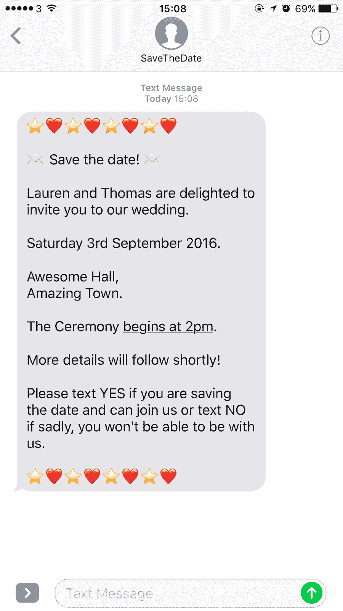
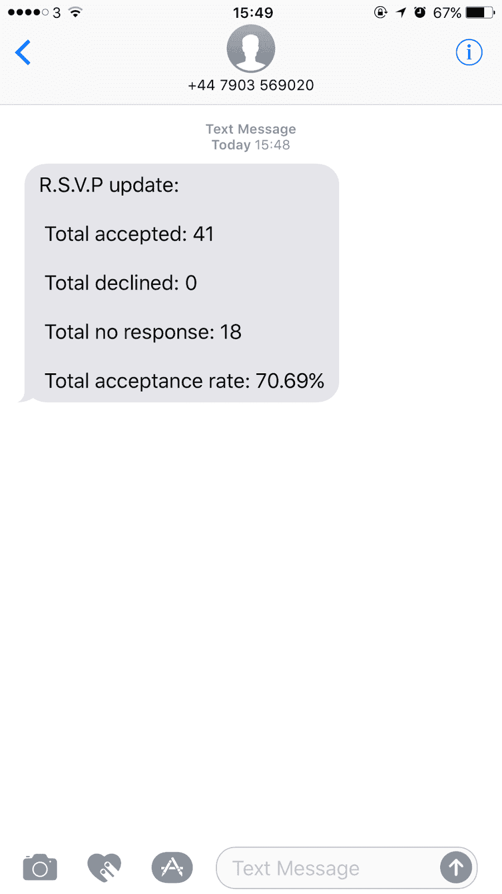
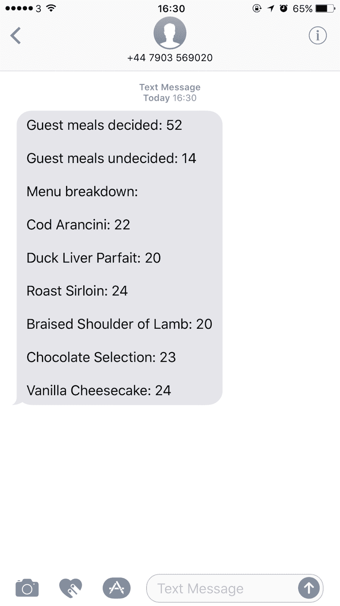
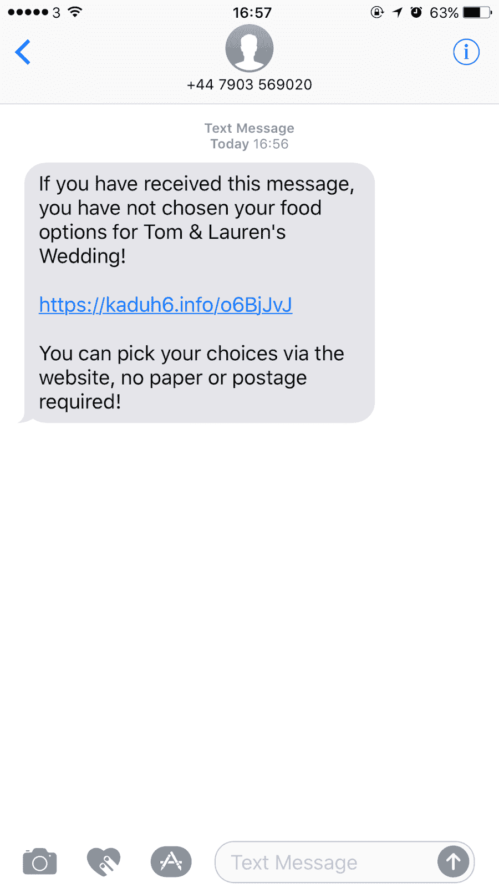
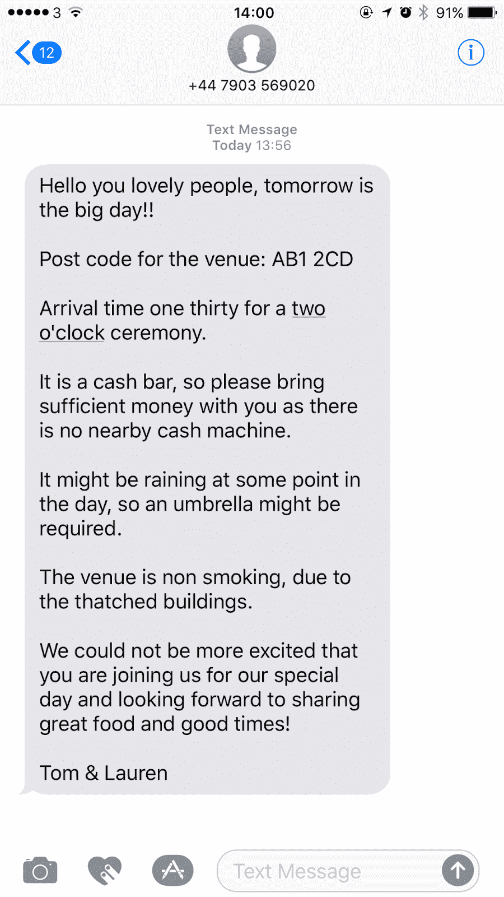

# 大规模婚礼:我如何使用 Twilio、Python 和 Google 来自动化我的婚礼

> 原文：<https://www.twilio.com/blog/2017/04/wedding-at-scale-how-i-used-twilio-python-and-google-to-automate-my-wedding.html?utm_source=wanqu.co&utm_campaign=Wanqu+Daily&utm_medium=website>


2016 年 9 月 3 日对世界上大多数人来说只是一个普通的日子，但对我来说，这一天将永远值得纪念，因为我和我的伴侣结婚了。

有许多不同的方面需要考虑，而规划一个婚礼。食物、装饰、餐桌装置(哦，是的，这些与装饰是分开的)、鲜花、住宿、交通、娱乐和位置。虽然在策划婚礼时有许多未知因素，但我可以肯定一件事。在婚礼中有很多列表，嵌套列表，以及更多的列表。当我盯着越来越多的商品时，我开始想是否有更好的方法？感觉都是手工操作，效率低下。技术肯定会在某些方面有所改进。

你可能会感到惊讶，但邀请人们参加婚礼是非常昂贵的(超过 380 英镑)，因为你需要发出“保存日期”卡和随后的邀请，其中包括婚礼的具体细节。它也很慢，因为你必须通过邮寄。追着人们看他们是否收到邀请，看他们是否愿意参加免费食物和饮料的聚会，这是*的时间密集型*——当然是自动同意吗？最后，请柬是不环保的，因为它们是一次性使用的，很容易丢失或放错地方。

回到列表。客人名单分为几个部分:

1.  你想去的人的名单
2.  回复了你的回复的人的名单
3.  回答“是”的人的名单
4.  回答“是”并选择食物的人的名单

但是列表是好的。它们有预定义的需求和响应，这使它们成为自动化的绝佳候选。

## 瓶子里的信息

不管年龄大小，我确信婚礼名单上的每个人都有一部手机，这意味着是时候了。如果想跳到代码，可以在 GitHub 上查看[回购。](https://github.com/SeekTom/Twilio/tree/master/Wedication)

短信完全满足了我的需求。我可以配置出站群发消息，并快速有效地处理回复。在草拟 MVP 和考虑数据库时，我想要一些容易分享的东西，不想浪费时间构建视图。偶然发现 gspread python 库使我能够 [*读写谷歌电子表格*](https://www.twilio.com/blog/2017/02/an-easy-way-to-read-and-write-to-a-google-spreadsheet-in-python.html) 。虽然不是最快的选择，但它确实足够灵活，并且提供了易于访问和阅读的输出。

对于最初的简历，我创建了一个包含以下栏目的电子表格:

*   名字
*   电话号码
*   确认 _ 状态
*   联系人详细信息状态
*   Message_count(发送给客人的消息数量，稍后会派上用场)

主数据输入完成后，我使用 [gspread](http://gspread.readthedocs.io/en/latest/) 遍历列表，给每个有手机号码的客人发短信:

[Sheets.py](https://github.com/SeekTom/Twilio/blob/master/Wedication/sheets.py)

```
import json
import time
import gspread
from oauth2client.client import SignedJwtAssertionCredentials
from twilio.rest import Client

# Message your attendees from a spreadsheet

# add file name for the json created for the spreadsheet
json_key = json.load(open('.json'))
scope = ['https://spreadsheets.google.com/feeds']

credentials = SignedJwtAssertionCredentials(json_key['client_email'],
                                            json_key['private_key'].encode(),
                                            scope)
gc = gspread.authorize(credentials)
wks = gc.open("wedding_guests")  # add your workbook name here
wks_attendees = wks.get_worksheet(0)  # attendees worksheet

ACCOUNT_SID = 'TWILIO_ACCOUNT_SID'
AUTH_TOKEN = 'TWILIO_AUTH_TOKEN'

client = Client(ACCOUNT_SID, AUTH_TOKEN)

# to iterate between guests, amend this based on your total
for num in range(2, 60):
    print "sleeping for 2 seconds"
    time.sleep(2)  # adding a delay to avoid filtering

    guest_number = wks_attendees.acell('B'+str(num)).value
    guest_name = wks_attendees.acell('A'+str(num)).value
    Message_body = u"\u2B50" + u"\u2764" + u"\u2B50" + u"\u2764" + u"\u2B50" + u"\u2764" + u"\u2B50" + u"\u2764" + "\n\n" + u"\u2709" +" Save the date! "+ u"\u2709" +"\n\nLauren and Thomas are delighted to invite you to our wedding.\n\nSaturday 3rd September 2016\. \n\nAwesome Hall,\nAmazing Town\n\nThe Ceremony begins at 2pm.\n\nMore details will follow shortly!\n\nPlease text YES if you are saving the date and can join us or text NO if sadly, you won't be able to be with us.\n\n" u"\u2B50" + u"\u2764" + u"\u2B50" + u"\u2764" + u"\u2B50" + u"\u2764" + u"\u2B50" + u"\u2764"
    if not guest_number:  # No mobile number skip this guest
        print guest_name + ' telephone number empty not messaging'
        wks_attendees.update_acell('E'+str(num), '0')  # set number to 0

    else:
        print 'Sending message to ' + guest_name
        client.messages.create(
            to="+" + guest_number,  # add the + back to make the number e.164
            from_="",  # your twilio number here
            body=message_body,
        )
        wks_attendees.update_acell('E'+str(num), int(wks_attendees.acell('E'+str(num)).value) + 1)  # increment the message count row
else:                  # else part of the loop
    print 'finished' 
```

由于 SMS 看起来有点简单，我添加了一些 unicode 码来增加趣味。以下是幸运的受邀者看到的信息:



接下来，我使用 Flask 作为我的 web 服务器，并将我的 Twilio 消息请求 URL 设置为指向一个`/messages` url，并创建简单的 if 语句来解析回复(yes，no):

[hello_guest.py](https://github.com/SeekTom/Twilio/blob/master/Wedication/hello_guest.py)

```
from twilio.twiml.messaging_response import MessagingResponse

@app.route("/messages", methods=['GET', 'POST'])
def hello_guest():

    resp = MessagingResponse()
    from_number = request.values.get('From', None)
    from_body = request.values.get('Body', None)
    number = from_number
    body_strip = from_body.lower()
    if "yes" in body_strip:
        # We have a keeper! Find the attendee and update their confirmation_status
        wks_attendees.update_acell("F"+str(guest_confirmation_cell.row), 'Accepted')  # update the status to accepted for that guest
        resp.message(u"\u2665" + "Thanks for confirming, we'll be in touch!" + u"\u2665")  # respond to the guest with a confirmation!

    elif "no" in from_body.lower():
        # update the confirmation_status row to declined for that guest
        wks_attendees.update_acell("F"+str(guest_confirmation_cell.row), 'Declined')
        # respond to the user confirming the action
        resp.message("Sorry to hear that, we still love you though!")

    else:  # respond with invalid keyword
        resp.message("You sent a different keyword, we need a yes or a no, you sent: "+  
                     from_body)
    return str(resp) 
```


第一条信息是在 2 月 19 日上午 8:37 发出的，第一条确认信息是在三分钟后的 8:40 收到的。到上午 9 点 38 分，我已经收到了 23 封确认信，也就是 32%的接受率！在最初群发信息的两天后，我们有 58%的客人确认了！尽管取得了明显的成功，但我那即将成为妻子的手机短信并没有完全把我当成婚礼邀请服务(SAAWIS？)，所以我决定给我的应用增加一些功能。

统计！我可以计算现场出席名单，并根据需要返回，给准新娘即时反馈客人名单是如何形成的。代码非常简单，因为我已经在电子表格中设置了一些基本的计数器，所以只需获取这些单元格的内容并将其添加到 SMS 中:

[hello_guest.py](https://github.com/SeekTom/Twilio/blob/master/Wedication/hello_guest.py)

```
# attendance variables
guest_confirmed = wks_attendees.acell('C70').value
guest_unconfirmed = wks_attendees.acell('C71').value
guest_no_response = wks_attendees.acell('C72').value
guest_acceptance = wks_attendees.acell('C73').value

elif "numbers" in from_body.lower():
    # return statistics (total guests, food choices list)
    resp.message("R.S.V.P update:\n\nTotal Accepted: " + guest_confirmed  
                 "\n\nTotal declined: "   guest_unconfirmed   "\n\nTotal no response: "+  
                 guest_no_response + "\n\nTotal acceptance rate: " + guest_acceptance) 
```

以下是生成的短信:


不完全漂亮，但相当有用。

劳伦现在可以记录出勤情况的事实是一种压力缓解。从那时起，所有的系统都运转正常，短信也尽可能地融入到婚礼的方方面面。有些是显而易见的，比如在婚礼网站上线时发送通知短信(自然是由 Heroku 提供支持的),分享礼物清单以及其他我至今仍引以为豪的事情。

## 食物，美味的食物

在建立了简历表之后，最常被耽搁的是让客人确认食物选择。你会惊讶地发现让人们选择免费食物有多难。第一步是发出另一条短信，告诉那些已经同意访问网站的客人，通过谷歌表单选择他们的食物。非常标准的东西，但是，该表单被设置为填充与与会者相同的工作簿。这意味着我现在有了被接受的客人的电子表格，以及那些填写了食物选择表的人的电子表格。通常情况下，我必须等待客人慢慢选择他们的食物，但我的婚礼是由 Twilio 驱动的，这意味着我可以毫不费力地追逐人们。

数据需要匹配客人姓名的两个电子表格，如果匹配，更新客人的食物选择状态。这需要一点额外的工作，但一旦代码被排序，我可以按需批量运行脚本，并在最后通过 SMS 获得我的与会者选择的最新状态:

[food.py](https://github.com/SeekTom/Twilio/blob/master/Wedication/food.py)

```
import json
import time
import gspread
from oauth2client.client import SignedJwtAssertionCredentials
from twilio.rest import Client

# add file name for the json created for the spread sheet
json_key = json.load(open(''))
scope = ['https://spreadsheets.google.com/feeds']

credentials = SignedJwtAssertionCredentials(json_key['client_email'],
                                            json_key['private_key'].encode(),
                                            scope)
gc = gspread.authorize(credentials)
wks = gc.open("")  # add your spreadsheet name here
wks_attendees = wks.get_worksheet(0)  # attendees worksheet
wks_food = wks.get_worksheet(1)  # food responses worksheet

ACCOUNT_SID = 'TWILIO_ACCOUNT_SID'
AUTH_TOKEN = 'TWILIO_AUTH_TOKEN'

client = Client(ACCOUNT_SID, AUTH_TOKEN)

# to iterate between 10 to 60 manual hack to ensure no guests not left out
for num in range(2, 60):
    food_guest_name = wks_food.acell('B'+str(num)).value  # food choice name column

    if food_guest_name:
        attendees_name = wks_attendees.find(val_food_guest_name).value
        attendees_name_row = wks_attendees.find(val_food_guest_name).row
        menu_status = wks_attendees.acell("G"+str(attendees_name_row)).value

        if food_guest_name == attendees_name:
            print
            if menu_status == 'Y':  # data already matched, move on
                print('Skipping')

            else:  # user has supplied their choices, update main spreadsheet
                print ('Food sheet name ' + food_guest_name + 'Attendees sheet name ' + attendees_name)
                # update menu choices row
                wks_attendees.update_acell("G"+str(attendees_name_row), 'Y')
        else:
            print('nothing found, moving on')
            wks_attendees.update_acell('E'+str(num), int(wks.acell('E'+str(num)).value) + 1)  # increment the message count row

    else:
        # send message to the admin that the process has been completed with update stats
        client.messages.create(from_="",  # twilio number here
                               to="",  # admin number here
                               body="Finished processing current meal listnnGuest meals confirmed" + guest_meals_confirmed + "\n\nGuest meals unconfirmed: " + guest_meals_unconfirmed) 
```

既然已经有了确定的客人名单和越来越多的食物选择，那么通过主应用程序公开这些统计数据是有意义的。所有需要做的就是抓取相关单元格的内容，并回复一条短信:

[Hello_guest.py](https://github.com/SeekTom/Twilio/blob/master/Wedication/hello_guest.py)

```
# respond with the current food totals and the meal choices
elif "food" in body_strip.strip():

    resp.message("Guest meals decided:" + guest_meals_confirmed + 
                 "\nGuest meals undecided: " + guest_meals_unconfirmed +
                 "\n\nMenu breakdown:\n\n" + starter_option_1 +": " +
                 starter_option_1_amount + "\n" + starter_option_2 +": " +
                 starter_option_2_amount + "\n" + starter_option_3 +": " +
                 starter_option_3_amount + "\n" + main_option_1 +": " +
                 main_option_1_amount + "\n" + main_option_2 +": " + main_option_2_amount +
                 "\n" + main_option_3 +": " + main_option_3_amount + "\n" +
                 dessert_option_1 + ": " + dessert_option_1_amount + "\n" + dessert_option_2
                 + ": " + dessert_option_2_amount) 
```



这是非常方便的，让婚礼宴会承办人了解我们的进展，并提供可操作的数据，谁没有选择。追逐客人是自动化的另一个候选对象。只需遍历与会者列表，找到没有选择用餐选项的淘气客人，并向他们发送消息！

[Chase.py](https://github.com/SeekTom/Twilio/blob/master/Wedication/chase.py)

```
for num in range(2, 72):  # manual hack to ensure no guests not left out
    print "sleeping for 3 seconds"

    time.sleep(3)  # adding a delay to avoid carrier filtering
    wedding_guest_number = wks_attendees.acell('B'+str(num)).value  # grab attendee tel number
    wedding_guest_name = wks_attendees.acell('A'+str(num)).value  # grab attendee name
    menu_guest = wks_attendees.acell('G'+str(num)).value

    if not wedding_guest_number:
        print wedding_guest_name+' telephone number empty not messaging'  # output to console that we are not messaging this guest due to lack of telephone number
        wks_attendees.update_acell('H'+str(num), '1')  # increment the message count row for the individual user

    else:
        if menu_guest == "N":  # guest has not chosen food! CHASE THEM!
            print 'Sending message to '+wedding_guest_name
            client.messages.create(
                to="+" + wedding_guest_number,
                from_="",  # your Twilio number here
                body="If you have received this message, you have not chosen your food options for Tom & Lauren's Wedding!\n\nYou can pick your choices via the website, no paper or postage required!\n\nhttp://www.yourwebsitehere.com/food"
            )
            wks_attendees.update_acell('H'+str(num), int(wks_attendees.acell('H'+str(num)).value) + 1)  # increment the message count row for the individual user
else:                  # else part of the loop
    print 'finished' 
```



这个重要的日子来得比我们想象的还要快。剩下唯一要做的事情是发送最后一条短信，提醒客人基本细节，并为自己准备一把伞，以抵御典型的多雨的英国夏季:



## 概括起来

婚礼从来都不是简单的事情，感觉很多方面都超出了你的控制。自动化无疑让我的生活变得更轻松，因为它提供了一个与我们的客人直接沟通的渠道，以及无数种我可以跟踪、推动和促使他们做出回应的不同方式。它帮助我们在婚礼中众所周知的耗时方面变得积极主动，让我们可以专注于这个大日子的其他重要方面。

为复杂的问题构建可伸缩的解决方案从来都不容易，即使在最终形式下，我的应用程序有时也很脆弱。我曾计划构建一个更完整的解决方案，包括进度数据可视化、语音集成和减少对 CLI 脚本的依赖，但时间占了我的上风。总的来说，我对事情的进展很满意。没有一个沟通系统是完美的。你需要实现最适合你的受众的渠道，无论是[短信](https://www.twilio.com/docs/api/rest/sending-messages)、[语音](https://www.twilio.com/docs/api/rest/making-calls)、[聊天](https://www.twilio.com/docs/api/chat)、[视频](https://www.twilio.com/docs/api/video)，还是[旗语](https://en.wikipedia.org/wiki/Semaphore_(programming))。

要说婚礼自动化，我是 [@seektom 在 Twitter](https://twitter.com/SeekTom) 。

🎉感谢您的反馈！

出事了。请再试一次。

