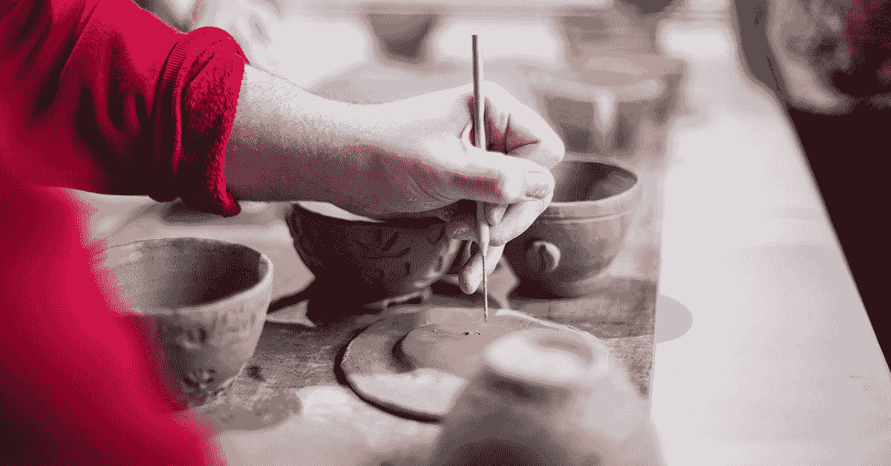

# 尽可能多地建造|第 8 道光

> 原文：<https://8thlight.com/blog/jerome-goodrich/2017/03/23/favor-prolificity.html?utm_source=wanqu.co&utm_campaign=Wanqu+Daily&utm_medium=website>

> 一位陶艺老师将她的入门课分成“数量”组和“质量”组。“数量”组的学生只根据他们制作的陶罐数量来评分，而“质量”组的学生只根据他们选择评分的陶罐的质量来评分。当评分的时间到来时，一个明显的趋势开始出现——不仅“数量”组的学生制作了更多的锅，而且他们制作的锅比“质量”组的质量更高。“这很自然。”这位老师心想:“当‘质量’部门忙着*考虑*制作完美茶壶的各种不同方法时，‘数量’部门忙着*制作*茶壶。“数量”部门从他们的错误中吸取教训，而“质量”部门则试图避免这些错误。在陶艺中，就像在所有其他学科中一样，你必须把手弄脏。”

大约五年前，我从一个朋友那里第一次听到这个寓言，它一直伴随着我。后来，他解释说，与其说这是对完美主义的谴责，不如说这是对多产的一次集会。框架是至关重要的。“不要做一个完美主义者”不如“尽你所能去建造”那样可行。

在第 8 道光，可以毫不夸张地说“尽你所能建造”是我们给学徒的唯一指示。这可能不是那些确切的话，但这种情绪融入了每一次互动。一定是。对于一个人来说，通过学徒制取得进步或提高他们在任何行业的水平的唯一方法就是制造越来越多的东西。这个事实是如此直观和简单，以至于在这里提及它似乎是愚蠢的。这种想法是错误的。“尽可能多地建造”不是老生常谈。这是一种技能。

想和做之间有差距。这种差距是由于害怕建造错误的东西或不知道如何开始而扩大的。它通过过度的研究、向同事提问，以及关于某个东西应该如何建造的理论和预测而显现出来。所有这些，都是为了规避各种形式的失败。缩短差距意味着通过接受失败是不可避免的来克服这些恐惧——这是可以利用的，而不是恐惧。当失败变成信息而不是灾难时，冒险让你头脑中的东西成真就容易多了。

当失败很小很具体的时候，它就变成了信息。如果它们很小，通常可能掩盖任何相关数据的影响就会变得微不足道。如果它们是具体的，数据的质量会更好，可以用来获得有意义的见解。在小而具体的块中工作，你的失败也会随之而来。我发现时间是最有用的限制因素。如果我只给自己 30 分钟的时间去做某件事，比没有约束的情况下更容易开始。如果我能花时间明确说明我在那半个小时里想做什么，我的成绩会提高。时间过去后，我可以很快看到我所做的是否与我想要做的相匹配。

最终，思想和行动之间的差距——多产的障碍——是信心的差距。雾化你的工作和改善你得到的反馈类型只能让你到此为止。最终，你必须“弄脏你的手”所以找个时间(我的时间是早上 6:30)坐在办公桌前，花 30 分钟尽可能多地锻炼。特别是在困难的时候去做；当你生病、疲倦或迟到时。这才是最重要的。总有一天，你会因为你的纪律而一事无成。不要气馁。过程和结果一样重要。如果你履行承诺的时间足够长，你的工作量将会增加，并迫使观念发生转变。随着信念越来越坚定，你创造的越多，你就会开始认为自己是一个创造东西的人。仅此一点就会给你信心去做更多。