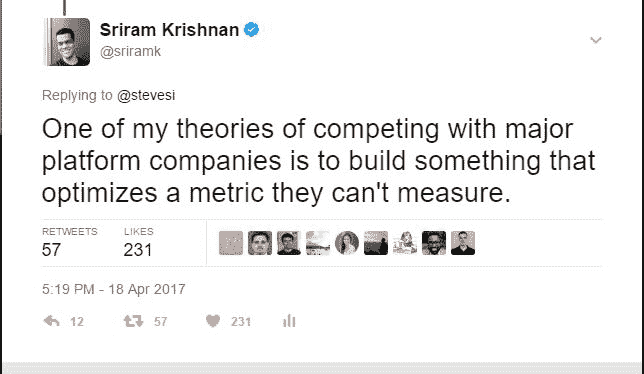

# 建造别人无法测量的东西| sriramk.com

> 原文：<http://sriramk.com/building-unmeasurable-things?utm_source=wanqu.co&utm_campaign=Wanqu+Daily&utm_medium=website>

## 

建造别人无法测量的东西

几天前，我写了一条[推文](https://twitter.com/sriramk/status/854489470514601984)，得到了很多回应。这到底是什么意思？这只是那些在科技业内人士看来很聪明，但实际上并不意味着什么的推文之一吗？好吧，是的，但是我决定自己把一个模糊的“策略”推文扩展成一个更长、更模糊的博客帖子，其中有 500%更模糊的“策略”。

任何大型系统都会选择一个指标作为自己的目标。关于这个指标的重要性，已经有整本书和篇幅太长的媒体文章发表了——它影响着一切，从人们的激励到你能多快优化你的业务。在一个相当于薛定谔的猫的组织中，选择指标本身会导致怪异的文化扭曲(见古德哈特定律)。

因为完美地测量人类行为几乎是不可能的，大多数大型团队/产品选择一个代理指标来测量潜在的行为。例如，“点击”代表“我读过这个吗？”以及“我会在未来某个时候购买该产品吗？”“花费的时间”代表“我喜欢这个内容吗？”而 NPS 往往是“我爱这家公司吗？”。您将模糊的人类情感/行为转换为可量化的指标，您可以根据这些指标来调整执行，并贴在图表上，以此来衡量团队。工程师和数据科学家对“这让人感到温暖和模糊”毫无办法。他们可以通过“这个特性使 metric X 每周提高 5%”来做很多事情。弄清楚这两者之间的联系往往是产品管理的艺术和科学。

这是初创公司和反叛者的机会所在。

这些指标从未真正捕捉到他们试图测量的潜在人类情感或行为。为了让事情变得更有趣，他们几乎总是创造第二行为，这使得度量上升，但是以一种系统设计者没有预料到或者想要的方式。

例如，就设计师想要什么、他们建造/测量了什么以及他们无意中造成了什么而言:

*   优质新闻报道→衡量点击量→创造吸引点击的内容
*   一个广告是否能引起人们的共鸣→衡量人们看了一个广告多长时间→用各种策略诱使人们去看广告。

如果你把这个应用到技术之外，你可以模糊地把这个框架应用到更广泛的问题上。[这个](https://www.ribbonfarm.com/2016/09/29/soft-bias-of-underspecified-goals/)和[这个](http://kortina.nyc/essays/metrics-incrementalism-and-local-maxima/)都是很棒的帖子，它们详细介绍了我从哪里偷来的这些帖子。举几个例子。

*   雇佣并留住最好的老师→衡量考试成绩→“教授考试”
*   政府为人民建设长期基础设施→任期限制→每届政府都优化以在 4-5 年内获得连任。

公司当然知道这一点，他们不是傻瓜。他们只是没有更好的选择。在规模上，你通常不得不满足于你可以衡量/优化或货币化的东西。你还必须满足于短期优化的指标——这是目前推动季度收益或竞争动态或产品迭代循环的因素。这是你能做到的最好的，而且通常已经足够好了。

但是你，作为一个局外人，你可以做得更好。如果你能发现这个盲点，你就能创造出一些东西，占领一个现有的在位者无法轻易占领的空间。这并不容易，几乎总是需要对产品/人类/社区的一些本能或直觉，这些并不广为人知，而且就其本质而言，是高 beta。

这方面有一些疯狂、不切实际的例子。

*   一个让你花更少时间在社交网络上的社交网络，并试图让你更多地外出/锻炼，而不是为了长期健康而优化。
*   没有统一在线存在的小众社区/行为(因此不容易被外人衡量/理解)。
*   仅出售健康商品的有限目录的超市。
*   只有要求你花大量时间阅读的长篇作品。
*   当你醒来、睡觉前或与家人在一起时，移动操作系统不会向你显示非紧急通知(从[特里斯坦·哈里斯](https://journal.thriveglobal.com/how-technology-hijacks-peoples-minds-from-a-magician-and-google-s-design-ethicist-56d62ef5edf3)偷来)。

虽然从表面上看，这些可能听起来只是反向的，但其中大多数所做的是优化一些长期的/不太可衡量的东西，其中现任者受到时间和他们可以衡量的东西的限制。

你可能已经注意到了其他一些东西——它们几乎都很难货币化或建立可持续的业务，因为现有的货币化/外部系统也都符合现有的指标(试图限制客户每年花费金额的商业公司面临真正的挑战)。

没人说这很容易。但如果你能在这里穿针引线，让它发挥作用，就有真正的价值。用我所有童年数学课本中令人沮丧的话来说，如何做到这一点是留给读者的练习。

一些好玩的延伸阅读[这里](https://www.ribbonfarm.com/2016/09/29/soft-bias-of-underspecified-goals/)、[这里](http://kortina.nyc/essays/metrics-incrementalism-and-local-maxima/)、[这里](http://goodregulatorproject.oimg/Every_Good_Key_Must_Be_A_Model_Of_The_Lock_It_Opens.pdf)、[这里](https://en.wikipedia.org/wiki/Management_by_objectives)、[这里](https://journal.thriveglobal.com/how-technology-hijacks-peoples-minds-from-a-magician-and-google-s-design-ethicist-56d62ef5edf3)和[这里](https://en.wikipedia.org/wiki/Goodhart%27s_law)。

更新:一些相对于理论的更具体的例子。

*   当流行的智慧是最大化在网站上的时间时，谷歌优化了发送人们离开它的网站
*   当其他零售商都在努力降低退货率时，Zappos 进行了优化，让退货体验成为一种享受，成为购物的一部分。