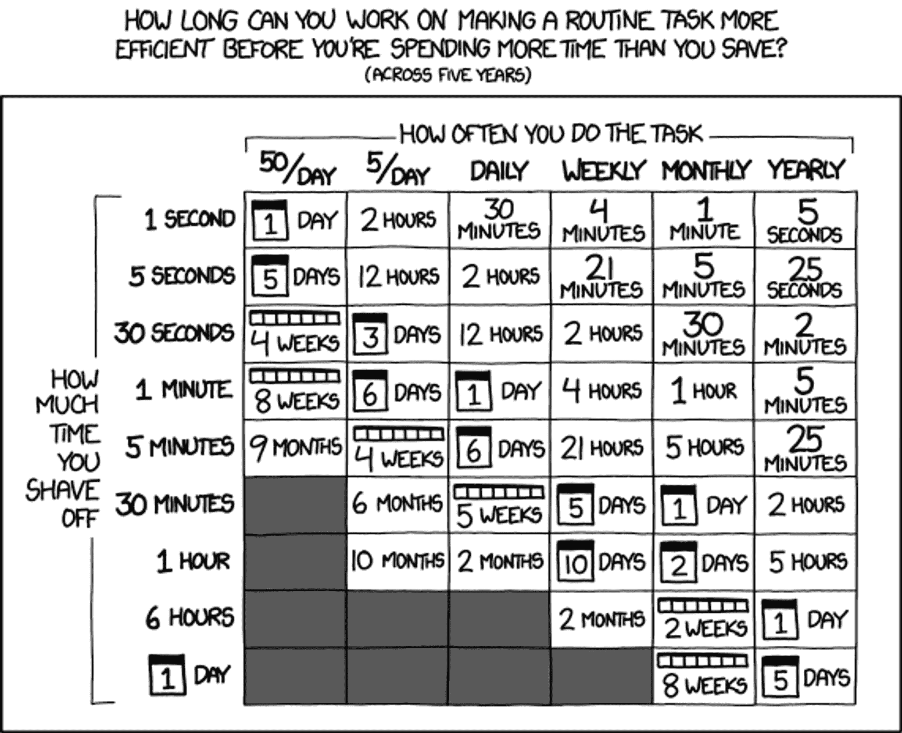

# Zapier 如何实现其一劳永逸的筹资方法|第一轮审查

> 原文：<http://firstround.com/review/how-zapier-pulled-off-its-one-and-done-approach-to-fundraising/?utm_source=wanqu.co&utm_campaign=Wanqu+Daily&utm_medium=website>

沙丘路。无限循环。科技领域有很多标志性的地址，其中大部分位于硅谷。但是他的灵感来自于 65203 号——他的家乡密苏里州的哥伦比亚。

“我以前的一位老板拥有一家抵押贷款公司，名为退伍军人联合会，有 1500 名员工，但他从未筹集过一分钱。从一开始就有利可图，但没有人谈论他们，因为这是中西部一家无聊的老抵押贷款公司，对吗？”

如果有好的中西部创始人价值观这种东西，福斯特就有。不过，他不是技术领域的局外人；毕竟，他是 Y Combinator 的毕业生，而扎皮尔存在的理由就是将科技界能想到的所有网络应用连接起来。但他认为，在密苏里州起步是因为他愿意问一个简单的问题:我们都必须遵循同样的筹款剧本吗？

在扎皮尔的案例中，答案是否定的。该公司是一个精英创业集团，包括 [Clearbit](https://clearbit.com/ "null") 、 [CB Insights](https://www.cbinsights.com "null") 、 [Trello](https://trello.com/ "null") 和其他少数几个迄今只筹集了一轮机构融资的公司。他不是在为自举辩护 Zapier 在 2012 年筹集的 120 万美元给了它急需的增长空间——而是在为到达目的地提供所需的燃料。

在这次独家采访中，福斯特解释了为什么跳出硅谷框框思考让 Zapier 建立了独特的客户和员工至上的文化。他介绍了大多数创始人可以提高资本效率的三个关键领域。他解释了为什么保守的筹资方式实际上可能是保持选择余地的最佳方式。

# 但是首先有一个警告

从一开始就声明这种精益筹资方式并不适合所有人。任何需要大量物质资源的公司——例如，一个火箭制造商需要火箭燃料——都需要大量的前期资金。专门在企业领域运营的初创公司也可能需要更多的银行存款，以适应更长的销售周期和更高的客户获取成本。

另一方面，传统的 SMB 软件公司通常存在于甜蜜点。“利润率非常高，”福斯特说。“你可以开发出一个很棒的产品，以一个合理的价格出售，然后从第一天开始就开始赚钱。”

尽管如此，许多创始人还是陷入了融资周期，不管他们是否明确需要现金。“湾区有很多风险投资，科技媒体聚焦于融资公司。“很多记者会告诉你，‘我不想要你的新闻，除非是一轮融资，’”福斯特说。“这种心态延续了成功取决于筹资的想法。当然，情况并非总是如此。”

此外，福斯特指出，有大量的反例，展示了各种各样的成功之路，但你可能需要超越科技博客的标题来了解它们。“你会看到更多的公司用最少的资金或根本没有资金长期从事这项工作。很多时候，这些公司不会被谈论太多。媒体对这些故事不感兴趣，所以这样做的公司不太为人所知。”

# 被困在比喻中

“筹款是一种工具，可以带你去你想去的地方，”福斯特说。然而，他经常看到初创公司如此沉迷于填满银行账户的狂热，以至于他们违背自己的兴趣或直觉筹集资金。当这种情况发生时，他通常会将其归因于两个原型玩家中的一个(或两个):

**迷人的创始人:**伟大的创始人需要能够提出令人信服的愿景——这是一种很好地服务于他们的技能，因为他们让投资者、员工和客户冒险尝试不可能的新想法。不过，有些创始人可能有点太擅长推销他们的愿景了。“有时候，这可以让他们说服人们为一个不太成功的想法投资。他们已经这样做了几年，很明显，单位经济学并没有真正发挥作用。他们回去再次加注，但因为他们非常擅长传递愿景或他们潜力的承诺。根据公司目前的业绩，他们得到的钱可能比应得的要多。因此，他们会在接下来的 12 到 18 个月里一瘸一拐地走下去。”

**照本宣科的投资者:**其他时候，面对实际建立一家公司的令人生畏的前景，经验不足的创始人渴望获得他们下一步行动的任何指导。由于许多初创公司的早期顾问都来自融资领域，他们可能会从一个特定的角度提供建议。“传统的风投公司有一套在整个公司运行的剧本，他们的商业模式也适合他们。福斯特说:“他们的目标是对少数公司进行战略投资。然而，创始人并不是在管理投资组合。他们需要根据一家公司——他们自己的公司——的具体需求来做出决策。建议是至关重要的，应该受到欢迎，但要批判性地思考建议背后的经历和动机。

“我从一个人那里听到了一个很好的建议，他说每当他走到十字路口，公司的转折点，他都会试着从两边的人那里得到建议。福斯特说:“他会悄悄地写下两者的利弊，然后把纸放在一边，做出感觉正确的选择。“我喜欢这一点，因为他将每一个观点都视为输入，而不是批发选项——并从所有观点中抽身，做出最终决定。我宁愿以我内心认为正确的方式去做这件事。如果我被说服按照别人的方式去做，但没有成功，我总是会想，‘如果我们按照我的方式去做会怎么样？’"

关键不是让逆风或顺风决定你驶向何方，而是你如何航行。告知你如何达到目标。

最重要的是确保“我的方式”不仅仅是你已经习惯听到的“默认方式”。“所以，当你在岔路口收集利弊时，留意谁在分享他们的利弊。福斯特说:“在筹款这种情况下，找到‘反对者’的代表可能需要时间。“所以，尽管你觉得这样做很舒服，但还是要试着转移到你的边缘——在你的行业、邮政编码和顾问团队之外——这样你就真的必须向某人解释决策的基本原则，而不是仅仅复述已知的观点和对应点。”

这就是为什么福斯特会求助于他在退伍军人联合会的老老板，以及科技创业公司内外的少数其他人，以提供投入，导致更多非传统的商业决策，从筹款开始，结果导致了同样非传统的结果。

# 花钱如流水

对你的公司采取这种所有权的一部分意味着深入了解你的现金流，并使关于这些美元的每一个决定都是个人的。在这方面，硅谷(相对)开放的支票簿可能是一件喜忧参半的事情。回到哥伦比亚，新企业主花钱就像是他们自己的——因为它可能就是。

“你必须想，‘好吧，钱从哪里来？’”福斯特说对我们来说，它来自我们的日常工作。“他和他的联合创始人布莱恩·赫尔姆格和 T2·迈克·努普连续几个月在晚上和周末为这个项目工作，下班回家一直工作到凌晨 1 点。”这迫使我们在管理公司的过程中要遵守很多纪律。我们从一开始就知道我们有多少钱，也知道我们没有多少钱。"

他们没有追求完美的奢侈——他们只是在尽可能的时间和方式完成任务。“这么长时间以来，我们知道这是可能的。我们能做到的。这有点疯狂，但不花一吨钱也不是不可能的。”当然，这是有权衡的。公司起步花了更长的时间，因为雇佣帮手不是一个选项。但大约六个月后，在 2012 年，Zapier 上线了，集成了所有 34 个应用程序。

当该团队最终选择在那年晚些时候进行融资时，在许多方面与其说是为了现金，不如说是为了信誉。作为一个工作流自动化工具，Zapier 连接应用程序，他们需要能够与这些应用程序背后的初创公司进行权威对话。

“对我们来说，YC 是获得认可的一种方式，有人会说，‘这家公司值得关注。’那是我们做的微积分。“它帮助我们与其他合作伙伴建立联系，并打开足够的大门，让事情进展得更快一些，”福斯特说。但是这些介绍与其说是资本，不如说是入门。他们允许我们做更多我们已经在做的事情——而不是 t 台来决定要做什么。因此，如果你选择融资，也要把信誉当成货币。从这个角度来看，如果你选择筹集资金，可能并不需要很多。也许你想雇佣一两个人，或者进行一些营销实验。一点点“踢”就能让关键的事情运转起来。"

# 像为别人省钱一样省钱

让你的选择留在桌面上的最好方法——从战略的角度而不是绝望的角度做出融资决定——是尽可能高效地运营你的创业公司。根据福斯特的经验，在三个关键领域，创始人可能会多花很多钱。

**固定资产:办公空间与分布式团队**从 YC 大学毕业后，扎皮尔团队终于有了足够的资金和需求，开始招聘员工。然而，也许是偶然的，他们不知道如何去做。

“我们以前从未这样做过，我们在湾区也没有真正的网络，”福斯特说。“所以，当我们考虑要雇用谁时，我们只会想到过去和我们一起工作过的聪明人，那些可能愿意和我们打赌的人。我在芝加哥有一个朋友，他经营着最大的小熊队在线留言板之一。我想，如果他能控制住不守规矩的小熊队球迷，他可能会支持我们。”

当时，联合创始人迈克·努普已经搬回密苏里州，他们在哥伦比亚雇佣了另一名工程师。这使得扎皮尔的人数达到了五人——在三个城市。“这让我们走上了一条遥远的路，我们变得很擅长。它从来没有妨碍我们运输东西、推出新功能和合作的能力。所以我们想，让我们继续这样做，因为它真的很好。”

五年后？有点出名的扎皮尔仍然没有办公空间。这并不是说他们已经成功*尽管*他们的远程劳动力。福斯特实际上将公司的成功很大程度上归功于这一战略带来的效率。“许多早期创业者，一走出 YC，他们做的第一件事就是筹集资金、雇佣员工、获得办公空间，”他说。“我们从来不用担心我们能负担得起多大的面积，或者它是否能满足我们的预期增长率。”

当然，这种选择并不适用于所有组织，甚至大多数组织。但不管怎样，福斯特建议创始人思考他们的基础设施是如何帮助或伤害他们的，以及在哪里可以简化它以支持更精简的运营。你认为你需要一个大会议室来会见客户吗？咖啡店可能会有用。“直到今天，我都这么做，没有人会多想，”福斯特说。

然而，建立一个远程团队仍然需要时间投资和深思熟虑的文化建设。随着 Zapier 的发展超出了其早期雇员——一个忙于家庭和当地社区的团队——建立一种强大到足以团结公司分散各地的员工的文化变得越来越重要。例如，他们创造了一个伙伴概念，员工每周配对(创始人也是！)进行视频聊天。虚拟咖啡约会。

有时候，两个人会开始谈论一个想法，这个想法会变成一个新的应用程序或产品功能。然而，大多数时候，好友聊天只是关于人们之间的联系。(最近，在一个团队成员的桌子上发现的一张有趣的快照像滚雪球一样变成了一张[盗梦空间](https://en.wikipedia.org/wiki/Inception "null")风格的[嵌套照片，照片上有来自全国各地的几十个团队成员](https://twitter.com/wadefoster/status/840066736992862208 "null")。)“仅仅因为你是偏远的，并不意味着你不能有一些这样的友情。”

Zapinception

也有每年两次的静修。自从七个人的首次聚会(“我们都只是在西雅图出现，仅此而已，”福斯特说)，他们已经演变成了适当规划的活动，议程充满了闪电谈话、小组讨论和团队想要涵盖的明确目标。“人们喜欢利用面对面的时间去做他们不能做的事情，也许会谈论一些不切实际的事情。不过，只有一周的时间，所以你必须确保安排好这些事情，否则可能不会发生。”

入职是 Zapier 的非传统设置必须重新发明的另一个重要流程。这是福斯特发现他们实际上有所改进的另一个方面。“考虑一下同地办公。他说:“当你加入一家公司时，你走进去，被介绍给每个人，第一周可能会和高管团队共进午餐。进入 Zapier 的“Airbnonboarding”概念，一两个新员工加入三个联合创始人，通常还有几个其他团队成员，在山景城 Airbnb 工作一周。

“这真的有助于建立我们作为创始人和团队中每个人之间的关系，因为他们来这里一周，我们在同一个房间工作。晚上，我们一起出去，带他们去镇上玩，”他说。“他们知道我们关心他们，我们希望他们成功。这让我们和团队中的其他人在松弛状态下的互动变得不那么可怕了。”

显然，Zapier 团队是他们分布式结构的忠实粉丝，他们已经尽力使他们的团队成为一个丰富、完整的工作场所。但是不管你的设置是什么，Foster 分享了一个警告:**在转向混合本地/分布式劳动力之前要三思**。“最困难的情况似乎是分裂，因为现在你有这两种文化。你已经有了办公室文化，现在你又有了这些疏远的人。它让远程员工变成了二等公民，因为他们没有连接到网络中心。”

此外，双管齐下，你不仅没有保存资本，还可能浪费更多的资本。Zapier 投资于分布式劳动力的决定并不是免费的——使其良好运行意味着支付所有这些机场、静修、旅行费用等等。“尽管如此，我们的首席财务官估计，与在旧金山有一个办公室相比，我们现在每年节省大约 200 万美元，”福斯特说。

同样，这不是一个适合所有公司的选择。但是，如果创始人能够做出每年节省哪怕一小部分的运营选择，融资的压力可能就会减轻。

Wade Foster

**人员:雇佣与自动化**

决定什么时候需要招聘，什么时候不需要，是精益创业的另一项关键技能。对于一家致力于提高工作流程效率的公司来说，Zapier 倾向于尽可能实现自动化，这或许并不奇怪。

我们早就有并推崇这样的价值观:不要做机器人，要造机器人。

这是一种哲学，在公司的客户支持运营中表现得最为清晰和有规律。首先，这是公司的一个领域，每个团队成员都会接触到——福斯特确保了这一点。“每个人都花时间支持，”他说。“我们的工程师意识到，有一些工具可以帮助他们更快地获得支持，这是一件好事。所以他们制造那些内部工具。”

随着时间的推移，曾经需要大量挖掘或猜测的支持查询已经简化为单击式流程。“由于我们已经建立的工具，一个人现在可以做的事情可能是以前的两倍，”福斯特说。“不仅如此，支持质量也得到了显著提高。过去，支持人员必须猜测客户帐户不可靠的原因，而现在，在实时数据日志的帮助下，他们可以立即告诉客户发生了什么。”

为客户提供更好、更快的帮助显然是重中之重。自动化也可以帮助做到这一点，首先减轻人类的负担。“我们收到了很多自动回复——我们会发送一封电子邮件，告知某人不在办公室或类似的情况。我们最近调查了一下，收到的电子邮件中有 40%是自动回复的，所以它真的填满了我们的支持收件箱，”Foster 说。

清理所有的垃圾曾经是一项手工工作，虽然很有效，但却是最昂贵的方法。然后数据科学家和基础设施工程师介入了。“他们采用这种算法，能够以大约 99%的准确率检测出一张票是否需要回复，这样我们就能够剔除所有自动回复的人。”结果呢？一个超级强大的支持团队突然有了更多的时间去买真正的票。

当然，减少 40%的支持收件箱是自动化的一个非常明显的例子。其他时候，不值得你的工程师花时间去解决一个项目。那么界限在哪里呢？“关于这一点，有一部非常好的 XKCD 漫画。“我们的几名工程师将它放在他们的机器旁边，”福斯特说。“它讲述了你如何知道何时将事情自动化。你多久做一次任务？你只需要做一个机会成本分析。”

简化运营只是等式的一部分。即使在你尽你所能实现自动化之后，招聘对于扩大业务规模仍然至关重要。这是福斯特敦促其他创始人做出深思熟虑的选择的另一个领域。如果做得太过宽松，它可以迅速为一家羽翼未丰的公司增加很多利润。

“一般来说，当我们决定雇用时，有两个原因，”福斯特说。“第一，我们在某种程度上超负荷工作，我们无法用其他方式解决这个问题。这在需求驱动的支持等领域最为常见。第二，我们希望进行产品投资，但没有足够的人手来实施所有的计划。”

扎皮尔的团队在五年内缓慢而谨慎地发展到不足 100 人，福斯特指出，他们通常只在感到手头拮据时才会招聘。“我们总是会揭露需要完成的工作和存在的机会。我们永远不会说，'我认为贾尼斯有点过度工作了，所以我要对她隐瞒一些工作。'“我们的目标是，在每周一对一和开放沟通文化的支持下，让招聘需求变得如此明显，以至于除了解决它们别无选择。

“我们希望避免经理们囤积任务的情况，因为他们不想让他们的团队感到有负担，”福斯特说。“那帮不了任何人。你认为自己已经尽了最大努力，但这不一定是真的。”然而，当关键的机会是已知的，而它们仍然被一个月一个月的推迟？每个人都同意是时候发布一份职位描述了。

或许是因为角色只有在任务关键时才会被创造出来，扎皮尔的招聘流程优先考虑一个简单的因素:技能。“我们往往不太在乎证书、简历或求职信。例如，我不能告诉你我们大多数人在哪里上学，坦率地说，我真的不在乎，”福斯特说。

当然，确定母校比设计印章或编码熟练程度要容易得多。所以在这里，Zapier 也在前端投资设计了一个减少噪音的过程。首先是一份申请表格，对某些关键技能进行审查；这些回答随后会被送到一个招聘小组，由该小组根据特定的角色给他们打分。面试也很注重技能测试，而不仅仅是假设性的练习。

“这些不是白板测试。例如，工程师们正在解决一个你可能在野外遇到的实际工程问题。他们和我们的其他开发人员一起在上面编码，”福斯特说。“我们试图根据人们在工作中的实际技能来审查他们，而不是一些假设的场景或代码问题。”

一旦你用自动化的方式摆脱平凡的任务，雇佣只有人类才能胜任的角色，灰色地带将不可避免地存在。“我们很想用半正式的方式来管理它，”福斯特说。“创建一个服务于整个组织的内部审计团队，四处寻找人们每周花时间做的任务，我们可能会取消这些任务。”他还没有到那一步，如果你也没有，也不用担心。仅仅从这些方面考虑，就能对建立一种保护文化大有帮助。

**客户开发:销售与开发平台**

当 Zapier 在 2012 年成立时，它的流程很简单:团队识别热门应用程序——谷歌应用程序、Salesforce、MailChimp、脸书等。—找到他们的公共 API，并让它们运行起来。很快，随着公司越来越受欢迎，他们开始处理成千上万的添加新应用的请求。

然后他们开始收到潜在伴侣的来信。“我们会听到‘我们怎样才能上扎皮尔？’福斯特说:“这种措辞听起来让人觉得人们可能愿意付出一些努力。Zapier 团队意识到他们永远无法为所有的应用程序构建集成，因此做了一些调查，看看公司是否愿意投资一点自己的工程时间。很多人都同意了，于是 Zapier 开发者平台诞生了。

这是一个巨大的成功——现在 Zapier 上有近 800 个应用程序——福斯特将其归功于他的公司的战略定位。“SaaS 公司不想参与整合业务；他们想从事客户关系管理、电子邮件营销、客户成功或诸如此类的业务，”他说。“说到整合，他们会想，‘我能打造的一两个真正具有战略意义的是什么？’Zapier 是一种非常简单的方法，可以让你从一开始就有足够的宽度。从告诉客户“不”到说“是”，这是一个简单的方法。"

并不是每个产品都适合开发者平台，但是每个产品都可以受益于为用户和潜在用户构建的社区。“以某种方式进入已经存在的社区，并成为这些人的相关参与者，”福斯特说。例如，如果你正在开发一个招聘应用，努力与那些已经提供招聘最佳实践的人接触。“试着进入那些能吸引顾客进入你的收入漏斗的领域，这样你就不必整天为赚钱而打电话。因为拨号上网真的很贵。”

结果是一种自我强化、互惠互利的生态系统:Zapier 继续改进其平台，使合作伙伴使用起来更容易、更快捷。对开发者来说，他们继续发布集成，构建 Zapier 的价值并扩大其潜在影响。“这 800 款应用中的每一款都是我们可以利用的用户群。与我们的合作伙伴一起，我们努力确保每个集成都有一个登录页面，包含必要的文档和目录。”在新整合的共同推广和每个登录页面的搜索流量之间，Zapier 几乎所有的销售额都来自于入站流量。

其实公司一直没有销售团队。与其花时间和金钱去获得顾客，他们可以把时间投入到 T2 服务顾客上。“例如，我们非常努力地让 UX 变得非常非常简单，以便人们可以自助服务。我们想为小企业服务，所以我们知道我们必须保持低价位。”

因为在一天结束的时候，Zapier 几乎只对它的顾客负责。“我们唯一需要关心的是让我们的客户满意。这就是我们想为之解决问题的人。我们不必担心投资者或利益相关者之类的事情。“我们有一些，但没有多到震耳欲聋，”福斯特说。

# **创立一家公司，而不仅仅是另一轮**

节省资金和精简运营并不意味着创造某种狄更斯式的工作场所。相反，在福斯特的经验中，这是关于给自己自由——并保持纪律——尝试创造性的想法，这不仅能够实现，而且还保留了有更广泛选择的能力。一次性完成筹资并不适合每种商业模式，但这是许多人可以考虑的一个选择，但没有这样做。寻求创始人和投资者之间相辅相成的刻板印象之外的意见，以确定这是否有可能。如果你筹到了钱，就像花自己的钱一样去花，像为别人存钱一样去存钱。控制固定资产、人员和客户开发的早期启动支出，以避免未来融资的饥饿痛苦。

“我们已经度过了近四年的盈利期。这不仅仅是一种骄傲，而是一种释放。我们觉得是我们决定了我们的跑道，而不是靠借来的时间。福斯特说:“在 Zapier，这大大有助于我们跟随自己的直觉。“这可能意味着要花六位数的钱把所有人召集到德州去度假，或者把我们所有的精力投入到以我们认为合适的方式制作一部电影中。有一些早期的选择使这种类型的机构对初创公司来说成为可能，但你必须以不同的方式考虑关键的里程碑，从融资开始。谈到创业，这不是人们通常会想到的“颠覆”，但它应该是。”

*摄影由* *[邦妮雷伊米尔斯](http://www.bonnieraemillsphoto.com/ "null")* 负责。