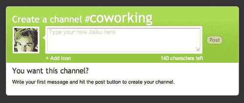
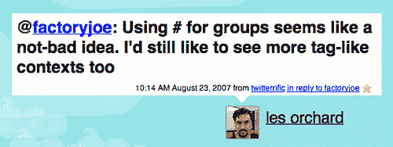
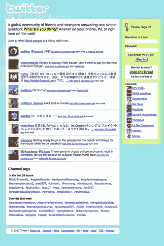

# Twitter 的群组；或者 Twitter 标签频道的提议——工厂乔

> 原文：<https://factoryjoe.com/2007/08/25/groups-for-twitter-or-a-proposal-for-twitter-tag-channels/?utm_source=wanqu.co&utm_campaign=Wanqu+Daily&utm_medium=website>

[![Twitter / Mr Messina: how do you feel about using # (pound) for groups. As in #barcamp [msg]?](img/4e9ed5e5e6524a4062fb570c9785f2d4.png)T2】](http://www.flickr.com/photos/25419820@N00/1236321800)

这是我在上一篇文章中提到的关于[耳语推文](https://factoryjoe.com/blog/2007/08/25/whispering-tweets/)的文章。我现在要做一个免责声明，这篇文章的标题是误导性的，实际上*不是*关于 Twitter 的群组。事实上，我一点也不相信群组(至少在 Flickr 这样的网站上是这样理解的)最终是一个好主意，或者是一个适合 Twitter 的平台。但是，我确实认为，在 Twitter 中改进*的语境化*、*的内容过滤*和*的探索性意外收获*是有一定价值的。这是一个相当混乱的建议。
T11】

首先，借用斯蒂芬妮·布斯和 T2 的话，我们应该把词汇搞清楚。

从 <cite>[斯蒂芬妮](http://climbtothestars.org/archives/2007/05/04/groups-groupings-and-taming-my-buddy-list-and-twitter/)</cite> :

> *   "Groups" or "shared interest groups" ("Flickr-groups")
> *   "Grouping" ("a specific combination of people with similar interests") [Stoboyd](http://www.stoweboyd.com/message/files/building_social_applications.pdf) )
> *   "Contact Group" (organize my contacts)

而 <cite>[来自布莱恩](http://getsatisfaction.com/twitter/topics/when_is_twitter_going_to_get_groups#reply_11411)</cite> :

> 好的，所以我们正在谈论三种类型的团体:你“加入”的公共团体。临时组用户控制是通过分组管理(Pownce)还是标记。然后我们有基于位置的上下文特定的组(@南方公园，有人想去费城吗？).

这三种类型的小组本质上在不同程度上涵盖了在 [Twitter 粉丝维基](http://twitter.pbwiki.com/)上呈现的[用例](http://twitter.pbwiki.com/Groups#Usecases)。

我最感兴趣的类型，并准备提供一个具体的建议，实际上是第四种，与斯托的“分组”关系最密切，但略有不同，主要是在如何建立分组的模型上。在上面介绍的案例中，采取了非常明确的方法，因为有些人想当然地认为团体意味着一种管理。无论你是与你创建、加入、推广的公共团体打交道，还是与你最终必须像管理任何一种邮件列表一样管理的团体打交道，它们都意味着大量的工作最终会与整个分组前提的采用背道而驰，从而将超级专注于流程的特定团体的任何好处降至最低。

我更感兴趣的是在 Twitter 上获得更好的窃听体验。

为此，我将我的思考集中在 Twitter 领域的*语境化*、*内容过滤*和*探索性的意外收获*。

我突然想到，IRC 为这些需求提供了一个经过验证的模型，它的基础是渠道，所以我一般会称之为渠道。

现在，在考虑实现*频道*的时候，当务之急是我不要对我目前使用 Twitter 的方式进行任何重大改变，就像我对其他已经添加到 Twitter 的功能(例如，[@回复](http://twitter.com/blog/2007/05/are-you-twittering-me.html)或[直接消息](http://twitter.com/blog/2006/11/are-you-getting-messages.html))所做的那样。Channels 将需要一个对命令行友好的附加功能，并且完全不需要基于网络的管理来充分利用它(为了进行区分， [Pownce](http://pownce.com/) 没有通过它的朋友集的测试，因为它需要使用他们的网站来利用这个特性)。

[Jaiku](http://jaiku.com) 最接近他们的[频道](http://jaiku.com/channel)实现，这使得创建新频道变得极其容易(只需发布一条以散列(#)和您想要的频道名称开头的消息，如果该频道不存在，它将为您创建):

[T2】](http://www.flickr.com/photos/25419820@N00/1236753348)

这就是它在 IRC 中的工作方式，也是它需要在 Twitter 中工作的方式。然而，Jaiku 的实现过度扩展的地方在于它的通道概念。频道不仅仅是一个临时的口头路标，它更像 Jaiku 中的聚合桶，允许你通过 feeds 等方式获取各种内容。毫无疑问，这是一个很好的[桥接应用](http://www.horsepigcow.com/2007/08/09/we-need-bridges/)的例子，但远远超出了我从 Twitter 频道寻找的简单功能。事实上，Twitter 频道可以也可能应该*反馈到 Jaiku 频道，但反过来就不应该了。*

所以，让我们更具体地了解一下我在 Twitter 频道上寻找的是什么，不是什么。许多人已经以这样或那样的方式对实现组提出了各种各样的建议，但是为了清楚起见，我想把某些功能明确地放在我所建议的范围之外。在此之前，我想对 Twitter 频道的想法做一点小小的修改。

[T2】](http://www.flickr.com/photos/25419820@N00/1237051904)

我花了一些时间与 BarCampBlock 的 l.m.orchard 交谈，我想他在 Twitter 上提到了标记(他在 Del.icio.us 工作；标签是他的优先事项应该是显而易见的)。他最近在[谈论](http://blogs.opml.org/decafbad/2007/08/21#When:2:23:28PM)这个话题，并在这个话题上提供了一个[相当不错的建议](http://decafbad.com/blog/2007/08/21/sticky-tags-for-twitter)。

将他的提议与托马斯·范德·沃尔的大众声学概念结合起来，这些“渠道”的更完整的图景开始形成。[向推特圈征求关于格式的意见](http://twitter.com/factoryjoe/statuses/223115412)很有帮助，就这个想法与推特上的 [Britt](http://lukewarmtapioca.com/) 交谈也有帮助。

我所意识到的是，这个“频道”概念满足了许多在各种“T0”群组中表达的对 Twitter 讨论的总体愿望，同时没有继承许多大多数群组系统似乎遭受的不必要的管理[cruft](http://en.wikipedia.org/wiki/Cruft)，它很容易适应当前的[Twitter 语法](http://microformats.org/wiki/twitter-syntax)和惯例，它很容易学习和轻量级，它非常灵活和完全[*folksonomic*](http://en.wikipedia.org/wiki/Folksonomy)，并与人们当前的行为一起工作，而不是强迫任何人学习任何全新的东西。它还将界面方面保持在最低限度(我将很快解释)，通过借鉴古老的 IRC 惯例(现有的*web 应用程序也采用了这些惯例)而发明了一些东西，并且，据 Britt 所说，它实际上在手机上工作一致(然而，例如，star 键就不是这样)。*

然而，真正有趣的是，这些频道如何在 Twitter 中被用作标签，从而开启全新的可能性。

每当有人使用*频道标签*来标记状态时，我们不仅知道关于该状态的一些具体信息，而且其他人也可以*偷听*它的上下文，然后加入频道并做出贡献。使用一个简单的#reply 意味着不在@reply 队列中的人将能够跟随，就像人们使用 Flickr 或 Delicious tags 一样，而不是试图在一个或多个个人之间用菊花链@ reply 进行乒乓式讨论。此外，进入现有渠道的主题将对之前加入讨论的人可见。也许最好的一点是，任何人都可以选择自己不感兴趣的话题。

我还喜欢 folksonomic 方法(因为没有“预先建立的团体”)允许大量的表达和协商(我认为#barcamp 将是事件之间的常见标签，但这没关系，因为如果有冲突，比如说在同一天两个独立的 barcamp 之间，他们将不得不通过社交工程设计一个解决方案，并可能选择一个新的标签，如#barcampblock)和衰退(也就是说，随着时间的推移，随着标签使用频率的降低，其他人可以重用它们——没有域名抢注！).它也加强了标签在野外的实际使用，因为如果标签没有首先在对话中被使用，它就不存在任何证据。这意味着在整个网站的标签云中表示频道，这些频道随着时间的推移而增减，并且与所有 Twitter 用户或单个用户相关，是显示这些信息的理想界面。

哦，从语言/设计的角度来看，你实际上可以将句子中的常规单词变成通道，就像许多人对@replies 所做的那样。例如:*今天晚些时候我要来#barcamp。*

### 细节

因此，我想我至少提供了一个“标签通道”概念的模糊概述，它们只是通过在一个或多个单词前加上散列字符(#)来使用。与我通常的一般想法相反，我想更进一步，变得更具体(可能是受我最近在 OAuth 上的工作的启发)。

让我们看看我能得到多具体的…

#### 句法

*   `follow #tag`:订阅所有带*#标签*的更新
*   `follow username#tag`:订阅来自特定用户的带有*#标签*的所有更新
*   `leave #tag`:取消订阅某个标签；您仍然可以从您的朋友那里获得带有此标签的更新
*   `leave username#tag`:取消特定用户对特定的订阅
*   `remove #tag`:彻底删除所有贴有*#标签*的帖子，甚至包括你的朋友
*   `#tag message`:在*#标签*通道中创建一个状态
*   `#tag !message`:创建一个只有订阅了频道标签*#标签*的人才能看到的状态

其他注意事项:

*   在这个第一个版本中，信道不应该是公共的或私有的；在状态中使用频道标签不会影响其隐私。任何可以看到没有通道标签的状态的人都可以看到带有通道标签的状态。
*   没有人拥有或管理标签频道。
*   第一次有人发布带有频道标签的状态时，就会创建一个频道。
*   无法删除频道；删除频道的唯一方法是删除所有带有特定标签的状态(这与 Delicous 或 Flickr 等网站一致)。
*   Twitter 上的频道 URL 格式应该是`http://twitter.com/#channel_name`。这不同于 Jaiku 的约定(`http://jaiku.com/channel/#channel_name`)，但遵循 IRC 标准。
*   频道名称和用户名可以重叠。因此，`http://twitter.com/factoryjoe`与`http://twitter.com/#factoryjoe`并不相同，但两者都可以安全存在。
*   要加入一个频道，只需像这样添加一个标签 hash(#):*# bar camp 网格打开了！*。
*   你可以在一篇文章中使用任意数量的频道，最多 140 个字符，例如: *#barcamp #barcampblock 网格打开了！*。
*   未解决:您应该能够通过在您的消息前面加上一个爆炸(！).
*   您可以订阅任意多或少的频道。
*   您可以随时离开频道。
*   通过 API，使用一个新的“花名册”命令(取自 [Jabber](http://www.xmpp.org/registrar/querytypes.html#roster "XMPP URI/IRI Querytypes") )你应该能够得到最近在一个频道上发帖的人的列表。

#### 实体模型

我为这个[概念](http://www.flickr.com/photos/factoryjoe/1236833797/)创造了[一个](http://www.flickr.com/photos/factoryjoe/1237793656/) [几个](http://www.flickr.com/photos/factoryjoe/1236918165/) [实体模型](http://www.flickr.com/photos/factoryjoe/1237731776/)。他们需要一点工作，但开始做吧。这里是[主页，上面有最近活跃的频道标签](http://www.flickr.com/photos/25419820@N00/1236839235):

[T2】](http://www.flickr.com/photos/25419820@N00/1236839235)

### 判例案件

Twitter 在去年的 SXSW 大会上获得了巨大的 [提升](http://www.web-strategist.com/blog/2007/03/10/twitter-communication-tools-of-sxsw/)。我在考虑今年，不要在特定 SXSW 的消息前加上“SXSW”…标签频道可以取代这种方式，允许人们在更新中的任何地方插入#sxsw。这既适用于更广泛的会议(组织者可以使用#sxsw 发布日程更新)，也适用于主要活动期间的协调(互动部分可能会使用#sxswi，小团体的朋友可能会选择类似#sxswbanc 的随机标签进行计划)。

最重要的是，过滤掉使用特定标签的状态非常容易(回答去年没有参加 sxsw 的人的投诉，SXSW 推文泛滥)…如果你只想订阅 SXSW 上某些人的#sxsw 状态，你也可以这样做。

虽然这个提议还没有完全完成，但我认为它提出了一个相当简单和清晰的(至少在我的脑海中)实现“类组功能”的计划，而没有违反 Twitter 的最初前提。标签频道的简单添加意味着人们可以跟踪内容并更新更相关和有趣的内容，而无需付出大量额外的努力或学习任何类型的无关语法。虽然网站上的界面仍然需要解决，但开始的步骤看起来有些希望和可行。

所以我想就这样了。我渴望得到反馈并完善这份提案。

现在，我们可以在 Twitter 上使用#channels 作为标签进行讨论；我们可以在粉丝维基上的[标签频道](http://twitter.pbwiki.com/TagChannels)下完善这个提议。

### 笔记

我喜欢 Twitter 上“分组行为”的新兴大众分类法的另一个方面是，它不依赖于创建专门的 Twitter 帐户来做自动加好友的事情(这需要 Twitter 员工的行动)。相反，**所有**标签频道会自动“添加回”每个使用标签的人，以及那些简单“加入”的人。就加速意外收获而言，这是会议和个人的巨大胜利，更不用说 Twitter 员工了！

### 像这样:

像 装...

### *相关*

## 作者:克里斯·梅西纳

共和公司西海岸业务发展主管。永远好奇的产品设计师和技术专家。标签发明者。此前:Molly.com(YC W18)，优步，谷歌。[查看克里斯·梅西纳的所有帖子](https://factoryjoe.com/author/factoryjoe/)