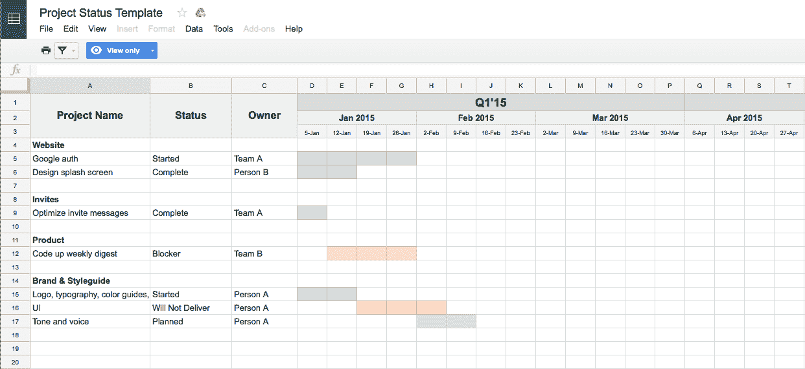

# 为什么每个企业都应该从电子表格开始|产品习惯

> 原文：<https://producthabits.com/why-every-business-should-start-with-a-spreadsheet/?utm_source=wanqu.co&utm_campaign=Wanqu+Daily&utm_medium=website>

# 为什么每个企业都应该从电子表格开始

我经常被问到的一个问题是，“你会为我的工作流程推荐什么工具？”

我明白了。在 SaaS，有大量的工具可以帮助你处理业务的方方面面——从客户关系管理系统到项目管理板。

但我创办的每一家企业都是从一张简单的电子表格开始的。

在早期阶段，很容易陷入寻找“正确的”工具集的困境，这些工具将帮助您的业务从销售、产品到营销的各个领域起飞。工具是有帮助的，但是它们也会在早期分散注意力——尤其是当你有太多工具的时候。

在这篇文章中，我们将讨论为什么不去寻找一套完美的工具，而应该从一个电子表格开始，为你的业务建立一个坚实的基础，从头开始建立你的工作流程。

## 电子表格让你保持专注

电子表格提供了无限的可能性。它迫使你必须严谨，从零开始建立你的工作流程。当你超越自己，过早地选择一个工具时，你会让自己承受不必要的分心。

以客户支持为例。在你创业的早期，你面临的问题可能不需要用 SaaS 工具来解决。

*   如果工具自动标记客户的支持请求，但是你还没有足够的客户支持请求，你需要它吗？
*   如果该工具已经自动化了向团队中的某些人发送某些类型的请求的工作流，但是您只有两个团队成员，这有必要吗？
*   如果你有一个可以进行情感分析的工具，但是你一天只收到 10 个错误报告或者支持票，那么情感分析还重要吗？

该工具的功能可能会将你的注意力引向不同的方向，而你真正需要做的是专注于用最快最好的方法来修复你面前的 10 个错误。

为任何事情建立一个强大的流程都是从找出需要完成什么开始的。电子表格有助于你做到这一点，因为它迫使你深思熟虑。从头构建一个电子表格迫使你思考整个过程，并问这样的问题:“我们在做什么？”以及“我们如何才能最好地完成这项工作？”

在某种程度上，当您开始每天看到数百个错误报告时，您可能会决定需要一个提供情感分析和自动化等功能的工具。当你到达一个电子表格不再足够的时候，你就应该寻找一个更强大的工具。

你不会从一个为你规定工作流程的工具开始就找到你理想的工作流程。首先做好构建强大流程和工作流的艰苦工作。然后，您可以找出最适合您工作流程的工具，而不是反过来。

所以，还是从最基本、最灵活的东西开始:电子表格。让我们来看看如何开始使用电子表格进行跟踪:

*   项目管理
*   客户反馈
*   客户关系管理

## 项目管理:谁在做什么，什么时候做？

项目管理有大量不同的方法。但是在你纠结于敏捷对 Scrum 对精益之前，要明白项目管理实际上归结于*谁在做什么，什么时候做*。

这些是项目管理的要素:

*   谁在做什么？
*   项目:他们在做什么？
*   **状态:**他们正在做的事情的状态如何？

这是它在 Google Sheets 中的样子:

 *

我已经使用了从 Basecamp 到 Trello 的所有项目管理工具，但最终我总是回到这个简单的电子表格。这里可以免费找到[。](https://docs.google.com/spreadsheets/d/1C5FH12YAJ_ZkzdE_iBFdmzB6yXSULPaGoXFv2hlBFSw/edit)

这是我们在 KISSmetrics 早期使用的主要项目管理工具。对于每个单独的项目，您可以看到状态、谁在工作以及正在进行的时间表。对于每个不同的状态选项，都有相应的颜色:“开始”是绿色，“完成”是紫色，依此类推。

即使我们开始增加新员工，构建更多的内部流程，我们也从未觉得有必要脱离这个电子表格。它帮助我们跟踪特定于项目的任务，并随着时间的推移跟踪进度。我可以很容易地看到一个人在做多少个项目，并对什么样的项目会变成“不会交付(…按时或永远)。”

最终一个团队可能会超越这个电子表格(尽管我在 KISSmetrics 从来没有过)。随着团队成员的增加和工作流程的复杂化，项目管理工具中需要的不仅仅是截止日期和任务。因此，请根据您的需求选择工具:

*   **[特雷罗](https://trello.com/inspiration/project-management) :** 这个项目管理工具会把你的电子表格单元格变成卡片。每张卡都配有清单、截止日期、评论和集成。
*   **[吉拉](https://www.atlassian.com/software/jira) :** 为开发者设计的项目管理工具。吉拉帮助开发人员跟踪要完成的任务中的错误和问题。它包括了从 Scrum 和看板到报告和路线图计划的一切。
*   **[Pivotal Tracker:](https://www.pivotaltracker.com/customer-stories)** 敏捷团队和开发人员的项目管理工具。Pivotal Tracker 是围绕用户故事设计的。

无论您是在吉拉计划冲刺，还是在 Pivotal Tracker 中跟踪里程碑，项目管理的基本流程都是一样的。你需要知道谁在做什么，什么时候做。转移到一个工具就是在你用电子表格创建的基础上进行构建。

## 用户反馈:我的用户在寻找什么？

虽然项目管理是关于跟踪你的内部任务，用户反馈处理外部因素——与你的客户交谈。除非你倾听用户的意见，否则你永远也不会做出人们会关心的东西。如果你问了正确的问题，你的用户总是会有很多话要说。

综合用户反馈实际上是回答一个基本问题:*我的用户在寻找什么？* 对于一家收到大量反馈的大公司来说，问题在于整理大量的答案，并将原始数据转化为实际有用的东西。然而，作为一项早期业务，你实际上可以手工整理和分析你的数据。

您可能会使用调查工具来自动标记和分类回答，但这不会对您有所帮助，除非您知道这些类别应该是什么。你可能会给你最成功的客户打电话，问他们一大堆问题，但这并不能帮助你把电话记录整理成行动计划。

对于任何客户反馈流程，您都需要做三件事:

*   提出问题
*   收集反馈——要么通过在线调查，给现有用户打电话，要么实际出去请人进行用户测试。
*   以一种能让你提出行动计划的方式整理和组织回答

你只需要一个电子表格就可以对回复(你的原始数据)进行分类:

当你手动添加标签并通读你的回复时，留意流行词汇。突出显示它们，对它们进行颜色编码，然后当您从反馈中了解到更多信息时，重新思考您的标签。使用流行词汇来确定你的标签应该是什么。你自己做所有这些会比一个花哨的分析工具告诉你更多。

在某些时候，你的用户反馈表会变得过于冗长。手动整理您的调查反馈(并添加客户来电记录)将变得难以管理。

当您开始在每次用户测试时得到成千上万的回复时，您可能会考虑使用以下工具之一:

*   **[SurveyMonkey](https://www.surveymonkey.com/mp/website-feedback-survey/) :** 一个调查工具，允许你根据预先确定的类别自动组织和标记调查回复。
*   **[字体](https://www.typeform.com/surveys/) :** 一款多功能的调查工具，注重易用性和设计。付费功能包括从跳过逻辑到支付处理的一切。
*   **[对讲](https://blog.intercom.com/intercom-customer-support/) :** 一个让你所有客户沟通的平台。Intercom 的 Engage 产品可帮助您通过应用内消息和电子邮件启动和跟踪客户对话。

将客户反馈手动输入电子表格会迫使您一次只查看一个反馈。你开始理解潜在的和常见的问题是什么，因为没有自动选项。你必须仔细检查每一件事。当您完成了手动标记响应的实践后，当您最终升级到更复杂的工具时，您将已经知道如何设置标记、标签和类别。

## 客户关系管理:客户 X 打算如何购买？

早期，当创始人负责每一笔销售时，CRM 看起来就像是联系你已经认识的人。

你搞清楚了基本情况。你的早期客户需要什么样的支持才能让你成交？将客户从洽谈阶段转移到成交阶段通常需要多长时间？通过使用电子表格来跟踪您的销售工作，您可以更容易地发现模式，并在早期优化您的销售流程。

准备一个复杂的 CRM 解决方案，比如 Salesforce 或其他一些大公司，只会让你的销售工作流程变得复杂，并在开始时分散你的注意力。你需要想清楚的是:*“我怎样才能让顾客 X 购买？、“*然后，“*最高效的销售方式是什么？”*

要回答这些问题，你需要记住三件事:

*   **联系信息:**您拥有的关于现有和潜在客户的信息。
*   **销售线索和交易:**将潜在客户转化为实际客户的过程。
*   **对话:**一路上你与每位潜在客户的互动。

从最简单的层面来说，你要密切关注你不断增长的潜在客户名单、最好的联系方式，以及你与他们中每一个人的关系。一开始，它只不过是一个详细的地址簿，你可以很容易地在一个电子表格中建立:

当创始人是公司唯一的销售代表时，在 50 名销售人员的团队中就不会有顾客。你可能达成的第一笔交易很可能是和你通讯录里的人——以及他们可以推荐给你的人。

当你在你的圈子之外扩大销售时，你需要知道你的销售线索来自哪里。它们是来自谷歌广告、你的登陆页面还是来自推荐？你是怎么跟进的？最后，*谁在跟进*？

你可以单独使用 Google Sheets 来构建一些非常健壮的东西。但是，如果您怀疑将来会需要专用 CRM，您还需要确保可以轻松地将客户迁移到专用 CRM。

当你发现自己希望可以将电子表格与收件箱合并，或者添加一些其他超级特定的功能时，你可能想要切换到一个工具。以下是一些可能有用的方法:

*   **[Close.io](https://close.io/product/) :** 专注于消除手动数据输入的销售 CRM。Close.io 集通话、邮件、短信于一体。
*   **[前台](https://frontapp.com/for-sales) :** 团队共享收件箱。将您的电子邮件链接到单独的 CRM，例如:Salesforce、Base 和 Pipedrive。
*   **[Hubspot](https://www.hubspot.com/products/crm) :** 面向小企业的免费 CRM。以仪表板形式直观显示您的销售渠道，并自动跟踪每一次互动(电子邮件、电话、社交媒体)。

当你的团队很小，你的销售是个人的和直接的，一个电子表格是你保持渠道畅通的全部。随着销售团队人数的增长和销售流程复杂性的增加，请注意当您需要转向成熟的 CRM 时的转折点。

## 电子表格迫使你从零开始

过早选择工具会在不知不觉中限制你的工作方式。它迫使你在你面前的仪表板或管道内建造。电子表格是您可以使用的最基本、最灵活的工具之一，也是一个很好的起点。您在电子表格中有无限的可能性，当您手动填写每个单元格时，您必须仔细考虑您正在构建的工作流。

稍后，如果您决定要对复杂程度进行分层，您可以这样做。但是首先，您应该从坚实的基础开始，从头开始构建考虑周到的流程。

您的工作流程将取决于您的特定市场、客户群、团队结构以及在公司内部使用不同策略和技能的能力。但是当你被不必要的工具压得喘不过气来时，你永远也不会发现这些东西是如何组合在一起的。

这些工具宣称可以帮助我们变得更聪明，但是如果你不知道哪里效率低，或者你的工作流程从哪里开始，你怎么知道这个工具是否适合你呢？商业工具的现实是它们和使用它们的人一样好。*