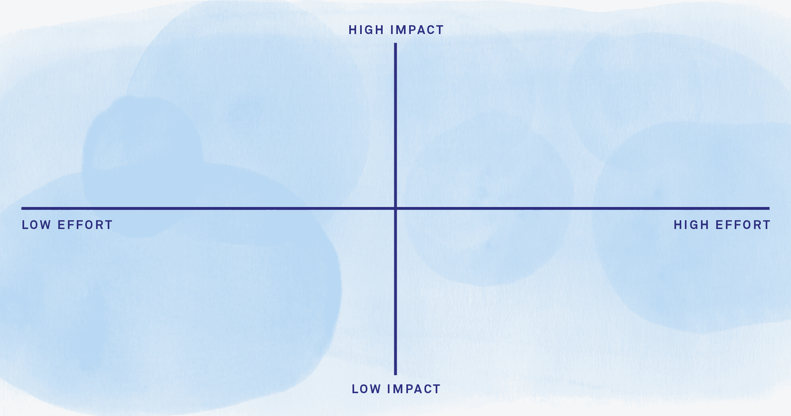
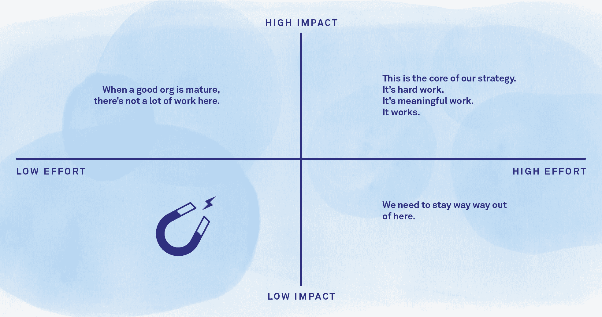
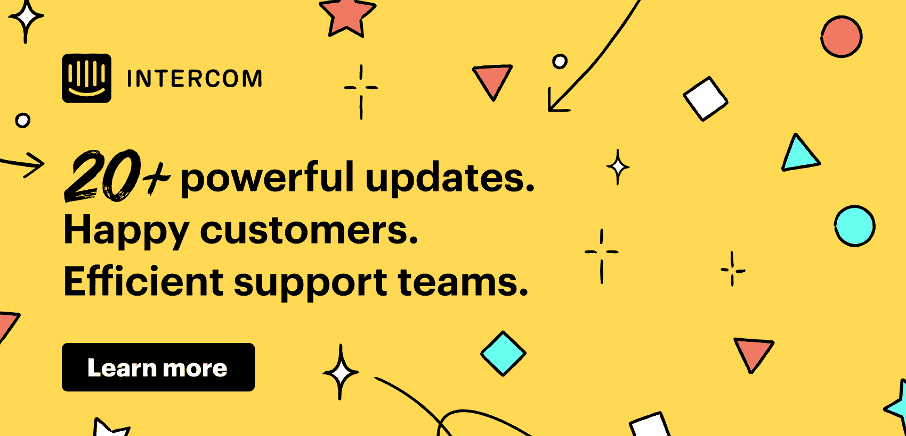

# 优先排序的第一条规则:不吃零食——内部通话

> 原文：<https://blog.intercom.com/first-rule-prioritization-no-snacking/?utm_source=wanqu.co&utm_campaign=Wanqu+Daily&utm_medium=website>

商业中最好的课程来自于简单的英语和令人不安的事实。一个这样的例子是我们从[猎人漫步](https://hunterwalk.com/)中学到的。

在与我们的增长总监 Ben 的谈话中，Hunter 指出了避免低影响力工作的重要性。为了解释，他画了一个 2×2 的图，这个图后来在我们公司很出名。

高强度、高影响力的工作反映了你有意部署的策略。每个人最喜欢的象限是低努力、高影响的东西。但是当你不断地采摘低垂的果实时，树枝将停止生长，所以随着你的产品和团队的成熟，这项工作会很快枯竭。大多数创业公司都明智地避免了高强度、低影响的工作，所以这是最后一个值得讨论的象限。

低努力、低影响的工作能杀死你，因为它太有吸引力了。亨特称之为“小吃”。这种感觉很有价值，可以解决短期问题，但是如果你从来不吃任何实质性的东西，你会很痛苦。

这项工作很容易证明，因为“它只花了 30 分钟”。当它没有实现任何有用的东西时，很容易找借口，因为它“花了我们这么少的时间”。这不是策略，这是拍打。这样做的次数足够多，你将会成长为一个没有任何成就的低影响力团队。

没有明确计划的聪明团队的默认位置是小吃。

当我看到创业公司的团队争相模仿当今最新的功能，或者把“立即注册”换成“免费注册”时，我总是会想起这个左下角。零食。即使在最好的情况下，这些项目对绝大多数公司的影响也很小。

如果你想有一个高影响力的团队，远离低影响力的工作。吃饭，不要零食。

[T2】](https://www.intercom.com/customer-support-software)