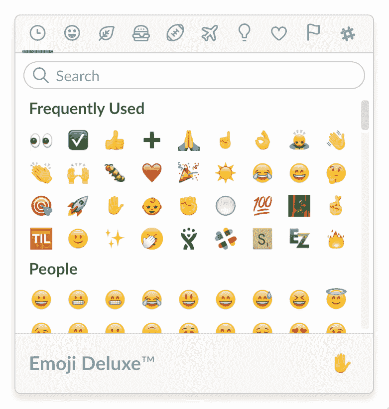
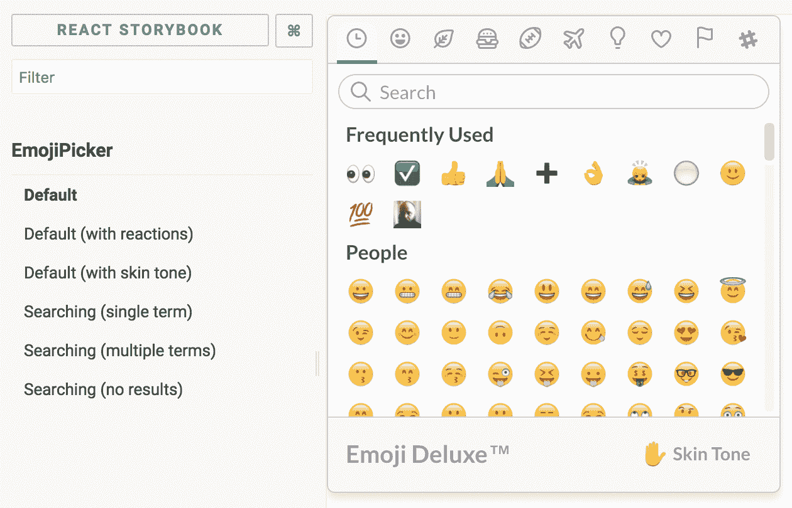
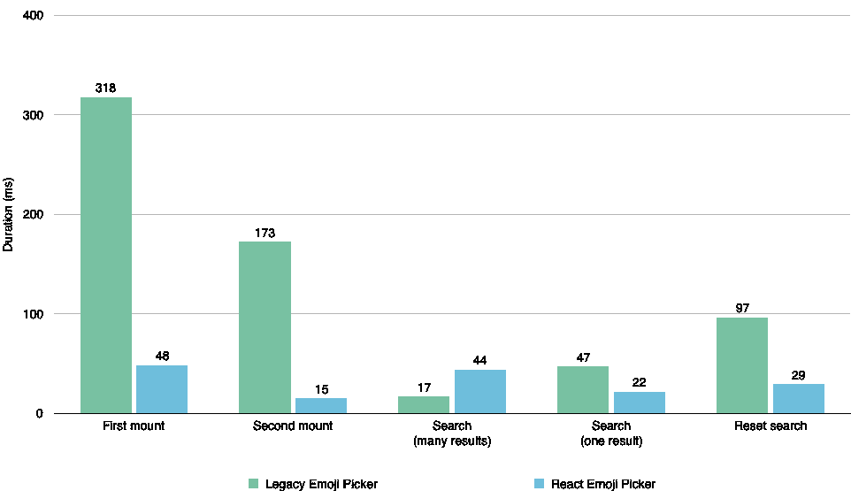

# 在 React - Slack 工程中重建 Slack 的表情选择器

> 原文：<https://slack.engineering/rebuilding-slacks-emoji-picker-in-react-bfbd8ce6fbfe?utm_source=wanqu.co&utm_campaign=Wanqu+Daily&utm_medium=website>

Slack 正在转变它的网络客户端以做出反应。当 Slack 第一次构建时，我们的前端由像 jQuery 和 Handlebars 这样的成熟技术组成。从那时起，社区已经开发了更好的方法来创建可伸缩的、数据驱动的接口。jQuery 的“渲染和修改”方法很简单，但是很容易与底层模型不同步。相比之下，React 的“渲染和重新渲染”模式将一致性作为默认设置。Slack 随着行业的发展而发展，以提高性能和可靠性。

我们认为引入 React 的最佳方式是重建现有的产品特性——这样，我们可以将开发过程和最终结果与已知的数量进行比较。我们需要一个交互的、自包含的、要求足够高的组件来证明我们的假设，即 React 可以提高性能。没多久就找到了一个完美的候选人——使用率很高、复杂得惊人的表情符号选择器。

Slack’s Emoji Picker

## 具有实际优势的虚拟 DOM

这篇文章假设读者对 React 有所了解。如果你不熟悉，我建议你浏览一下官方文件。简而言之，React 是一个 JavaScript 库，它使得编写声明性的、数据驱动的用户界面变得容易。该 API 是 trim，主要由一个包含一些生命周期方法的[组件](https://facebook.github.io/react/docs/react-api.html#react.component)类组成。组件不会自己生成标记。相反，它们呈现为一个类似 DOM 的树，称为虚拟 DOM。React 可以比较两个虚拟 DOM 树，以确定将第一个树转换为第二个树所需的最少操作。例如，您可以告诉 React 用新的模型数据重新呈现整个视图，它可能会决定只需要更新几个节点的文本。React 就像让一群侏儒代表你定制 DOM 更新。

React 擅长将一个组件可以改变的所有方式整合到一个模板中。例如，考虑当一个频道变为未读时，如何使用普通 JavaScript 来更新 Slack 的频道侧栏:

*   识别已修改频道的 ID 和未读状态
*   使用通道 ID 在 DOM 中查询通道元素
*   切换通道元素上的未读类

这个过程很简单，但是您必须编写额外的处理程序来支持其他通道事件，如“创建”、“加入”、“离开”和“重命名”。相比之下，React 通过以下方式适应所有五种场景:

*   用新的模型数据重新呈现频道侧栏

我们不再手写每个 DOM 更新，而是重新呈现整个组件，让 React 找出如何高效地完成它。这种方法通过用专门的代码路径替换通用的、一刀切的模板来简化开发。

## 挑选提货人

表情符号是 Slack 用户界面不可或缺的一部分，表情符号选择器是一个理想的 React 组件。它是动态的、离散的，只需要很少的输入——一系列表情符号、首选肤色和用户的历史表情符号使用。巧合的是，目前的表情符号选择器需要进行性能调整，因为它采用了一种不幸的策略，即渲染每个表情符号，而不管它是否在视图中。搜索包括切换匹配或不匹配用户搜索词的每个节点的可见性。这是一场千刀万剐的表演。新的 Slack 团队以 1374 个默认表情符号开始，随着你添加习俗，它会增加(截至本文撰写时，Slack 的团队共有 3126 个表情符号，但一些团队甚至更多！)重建表情符号选择器将让我们有机会以一种有意义的方式影响日常闲置使用。

Storybook UI displaying Emoji Picker variations

我们选择在 [Storybook](https://storybooks.js.org/) 中开发，这是一个自称“你将❤️使用的 UI 开发环境”。它不会取代你的风格指南，但它确实让开发、测试和审查代码变得更加愉快。Storybook 允许您通过指定不同的属性集来定义组件的变体。对于表情符号选择器，我们添加了肤色偏好的变体和搜索的多个变体。Slack 的任何人——开发者或其他人——都可以打开 Storybook 并查看列举的状态。

## 元件布置

React 表情符号选择器是从一个有状态的根组件构建的，它有许多无状态的子组件。我们坚持每个文件导出一个组件的惯例。大致结构如下:

### **表头**

*   类别标签:列出带有“跳转到”链接的表情类别
*   搜索栏:通过表情名称/别名过滤表情列表内容

### **正文**

*   粘性标题:显示活动类别的名称
*   表情列表:所有类别的虚拟表情列表

### **页脚**

*   表情预览:当前所选表情的大视图
*   肤色选择器:显示当前的肤色，并提供选择新肤色的选项
*   便捷反应(可选):表情符号的子集，通常用于对信息做出反应

在 React 中编写无状态组件有两种主要方法:类 [PureComponent](https://facebook.github.io/react/docs/react-api.html#react.purecomponent) 和函数[T3。函数更简单，但它们会在每次协调时呈现，这会影响性能。React 团队有优化函数的计划，但目前看来最好避免使用它们。我们选择使用 PureComponent，它包含一个预定义的 shouldComponentUpdate 方法，当传递相同的 props 时，该方法会阻止更新。](https://facebook.github.io/react/docs/components-and-props.html#rendering-a-component)

由于 React 只是一个视图层，将它集成到一个已建立的应用程序中可能比集成一个规范的框架更简单。对我们来说，重要的是不要为了适应 Slack 中存在的模式而损害新表情选择器的封装设计——我们希望该组件看起来像是从端到端 React 应用程序中提取的。为了保持挑选器的纯净，我们在现有的模块系统中创建了一个轻量级适配器。适配器安装组件，提取模型数据，并监听外部信号。这种模式允许我们在开发新功能的同时逐步移植代码库。

## 新开发工作流程

虽然使用 React 进行开发是一件愉快的事情，但是将它集成到我们现有的开发工作流中却不是——至少一开始不是。当时，Slack 的前端构建管道是内部开发的，没有导入、依赖或 transpilation 等复杂转换的概念。然而，我们决定充分利用 JSX 语法以及编写 ES2015+ JavaScript 的好处。代替现代的构建管道，我们开始用 Babel 和 webpack 在本地构建表情符号选择器资产。

我们预料到签入本地编译的代码会很痛苦，但是我们低估了随之而来的合并冲突和依赖管理会有多糟糕。因此，我们正在努力将 webpack 集成到我们的开发和试运行环境中，目标是无缝替换现有的工作流。为此，我们:

*   围绕 [webpack-dev-server](https://github.com/webpack/webpack-dev-server) 开发了一个服务，当被监视的文件或它们的依赖关系改变时(包括 webpack 自己的配置),自动编译和提供我们的开发服务器上的资产
*   增加了在单元测试中加载 webpack 资产的支持(使得为我们的 React 组件编写测试成为可能)
*   修改了我们的生产构建流程，将 webpack 资产推送到我们的 CDN

事实证明，重新构建表情符号选择器正是我们重新思考构建管道所需的动力，以便以更健壮、更可伸缩的方式捆绑和传输资产。

## 绩效结果

我们将新组件部署到一小部分团队中，并观察结果。我们测量了用户与表情选择器交互的 5 种常见方式的渲染速度。对于大多数操作，React 实现明显更快。下面列出了典型规模团队的渲染时间差异:

*   **第一次挂载:**-270 毫秒(减少 85%)
*   **第二次挂载:**-158 毫秒(减少 91.3%)
*   **搜索(很多结果):**+27 毫秒(增长 259%)
*   **搜索(一个结果):**-25 毫秒(下降 53.2%)
*   **重置搜索:**-68 毫秒(减少 70.1%)

最大的改进出现在“首次装载”期间，从 318 毫秒下降到 48 毫秒，减少了 270 毫秒，降幅达 85%。这在很大程度上归功于[react-virtualized](https://github.com/bvaughn/react-virtualized)——一个虚拟列表库——减少了渲染表情符号的数量。React 表情选择器在默认视图中呈现的 DOM 节点减少了 85%。

也许最令人惊讶的变化发生在“搜索(许多结果)”期间，它增加了 27 毫秒，从 17 毫秒增加到 44 毫秒。传统选择器直观地隐藏了与搜索查询不匹配的表情符号，这意味着当几乎所有内容都匹配时，它相对较快。这种方法的缺点表现在“搜索(一个结果)”和“重置搜索”场景中，这两种场景迫使遗留选择器在更大的表情集合上执行工作。

## 后续步骤

在 React 中重建表情符号选择器导致了更快的渲染和更容易维护的简化代码。我们正在通过完全过渡到 React 来将这些收益扩展到我们代码库的其余部分。我们还有很多工作要做，我们对这一转变将对我们客户的日常体验产生的积极影响感到兴奋。与此同时，我们正在利用 React 构建内部专业知识，以便我们能够帮助推动该平台向前发展。

想要帮助 Slack 解决棘手的问题并加入我们不断成长的团队吗？查看我们所有的工程职位，并立即申请。[立即申请](https://slack.com/jobs/dept/engineering)