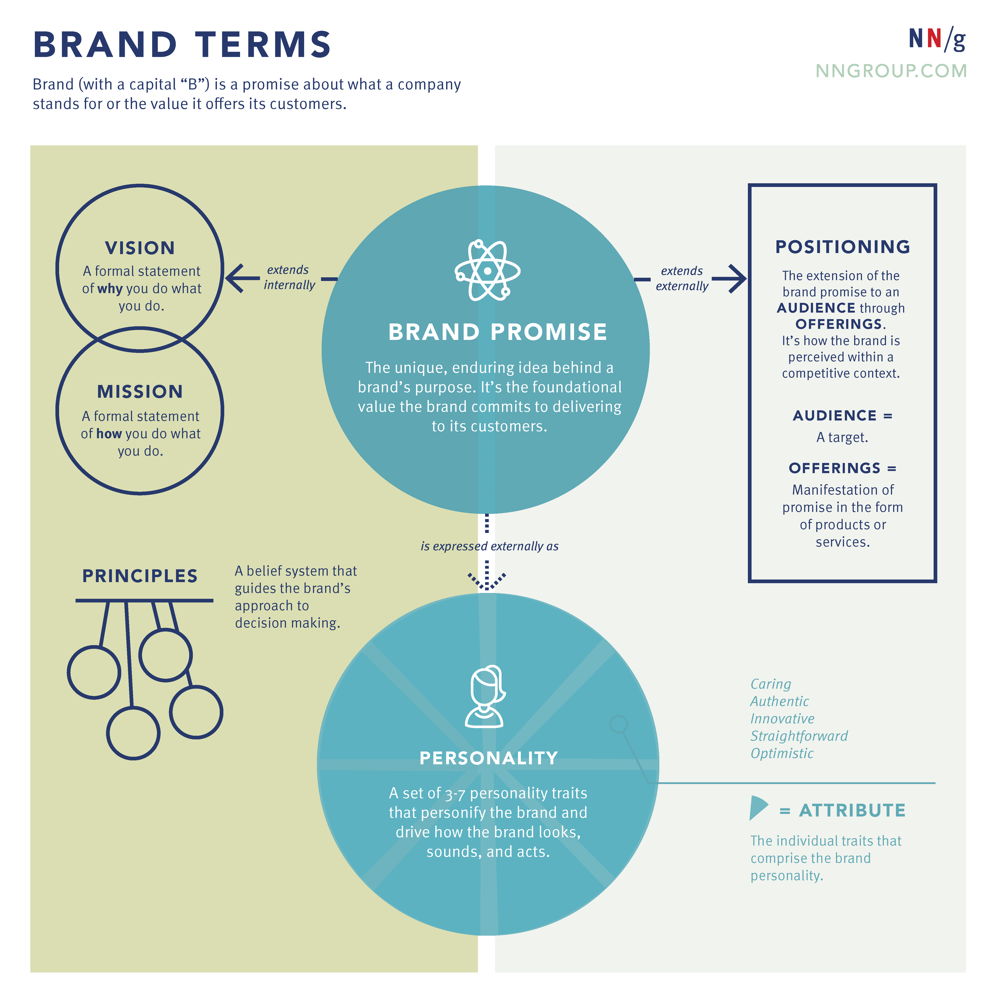
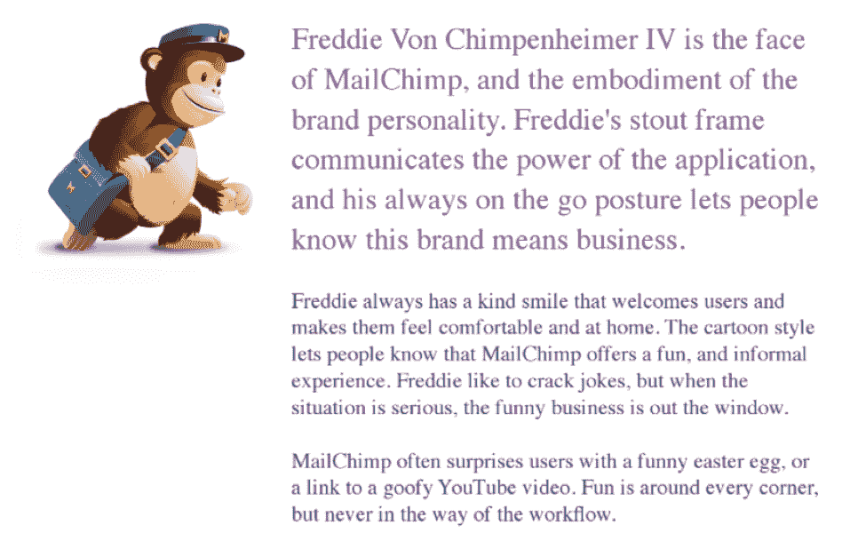
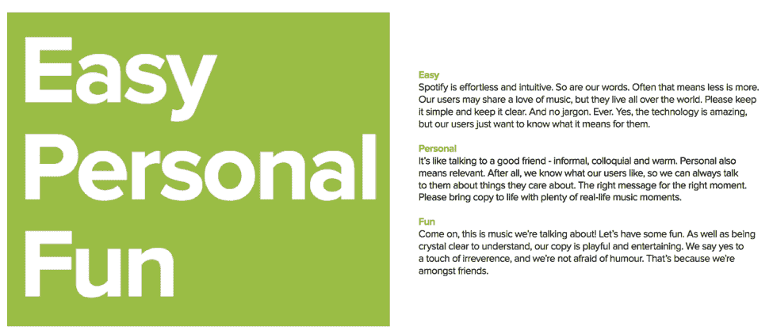
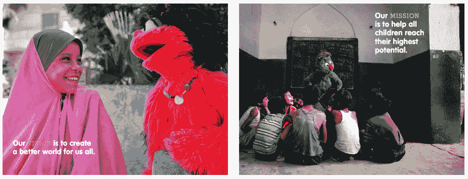
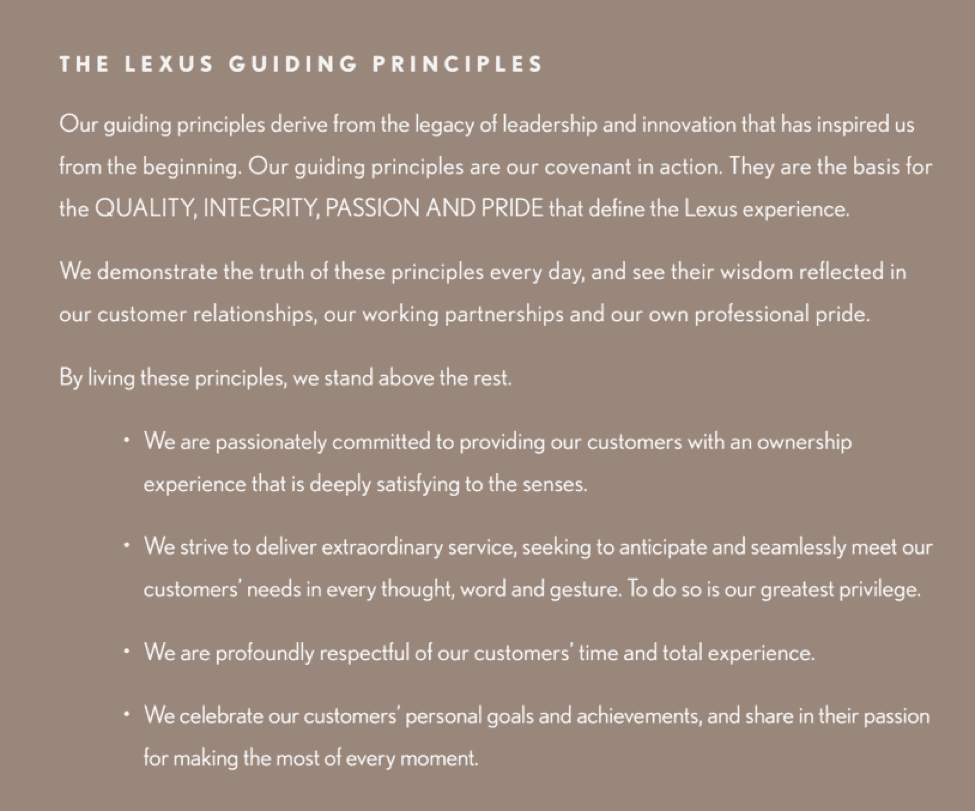

# UX 背景下的品牌词汇:定义的关键术语

> 原文：<https://www.nngroup.com/articles/ux-brand-terms-defined/?utm_source=wanqu.co&utm_campaign=Wanqu+Daily&utm_medium=website>

今天，由于复杂的数字用户体验和双向对话(例如，社交分享和用户生成的内容)，品牌是一个复杂的、多方面的概念。用来指代关键品牌概念的语言可能会模糊不清，令人困惑，尤其是当涉及到这些术语与用户体验的关系时。通常，品牌组件没有明确定义(有时甚至不兼容)。事实上,“品牌”这个词本身通常被误用来表示产品名称、视觉识别或标志。

为了清晰起见，我们汇编并定义了一组关键的品牌术语，并提供了这些元素在用户体验设计中的角色的一些背景。这些定义旨在帮助组织和设计师在将品牌转化为用户交互时建立一个共享的词汇和理解。

## 什么是品牌？

让我们重申一下[我们对品牌和品牌](https://www.nngroup.com/articles/brand-experience-ux/)的定义，这是两个经常混淆的概念:

1.  品牌(大写字母“B”)是关于一家公司代表什么的承诺，或者说，它为客户提供的价值。例如，一个特定的品牌可以代表其相关产品可能“健康”、“可持续制造”或“耐用”的承诺。
2.  **品牌推广(小写字母“b”)**则定义为通过在广告、宣传、包装等方面应用标识或其他准则，对品牌身份的受控展示。

有了第一个更有意义的品牌定义后，我们整理并定义了构成组织品牌框架的概念——这些概念必须在公司范围内进行定义和理解，以便组织能够通过各种渠道提供一致的品牌体验。这是一个组织必须阐明和记录的一套部件，以便有一个坚实的品牌基础，团队可以从这个基础上做出有凝聚力的设计决策。

## 品牌框架的组成部分

品牌框架有六个核心要素，团队必须理解这些要素，才能有效地将品牌转化为一致的用户交互:

1.  品牌承诺
2.  品牌个性
3.  品牌属性
4.  代表团
5.  视力
6.  品牌原则

## (1)品牌承诺

**品牌承诺**(也称为品牌概念、意义或本质)是品牌宗旨背后独特而持久的理念。这是品牌承诺向顾客传递的基本价值。有时，品牌承诺被用作公司的标语或口号，但并不总是如此。

品牌承诺不仅仅体现在用户体验的一个地方，而是贯穿整个全渠道体验。品牌承诺驱动所有其他因素，包括内部和外部因素——从公司愿景、使命和原则到品牌定位、受众和营销。

品牌承诺回答了这个问题，“这家公司存在的理由是什么？”一些品牌承诺的例子有:

*   苹果:*想不同*
*   联邦快递:*世界准时*
*   目标:*期待更多。少付钱。*
*   葛:*想象力在起作用*

起初，在 UX 的背景下，品牌承诺似乎很抽象。然而，请考虑使用品牌承诺作为衡量标准。发布前，回到你说好的承诺，对比体验。你的品牌是否兑现了对用户的承诺？如果不是，你如何利用你作为设计师的角色来弥合预期的品牌承诺和用户体验的现实之间的差距？

## (2)品牌个性

**品牌个性**是一系列定义明确的特征，体现了品牌的个性。这种个性贯穿于从产品或服务设计到视觉系统开发以及与客户沟通的方方面面。一个定义明确的品牌个性回答了以下问题:“如果品牌是一个人或角色，它会是什么样的？它在某些情况下会如何行动？”

有时，品牌甚至会创造一个吉祥物或品牌角色来代表他们的个性，比如 MailChimp 的 Freddie Von Chimpenheimer IV。在这种情况下，品牌角色作为品牌吉祥物承担了双重责任，但情况并非总是如此。

*At launch, MailChimp went through an internal exercise to map and visualize the brand’s personality, which resulted in the well-known brand mascot.*

在 UX，品牌个性可以用来推动关于特定交互、视觉和文案的设计决策。如果一个品牌是有趣的，动画或页面负载应该以某种方式表明这一点。如果一个品牌是直截了当的、严肃的，那么所用的文案会偏于正式和专业。

## (3)品牌属性

**品牌属性**是构成品牌个性的个体特征或个性特征。

例如，沃尔玛将其品牌属性列为:

*   乐于助人的; 关心他人的
*   真正的
*   创新的
*   坦率的
*   乐观的

这一系列共同构成了沃尔玛的品牌个性。

*Walmart’s first brand attribute listed in its brand book is “caring.” That trait, along with the other four traits listed, should ideally drive the way Walmart interacts with its customers.*

总之，品牌属性有助于组织推动设计决策并创建符合品牌个性的用户交互——无论是人对人还是人对机器。

通常，品牌有一组 3-7 个品牌属性，这些属性在组织的环境中被很好地定义。在上面的沃尔玛例子和下面的 Spotify 例子中，组织已经花时间提供了这些潜在模糊术语对于设计和品牌体验的具体定义。有了这个额外的背景，一套品牌属性就成了设计师随时可用的试金石。例如，在设计用户流甚至电子邮件文案时，Spotify 的设计师或作家可以问自己:“这种体验是否轻松、个性化和有趣？是否体现了我们的品牌属性？”

*Spotify’s brand attributes are “easy,” “personal,” and “fun.” The organization has given these concepts specific definitions within the context of Spotify.*

## (4)品牌愿景和(5)使命

**品牌愿景和使命**是帮助品牌以更具战术性的方式表达其承诺的正式声明。品牌愿景表达了公司为什么要这么做，而品牌使命表达了公司如何努力实现这一愿景。换句话说，愿景是公司对这个问题的回答:“如果我们的品牌以最理想的形式存在，世界会是什么样子？”反过来，任务回答这个问题:“我们如何到达那里？”

例如，正如其品牌手册中所指出的，芝麻街的愿景是“为我们所有人创造一个更美好的世界。”它旨在通过其使命实现这一愿景:“帮助所有儿童发挥他们的最大潜力。”芝麻街称赞说，为了创造“一个对我们所有人都更好的世界”(他们的愿景)，他们应该“帮助孩子们发挥他们的最大潜力。”

另一个例子:[宜家](http://www.ikea.com/ms/en_SG/about_ikea/our_business_idea/index.html)的使命强化了“让大众过上更美好的日常生活”的愿景:“通过提供物美价廉的产品，最大限度地利用原材料，满足人们的需求和偏好。”

*Sesame Street’s vision and mission help explain why the brand exists, as well as how it attempts to reach its aspiration.*

品牌愿景和使命可以帮助 UX 的专业人士优先考虑，路线图，并作出大规模的产品和设计决策。想象你的团队正在创建一个 MVP(或者最小可行产品)的路线图。你的 MVP 至少需要满足品牌使命的某些部分。

## (6)品牌原则

**品牌原则**是品牌使命和愿景的直接延伸。它们可以被认为是指导公司决策方法的核心价值观的信仰体系，也是内部公司文化的驱动力。

例如，雷克萨斯的品牌原则影响着整个设计过程中的每一个决策，以及内部组织文化:

*Lexus’ brand principles are posted on the organization’s website, helping keep employees accountable, as well as priming consumers for what an experience with Lexus will be like.*

权衡是不可避免的；事实上，这几乎是一个人必须做出选择的设计定义。然而，在判断设计备选方案或优先考虑看起来同样有吸引力的内部计划时，品牌原则可以作为一套标准，帮助我们了解哪个选择最符合我们组织的品牌。

品牌原则帮助我们在日常决策中与品牌承诺保持一致。把原则想象成隐喻的保险杠，让我们保持在正确的轨道上。

## 结论

虽然这些术语一开始会让人感到不知所措，但在早期投入时间来创建对品牌相关词汇的清晰、共享的理解是值得的。初级的混淆导致对品牌的不一致理解，最终导致用户体验的破碎。

在我们的全天课程[中将品牌转化为用户互动](https://www.nngroup.com/courses/translating-brand/)中，学习如何在用户体验中清晰地表达和表达您的品牌。

