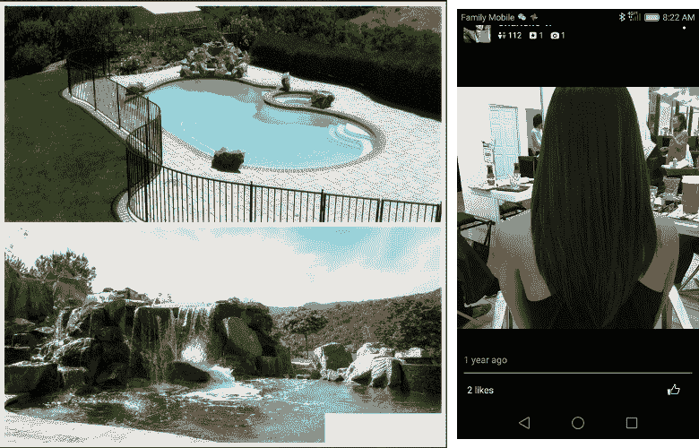
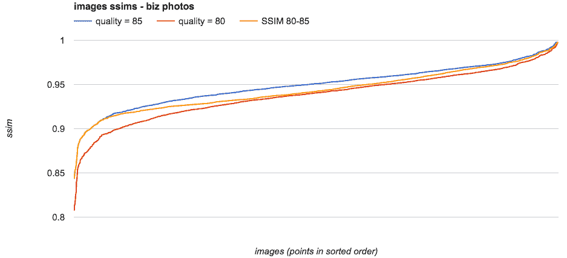
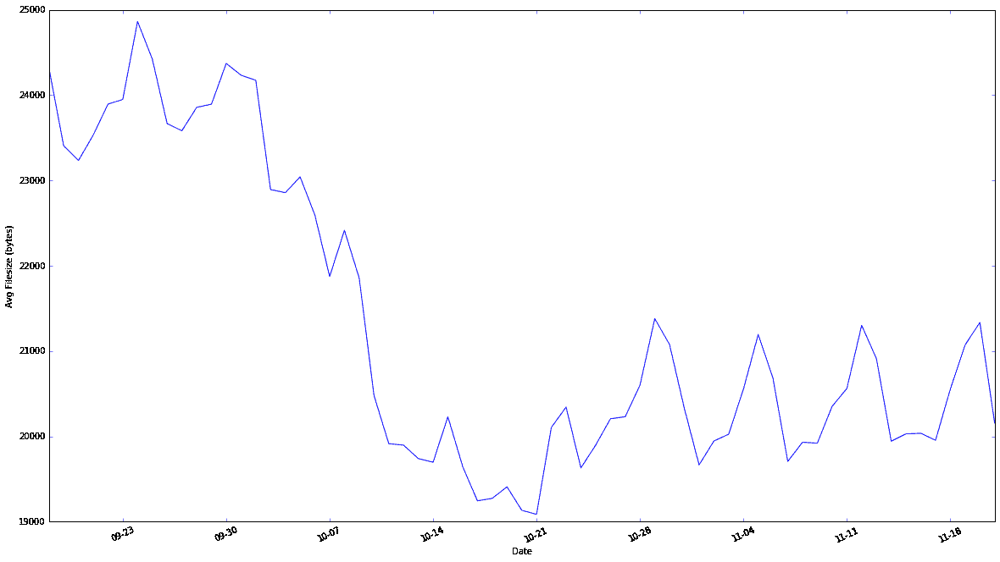

# 在不损失质量的情况下缩小照片

> 原文：<https://engineeringblog.yelp.com/2017/06/making-photos-smaller.html?utm_source=wanqu.co&utm_campaign=Wanqu+Daily&utm_medium=website>

Yelp 拥有超过 1 亿张用户生成的照片，从晚餐或理发的照片到我们的最新功能之一， [#yelfies](https://www.yelpblog.com/2016/11/yelfie) 。这些图像占据了应用程序和网站用户的大部分带宽，并且代表了存储和传输的巨大成本。为了给我们的用户提供最佳体验，我们努力优化我们的照片，并能够实现 30%的平均尺寸缩减。这为我们的用户节省了时间和带宽，并降低了我们提供这些图像的成本。哦，我们做到了这一切，没有降低这些图像的质量！

# 背景

Yelp 储存用户上传的照片已经超过 12 年了。我们将无损格式(PNG，GIF)保存为 PNG，所有其他格式保存为 JPEG。我们使用 Python 和 [Pillow](https://python-pillow.org/) 来保存图像，并以如下片段开始我们的照片上传故事:

<noscript><pre>400: Invalid request</pre></noscript>

以此为起点，我们开始研究文件大小的潜在优化，我们可以在不损失质量的情况下应用。

# 最佳化

首先，我们必须决定是自己处理还是让 CDN 提供商神奇地改变我们的照片。随着我们对高质量内容的重视，我们自己评估选项并做出潜在的大小与质量的权衡是有意义的。我们继续研究照片文件大小缩减的当前状态——可以进行哪些更改，以及每种更改会带来多大的大小/质量缩减。这项研究完成后，我们决定研究三个主要类别。这篇文章的其余部分解释了我们做了什么，以及我们从每次优化中获得了多少好处。

1.  枕头的变化
    *   优化标志
    *   渐进 JPEG
2.  更改应用程序照片逻辑
    *   大型 PNG 检测
    *   动态 JPEG 质量
3.  对 JPEG 编码器的更改
    *   网格量化，自定义量化矩阵

# 枕头的变化

## 优化标志

这是我们所做的最简单的改变之一:启用 Pillow 中的设置，以 CPU 时间为代价负责额外的文件大小节省(`optimize=True`)。由于折衷的性质，这根本不会影响图像质量。

对于 JPEG，该标志指示编码器通过对每个图像扫描进行额外的传递来找到最佳的[霍夫曼编码](https://en.wikipedia.org/wiki/Huffman_coding)。每个第一遍，而不是写入文件，计算每个值的出现统计，计算理想编码所需的信息。PNG 内部使用 zlib，因此在这种情况下，optimize 标志有效地指示编码器使用`gzip -9`而不是`gzip -6`。

这是一个很容易做到的改变，但事实证明它不是一个银弹，只减少了百分之几的文件大小。

## 渐进 JPEG

将图像存储为 JPEG 格式时，有几种不同的类型可供选择:

*   基线 JPEG 图像从上到下加载。
*   渐进式 JPEG 图像从模糊到不模糊加载。渐进式选项可在 Pillow ( `progressive=True`)中轻松启用。因此，可以感觉到性能有所提高(也就是说，当图像部分缺失时，注意到这一点比注意到它不完全清晰要容易得多)。

此外，渐进式文件的打包方式通常会导致文件大小略有减小。正如[维基百科文章](https://en.wikipedia.org/wiki/JPEG#Entropy_coding)更全面解释的那样，JPEG 格式在 8×8 像素块上使用锯齿形模式进行熵编码。当这些像素块的值被解包并按顺序排列时，通常首先是非零数字，然后是 0 序列，对于图像中的每个 8×8 块，该模式重复并交错。利用渐进编码，展开的像素块的顺序改变。每个块的较高值的数字首先出现在文件中，(这使得逐行扫描图像的最早扫描具有明显的块效应)，并且较小数字的较长跨度，包括更多的 0，添加了更精细的细节，接近末尾。图像数据的这种重新排序不会改变图像本身，但会增加一行中 0 的数量(这样更容易压缩)。

与用户提供的甜甜圈美味图片的对比(点击查看大图):

[img/posts/2017-05-31-making-images-smaller/baseline-large.gif) 

<small>(左)一个基本 JPEG 渲染的模拟。</small>

[img/posts/2017-05-31-making-images-smaller/progressive-large.gif) 

(右)一个对渐进 JPEG 渲染的模拟。

# 更改应用程序照片逻辑

## 大型 PNG 检测

Yelp 针对两种图像格式提供用户生成的内容——JPEG 和 PNG。JPEG 是一种很好的照片格式，但通常难以处理高对比度的设计内容(如徽标)。相比之下，PNG 是完全无损的，因此非常适合图形，但对于小失真不可见的照片来说太大了。在用户上传实际上是照片的 png 文件的情况下，如果我们识别这些文件并将其保存为 JPEG 格式，我们可以节省大量空间。Yelp 上一些常见的 PNG 照片来源是移动设备和应用程序拍摄的截图，这些设备和应用程序修改照片以添加效果或边框。

### 

<small>(左图)典型的复合 PNG 上传，带 logo 和边框。(右)截图中典型的 PNG 上传。</small>

我们希望减少这些不必要的 png 的数量，但重要的是避免过度和改变格式或降低标识、图形等的质量。我们如何辨别某样东西是不是照片？从像素来看？

使用 2500 张图像的实验样本，我们发现文件大小和独特像素的组合可以很好地检测照片。我们以最大分辨率生成一个候选缩略图，并查看输出的 PNG 文件是否大于 300KiB。如果是，我们还将检查图像内容，看看是否有超过 2^16 独特的颜色(Yelp 将 RGBA 图像上传转换为 RGB，但如果没有，我们也会检查)。

在实验数据集中，这些手动调整的定义“大”的阈值捕获了 88%的可能文件大小节省(即，如果我们要转换所有图像，我们预期的文件大小节省)，而没有任何图形被转换的假阳性。

## 动态 JPEG 质量

第一种也是最广为人知的减小 JPEG 文件大小的方法是一个名为`quality`的设置。许多能够保存为 JPEG 格式的应用程序将质量指定为一个数字。

质量在某种程度上是抽象的。事实上，JPEG 图像的每个颜色通道都有不同的质量。质量等级 0 - 100 映射到颜色通道的不同[量化表](https://en.wikipedia.org/wiki/JPEG#JPEG_codec_example)，确定有多少数据丢失(通常是高频)。信号域中的量化是 JPEG 编码过程中丢失信息的一个步骤。

减小文件大小的最简单方法是降低图像质量，引入更多的噪点。然而，在给定的质量水平下，并不是每张图像都会丢失相同数量的信息。

我们可以动态选择针对每张图像优化的质量设置，在质量和大小之间找到理想的平衡。有两种方法可以做到这一点:

*   **自下而上:**这些算法通过在 8×8 像素块级别处理图像来生成调整的量化表。他们计算理论质量损失了多少，以及损失的数据如何放大或抵消，以使人眼或多或少地可见。
*   **自上而下:**这些算法将整个图像与其原始版本进行比较，并检测有多少信息丢失。通过迭代地生成具有不同质量设置的候选图像，我们可以选择满足我们选择的任何评估算法的最低评估水平的图像。

我们评估了一种自下而上的算法，根据我们的经验，这种算法在我们想要使用的质量范围的高端没有产生合适的结果(尽管它似乎在中等图像质量范围内仍有潜力，编码器可以开始更大胆地使用它丢弃的字节)。许多关于这一策略的学术论文发表于 90 年代初，当时计算能力非常珍贵，并采取了选项 B 解决的捷径，例如不评估跨块的交互。

所以我们采取了第二种方法:使用二分法生成不同质量水平的候选图像，并通过使用 [pyssim](https://github.com/jterrace/pyssim/) 计算其结构相似性度量( [SSIM](https://en.wikipedia.org/wiki/Structural_similarity) )来评估每个候选图像的质量下降，直到该值处于可配置但静态的阈值。这使我们能够有选择地降低平均文件大小(和平均质量),只对那些一开始就明显降低的图像。

在下面的图表中，我们绘制了通过 3 种不同质量方法生成的 2500 幅图像的 SSIM 值。

1.  当前方法在`quality = 85`生成的原始图像标为蓝线。
2.  降低文件大小的另一种方法，改变`quality = 80`，标为红线。
3.  最后，我们最终使用的方法是 orange 中的`SSIM 80-85`动态质量，它根据是否达到或超过 SSIM 比率，在 80 到 85(包括 85)的范围内选择图像质量:预先计算的静态值，使过渡发生在图像范围的中间。这让我们可以在不降低最差图像质量的情况下降低平均文件大小。

### 

<small>采用 3 种不同质量策略的 2500 张图像的 SSIMs。</small>

### SSIM？

有相当多的图像质量算法试图模仿人类视觉系统。我们已经评估了其中的许多，并认为 SSIM 虽然更老，但基于以下几个特征最适合这种迭代优化:

1.  对 [JPEG 量化误差](http://users.eecs.northwestern.edu/~pappas/papers/brooks_tip08.pdf)敏感
2.  快速、简单的算法
3.  可以在 PIL 本地图像对象上计算，而无需将图像转换为 PNG 并将它们传递给 CLI 应用程序(参见#2)

动态质量示例代码:

<noscript><pre>400: Invalid request</pre></noscript>

还有一些关于这种技术的博客文章，这里的是 Colt Mcanlis 写的。当我们出版的时候，Etsy 已经出版了一个[在这里](https://codeascraft.com/2017/05/30/reducing-image-file-size-at-etsy/)！击掌，更快的上网！

# 对 JPEG 编码器的更改

## Mozjpeg

[Mozjpeg](https://github.com/mozilla/mozjpeg/) 是 [libjpeg-turbo](http://libjpeg-turbo.virtualgl.org/) 的开源分支，以执行时间换取文件大小。这种方法与重新生成图像的离线批处理方法非常吻合。在比 libjpeg-turbo 多投入约 3-5 倍时间的情况下，几个更贵的算法就能让图像变小！

mozjpeg 的一个独特之处是使用了另一种量化表。如上所述，质量是用于每个颜色通道的量化表的抽象。所有迹象都表明默认的 JPEG 量化表很容易被击败。用 JPEG 规范的话说:

> 这些表格仅作为示例提供，不一定适合任何特定的应用。

因此，自然地，当您知道这些表是大多数编码器实现使用的默认表时，您不会感到惊讶…🤔🤔🤔

Mozjpeg 已经为我们完成了基准测试替代表的麻烦，并为它创建的图像使用了性能最好的通用替代表。

## Mozjpeg + Pillow

大多数 Linux 发行版默认安装了 libjpeg。所以在 Pillow 下使用 mozjpeg 在默认的 T2 下是不工作的，但是配置它也不是很困难。当你构建 mozjpeg 时，使用`--with-jpeg8`标志并确保它可以被 Pillow 找到。如果您使用 Docker，您可能会有一个 Docker 文件，如下所示:

<noscript><pre>400: Invalid request</pre></noscript>

就是这样！构建它，你就可以在正常的图像工作流程中使用由 mozjpeg 支持的 Pillow 了。

# 影响

这些改进对我们有多重要？我们从 Yelp 的 2500 张商业照片中随机抽取样本开始这项研究，以通过我们的处理流程，并测量对文件大小的影响。

1.  枕头设置的改变导致了大约 4.5%的节省
2.  大量 PNG 检测带来了约 6.2%的节省
3.  动态质量带来了大约 4.5%的节约
4.  转换到 mozjpeg 编码器带来了大约 13.8%的节省

这使得图像文件大小平均减少了约 30%，我们将这一点应用于最大和最常见的图像分辨率，使网站对用户来说更快，并在数据传输方面每天节省数兆字节。在 CDN 测量:

### 

<small>一段时间内的平均文件大小，根据 CDN 测量(结合非图像静态内容)。</small>

# 我们没有做的

这一部分旨在介绍一些您可能能够进行的其他常见改进，这些改进要么由于我们的工具选择的默认设置而与 Yelp 无关，要么是我们选择不进行的折衷。

## 二次抽样

[二次采样](https://en.wikipedia.org/wiki/Chroma_subsampling)是决定网页图像质量和文件大小的主要因素。关于二次采样的更详细的描述可以在网上找到，但是对于这篇博文来说，我们已经在`4:1:1`进行了二次采样(这是 Pillow 的默认设置，如果没有指定的话)，所以我们无法在这里实现任何进一步的节省。

## 有损 PNG 编码

在了解了我们对 PNG 所做的事情后，选择将其中一些保存为 PNG，但使用像 [pngmini](https://pngmini.com/lossypng.html) 这样的有损编码器可能是有意义的，但我们选择将它们重新保存为 JPEG。根据作者的说法，这是一个具有合理结果的替代选项，比未修改的 png 节省 72-85%的文件大小。

## 动态内容类型

对更现代的内容类型如 WebP 或 JPEG2k 的支持当然在我们的考虑范围之内。即使这个假想的项目发布了，还是会有大量的用户需要这些现在已经优化的 JPEG/PNG 图像，这将继续让这项工作物有所值。

## 挽救（saving 的简写）

我们在网站的很多地方都使用 SVG，比如我们的设计师创建的静态资产，它们被放入我们的 [styleguide](http://yelp.design) 。虽然这种格式和优化工具如 [svgo](https://github.com/svg/svgo) 对于降低网站页面权重很有用，但它与我们在这里所做的无关。

## 供应商魔术

提供图像交付/调整大小/裁剪/转码服务的提供商不胜枚举。包括开源的 [thumbor](https://github.com/thumbor/thumbor) 。也许这是支持响应式图像、动态内容类型并在未来保持领先地位的最简单方式。目前，我们的解决方案仍然是独立的。

# 进一步阅读

这里列出的两本书绝对独立于本文之外，强烈推荐作为关于这个主题的进一步阅读。

### 成为 Yelp 的一名工程师

Yelp 的后端应用团队参与了许多类似这样的令人难以置信的基础设施项目。如果你感兴趣，请在下面申请！

[View Job](https://www.yelp.com/careers/job-openings/e4e2318e-cba0-487e-a8c9-7237c2d90c0e?lever-source=engineering_blog)

[回到博客](/)