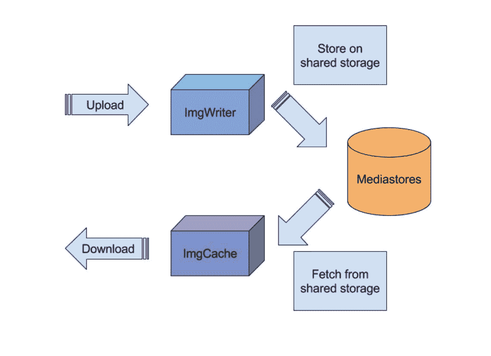
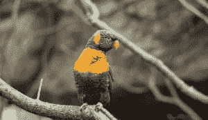
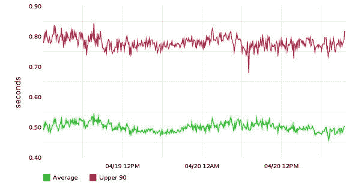
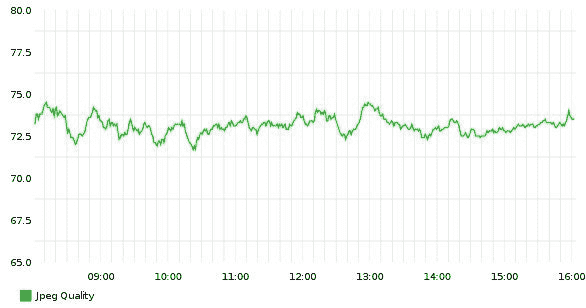
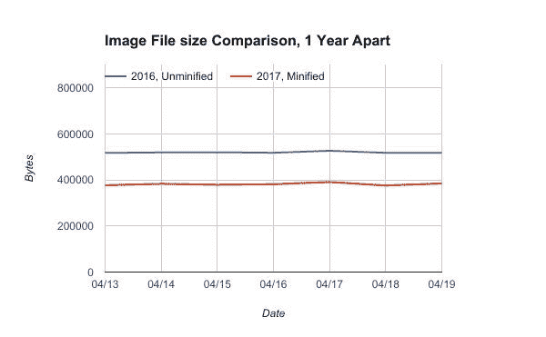
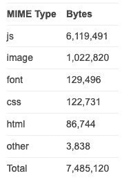
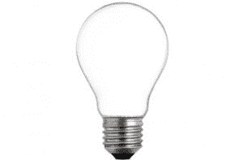
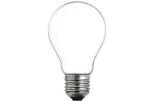

# Etsy 工程|减小 Etsy 的图像文件大小

> 原文：<https://codeascraft.com/2017/05/30/reducing-image-file-size-at-etsy/?utm_source=wanqu.co&utm_campaign=Wanqu+Daily&utm_medium=website>

提供图像是 Etsy 基础设施的重要组成部分。我们的卖家依靠展示干净、视觉上吸引人的图片来展示他们的产品。买家可以通过阅读描述来了解一件商品，但看到你找到的定制项链、完美风格的衬衫或独一无二的手袋的照片也是一种有形的东西。

我们的映像基础架构非常简单。用户将上传图像，我们在专用处理机器(ImgWriters)上将它们转换为 jpegs，并存储在大型数据存储(Mediastores)中。根据请求，我们有专门的主机(ImgCaches)从媒体商店获取图像，并将其发送给我们的用户。

当然，还有许多更小的部分组成了我们的照片基础架构。例如，我们的 ImgWriters 涉及到负载平衡，将请求分散到整个集群，我们的 ImgCaches 对频繁请求的图像进行一定程度的本地内存缓存，并结合哈希方案来减少重复工作。在此之前，我们的 CDN 端也有缓存。在写入器和缓存背后，我们的媒体存储中有一些冗余，这既是为了避免单点故障场景，也是为了扩展。

然而，在整个架构中，我们最大的限制之一是我们传递的数据的大小。我们的 CDN 在开始驱逐图像之前只能缓存这么多，此时请求被路由回我们的源。更大的图像将需要更多地使用我们的 CDN，从而推高成本。对于我们的用户来说，随着图像大小的增加，页面的下载时间也会增加，这会影响性能并导致次优的用户体验。同样，任何内部图像后处理都会增加我们在网络上使用的带宽，并增加我们的存储需求。较小的图像有助于我们更快更远地缩放。

由于我们使用 jpeg 作为我们的格式，减少图像数据大小的一个简单方法是降低 JPEG 质量值，压缩图像的内容。当然，随着我们进一步压缩，我们会继续降低图像的视觉质量——边缘会变得模糊，并且会出现伪像。下面是这样一个例子。左边的图像 jpeg 质量为 92，而右边的图像 JPEG 质量为 25。在这种极端情况下，我们可以看到右边一只鸟的图片开始出现压缩的迹象——背景变得“块状”，边缘周围出现“伪像”，比如鸟的周围和后面背景的块状。

左边 jpeg 质量为 92，右边 jpeg 质量为 25。

对于 Etsy 的大部分历史处理图像，我们保持了一个普遍保持的常数，即设置 jpeg 图像的质量为 85 被认为是一个“良好的平衡”。再大一点，我们可能看不到足够的差异来保证所有这些额外的字节。但是我们能把它降低到 80 吗？或许黄金数字是 75？这完全取决于用户上传的图片。在白色背景上的戒指图片之前，具有各种梯度的日落可能开始显示降低 jpeg 质量的负面影响。我们真正想要的是能够确定每张图片设置什么样的 jpeg 质量是好的。

为此，我们在堆栈中添加了一个名为 [dssim](https://github.com/pornel/dssim) 的图像比较工具。Dssim 使用估计人类视觉的 [SSIM](https://ece.uwaterloo.ca/~z70wang/research/ssim/) 算法来计算两幅图像的不同程度。给定两个(或更多)图像，它将比较结构相似性，并产生从 0(完全相同)到无界的值。注意，虽然 README 声明它只比较两个 png，但是最近对库的更新也允许使用 jpegs 之间的比较。

以用户上传的图像为基础，我们可以对 jpeg 质量进行二分搜索法，以找到视觉质量(看起来有多好)和 jpeg 质量(可以帮助确定压缩大小的值)之间的平衡。如果我们假设 85 是图像的最佳上限，我们可以尝试将质量降低到 75。比较 85 和 75 处的图像，如果返回的值高于 dssim 分数“好”的已知阈值，我们可以将 jpeg 质量提高到 80 之间的一半。如果低于某个阈值，也许我们可以尝试将质量降低一点，比如 70。无论哪种方式，我们继续比较，直到我们找到一个满意的中间点。

该算法改编自 Tobias Baldauf 在压缩 jpegs 方面的[工作](https://github.com/technopagan/cjpeg-dssim)。在遇到一些速度问题之前，我们首先使用这个 bash 脚本测试了压缩。虽然这对于图像的离线异步优化很好，但我们希望保持我们的同步，以便用户可以在上传时看到与向用户显示时相同的图像。通过从 PHP 中剥离，我们在较大的图像上突破了 15-20 秒，因此深入挖掘一些性能优势。

速度放缓的部分原因是 cjpeg-dssim 正在从 jpeg 转换为 png，以便与 dssim 进行比较。自从最初的 bash 脚本编写以来，已经有了一个允许 dssim 比较 jpegs 的更新。我们可以节省一半或更多的时间，因为我们不必进行双向转换。我们还将代码移植到 PHP，因为我们已经在内存中有了图像 blob，可以避免每次读取和写入图像到磁盘的一些调用。我们还调整了一些大小调整，使其更保守一些，将 jpeg 质量限制在 85 到 70 之间，以缩短比较时间，从 78 的图像质量开始，如果超过 85 或低于 70，就停止比较。由于我们为图像剪切了许多大小，理论上我们可以为每个调整大小的图像执行此操作，但我们很少看到 jpeg 质量值有所不同，因此对给定上传的所有剪切和调整大小的图像使用一个大小的计算 jpeg 质量。

正如你所料，我们增加了图像处理的工作量，所以必须考虑到这一点。我们相信，在上传过程中，额外的前期成本将会得到数倍的回报。下载图像的速度节省意味着在页面上呈现重要内容的时间缩短。我们平均增加了 500 毫秒的处理时间，高 90%的处理时间增加了 800 毫秒，这似乎在可接受的范围内。

[T2】](http://i.etsystatic.com/inv/42e97a/3491682707/inv_fullxfull.3491682707_jw5tq60j.jpg?version=0)

不过，这取决于您所处理图像的尺寸。我们选择经常显示的图像，宽度为 570 像素，高度可变(上限为 1500 像素)。较大的图像处理时间较长。

在我们努力绘制所有事物的过程中，我们跟踪了 jpeg 质量如何从标准的 85 变化到不同的图像，平均稳定在大约 73。

[T2】](http://i.etsystatic.com/inv/661f2d/3491682767/inv_fullxfull.3491682767_t5v3rd2b.jpg?version=0)

正如所料，存储的字节的相应图形也丢失了。将 2016 年 4 月和 2017 年 4 月同一天的图像文件大小进行比较，我们发现存储的图像大小通常会减少 25%到 30%:

[T2】](http://i.etsystatic.com/inv/a9a725/3491682833/inv_fullxfull.3491682833_o1kdhy8u.jpg?version=0)

与 2017 年相比，2016 年 4 月 1 周内图像的总文件大小(以字节为单位)

### 页面加载性能

那么如何在 Etsy 上达到页面加载呢？例如，我们检查了 Etsy 上的列表页面，它以几种不同的大小显示商品:页面首次加载时是中等大小，放大时是大尺寸，转盘中有几个小缩略图，右边最多有 8 个缩略图，显示商店的其他商品。下面是下载内容的分类(根据获取的列表有一些基本的变化):

在 Etsy，我们预先加载我们的静态资产(js、字体、css ),并在整个站点共享，因此当用户到达列表页面时，这些资产通常会被缓存。除去这三个，总共 6，371，718 字节，我们剩下 1，113，402 字节，其中大约 92%由图像数据组成。这意味着，一旦用户加载了网站的资产，他们下载的绝大部分就是我们在给定页面上提供的图片，因为他们会导航到每个列表。如果我们将我们估计的 23%的节省应用于图像，将图像数据减少到 787，571，页面数据减去资产减少到 878，153，那么在 2G 移动设备上(大约 14.4 kbps)，下载一个页面需要 77.3 秒和 60.8 秒。对于没有 4G 服务的地区，这是一个很大的区别！当然，这只是一个示例页面，图像大小与页面大小的比例将根据列表而变化。

### 遭受更多痛苦的图像

并非所有的图像都是平等的。可能适用于少数图像的方法不会普遍适用。我们发现，在我们的测试中，一些图像的 jpeg 质量下降更大，同时视觉质量也受到影响。调查发现，在一些情况下，该系统可能需要改进。特别是，当图像包含艺术线条或细线、文本和渐变时，jpeg 质量通常会受到更大的影响，因为 JPEG 的有损压缩算法在这些情况下通常不太适用。同样，具有大的纯色背景区域和小的产品焦点的图像将受到影响，因为压缩将在图像中的大部分空白空间上大量运行，然后过度压缩图像的焦点。这有助于我们了解 jpeg 质量的较低阈值 70，在这个阈值上，我们决定进一步压缩不值得损失视觉质量。

第一个未压缩，第二个压缩到 jpeg 质量 40。

### 其他获奖页面

加载速度并不是缩小图像的唯一优势，因为我们的基础设施也看到了缩小图像文件大小的好处。CDN 是我们基础设施的一个重要组成部分，允许在世界各地的存在点为更接近请求位置的静态资产提供服务，并将一些点击卸载到我们的原始服务器。小图像意味着我们可以在遇到驱逐限制之前缓存更多的文件，并减少我们在 CDN 上的支出。我们的内部网络基础设施也可以进一步扩展，因为我们不会在线路上传输太多字节。

### 工具的可用性和未来工作

我们正在将这背后的代码抽象成一个开源工具，以插入您的 PHP 代码(或外部服务)。编写这个工具的一个目标是确保在确定什么是“好”时有一定的灵活性，因为这对用户和他们的需求来说是非常主观的。也许您正在处理非常大的图像，并且愿意处理更多的压缩。最小和最大 jpeg 质量值允许您微调您愿意接受的压缩量。最重要的是，我们在寻找 dssim 的“最佳点”时用来缩小范围的阈值常数是可配置的，让您可以在另一个方向进行调整。同时，遵循上述结合使用二分搜索法方法和 dssim 的指导原则应该可以帮助您入门。

### 关闭

并非所有这些调整背后的挑战都是技术性的。使用大多数软件应用程序设置图像的 jpeg 质量非常简单，因为它通常是转换图像时需要包含的一个附加参数。然而，部署这样的改变需要对许多不同种类的图像进行广泛的测试。了解你的用例以及组成你的网站的图像的范围对于这样的改变是至关重要的。有了这样的转变，知道如何回滚，即使需要回填，也可以作为一个安全网。最后，知道调整图像很少“完成”是有好处的。一些用户喜欢严重依赖锐化图像的图像，而另一些用户可能希望在调整大小时进行一些柔和的混合。记住这一点对我们发现如何继续改善用户体验非常重要，无论是在整体页面速度还是产品显示方面。