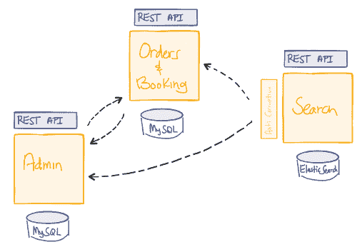
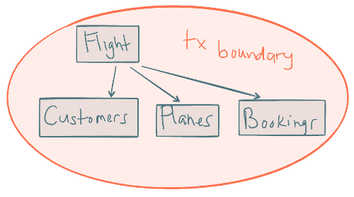
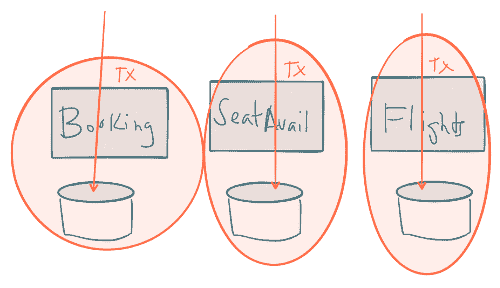
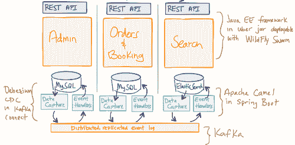
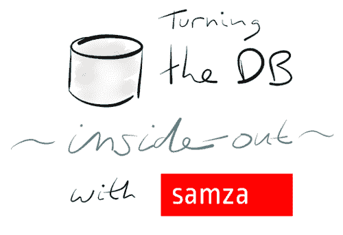

# 微服务最难的是什么？你的数据| Opensource.com

> 原文：<https://opensource.com/article/17/5/hardest-part-about-microservices-your-data?utm_source=wanqu.co&utm_campaign=Wanqu+Daily&utm_medium=website>

在本文中，我将探讨创建和开发[微服务](https://opensource.com/resources/what-are-microservices)时最困难的问题:您的数据。使用[Spring Boot](https://projects.spring.io/spring-boot/)/[drop wizard](http://www.dropwizard.io/1.1.0/docs/)/[Docker](https://opensource.com/resources/what-docker)并不代表你在做微服务。仔细审视你的领域和数据将有助于你获得微服务。(要了解更多背景知识，请阅读我关于微服务实现的博客系列: *[为什么微服务应该是事件驱动的](http://blog.christianposta.com/microservices/why-microservices-should-be-event-driven-autonomy-vs-authority/)* ， *[让您的微服务更具弹性的 3 件事](http://blog.christianposta.com/microservices/3-easy-things-to-do-to-make-your-microservices-more-resilient/)* ，以及 *[雕刻 Java EE Monolith:更喜欢垂直，而不是层](http://blog.christianposta.com/microservices/carving-the-java-ee-monolith-into-microservices-perfer-verticals-not-layers/)* 。)

在我们尝试微服务架构的原因中，最主要的是允许您的团队能够以不同的速度处理系统的不同部分，而对团队的影响最小。我们希望团队是自治的，能够就如何最好地实现和操作他们的服务做出决策，并且能够根据业务的需要自由地做出改变。如果我们组织我们的团队来做这件事，那么我们系统架构中的反射将开始演变成看起来像微服务的东西。

为了获得这种自主权，我们需要*摆脱依赖*，但这说起来容易做起来难。我看到人们把这个想法部分地称为“每个微服务都应该拥有并控制自己的数据库，任何两个服务都不应该共享一个数据库。”这个想法是合理的:不要跨服务共享单个数据库，因为这样会遇到冲突，比如竞争读/写模式、数据模型冲突和协调挑战。但是单个数据库确实为我们提供了很多安全和便利，包括 ACID 事务、单个查找位置，这是很好理解的(某种程度上？)，一个地方管理等等。

在构建微服务时，我们如何将这些安全性与将我们的数据库分割成多个更小的数据库相协调？

首先，对于构建微服务的企业，我们需要明确以下几点:

*   什么是域？什么是现实？
*   事务边界在哪里？
*   微服务应该如何跨界沟通？
*   如果我们把数据库翻个底朝天呢？

## 什么是领域

这似乎在很多地方都被忽略了，但这是互联网公司实践微服务的方式和传统企业可能(或可能因为忽略这一点而失败)实施微服务的方式之间的巨大差异。

在我们能够构建微服务并推理它所使用的数据(生产/消费等)之前。)，我们必须很好地理解这些数据代表了什么。例如，在我们可以将关于我们的[票怪物](https://developers.redhat.com/ticket-monster/)的“预订”及其向微服务的[迁移的信息存储到数据库之前，我们需要理解什么是*预订*。和你的领域一样，你可能需要理解什么是*账户*，或者*雇员*，或者*索赔*等等。](https://github.com/search?q=user%3Achristian-posta+ticket)

要做到这一点，我们需要深入了解现实中的 it 是什么？比如:什么是书？考虑一下，因为这是一个相当简单的例子。我们如何在数据模型中表达这一点？

书是有书页的东西吗？报纸是一本书吗？(它有几页。)可能一本书有硬皮？或者不是每天都发布/出版的东西？如果我写了一本书(我确实写了— [面向 Java 开发人员的微服务](http://blog.christianposta.com/my-book-has-been-released-microservices-for-java-developers/))，出版商可能会给我一个条目，其中一行代表我的书。但是一家书店可能有我的五本书。每一本都是一本书吗？还是它们是复制品？我们该如何表达呢？如果一本书太长了，必须分成几册，那该怎么办？每一卷都是一本书吗？还是全部加起来？很多小作文组合在一起会怎么样？组合是书吗？还是每一个人？基本上，我可以出版一本书，在书店里有很多本，每本都有好几册。

那么，什么是书呢？

现实是不存在现实。就现实而言，*什么是书*并没有客观的定义，所以要回答这样的问题，我们必须知道:谁在问这个问题，背景是什么？

我们人类可以很快——甚至无意识地——解决这种理解的模糊性，因为我们在头脑中、在环境中和在问题中有一个上下文。但是电脑不会。当我们构建我们的软件和建模我们的数据时，我们需要使这种上下文明确。用一本书来说明这一点是简单化了。你的领域(一个企业)及其账户、客户、预订、索赔等等将会更加复杂，更加矛盾/模糊。我们需要界限。

我们在哪里划定界限？在[领域驱动的设计社区](http://dddcommunity.org/)中的工作帮助我们处理领域中的这种复杂性。我们围绕 [**【实体】**](http://dddcommunity.org/resources/ddd_terms/)****和*模型*绘制一个[有界上下文](https://martinfowler.com/bliki/BoundedContext.html)定义域。换句话说:我们构建并提炼一个代表我们领域的模型，并且这个模型包含在一个定义我们上下文的边界内。这很明显。这些边界最终成为我们的微服务，或者边界内的组件最终成为微服务，或者两者都是。无论如何，微服务是讲边界的，DDD 也是。****

 ****

我们的数据模型——我们希望如何在物理数据存储中表示概念(注意这里的明显区别)——是由我们的领域模型驱动的，而不是相反。当我们有了这个边界，我们就知道(并且可以断言)在我们的模型中什么是正确的，什么是不正确的。这些界限也意味着一定程度的自主权。有界语境 **A** 对什么是*书*的理解可能与有界语境 **B** 不同。例如，也许有界上下文 **A** 是搜索标题的搜索服务，其中单个标题是一本*书*；也许 bounded context **B** 是一个结帐服务，它根据你购买了多少本书(书名+副本)来处理交易，等等。

你可能会停下来说，“等一下。网飞没有提到领域驱动设计，Twitter 和 LinkedIn 也没有。我为什么要听这些关于 DDD 的话？”

原因如下:

> “人们试图复制网飞，但他们只能复制他们看到的东西。他们复制的是结果，而不是过程。”阿德里安·科克罗夫特，前网飞首席云架构师

微服务之旅就是这样:一次旅程。每家公司的 It *会有所不同*。没有硬性规定，只有取舍。复制对一家公司有用的东西，因为它在这一实例中似乎有用，这是试图跳过这一过程/旅程，是行不通的。你的企业是*不是*网飞。事实上，我认为无论网飞的领域有多复杂，它都没有你的传统企业复杂。搜索和播放电影、发布推文、更新 LinkedIn 个人资料等等都比保险索赔处理系统简单得多。这些互联网公司之所以选择微服务，是因为它们的上市速度和绝对的数量/规模。(向 Twitter 发布一条推文很简单。为 5 亿用户发布推文和显示推文流极其复杂。)

企业必须面对领域和规模的复杂性。因此，接受这是一个平衡领域、规模和[组织变化的*旅程*。每个组织的旅程都是不同的。](http://blog.christianposta.com/devops/devops-and-the-myth-of-efficiency-part-i/)

## 事务边界是什么？

回到故事。我们需要像领域驱动设计这样的东西来帮助我们理解我们将用来实现我们的系统的模型，并在一个上下文中围绕这些模型画出边界。我们承认，客户、账户、预订等对于不同的有界上下文可能意味着不同的东西。我们可能最终会将这些相关的概念分布在我们的体系结构中，但是当变化发生时，我们需要一种方法来协调这些不同模型之间的变化。我们需要考虑这一点，但首先，我们必须确定我们的事务边界。

不幸的是，开发人员似乎仍然在错误地构建分布式系统:我们透过单一的关系数据库来看待问题。我们也忽略了异步、不可靠网络的危险。也就是说，我们做一些事情，比如编写花哨的框架，使我们不必了解任何关于网络的东西(包括 RPC 框架、也忽略网络的数据库抽象)，并试图用点对点同步调用(REST、SOAP、其他类似 CORBA 的对象序列化 RPC 库等)来实现一切。).我们构建系统时没有考虑[权威和自治](http://blog.christianposta.com/microservices/why-microservices-should-be-event-driven-autonomy-vs-authority/)，最终试图解决分布式数据问题，比如跨许多独立服务的两阶段提交。或者我们完全忽略这些问题。这种心态导致构建不可伸缩的脆弱系统，无论你称之为 SOA、微服务、迷你服务还是其他什么都无所谓。

我说的事务边界是什么意思？我指的是业务不变量所需的最小原子单位。使用数据库的 ACID 属性实现原子性还是两阶段提交并不重要。要点是使这些事务边界尽可能小(理想情况下是单个对象上的单个事务)，以便我们可以伸缩。(弗农·沃恩有一个[系列文章描述了这种 DDD 聚合的方法](https://vaughnvernon.co/?p=838)。)当我们构建我们的领域模型时，使用 DDD 术语，我们识别**实体**、**值对象**，以及**集合**。这个上下文中的聚集是封装其他实体/值对象的对象，并且负责实施不变量；有界上下文中可以有多个聚合。

例如，假设我们有以下用例:

*   允许客户搜索航班，
*   允许顾客在特定航班上挑选座位，
*   并允许客户预订航班。

这里我们可能有三个有界的上下文:搜索、预订和售票。(我们还有其他的，比如支付、忠诚、待机、升级等等，但是让我们把重点放在三个上面)。*搜索*负责显示给定时间范围(日期、时间等范围)内特定路线和旅程的航班。).*预订*将负责提供客户信息(姓名、地址、常旅客号码等)的预订流程。)、座位偏好和支付信息。*票务*负责与航空公司解决预订事宜并出票。在每一个有界的上下文中，我们想要识别事务边界，在其中我们可以实施约束/不变量。我们将不考虑跨有界上下文的原子事务，这将在下一节中讨论。

考虑到我们想要小的交易边界(预订航班的简化版本)，我们将如何对此建模？也许是一个封装了时间、日期、路线等值以及客户、飞机和预订等实体的航班聚合？这似乎很有道理——一个航班有飞机、座位、客户和预订。flight aggregate 负责跟踪飞机、座位等信息，以便创建预订。从数据库内部的数据模型角度来看，这可能是有意义的(带有约束和外键的良好关系模型，等等)。)，或者在我们的源代码中做一个很好的对象模型(继承/复合)，但是让我们看看会发生什么。

仅仅为了创建一个预订，所有的预订、飞机、航班等等真的都不变吗？也就是说，如果我们将一架新飞机添加到航班总量中，我们真的应该将客户和预订包括在该事务中吗？大概不会。我们这里有一个考虑到组合和数据模型便利性而构建的聚合；然而，交易的界限太大了。如果航班、座位、预订等有很多变化。，我们将会有很多事务冲突(无论使用乐观锁定还是悲观锁定都无关紧要)。这显然是不可扩展的——不要介意仅仅因为航班时刻表的变化而导致订单失败，这是一种糟糕的客户体验。

如果我们把交易的界限打破得小一点会怎么样。

也许预订、座位可用性和航班是它们自己独立的集合。预订封装了客户信息、偏好，可能还有支付信息。座位可用性集合封装了平面和平面配置。航班总数由时刻表、航线等组成。，但我们可以在不影响航班时刻表和飞机/座位可用性的情况下继续创建预订。从领域的角度来看，我们希望能够做到这一点。我们不需要飞机/航班/预订之间 100%的严格一致性，但我们希望作为管理员正确记录航班时刻表的变化，作为供应商记录飞机配置，以及来自客户的预订。那么，我们如何在航班上实现诸如“选择特定的座位”这样的事情呢？

在预订过程中，我们可能会调用座位可用性集合，并要求它在飞机上预订一个座位。这个座位预订将作为单个事务来实现—例如，(保留座位 23A)并返回一个预订 ID。我们可以将这个预订 ID 与预订相关联，并提交预订，因为我们知道这个座位曾经是“预订的”其中的每一项——预订座位和接受预订——都是单独的事务，可以独立进行，不需要任何两阶段提交或两阶段锁定。

注意这里使用*预订*是业务需求。我们这里不做座位分配；我们只是预订了座位。这个需求可能需要通过模型的迭代来限制，因为用例的语言起初可能只是说“允许客户挑选座位”开发人员可能会试图推断该需求意味着“从剩余座位中挑选，将其分配给客户，将其从库存中移除，并且售出的门票不超过座位数。”这将是额外的、不必要的不变量，会给我们的事务模型增加额外的负担，而业务并不真正认为这是不变量。这项业务当然可以接受没有完全分配座位的预订，甚至超额销售航班。

这是一个允许真正的域引导您走向更小、简化但完全原子化的事务边界的例子。但是故事不能就此结束，因为我们现在必须纠正这样一个事实，即所有这些单独的事务都需要在某个时候集合在一起。涉及到数据的不同部分(例如，我创建了一个预订和座位预订，但这些不是关于获得登机牌/机票等的已结算事务。)

## 微服务应该如何跨界沟通？

我们希望保持真正的业务不变量不变。使用 DDD，我们可以选择将这些不变量建模为聚合，并使用聚合的单个事务来实施它们。可能存在我们在单个事务中更新多聚合的情况(跨单个数据库或多个数据库)，但这些情况是例外。我们仍然需要在聚合之间(以及最终在有界上下文之间)保持某种形式的一致性，那么我们应该如何做呢？

有一点我们应该明白:分布式系统是很挑剔的。在有限的时间内，对于分布式系统中的*任何事情*，我们几乎无法做出[任何保证——事情会失败，非确定性地缓慢或看起来已经失败，系统具有不同步的时间边界，等等。—那么，为什么要努力与之抗争呢？如果我们接受这一点，并将其融入我们整个领域的一致性模型中，会怎么样？如果我们说，在必要的事务边界之间，我们可以与数据和领域的其他部分一起生活，以便在以后的某个时间点进行协调和保持一致，会怎么样？](http://queue.acm.org/detail.cfm?id=2953944)

对于微服务，我们看重的是自主性。我们重视能够独立于其他系统进行更改(在可用性、协议、格式等方面)。这种时间上的分离和对任何有限时间内服务之间的任何事情的任何保证允许我们实现这种自治([这不是计算机系统或任何系统所独有的](http://blog.christianposta.com/microservices/why-microservices-should-be-event-driven-autonomy-vs-authority/))。所以我说，在事务边界之间和有界上下文之间，使用事件来传达一致性。事件是不可变的结构，它捕捉一个有趣的时间点，应该广播给对等点。对等点将收听他们感兴趣的事件，并基于该数据做出决策，存储该数据，存储该数据的一些衍生物，基于用该数据做出的决策更新他们自己的数据，等等。

继续我开始的航班预订示例:当预订通过 ACID 风格的事务存储时，我们如何结束对它的售票？这就是前面提到的票务绑定上下文的由来。受预订限制的上下文将发布一个类似于 *NewBookingCreated* 的事件，受票务限制的上下文将使用该事件并继续与后端(可能是遗留的)票务系统进行交互。这需要某种集成和数据转换，这是 [Apache Camel](http://camel.apache.org/) 擅长的。

我们如何原子地对数据库*进行写操作，并将*发布到队列/消息传递设备？如果我们的事件之间有排序要求/因果要求，会怎么样？每个服务一个数据库怎么样？

理想情况下，我们的聚合将直接使用命令和[域事件](https://martinfowler.com/eaaDev/DomainEvent.html)(作为一等公民——也就是说，任何操作都被实现为命令，任何响应都被实现为对事件的反应),并且我们可以更清楚地在我们内部使用的事件和我们在上下文之间使用的事件之间进行映射。我们可以只将事件(例如，NewBookingCreated)发布到消息队列，然后让一个侦听器从队列中使用它，并将其幂等地插入到数据库中，而不必使用 XA/2PC 事务，而不是我们自己插入到数据库中。我们可以将事件插入一个专用的[事件存储库](https://geteventstore.com/)，它既充当数据库，又充当消息发布-订阅主题(这可能是首选的方式)。或者我们可以继续使用一个 ACID 数据库，并将对该数据库的更改流式传输到一个持久的、复制的日志中，就像 [Apache Kafka](http://kafka.apache.org/) 使用类似 [Debezium](http://debezium.io/) 的东西，并使用某种事件处理器/流处理器来推断事件。无论哪种方式，我们都希望用不变的时间点事件在边界之间进行交流。

这带来了巨大的优势:

*   我们避免昂贵的、潜在不可能的跨境交易模型。
*   我们可以对我们的系统进行修改，而不会妨碍系统其他部分的进展(时间和可用性)。
*   我们可以决定多快或多慢地看到外面的世界，并最终变得一致。
*   我们可以将数据存储在我们自己的数据库中，但是我们希望使用适合我们服务的技术。
*   我们可以在闲暇时修改我们的模式/数据库。
*   我们变得更具可扩展性、容错性和灵活性。
*   您必须更加关注 CAP 定理和您选择用来实现存储/队列的技术。

值得注意的是，这带来了缺点:

*   比较复杂。
*   调试困难。
*   因为我们在看到事件时有延迟，所以我们不能对其他系统知道什么做出任何假设(我们无论如何也做不到，但这在这个模型中更明显)。
*   操作更加困难。
*   您必须更加注意 CAP 定理和您选择用来实现存储/队列的技术。

我在两个专栏中都列出了“关注 CAP 等人”,因为尽管这给我们增加了一点负担，但无论如何这样做是必要的。此外，在我们的分布式数据系统中，注意不同形式的数据一致性和并发性是至关重要的。依赖“我们的 ACID 数据库”不再是可接受的了(特别是当那个 ACID 数据库很可能默认为弱一致性的时候)。

从这种方法中出现的另一个有趣的概念是实现称为*命令查询分离责任*的模式的能力，在这种模式中，我们将读取模型和写入模型分离到单独的服务中。还记得我们感叹互联网公司没有复杂的领域模型。这在他们简单的编写模型中显而易见(例如，[将一条推文插入分布式日志](https://blog.twitter.com/2015/building-distributedlog-twitter-s-high-performance-replicated-log-service))。然而，由于它们的规模，它们的阅读模型非常复杂。CQRS 有助于消除这些担忧。另一方面，在企业中，写模型可能非常复杂，而读模型可能是简单的平面选择查询和平面 DTO 对象。CQRS 是一个强大的关注点分离模式，一旦您有了适当的边界，就可以对其进行评估，并且是一个在聚合之间和有界上下文之间传播数据变更的好方法。

如果一个服务只有一个数据库，并且不与任何其他服务共享，该怎么办？在这个场景中，我们可能有订阅事件流的侦听器，并且可能将数据插入到主聚合最终可能使用的共享数据库中。这个“共享数据库”非常好。记住没有规则，只有权衡。在这种情况下，我们可能有多个服务与同一个数据库协同工作，只要我们(我们的团队)拥有所有的过程，我们就不会否定我们的任何自治优势。因此，当你听到有人说，“一个微服务应该有自己的数据库，不要和任何人共享，”你可以回答，“嗯，有点。”

## 如果我们把数据库翻个底朝天呢？

如果我们把上一节的概念用到它的逻辑极端会怎么样？如果我们只是说我们将对所有事情使用事件/流，*和*也将永久保存这些事件，会怎么样？如果我们说数据库/缓存/索引实际上只是过去发生的事件的持久日志/流的物化视图，而当前状态是所有这些事件的左折叠，会怎么样？

这种方法带来了更多的好处，您可以将这些好处添加到通过事件进行沟通的好处中(如上所列):

*   现在，您可以将数据库视为记录的“当前状态”，而不是真实的记录。
*   您可以引入新的应用程序，重新读取过去的事件，并根据*将会发生什么*来检查它们的行为。
*   您可以免费完善审计日志。
*   您可以引入新版本的应用程序，并通过重放事件对其进行详尽的测试。
*   通过在新数据库中重放事件，您可以更容易地推断数据库版本/升级/模式更改。
*   您可以迁移到全新的数据库技术(例如，您可能发现您的关系数据库已经不能满足您的需求，并且您想要切换到一个专门的数据库/索引)。

有关这方面的更多信息，请阅读 Martin Kleppmann 的文章[“用 Apache Samza 彻底改变数据库”](https://www.confluent.io/blog/turning-the-database-inside-out-with-apache-samza/)。

当你预订 aa.com、delta.com 或 united.com 的航班时，你会看到其中一些概念在发挥作用。当你选择一个座位时，你实际上并没有被分配到座位上，而是预订了座位。当你预订航班时，你实际上并没有票——你稍后会收到一封电子邮件，告诉你你已经被确认/出票了。您是否曾经因为预订变更而被分配到不同的航班座位？或者去过登机口，听到他们因为航班超售而要求志愿者让座？这些是事务边界、最终一致性、补偿事务，甚至工作中的道歉的例子。

## 结论

数据、数据集成、数据边界、企业使用模式、分布式系统理论、计时等等都是微服务的难点(因为*微服务*其实只是*分布式系统*)。我看到了太多关于技术的困惑(*“如果我使用 Spring Boot，我就在做微服务*；*我需要解决云中的服务发现、负载平衡，然后才能做微服务*、*“我必须为每个微服务建立一个数据库*”)以及关于微服务的无用规则。

别担心。一旦大型供应商向您出售了所有精美的产品套件，您仍然需要完成我在本文中概述的困难部分。****