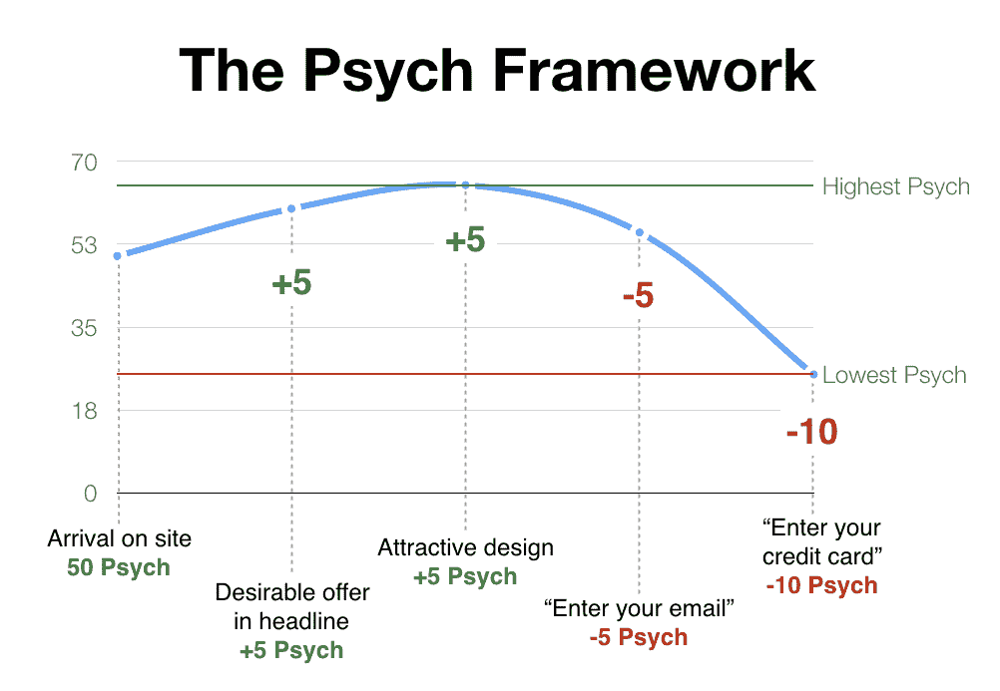
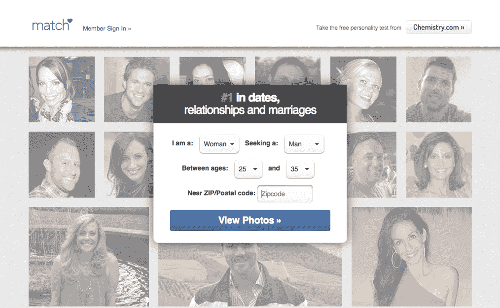
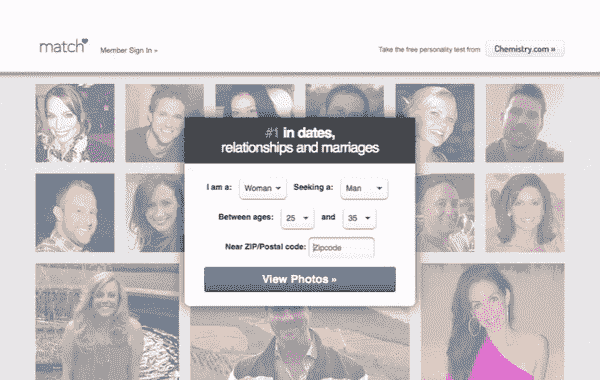
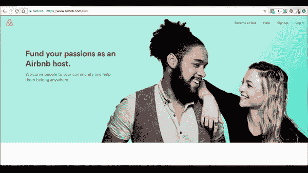
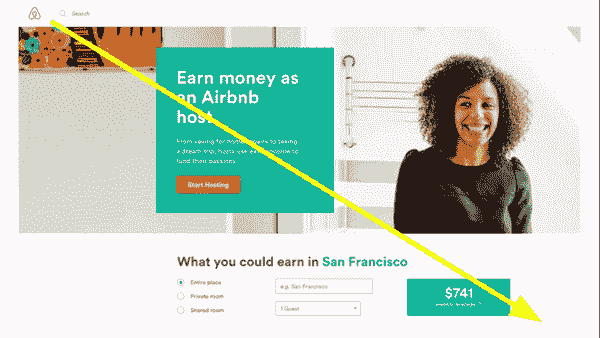

# 心理学:在 andrewchen 增加漏斗转换的新用户心理学框架(客座博文)

> 原文：<http://andrewchen.co/psychd-funnel-conversion/?utm_source=wanqu.co&utm_campaign=Wanqu+Daily&utm_medium=website>

读者们好，我的好朋友[大流士承包商](http://twitter.com/dariusmc)(目前是 Dropbox 的增长工程师)有一个辉煌的新框架，关于用户心理学如何推动 Bebo、Tickle、PhotoSugar，当然还有 Dropbox 等公司的增长。感谢大流士和[再造](http://reforge.com)的人们把这些放在一起。希望你喜欢这篇文章！-安德鲁

# 通过让大流士承包商对用户进行心理分析来提高您的漏斗转化率

你有没有想过为什么人们会从你几乎没有摩擦的入职流程中反弹？为什么同样的改变会导致一个页面的提升而另一个页面的下降？或者为什么那些通过搜索找到你的人过了一会儿就离开了？

多年来，我一直致力于打造让数百万用户分享、加入并邀请他们的朋友的体验，我学到了两件事:

1.页面上的每个元素都会增加或减少情感能量。鼓舞用户和减少摩擦一样重要

高科技领域顶尖成长型专家的一个秘密是，将每一次 UX 互动都视为一次情感事件。但是，情绪驱动的交互远远不是随机的或超出我们控制的，它可以被分解成组件，在每一步进行优化，并被复制以获得更好的入职和转换结果。

## 心理学框架

今天，我将分享我用来帮助 Tickle、Bebo 和 Dropbox 等公司发展的心理学框架。它是一种系统化的方式来检测和改善一种体验影响用户情绪能量的方式，我们称之为“心理学”。

每一次 UX 互动都会增加或减少心理压力，心理压力是衡量完成一个动作的动机的单位。

网页的每一个元素要么通过给我们更多的心理单位来激励我们，要么通过耗尽我们现有的心理储备来压垮我们。

一旦你明白是什么因素增加或消耗了用户的能量，你就可以开始管理这些能量:增加灵感，减少压力，帮助用户采取你的核心行动。

## 心理单元

我们以“心理”为单位测量用户能量，从 0 到 100。

100 Psych 的用户最大限度地致力于他们当前的体验，不需要进一步的激励，并将克服大多数挑战。例如，一个今晚需要报税的人会想尽一切办法从他们公司的工资单网站下载 W2。他们将完成一个忘记密码的步骤，经历一个他们从未使用过的糟糕界面，并通读令人困惑的数字，以便及时完成他们的税务。

0 Psych 的用户精疲力尽，毫无兴趣，以至于放弃了他们当前的体验。例如，一个人无意中点击了一个广告，当他意识到自己已经进入了一个诈骗网站时，他将没有继续下去的动力，并且会反弹。

## 心理因素

在你的用户界面中意识到+Psych 可以极大地推动用户的兴奋/增长:

> **Tinder:** “发现附近新的有趣的人”→对，就这样吧！

同样，不了解产品中的心理因素会大大降低成功的几率:

> **全球入口网站:**“填写 40 个关于你自己的表单域”→呃，也许以后……<关闭浏览器>

我们称之为激励用户并增加他们情绪能量的元素+Psych。

如果一个汽车租赁网站宣传“以 15 美元/天的价格得到你的车”，这可能是一个+心理，激励用户试图得到这笔好交易。相反，心理因素会让用户感到厌倦或不知所措，比如冗长的注册表格、不清楚的 UX、太多的文本以及不清楚的下一步行动。

让我们用 Match 的主页来测试一下这个概念。之后，我们将讨论在你的信息流中寻找什么，并检查 Airbnb 在他们的主机注册体验中获得了什么。

## 示例 1: Match 的主页

我们如何评价这一页的心理评分？

**1。确定你的起始心理状态**

要了解用户到达一个网站时的心理状态，考虑一下他们是如何到达那里的。

例如，通过谷歌搜索到达 Match 的用户是高意向的，并且有内在动机，因为他们明确地搜索约会。所以他们的心理指数在 60 左右。

相比之下，横幅点击的访问可能是低意图的，因为他们的点击是对外部触发的响应。他们可能是 30 心理学家。

朋友的推荐可能会导致低意向但高社会认可度的点击率。所以，他们可能在精神病院。

**2。从左上方到右下方跟随用户的注意力**

在像英语这样从左到右的语言中，我们从左上到右下阅读内容。当我们沿着我们的自然轨迹穿过书页时，当我们遇到让我们兴奋的因素或成为障碍的因素时，我们的心理会上升或(更有可能)下降。

在上面的 Match 主页上，这些是我们从左上至右下遇到的元素:

*   标志；徽标
*   单身照片
*   在约会、恋爱和婚姻中排名第一
*   人口统计形式
*   “查看照片”按钮

正如你所看到的，就在标识向我们保证这是一个我们可以信任的真实公司实体之后，我们看到了迷人的微笑着的人们的照片。然后，我们看到署名“#1 在日期，关系和婚姻，”这向我们保证，我们将与最好的网站，它在那里帮助我们实现日期，关系，甚至婚姻。

接下来，有一种形式，要求采取可能耗尽精神的行动。但是我们受到了“查看照片”按钮的刺激——这正是对“约会、关系和婚姻”感兴趣的用户此时想要做的事情。

**3。哪些元素对你来说是+Psych？哪些是-心理学？**

让我们再浏览一下比赛主页，一点一点地总结一下心理学。

**这些是+ Psych 元素:**

*   “呜，这些人看起来很有魅力！” **→ +10 心理**
*   “他们是第一名？我能得到约会/关系/婚姻吗？” **→ +3 心理**
*   "我喜欢它默认为女人寻找男人." **→ +3 心理**
*   “好看，迫不及待想看照片” **→ +8 Psych**

**这些是心理要素:**

*   “Hrm，我要找什么年龄的？” **→ -5 心理**
*   “他们为什么需要我的邮政编码？啊，键盘…”**→-10 心理**

**4。总结一下！**

总结所有的心理因素，看看用户在看到你的行动号召时在哪里。大于零的心理指数意味着用户通过了心流。

*   从搜索开始:50 心理
*   +心理:10+3+3+8 = +24 心理
*   -心理:-5-10 = -15 心理
*   结果:59 心理→他们成功了！

接下来，我们将浏览一些常见页面中的顶级+心理和-心理因素。

## 在你的每一页上最大化心理学

**1。评估初始心理状态**

人们带着初步的心理分析来到你的网站。

如果你中午很饿，一整天都没吃东西，那么你吃三明治的心理水平会非常高。这将帮助你克服排队、选择、掏出钱包等待 8 美元英雄拯救的摩擦。

因此，评估心理状态的第一步是查看决定人们在进入你的漏斗时有多少心理状态的因素:

**2。登陆页面上的心理学**

一旦访问者访问了你的登陆页面——太好了！你现在有很多机会增加他们的心理状态，让他们继续注册，或者，如果你不小心，降低他们的心理状态，让他们反弹。

**3。输入个人信息**

在某些时候，你必须要求你的访问者输入一些个人信息，即使那只是他们的电子邮件地址。

询问个人信息通常会造成消极的心理状态，无论是因为人们害怕分享他们的信息，还是因为他们只是觉得懒惰，不想完成输入动作。

**4。与产品互动**

如果你有免费增值或免费试用模式，你的用户将有机会在付费前与产品互动。这是一个在玩家开始消耗精神的支付行动之前增加精神的机会。

**5。输入付款信息**

对于大多数企业来说，最终是用户输入支付信息并完成交易的时候了。

因为花钱痛苦的心理现象，这是最终的耗尽精神的行动。

虽然我们可能会认为购买行为应该是心理增长，因为获得我们想要的东西会带来预期的快乐，但它实际上触发了大脑中与身体疼痛相同的区域。所以，花钱=痛苦。

但是，麻省理工学院的研究人员发现[信用卡增加了购物的分离度](http://spectrum.mit.edu/winter-1999/the-psychology-of-spending/)。换句话说，信用卡有助于减少我们因消费(现金)而感到的痛苦。

除了固有的痛苦和消极的消费心理，你仍然可以做一些事情来改善支付阶段的心理状态。

## 降低认知负荷不仅仅是简单的注册形式

以上是一个基本框架，任何人都可以通过它来理解入职流程中的心理起伏。

但是优化 Psych 不仅仅是删除点击和减少文本。在某些情况下，更详细的表格或副本有助于减少决策时的认知负荷——尽管这在技术上需要更多的努力。例如，包括更多关于安全和退款保证的信息可以克服信任障碍，缓解对大宗购买的担忧。

现在我们来看另一个活生生的例子。

## 例子 2: Airbnb 的托管流程

我们来看一个更复杂的例子——成为 Airbnb 上的主持人。

我们如何评价这一页的心理评分？

**1。决定你的起点。**

为了弄清楚那些考虑在 Airbnb 上寄宿的人的心理起伏，让我们从他们登陆页面之前的心态开始。

*   他们可能听说过一些在 Airbnb 上赚大钱的故事→ **+20 Psych**
*   他们可能听说过大量的工作或负面的托管故事→ **-10 Psych**

但是最终他们积极的开始心理比他们的怀疑更重要，他们有足够的动力去检验它。

**2。从左上方到右下方跟随用户的注意力**

Airbnb 提供了三种不同的方式来成为平台上的“主人”:

1.  出租房子或公寓
2.  帮助邻居处理 Airbnb 房源
3.  带领游览或其他旅行体验

为了使这篇文章简单，我们只看 Airbnb 的核心“寄宿”行为——租房子或公寓。

当你从左上角到右下角追踪用户的注意力时，很明显 Airbnb 知道其托管用户最关心的是什么——通过出租他们的地方来赚取额外的钱。

以下是我们在折叠上方遇到的直接元素，从左上至右下:

*   标志；徽标
*   “挣钱”价值主张
*   一个交互式计算器，看看你能挣多少钱
*   一个“周均线”盒子，有令人印象深刻的收益预测和美元符号

从那里，页面显示更多旨在增加心理和减少疑虑的内容:

*   揭开 Airbnb 运作方式神秘面纱的战术说明
*   令人放心的安全和安保细节，如他们的主机保护保险和 100 万美元的主机担保
*   视频形式的社会证据，展示了不同主持人谈论 Airbnb 的收入如何帮助他们留在家中，支付医疗账单，或为退休提供资金。

因为用户必须登录才能继续主机流程，Airbnb 在第一页的目标是将 Psych 提升到足够高的水平，以便让他们完成流程中后续更繁琐的步骤——登录或创建帐户，并设置他们的第一个列表。

**3。哪些元素对你来说是+Psych？哪些是-心理学？**

现在让我们一点一点地浏览和总结心理学。

Airbnb 在加载+Psych 元素的页面方面做得很好，因为他们知道他们向用户提出了很多要求:

*   “挣钱？是的，请。”→ **+10 心理**
*   “我可以租出整个地方，或者一个房间，或者只是一张沙发？那么可能有适合我的东西。”→ **+5 心理**
*   “每周平均 741 美元……比我想象的要高。”→ **+10 心理**
*   “主机保险，以及保护我的东西的 100 万美元担保……好吧，唷。”→ **+4 心理**

**4。总结一下！**

再一次，你可以总结所有的心理因素，看看用户在行动号召的时候在哪里。记住，大于零的心理指数意味着用户点击了“注册我”按钮。

这只是 Airbnb“成为主人”流程中的一个页面上的一个简单的心理记录。显然，在用户成为一个对市场有贡献的成功的主机之前，还有很多步骤。记住这一点，你可以在入职或转换流程的每一步运行心理框架，以找到逆转心理和增加+心理的机会。

简而言之，这就是心理学框架。告诉我你在评论中的想法，如果你想听到更多。

[-大流士](https://twitter.com/dariusmc)

*免责声明:我是 Dropbox 的员工，但我不是代表 Dropbox 发帖，也不是以 Dropbox 员工的官方身份发帖。本帖最初发表于[这里](https://darius.com/increase-funnel-conversion-with-psych-7378d51c4caf)。*

**PS. Get new updates/analysis on tech and startups**

我写一份高质量的每周时事通讯，报道硅谷发生的事情，关注创业、营销和移动领域。

在本网站链接的“内容”(包括帖子、播客、视频)中或在社交媒体和其他平台(统称为“内容分发渠道”)中发表的观点是我自己的，并不是 AH Capital Management、l . l . c .(“a16z”)或其各自附属公司的观点。AH 资本管理公司是一家在证券交易委员会注册的投资顾问公司。注册为投资顾问并不意味着任何特殊技能或培训。这些帖子不针对任何投资者或潜在投资者，也不构成出售或购买任何证券的要约，不得用于或依赖于评估任何投资的价值。

内容不应被解释为或以任何方式依赖于投资、法律、税务或其他建议。您应该向您自己的顾问咨询有关任何投资的法律、商业、税务和其他相关事宜。这些材料中表达的任何预测、估计、预测、目标、前景和/或观点可能会在不通知的情况下发生变化，并且可能与他人表达的观点不同或相反。此处提供的任何图表仅供参考，在做出任何投资决策时不应依赖。此处包含的某些信息来自第三方来源。虽然这些信息来自据信可靠的来源，但我并未独立核实这些信息，也未对这些信息的持久准确性或其在特定情况下的适当性做出任何陈述。该内容仅在所示日期有效。

在任何情况下，本网站或相关内容分销渠道上提供的任何帖子或其他信息都不应被解释为 a16z 人员发起、讨论或提及的任何集合投资工具中的任何证券或权益的购买或销售要约。也不应被理解为提供投资咨询服务的要约；投资 a16z 管理的集合投资工具的要约将单独提出，并且仅通过特定集合投资工具的保密要约文件提出，这些文件应完整阅读，并且仅提供给符合联邦证券法规定的特定资格的人。这些投资者被定义为合格投资者和合格购买者，通常被认为有能力评估潜在投资和财务事项的优点和风险。不能保证 a16z 的投资目标会实现或投资策略会成功。对 a16z 管理的投资工具的任何投资都包含很高的风险，包括损失全部投资金额的风险。提及、提及或描述的任何投资或投资组合公司并不代表 a16z 管理的所有投资工具，也不能保证这些投资将会盈利，也不能保证将来进行的其他投资会有类似的特征或结果。a16z 管理的基金所做的投资清单可在 https://a16z.com/investments/.获得。该清单不包括发行人未允许 a16z 公开披露的投资以及对公开交易的数字资产的未宣布投资。Andreessen Horowitz 投资、集合投资工具或投资策略的过去结果不一定代表未来结果。请参见[https://a16z.com/disclosures](https://a16z.com/disclosures)了解更多重要信息。