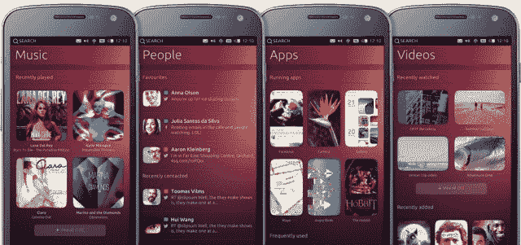
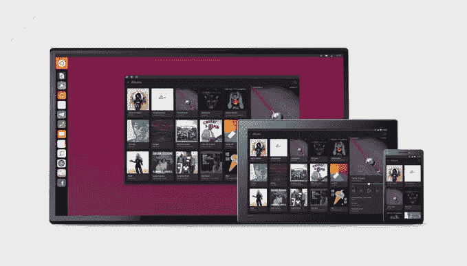
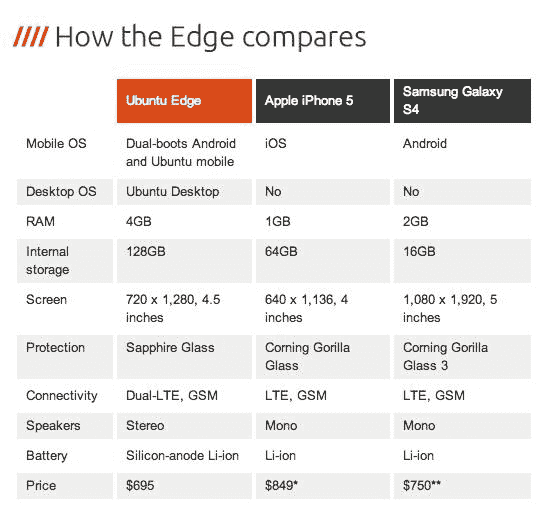
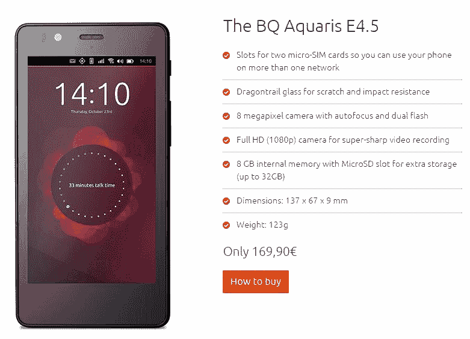

# 我的移动设备 Ubuntu 事后分析

> 原文：<http://www.lieberbiber.de/2017/06/20/my-ubuntu-for-mobile-devices-post-mortem/?utm_source=wanqu.co&utm_campaign=Wanqu+Daily&utm_medium=website>

现在 Ubuntu 手机和平板电脑已经不存在了，我想就我个人认为这个项目失败的原因以及从中可以学到什么提出我的想法。

概括一下我参与该项目的情况:从 2013 年发布到 2014 年 12 月，我一直在断断续续地在 Nexus 7 上使用 Ubuntu Touch，2014 年 12 月开始开发点击应用程序，2015 年 1 月开始撰写关于系统内部的 15 集“黑客 Ubuntu Touch”[博客系列文章](http://www.lieberbiber.de/2015/05/07/hacking-ubuntu-touch-index/)，成为 Ubuntu Phone 的圈内人士，从 Canonical 获得一台魅族 MX4，组织并赞助了 [UbuContest](https://ubucon.de/2015/contest) 应用程序开发竞赛所以我想我可以提供一些关于这个项目的想法，它的挑战和我们可以做得更好的地方。

请注意，这篇帖子不适用于 [UBPorts 项目](https://ubports.com/)，该项目继续在手机操作系统、Unity 8 和其他组件上工作。

## 1.它没有瞄准有利可图的利基市场。

适用于个人电脑、笔记本电脑和服务器的 Ubuntu 相对容易。几乎所有这些设备都允许你安装任何知道如何使用硬件的操作系统，当 Ubuntu 在 2004 年出现时，它最大的对手(微软)非常脆弱。Windows 的名声不好，非常贵，而且是一个资源猪，所以 Ubuntu 只需要不那么烦人，更便宜，容易安装，在旧电脑上运行得更好。这正是它所做的。Windows 继续有一个坏名声，现在甚至在监视它的用户，而且仍然相当昂贵。所以 Ubuntu 桌面没有也不需要做很多正确的事情来维持和增加它的用户群。

在服务器端，Windows，Red Hat，尤其是 SUSE 被认为太保守，太慢，又太贵。一个 Red Hat Enterprise 订阅一年要花几百美元，而且这个订阅甚至不一定包含人类的实际支持。对于许多人来说，一个快速移动、成本更低、有一些行业支持、存储库中有大量软件包的替代方案一定会很有趣，尤其是在云中。Ubuntu 成为 OpenStack 的参考操作系统也很有帮助。

但是在移动设备方面，一切都不同了。你不能只是在手机或平板电脑上闪存任何通用的操作系统。每个设备基本上都有一个定制的、特别定制的 Android 版本。2013 年 Ubuntu 宣布踏入移动市场的时候，无论是 Android 还是 iOS 都没有不堪一击，恰恰相反。Android 几乎已经将除 iOS 之外的所有其他平台挤出了市场。人们哭着要第三种选择，大多不是因为 Android 或 iOS 名声不好，或者太受限制，或者给人不好的用户体验，而是因为他们(理所当然地)害怕谷歌垄断。因此，攻击 Android 和 iOS 并不像在个人电脑和服务器上攻击微软和红帽那样容易。

What Ubuntu Touch looked like when the project was unveiled on January 2, 2013\. (Copyright Canonical)

我记得 Canonical 的一个人说过，这个项目需要占领大约 1%的移动市场才能维持下去。当时，这相当于每年销售约 1100 万部 Ubuntu 手机和 200 万台平板电脑。如果你设法为每台设备的软件和服务赚取至少 1 欧元/美元，你就可以轻松地向 100 多个开发者付费，如果你正确使用它们，这是一大笔钱。我想，开发 Sailfish OS 的 Jolla 公司在某个时候有大约 120 名员工，但他们也需要营销和支持部门，而 Canonical 已经有了这些部门。但是考虑到 Ubuntu 桌面用户的数量估计在 2000 万到 3000 万左右，每年销售 1100 万部手机和 200 万台平板电脑是一个非常雄心勃勃的目标**。**

 ***   可能性 1:达到百分之一:比竞争对手好得多，以至于你成为主流，甚至不用担心那百分之一。我想我们都知道这不会发生，特别是当所有重要的服务(WhatsApp，Google，Twitter，Instagram 等)都变得清晰的时候。)甚至不允许他们的应用程序克隆版在 Ubuntu 设备上运行。如果 Canonical 没有建立自己的电报客户端，当第一批商业 Ubuntu 手机上市时，甚至不会有即时消息。这是在 2015 年，每个人都在使用即时通讯工具。如果一部 Ubuntu 手机不能做与 Android 相同型号的手机相同的事情，没有人会花同样的钱买它，即使它被宣传为“开发者设备”。
*   达到 1%的可能性 2:迎合财大气粗的利基市场。Canonical 过于关注“融合”这个利基市场，而没有足够多的人关心这个市场，同时他们几乎忽略了所有的黑客、修补者和受够了谷歌、微软和美国国家安全局监视他们的人。没有多少人愿意为一部连接到外部显示器时可能会变成缓慢的笔记本电脑的手机支付溢价，但有足够多的人愿意为一部 [Blackphone](https://www.silentcircle.com/) 支付溢价。

## 2.用户体验很差，优先级被扭曲。

我想在这里说实话:在第一批空中下载(OTA)更新发布后，我问自己“bq 和魅族，尤其是他们的客户，真的能忍受这些吗？”。手机运行缓慢，必须定期重启。魅族 MX4 过热。电池指示器倾向于显示虚假数据。移动数据不可靠，(国内)漫游经常根本不起作用。定位服务 ***非常*** 不可靠。当被呼叫时，电话并不总是响，或者因为用户界面隐藏了按钮，你不能发出呼叫。警报器工作不可靠。蓝牙只支持音频设备和后来的输入设备，但甚至不支持基本的文件传输。在 OTA-5 之前，WiFi 不会连接到 WPA 企业网络。我认为音乐播放器甚至在索引文件的时候开始删除文件。等等。

你期望能成功，但却没有成功的事情有一长串。但更糟糕的是，bug 会不止一次地在两个 OTA 之后回归。在手机/平板电脑项目的生命周期中，Launchpad 上的错误报告数量以我从未见过的方式激增。

根除所有这些错误并不是当务之急，开发人员将大部分时间花在了支持更多硬件(魅族 Pro 5，bq Aquaris 10)和融合上。直到项目的最后，我经常与之交谈的大多数用户都对他们的设备不满意。只有那些依赖最基本功能的人，比如我的父亲，他甚至没有移动数据，每两天打一次电话，他们很高兴，因为设备可以运行几天。然而，购买一部 150 欧元的智能手机，却不使用任何让它变得“智能”的功能，这并不太合理。

What Convergence was supposed to look like (Copyright Canonical)

我知道没有足够的开发人员一次解决所有问题，但我们没有决定制造一部好的手机或一部好的融合平板电脑，我们的设备实际上什么都做不好。整个项目也总是围绕着“这些是开发人员的设备，做得快并不重要，从长远来看我们会赢”的氛围，直到管理层非常明显地意识到这一切都太昂贵了，已经浪费了太多的时间。那时他们在内部减少了损失，在 2016 年 10 月左右将所有关键人员转移到 Snappy，让手机和平板电脑悄然死去，直到几个月后才告诉公众。

哦，我认为设计师们坚持“望远镜”的想法太久了。尤其是当没有人真正知道如何在桌面上使用示波器的时候。

## 3.这些设备很难得到，也没有交付。

我想我们都同意，要得到一个设备实在是太难了。我在一家商店买了我的第一台 Nexus 7，在易贝买了我的 Nexus 4，但当这个项目真正获得势头时，这些设备已经很旧了，更难得到，很快就不再有任何官方形象了。bq 设备至少在欧洲大部分地区有销售，但是经常“缺货”。除了我们这些 Ubuntu 手机业内人士，获得 MX4 对每个人来说都是一种痛苦。即使美国人有了一部手机，它通常也不会全速连接到移动网络。

在 2015 年和 2016 年的大部分时间里，如果应用开发者想要获得一个官方支持的设备来测试他们的应用，我甚至不知道应该推荐哪一个。

另一方面，大多数人期望的设备——极高性能的 Ubuntu Edge——并不是人们得到的设备。bq 设备很便宜，内存很小，只有 3G。MX4 速度很快，有一个大屏幕和 4G，但没有别的，甚至没有 SD 卡插槽。所有官方手机都没有融合所需的 HDMI 输出，Miracast/Aethercast 也不是一个等效的解决方案。许多人认为 Ubuntu 将释放他们硬件的全部潜力，例如 Aquaris E4.5/E5 上的 FM 收音机，但这甚至不在功能列表中，并且没有设备驱动程序的 Android 源代码，社区几乎不可能添加该功能。

许多人还期望他们的 Ubuntu 手机天生比 Android 更安全，因为它的开源软件和频繁的更新。这显然是不正确的，Android 驱动程序和移动基带仍然是专有的和不安全的，可以完全访问硬件。但这不是很多人能理解的。

## 4.沟通和营销相当混乱，有时会产生误导。

我每天花大量的时间试图跟上发展，但大多数时候我甚至不知道接下来会发生什么，或者在下一个 OTA 中会结束什么。邮件列表、IRC、电报频道、Launchpad、官方网站、开发者之间的私人谈话、sprints、Ubuntu 在线峰会——太多了。这还不包括在 Canonical 进行的所有非公开对话，当时他们不得不保守秘密，以确保在公布秘密时获得最大限度的新闻报道。

Canonical 的许多员工在家工作，或者至少在不同的时区工作，对我来说，事情往往变得更糟。我记得当我试图帮助解决“当我按下电源按钮时，手机只在一秒钟后醒来”和“假电池指示器”的问题。唯一不变的是 Launchpad，人们希望自动充分利用它。但是通常在你真正对错误报告做出有价值的贡献之前，或者只是决定如何解决问题之前，与人交谈一分钟会更有效率。

开发设备内核源代码的人可能在亚洲的某个地方。做所有问答的人可能在美国的某个地方。我在欧洲。我们的轮班并没有重叠。所以有几天，我会在早上 8 点亚洲人下班前和他聊天，然后在下午或晚上他们刚开始工作时和美国人聊天。

The promoted features of the bq Aquaris E4.5 Ubuntu Edition. Note the absence of the words “Convergence”, “HDMI”, “FM Radio” and many other things people were silently expecting, but marketing never actually promised. (Copyright bq)

我不得不说我从市场部学到了很多，尤其是当谈到“期望与现实”时。例如，许多人只是假设 Aquaris E4.5/E5 和 MX4 也将通过稍后的 OTA 更新获得融合功能，但这不是制造商和 Canonical 在销售设备时宣传的内容。直到这个项目被取消，大多数人都默默地认为可以运行和桌面上一样的应用程序(Firefox，SIP clients 等)。)并用 apt-get 管理手机，这就是整个营销变得简单误导的地方。有太多的强调“都是一样的 Ubuntu ”,而事实并非如此。我不记得有多少次我不得不在各种支持渠道上向随机的人解释 Firefox 不能运行，使用 apt-get 会破坏东西。当人们发现用于移动设备的 Ubuntu 有如此大的不同时，他们通常会非常惊讶。

## 5.用户和应用程序开发人员过于关注他们不关心的技术特性。

我觉得一个新的独立的移动操作系统平台的宣布是一个很好的理由，让架构师说:“是的，让我们这样做，但让我们以正确的方式做**并比所有其他人更好”。Ubuntu 不只是有一个图形用户界面，它将有一个可以在所有设备上工作并适应所有形式的界面。它不会像 Linux 内核或 Android 那样将应用程序相互隔离，它会有全面的限制，这也保护了你的数据和隐私。它会神奇地阻止应用程序耗尽电池。诸如此类。无论其他人在技术方面做什么，Ubuntu 都会做得更好，而且方式更优雅。**

 **<iframe loading="lazy" src="https://www.youtube.com/embed/cWLgY-2bZZM?feature=oembed" frameborder="0" allowfullscreen="">视频</iframe>

并非所有这些对我来说都有意义。Unity 8 是必需的，因为 Unity 7 依赖于 Compiz，不太适合在各种具有旋转显示屏等的外形上工作。但米尔唯一的工作是取代 X.Org 和 SurfaceFlinger，这样 Unity 8 就可以在个人电脑和移动设备上使用单一的 API。我不是图形技术和 API 方面的专家，但至少从“我们非常缺乏人力”的角度来看，这就像是推出了一个全新的显示服务器，没有人想使用它，并且它不会给现有的替代方案增加太多，这是应该不惜一切代价避免的。尤其是当用户永远看不到区别的时候。直到 2013 年底，Ubuntu Touch 一直在愉快地使用 Android 的 SurfaceFlinger。

对于约束和生命周期模型，IMO 也是如此。如果你的设计很复杂，只是为了节省一点点电池电量，而这种复杂性导致系统服务的实现需要大量额外的工作，但这些服务因为你的团队太小而永远无法实现，那么你的用户和应用程序开发人员很可能不会因为他们的设备使用时间更长而称赞你，但他们会没完没了地抱怨缺少的东西。这就是为什么 Launchpad 上的“完成高优先级后台服务实现”[错误报告](https://bugs.launchpad.net/ubuntu-application-lifecycle/+bug/1532221)上升到 240 的热度——自项目宣布以来已经过去了三年，但在这方面几乎没有任何改善。

另一个很好的例子是计划中的消息传递框架。无论是 Jabber/XMPP、SMS、Telegram 还是 WhatsApp，你只需要一个系统应用程序就可以满足你所有的信息需求，第三方资源可以为他们的服务提供插件。这个框架是拒绝应用程序在后台运行的主要原因之一。因此，您不能制作一个简单的独立 XMPP 客户端，它将继续在后台接收消息，但是您应该插入的消息传递框架被延迟，直到它从未实际发布。甚至 Telegram 客户端也不能在后台运行，它只能显示弹出通知，因为 Canonical 说服了 Telegram 开发人员更改他们的服务器代码(！)来支持 Ubuntu 推送通知服务。

Canonical 的一些关键开发者真的认为 Ubuntu 是如此重要，以至于所有的服务提供商都会改变他们的服务器代码来使用 Ubuntu 推送通知服务，从而解决问题。除了电报之外，没有人会想到这一点。

(顺便说一句，我仍然认为生命周期模型不会带来显著的电池节省。仔细想想，对于相同的操作，它总是花费相同的数量或者更多的 CPU 周期。)

## 6.应用程序开发人员的生活太艰难了。

如今，移动操作系统平台的价值不在于基础操作系统。它在生态系统中。这是 Ubuntu 崩溃最严重的地方。

适用于移动设备的 Ubuntu 从根本上来说与之前存在的所有运行时环境都不兼容。它不能运行 Android、Windows、X11 或 iOS 应用程序。你不能只是交叉编译 Android、Windows、X11 或 iOS 应用。图形系统、系统服务、限制、基础库集，一切都不同了。它甚至与 Ubuntu 桌面完全不同。你可以整天告诉我“这都是一样的 Ubuntu”，但如果我甚至不能在桌面上测试我的应用程序，因为它甚至不运行 Mir，那么它就不是一样的 Ubuntu，我必须为两个不同的平台开发。

Canonical 去构建了一个完整的 SDK，一个基于 Qt Creator 的集成开发环境，加上一个交叉编译环境，再加上一套全新的 Ubuntu QML 组件。我真的不想冒犯任何人，但是除了不重用现有代码之外，这样做的方式也让应用程序开发人员非常困惑和沮丧。事情不会一直运转、变化和破裂。有时 SDK 会中断数周。引入了版本控制方案，但你的应用还是会崩溃。

在某个时候，我不得不在商店里重建和更新我的 glmark 2 应用程序，因为 OTA 附带了更新的 Mir 客户端库，而操作系统仍然宣传与以前相同的兼容性水平。然后很明显，版本控制方案只是保证了官方支持的编写应用程序的方式仍然有效，但官方支持的方式只是 QML 和 HTML5。glmark2 和许多其他人一样直接和 Mir 对话(例如使用 SDL 的游戏)。如果不在每次 OTA 后不断检查和更新，商店中的应用程序可能会停止工作。你仍然可以在最近的 Android 手机上运行旧的 Android 应用程序，但你不得不担心，如果你太长时间不使用它，你去年的 Click 应用程序在下一次 OTA 后将不再工作。我记得 2015 年末在 IRC 上有一场生动的讨论，期间几个 Canonical 开发人员很难发现这一点，他们问 SDK 团队他们希望应用程序开发人员如何在这样的环境中工作。

A rendering of a bq Aquaris E4.5 running Panda Love, one of my apps in the Click Store.

我最初是一名应用程序开发人员。每当我想做一件事，我几乎都得从头开始。构建 GUI？唯一支持的方式是 QML 的 Ubuntu QML 组件，而 QML 并不是一个拥有大量现有代码和良好工具的成熟生态系统。就用一个现有的 UI 库？他们都期待 X11 或韦兰，它花了很长时间，直到 SDL 和这样的有米尔后端。与硬件人员和系统服务人员交谈？因为禁闭，我不得不通过 D-Bus 与特殊的 Ubuntu 服务对话，大多数“标准”的东西，比如 NetworkManager，在禁闭中是无法与之对话的。后台下载点东西？与特殊的 Ubuntu 下载管理器服务对话。得到电话外发生的事情的通知？只有当你把一切都和 Ubuntu 推送通知服务整合在一起的时候。

这就是为什么我实际上开始在基础系统上工作。早在 2015 年 1 月，我就想构建 WiFi 和蓝牙扫描仪，但所有必要的 API 和系统服务都还不存在。许多这些缺失的 API 和系统服务永远不会出现。

所有这些都使得这个平台对大多数第三方开发者来说毫无吸引力。他们没有看到他们的投资如何从零开始构建 ***和另一个*** 版本的应用程序，尤其是当考虑到非常小的潜在用户群时，可能是值得的。我想不出 Click Store 中有哪一款应用是由其“原始”开发者上传的。甚至 Telegram 也是 Canonical 自己开发的。

所以我们中的许多人去构建廉价的网络应用或现有应用的克隆。很快就遇到了一个问题，许多应用程序依赖于某种非免费的在线服务，服务条款非常不利。我亲自建造了 BD Navigator，它是德国铁路导航仪的克隆版。我对他们的客户端-服务器协议进行了逆向工程，使我能够复制几乎所有的东西，除了购买一张真正的火车票，但他们在其中建立了一小段加密，使用偷来的加密密钥在德国是非法的。我问德国铁路公司是否允许我这样做，他们说不。最终，整个应用程序被降级为一个美化的网络容器，为他们的移动网页提供书签。

WhatsApp、Twitter、Instragram、Google Plus、Google Drive 等也是如此。我们可以复制很多东西，但是服务提供商不允许我们这样做。据称，WhatsApp 希望获得七位数的费用，以允许访问 API，而不是开发一个工作客户端应用程序。Instagram 锁定了他们的 API，以至于内置的 Instagram Scope 不得不被移除。谷歌甚至没有许多服务的公共 API。

(此外，一小部分开源书呆子永远也不能保持所有流行应用程序的最新版本。它就是无法扩展。)

## 7.它并不像预期的那样开放和由社区驱动。

现在我明白这一点可能是最有争议的一点，如果你不同意，请记住，这就是我的感觉。我可能是少数。我不知道。

移动设备的 Ubuntu 本应像“普通”的 Ubuntu 一样开放，但事实并非如此。

*   我们开发的东西的源代码都在那里，在某个地方，分布在未知数量的 Launchpad 项目中。
*   内核源代码在 GitHub 上，通常已经过时。
*   所有专有的 Android 驱动程序和其他代码只对 Canonical 的一些员工开放。
*   Canonical 和他们的商业伙伴有一个完整的私人启动区，里面有私人的错误报告。公共错误报告上的链接经常指向私人报告，所以你只有一半的信息。
*   该社区关于即将推出的设备的大部分信息都是通过搜索大量无意泄露的数据获得的，这些数据大多来自 paste.ubuntu.com。
*   当了解到一个即将到来的功能时，我们经常会发现相应的 Launchpad 项目已经在几周或几个月前以一个代码名开始了，或者 Canonical 开发人员已经在私人存储库中工作了几个月。例如，这对于 [Aethercast](https://launchpad.net/aethercast) 来说是正确的。
*   作为一个不为 Canonical 工作的人，很难全面了解正在做什么，计划做什么，以及在哪里可以加入进来并提供帮助。
*   如果你找到了可以帮忙的地方，那就很难跟上规范的开发者了。他们的工作日至少有八个小时，但你没有八个小时的空闲时间，而且你的空闲时间经常与他们的工作时间不重叠。
*   我从来不觉得用户和更广泛的社区的愿望对下一步开发什么功能或者下一个 OTA 会有什么影响。在许多情况下，Launchpad bug 报告和最“热门”的功能请求会逗留最长时间。

## 常见问题解答

以下是人们有时会问我的一些问题。

#### 你买了多少设备用于开发？

我想我买了两个新的 Nexus 7，两个二手的 Nexus 4，三个新的 bq Aquaris E4.5 和两个便宜的中国联发科手机(用于逆向工程)，专门用于开发 Ubuntu。我也从 Canonical 拿了一个 MX4。我想我已经花了一千多欧元买了七部手机和两部平板电脑。

#### 你有没有估计过你投入了多少时间？

是的。在做了所有的计算之后，我认为我已经在 18 个月的时间里投入了 6 个人月，或者说，如果 Canonical 聘用我为他们做 30%的兼职工作，我会做同样多的工作。

#### 你后悔投入这么多时间和精力吗？

号码

#### 你什么时候开始怀疑它会成功？

如果没记错的话，是 2015 年圣诞节前后。很大一部分动力似乎已经消失，很明显我们永远不会有完整的 WhatsApp、Twitter 等。应用程序，你可以开始看到，对许多手机用户来说，没有多少“真正”的重要性了。平板电脑的融合正在进行中，但没有多少人有 bq Aquaris M10 平板电脑。

记得我刚开始做基础操作系统，因为我连一半想做的应用程序都做不出来。经过一年的工作，我需要的一个 API 和系统服务都没有完成，我们还在和一些系统架构师争论系统是否应该有我们需要的所有东西。当你的应用程序开发人员告诉你他们需要一些东西来构建酷的应用程序时，只要给他们一些你作为架构师在可预见的未来可以接受的东西就行了。它不一定要完美，但你需要你的应用程序开发人员超过他们需要你。

#### 2016 年年中你走了，早在项目停工之前。为什么？

一方面，总的来说，我对软件开发不太感兴趣。如今，我大部分空闲时间都花在环游世界、拍照和创作糟糕的纸牌游戏、漫画和游戏上。

另一方面，我不再觉得为这个项目工作让我快乐。在连续坐在一台设备前八个小时后，有时我会想“我做得不够，这是我的错”。我想，这不应该是你在空闲时间做的有趣的事情的感觉。

*(精选图片版权 [Maurizio Pesce](https://www.flickr.com/people/30364433@N05) ，此图片在[知识共享](https://en.wikipedia.org/wiki/en:Creative_Commons "w:en:Creative Commons")T5】归属 2.0 通用许可下获得许可*****