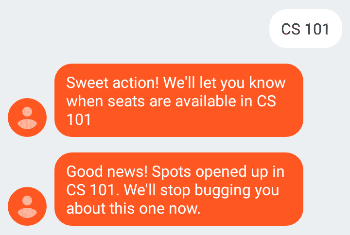

# 我是如何用 Python 和 Twilio 入侵我大学的注册系统的

> 原文：<https://www.twilio.com/blog/2017/06/hacked-my-universitys-registration-system-python-twilio.html?utm_source=wanqu.co&utm_campaign=Wanqu+Daily&utm_medium=website>


大学生知道试图注册一门课却发现已经满员的痛苦。在我的大学里，大多数课程甚至没有等候名单系统。我们不得不求助于一天多次登录并检查网站。这看起来像是计算机能做的事情，所以我开始用一点 Python 和 [Twilio API](https://www.twilio.com/docs/api/rest) 来自动化它。

## 入门指南

因为大学的课程注册系统是在密码登录之后，我们将使用我建立的的[简化网站。为了这个演示的目的，它每分钟在 CS 101 中没有空座位和有一个空座位之间交替。](http://courses.project.samueltaylor.org/)

我们将使用一些库来帮助我们完成这个项目。假设您已经安装了[pip](https://pip.pypa.io/en/stable/installing/)，继续运行下面的`pip`命令来安装它们:

```
pip install requests==2.17.3 beautifulsoup4==4.6.0 redis==2.10.5 twilio==6.3.0 Flask==0.12.2 
```

随着我们的深入，我们将深入使用其中的每一个库。

## 刮登记制度

我们需要编写一个程序来确定给定课程中是否有座位。为了做到这一点，我们将使用一种叫做网络抓取的技术，在这种技术中，我们从互联网上下载一个页面并找到重要的部分。两个流行的库使这变得容易，它们是 [Requests](http://docs.python-requests.org/en/master/) 和 [BeautifulSoup](https://www.crummy.com/software/BeautifulSoup/) 。请求使获取网页变得容易，BeautifulSoup 可以帮助我们找到对我们来说重要的网页部分。

```
# scraper.py
import requests
from bs4 import BeautifulSoup

URL = 'http://courses.project.samueltaylor.org/'
COURSE_NUM_NDX = 0
SEATS_NDX = 1

def get_open_seats():
    r = requests.get(URL)
    soup = BeautifulSoup(r.text, 'html.parser')
    courses = {}

    for row in soup.find_all('tr'):
        cols = [e.text for e in row.find_all('td')]
        if cols:
            courses[cols[COURSE_NUM_NDX]] = int(cols[SEATS_NDX])
    return courses 
```

这里的肉在`get_open_seats`函数里。在这个函数中，我们使用 requests.get 下载页面的 HTML 源代码，然后用 BeautifulSoup 解析它。我们使用`find_all('tr')`获取表中的所有行，更新课程字典以指示给定课程中可用的座位数。find_all 可以比这个简单的例子用得更强大，所以如果你有兴趣了解更多的话，可以查看一下[文档](https://www.crummy.com/software/BeautifulSoup/bs4/doc/#searching-the-tree)。最后，我们返回课程字典，以便我们的程序可以查找给定课程中有多少座位(即`courses['CS 101']`是 CS 101 中可用的座位数)。

万岁，现在我们可以确定一个课程是否有空位。测试这个函数的一个很好的方法是在 Python 解释器中。将这段代码保存到一个名为 scraper.py 的文件中，然后运行脚本并进入交互模式，看看这个函数做了什么:

```
$ python -i scraper.py
>>> get_open_seats()
{'CS 101': 1, 'CS 201': 0} 
```

虽然这很好，但我们还没有找到解决方案；我们仍然需要某种方法来通知用户何时有座位空出来。[朱婷短信](https://www.twilio.com/docs/api/rest/sending-messages)来救援了！

## 通过短信获取更新

当构建用户界面时，我们希望简单的事情变得简单。在这种情况下，用户希望在课程的座位空出来时得到通知。他们向我们传达这一意图的最简单方式是分享课程编号。让我们通过设置和处理 webhook 来实现订阅功能。我选择使用 [Redis](https://redis.io/) (一个提供可以从多个进程访问的数据结构的工具)来存储订阅。

```
# sms_handler.py
from flask import Flask, request
import redis

twilio_account_sid = 'ACXXXXX'
redis_client = redis.StrictRedis(host='localhost', port=6379, db=0)
app = Flask(__name__)

@app.route('/sms', methods=['POST'])
def handle_sms():
    user = request.form['From']
    course = request.form['Body'].strip().upper()

    redis_client.sadd(course, user.encode('utf-8'))

if __name__ == '__main__':
    app.run(debug=True) 
```

这里我们使用一个名为 [Flask](https://www.fullstackpython.com/flask.html) 的 Python 框架来创建一个处理 SMS 消息的小服务。在一些初始设置之后，我们指出对`/sms`端点的请求应该由`handle_sms`函数来处理。在这个函数中，我们获取用户的电话号码和他们正在寻找的课程，并将它们存储在以课程命名的集合中。

就获取订阅而言，这很好，但是这是一个令人沮丧的用户界面，因为它没有向用户提供任何反馈。我们想回到用户身边，告诉他们我们是否能够尽快满足他们的要求。为此，我们将提供一个 [TwiML 响应](https://www.twilio.com/docs/api/twiml/sms/your_response)。下面突出显示了为此所需的附加行。

```
# sms_handler.py
from flask import Flask, request
import redis
from twilio.twiml.messaging_response import MessagingResponse

twilio_account_sid = 'ACXXXXX'
my_number = '+1XXXXXXXXXX'
valid_courses = {'CS 101', 'CS 201'}

redis_client = redis.StrictRedis(host='localhost', port=6379, db=0)
app = Flask(__name__)

def respond(user, body):
    response = MessagingResponse()
    response.message(body=body)
    return str(response)

@app.route('/sms', methods=['POST'])
def handle_sms():
    user = request.form['From']
    course = request.form['Body'].strip().upper()
    if course not in valid_courses:
        return respond(user, body="Hm, that doesn't look like a valid course. Try something like 'CS 101'.")

    redis_client.sadd(course, user.encode('utf-8'))
        return respond(user, body=f"Sweet action. We'll let you know when there are seats available in {course}")

if __name__ == '__main__':
    app.run(debug=True) 
```

我们对上面的代码做了两个主要的修改。首先，我们验证用户正在请求一个有效的课程。第二，当用户要求更新时，我们会作出回应。在 respond 函数中，我们用给定的消息为给定的数字构造一个 TwiML 响应。

确保[安装 Redis](https://www.fullstackpython.com/blog/install-redis-use-python-3-ubuntu-1604.html) 并用`redis-server`命令启动。将上述代码保存到一个名为`sms_handler.py`的文件中，然后运行`python sms_handler.py`。

不可否认，这里的回复信息有点傻，但我很惊讶地看到用户有多喜欢它们。在某些情况下，个人接触可以带来更好的用户体验。

让我们扩展我们之前的抓取脚本，实际通知那些人，现在我们知道谁想要得到课程开放的通知。

```
# scraper.py
from twilio.rest import Client

client = Client(twilio_account_sid, token)
redis_client = redis.StrictRedis(host='localhost', port=6379, db=0)

def message(recipient, body):
    message = client.messages.create(to=recipient, from_=my_number, body=body)

if __name__ == '__main__':
    courses = get_open_seats()
    for course, seats in courses.items():
        if seats == 0:
            continue

        to_notify = redis_client.smembers(course)
        for user in to_notify:
            message(user.decode('utf-8'), 
                    body=f"Good news! Spots opened up in {course}. " + \
                          "We'll stop bugging you about this one now.")
            redis_client.srem(course, user) 
```

我们可以一次性运行这个刮刀，通过运行`python scraper.py`来测试它。

## 用 Cron 作业跟踪课程

虽然将检查课程注册站点的过程简化为一个脚本很好，但我们希望脚本每隔几分钟自动运行一次。使用 [Cron](https://en.wikipedia.org/wiki/Cron) 可以轻松解决这个问题。我们可以通过运行`crontab -e`并添加以下行来添加每三分钟运行一次的任务:

```
*/3 * * * * /path/to/scraper.py 
```

有了这些代码，Cron 守护进程将每三分钟运行一次我们的 scraper。我们可以通过运行`crontab -l`看到预定的任务。就是这样！我们可以订阅一个课程的更新，回到生活中重要的事情。作为一个有趣的附带好处，当你让你的朋友们参加那个打包的“休息和放松”课程时，他们会非常感激你的。虽然进入我想要的班级是对工作的大量奖励，但它最终也帮助了大约十几个人获得了他们理想的时间表。


使用这篇文章中的技巧，你可以为各种各样的事情设置通知。例如，有人使用 Ruby 和 Twilio 来跟踪精酿啤酒的供应情况。要获得这篇文章的所有代码，请查看[的要点](https://gist.github.com/ssaamm/70dfca15dbb85d5e4a011d926097d62a)。您也可以通过以下方式联系我:

免责声明:请确保设置通知不会违反您所在大学的学生系统服务条款。有疑问的时候，问问知道的人！

🎉感谢您的反馈！

出事了。请再试一次。

